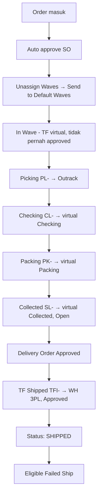
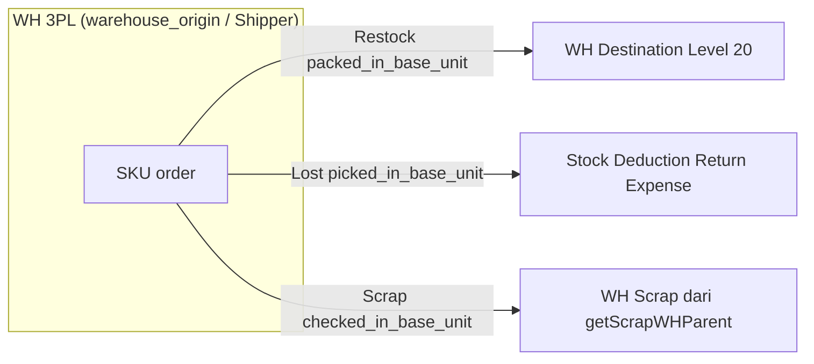
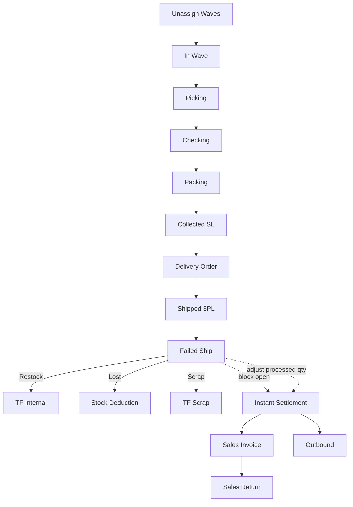
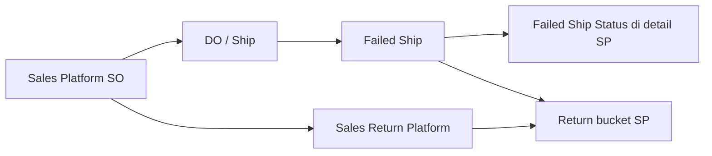

# Failed Ship — Requirement Documentation

**Modul:** Supply Chain + OmniChannel + Accounting  
**Audience:** PM, QA, Developer, Operations  
**Status:** TO-BE (requirement bisnis) + AS-IS (verifikasi codebase 26 Juni 2026)

---

## 0. Metadata & Changelog

| Version | Date | Author | Changes |
|---------|------|--------|---------|
| 1.0 | 2026-06-19 | QA - Yemima | Draft awal dari analisis codebase |
| 1.1 | 2026-06-23 | QA - Yemima | Sinkron partial dengan requirement bisnis |
| 2.0 | 2026-06-26 | QA - Yemima | Konsolidasi requirement final + deep check codebase (stock flow, gap analysis, export, UI UX) |
| 2.1 | 2026-06-26 | QA - Yemima | Klarifikasi PM: scan SO, tracking qty FS, settlement per-baris, relasi Sales Return |
| 2.2 | 2026-06-26 | QA - Yemima | Deep check eligibility invoice/outbound, pill Sales Platform Returns, gap approve G-05 |
| 2.3 | 2026-06-26 | QA - Yemima | Cross-menu stock flow: relasi TF internal, picking/checking/packing/DO, order, settlement, SR |
| 2.4 | 2026-07-15 | QA - Yemima | Relasi Sales Platform (Return bucket, Failed Ship Status, flow vs Sales Return) |
| 2.5 | 2026-07-23 | QA - Yemima | Tambah user-guide v1.0; sync README 5-file + KB compliance |

---

## 1. Ringkasan Eksekutif

**Failed Ship (FS)** menangani gagal kirim COD **setelah order Shipped (di WH 3PL)** namun **belum settlement** (belum ada Sales Invoice & Outbound). Berbeda dari **Sales Return** yang hanya untuk order yang sudah settled.

| Aspek | Ringkasan |
|-------|-----------|
| Dokumen | `scm_stock_mutations` dengan `process_type = failed ship`, kode prefix **FS** |
| Qty per kondisi | **Restock** (kembali ke gudang), **Lost** (hilang → Stock Deduction), **Scrap/Broken** (rusak → WH Scrap) |
| Origin stok | Selalu **WH 3PL** (shipper) — lokasi terakhir setelah Transfer Internal Shipped |
| Blocking settlement | Order dengan FS **open** ditolak upload settlement |
| Prasyarat FS | **Belum** punya referensi Sales Invoice & Outbound (termasuk unapproved) |
| Adjustment settlement | Qty **processed** FS mengurangi qty invoice/outbound saat first settlement |

### 1.1 Failed Ship vs Sales Return

| Kondisi Order | Menu |
|---------------|------|
| Shipped, belum settlement / belum SI & Outbound | **Failed Ship** |
| Sudah settlement (ada SI) | **Sales Return** |

---

## 2. Acceptance Criteria

### 2.1 Basic Information

| ID | Kriteria (TO-BE) | AS-IS | Status |
|----|------------------|-------|--------|
| A-01 | Kode prefix FS, manual atau auto-generate | ✅ `generateCode(..., 'FS')` via `StockMutationTransferController@store` | OK |
| A-02 | Transaction Date default now | ✅ Default `dateTimeNow()` di FE; validasi fiscal period | OK |
| A-03 | Warehouse Destination wajib, Level 20 tanpa sub-WH | ✅ `select2-warehouse-destination`; validasi smallest child | OK |
| A-04 | Shipper wajib, sumber WH 3PL, tidak memfilter outstanding | ✅ `warehouse_origin` = Shipper; `select2-warehouse-origin` filter 3PL | OK |
| A-05 | Shipper hanya informasi datalist, tidak memfilter order | ✅ Outstanding difilter `warehouse_origin` FS header, bukan field shipper terpisah | OK |
| A-06 | Description opsional, max 150 | ✅ | OK |

### 2.2 Shipped Sales Order (Outstanding)

| ID | Kriteria (TO-BE) | AS-IS | Status |
|----|------------------|-------|--------|
| A-07 | Hanya order Shipped, belum settlement | ✅ Filter qty out/invoice = 0 + `processed_to_do_quantity` full | OK |
| A-08 | Toggle Group by Order / Group by Product (outstanding) | UI aktif: tidak ada toggle (scan di index). V1 legacy: default Product (`groupViewAvailable: true`) | Lihat §8 catatan G-02 |
| A-09 | Kolom sesuai spec outstanding | Sebagian kolom/urutan berbeda antara index vs V1 | Partial |
| A-10 | Insert order ke detail + validasi §10 | ✅ `useSo` (scan index), `useProduct` / `UseSalesOrder` / `bulkUseProduct` | OK |

### 2.3 Failed Ship Detail

| ID | Kriteria (TO-BE) | AS-IS | Status |
|----|------------------|-------|--------|
| A-11 | Default tampilan **Group by Product Order** | ✅ V1: `groupView: true` → `DatalistDetailGroup` | OK |
| A-12 | Restock / Lost / Scrap inline edit, default 0 | ✅ `packed_in_base_unit`, `picked_in_base_unit`, `checked_in_base_unit` | OK |
| A-13 | Total FS Qty ≤ Product Qty | ✅ Validasi di `inlineEdit`, `store`, `approve` | OK |
| A-14 | Cara insert order ke detail | ✅ **Scan SO** di index (`POST failed-ship/{code}/use-so`) — setara fungsi Select Order / Use | OK (AS-IS) |
| A-15 | Delete detail → kembali outstanding | ✅ `destroy` middle detail + reset `prepared_to_failed_ship_quantity` | OK |

### 2.4 Approval & Konsekuensi Stok

| ID | Kriteria (TO-BE) | AS-IS | Status |
|----|------------------|-------|--------|
| A-16 | Re-validasi invoice/outbound/settlement saat **approve** FS | ❌ `approve()` tidak re-cek qty invoice/outbound — **GAP major** (G-05) | **GAP** |
| A-17 | Restock → TF Internal 3PL → WH Destination | ✅ Approve FS transfer + `ItemStockMutation::approveTransfer` | OK |
| A-18 | Lost → Stock Deduction dari 3PL, jurnal Return Expense | ✅ `handleMissing` + auto-approve via `StockMutationDeductionFAController` | OK |
| A-19 | Scrap → TF Internal 3PL → WH Scrap (dari Setting WH Destination) | ✅ `getScrapWHParent(warehouse_destination)` + `handleBroken` | OK |
| A-20 | Total FS Qty > Product Qty ditolak approve | ✅ | OK |

### 2.5 Relasi Sales Order & Settlement

| ID | Kriteria (TO-BE) | AS-IS | Status |
|----|------------------|-------|--------|
| A-21 | Tracking Prepared/Processed di detail SO | ✅ Kolom qty `prepared_to_failed_ship_quantity` / `processed_to_failed_ship_quantity` (+ tampilan di SO detail) | OK (AS-IS) |
| A-22 | Reset prepared qty saat cancel/delete FS | ✅ `deleteFailedShip` reset `prepared_to_failed_ship_quantity` | OK |
| A-23 | Settlement gagal jika FS masih open | ✅ Cek header `failed_ship.transaction_status == open` — cukup untuk block upload | OK (AS-IS) |
| A-24 | Settlement invoice/outbound per baris SKU net FS | ✅ `invoicable_quantity_in_base_unit` per detail; outbound dari `item_stock.available_quantity` di 3PL | OK |
| A-25 | Full failed ship → settlement tanpa produk | ✅ `empty($details)` + `failed_ship` flag → success dengan `without_outbound` | OK |

### 2.6 Export

| ID | Kriteria (TO-BE) | AS-IS | Status |
|----|------------------|-------|--------|
| A-26 | Export with/without detail (card terpisah di requirement awal) | ✅ `ExportFileTable` + `FailedShipExport` | OK |
| A-27 | Import bulk Failed Ship | ❌ Belum ada fitur import (bukan gap implementasi v1 — memang belum dibangun) | Planned |
| A-28 | Qty FS + Return ≤ qty order per SKU | ✅ Enforced via `invoicableQuantityInBaseUnit` + cap return ke outbound qty | OK |
| A-29 | Qty return ≤ qty outbound terakhir per SKU | ✅ `SalesReturnDetailController` + `createDetail` cap per `outbound_mutation_detail` | OK |

---

## 3. Pergerakan Stok Order — Wave hingga 3PL

Order eligible FS adalah order yang processing status **Shipped** — stok sudah di WH 3PL.

### 3.1 Alur end-to-end



### 3.2 Tahap Transfer Internal (AS-IS codebase)

| Tahap | `process_type` | Prefix kode | WH Origin → Destination | Status awal | Trigger approved |
|-------|----------------|-------------|-------------------------|-------------|------------------|
| In Wave | `in wave` | TFI (virtual) | Rack → Rack-Waves | — | Tidak pernah di-approve |
| Picking | `picking` | **PL** | Rack → Outrack | draft | Picking complete |
| Checking | `checking` | **CL** | Outrack → virtual Checking | — | Checking complete |
| Packing | `packing` | **PK** | virtual Checking → virtual Packing | — | Packing complete |
| Collected | `shipping` | **SL** | virtual Packing → virtual Collected | **open** | Masuk DO detail |
| Shipped (3PL) | `shipping do` | **TFI** | virtual Collected → WH 3PL (shipper) | — | DO approved |

**Offset waktu trx date (AS-IS):**

| Transisi | Offset |
|----------|--------|
| Picking (skip process) | SO date + 10 menit |
| Checking | Picking date + 10 detik |
| Packing | Checking date + 10 detik |
| Collected (SL) | Packing date + 10 detik |
| Shipped DO (TFI) | Collected date + 10 detik |

Sumber: `PicklistService`, `TransferCheckingController`, `TransferPackingController`, `TransferShippingController`, `TransferShippingDoController`.

### 3.3 FIFO After Fulfill

Alokasi stok order mengikuti **FIFO After Fulfill** (single batch per rack per tanggal jika cukup, fallback FIFO klasik). Detail requirement di dokumen bisnis §4.5 — implementasi di engine picking/transfer internal.

### 3.4 Konsekuensi Approve Failed Ship per Jenis Qty



| Jenis | Field detail | Dokumen generated | Origin | Destination |
|-------|--------------|-------------------|--------|-------------|
| Restock | `packed_in_base_unit` / `transfer_quantity` | FS header approve → TF internal | WH 3PL | `warehouse_destination` (Location) |
| Lost | `picked_in_base_unit` | Stock Deduction (`process_type = lost`) | WH 3PL | — (Return Expense COA) |
| Scrap | `checked_in_base_unit` | TF Scrap (`process_type = scrap`, prefix TFS) | WH 3PL | `warehouse_scrap_id` dari Setting WH parent |

**Mapping field DB (penting untuk QA):**

| Label UI | Kolom `scm_transfer_mutation_details` |
|----------|---------------------------------------|
| Restock Qty | `packed_in_base_unit` + `transfer_quantity` |
| Lost Qty | `picked_in_base_unit` |
| Scrap/Broken Qty | `checked_in_base_unit` |
| Total FS Qty | `transfer_quantity` (computed sum) |

### 3.5 Jurnal Lost Qty (Stock Deduction)

| Posisi | COA | Sumber |
|--------|-----|--------|
| Kredit | Persediaan | Product COA Group SKU |
| Debit | Return Expense | Product COA Group SKU (field Return Expense) |

Berbeda dari Stock Deduction reguler (Expense biasa). Auto-approve via `StockMutationDeductionFAController` setelah generate dari FS.

### 3.6 Peta relasi menu (fulfillment → Failed Ship → settlement)

Stok SKU order bergerak melalui rantai TF internal (mayoritas di **virtual WH**). Failed Ship hanya bisa setelah rantai selesai di **WH 3PL**. Setiap tahap punya doc QA terpisah — lihat kolom **Doc QA**.

| # | Menu | Slug | Peran stok terhadap FS | Doc QA |
|---|------|------|------------------------|--------|
| 1 | **Transfer Internal** | `supplychain-mutation-transfer-internal` | Semua TF fulfillment + FS tercatat di `scm_stock_mutations`. Default datalist **menyembunyikan** `process_type` fulfillment — aktifkan **Show Virtual** untuk melihat PL/CL/PK/SL/TFI. FS sendiri `process_type = failed ship`. | [technical §8](../supplychain-mutation-transfer-internal/technical.md#8-relasi-failed-ship--rantai-fulfillment) |
| 2 | **Picking Process** | `omni-picking-process` | TF `picking` (PL-): Rack → Outrack. Tahap pertama approve fisik pasca wave. | [requirement §Relasi FS](../omni-picking-process/requirement.md#relasi-failed-ship) |
| 3 | **Checking Process** | `omni-checking-process` | TF `checking` (CL-): Outrack → virtual Checking. | [requirement §Relasi FS](../omni-checking-process/requirement.md#relasi-failed-ship) |
| 4 | **Packing Process** | `omni-packing-process` | TF `packing` (PK-): virtual Checking → virtual Packing; trigger Collecting (SL). | [requirement §Relasi FS](../omni-packing-process/requirement.md#relasi-failed-ship) |
| 5 | **Delivery Order** (+ Collecting) | `supplychain-delivery-order` | SL `shipping` (Collected, open) masuk DO; approve DO → TFI `shipping do` ke **WH 3PL** + status SO **Shipped** → **prasyarat FS**. | [technical §8](../supplychain-delivery-order/technical.md#8-relasi-failed-ship--collecting--shipped-3pl) |
| 6 | **Sales Order** | `sales-order-general` | Header referensi semua TF (`transaction_reference` SO/SO detail); kolom qty FS & settlement di `omni_sales_order_details`. | [requirement](../sales-order-general/requirement.md) |
| 7 | **Instant Settlement** | `accounting-settlement-upload` | Setelah FS approved: qty invoice/outbound net; FS open memblokir upload. | [requirement §4.3](../accounting-settlement-upload/requirement.md) |
| 8 | **Sales Return** | `supplychain-sales-returns` + `accounting-sales-return` | Alternatif jika order **sudah** SI & Outbound; qty return cap ke outbound; dual menu SCM/Finance v2.0. | [SCM](../supplychain-sales-returns/README.md) · [Finance](../accounting-sales-return/README.md) |

**Cara baca pergerakan di Transfer Internal:** buka menu TF Internal → toggle **Show Virtual** → filter `process_type` / kode prefix PL, CL, PK, SL, TFI untuk order yang sama (`transaction_reference` = SO).

**Setelah FS approve:** stok keluar dari 3PL (restock → Location, lost → deduction, scrap → WH scrap) — bukan revert tahap picking–DO.

---

## 4.0 Prasyarat Eligibility — Invoice & Outbound (MAJOR)

Failed Ship **hanya** untuk order yang sudah **Shipped** (DO full) tetapi **belum punya jejak Sales Invoice maupun Outbound** — berlaku **Platform & General**.

### 4.0.1 Sumber kebenaran di DB

Sistem **tidak** join langsung ke tabel `customer_invoices` / `stock_mutations` (outbound) saat filter datalist. Sebagai gantinya memakai kolom qty di **`omni_sales_order_details`**:

| Kolom | Arti |
|-------|------|
| `prepared_to_invoice_quantity` | Ada SI **belum approved** (open/draft) |
| `processed_to_invoice_quantity` | Ada SI **approved** |
| `prepared_to_out_quantity` | Ada Outbound **belum approved** |
| `processed_to_out_quantity` | Ada Outbound **approved** |

**Rule eligibility:** keempat kolom di atas harus **= 0** pada baris SO detail yang diproses. Jika salah satu **> 0** → order dianggap sudah settled / punya referensi invoice atau outbound → **tidak boleh Failed Ship** (gunakan Sales Return).

> Termasuk dokumen **unapproved**: `prepared_to_* > 0` sudah memblokir — tidak perlu tunggu approve SI/Outbound.

### 4.0.2 Di mana rule ini di-enforce (AS-IS)

| Titik | Cek invoice/outbound qty | File |
|-------|--------------------------|------|
| Datalist index | Join detail: keempat kolom = 0 + DO full | `FailedShipController@index` |
| Scan / use SO | `exists()` jika **ada** detail dengan salah satu > 0 | `FailedShipController@useSo` |
| Insert detail | `exists()` per `sales_order_detail_id` | `FailedShipDetailController@store` |
| Outstanding product/SO | Filter keempat kolom = 0 | `FailedShipDetailController@outstandingProduct/SalesOrder` |
| **Approve FS** | ❌ **Tidak ada** re-cek | `FailedShipController@approve` |

Pesan error saat blocked: *"This order cannot be processed as failed shipment because it has already been settled. Please use the return menu for this action."*

### 4.0.3 GAP major — approve tidak re-validasi (G-05)

Antara **insert detail** dan **approve**, order bisa mendapat SI/Outbound (upload settlement, manual invoice, dll). **`approve()` saat ini hanya cek:**
- DO approved
- FS date ≥ DO date
- Ada qty > 0

**Tidak** membaca ulang `prepared_to_*` / `processed_to_*` invoice & outbound. Risiko: FS approved padahal order sudah settled.

**Rekomendasi TO-BE:** sebelum `StockMutationTransferController@approve(..., is_from_failed_ship: true)`, jalankan validasi yang sama dengan `useSo` (per detail FS + seluruh order).

### 4.0.4 GAP minor — datalist index vs scan (partial order)

| Mekanisme | Scope cek |
|-----------|-----------|
| `useSo` / scan | **Order-level** — jika **satu** detail punya invoice/outbound qty > 0 → tolak seluruh order |
| Index `join` detail | **Per baris detail** — order bisa **masih muncul** di datalist jika masih ada baris detail lain yang belum settled |

Contoh: order 2 SKU, 1 SKU sudah punya SI → baris itu tidak join, baris lain bisa join → SO **tetap tampil** di datalist, tapi **scan ditolak**. Inkonsistensi UX; idealnya hide seluruh order jika ada detail settled.

### 4.0.5 Pill **Sales Platform Returns** (Failed Ship index)

Komponen: `FailedShip/DataList.vue` → `SalesReturnPlatformTable` dengan props:

| Prop | Nilai | Efek API |
|------|-------|----------|
| `only-platform` | true | Platform ≠ Other |
| `without-used` | true | `stock_mutation_id IS NULL` (belum diproses jadi SR) |
| `without-outbound` | true | `processed_to_out_quantity = 0` |

Counter badge: `GET omnichannel/sales-returns/count?without_outbound=true` — count juga cek `prepared_to_out_quantity = 0`.

**Maksud bisnis:** menampilkan data **return dari API marketplace** untuk order yang **belum outbound** — kandidat arah Failed Ship, **bukan** Sales Return.

Tooltip UI: *"Returned and/or refunded Sales Platform that has not been processed to outbound"*.

**Catatan:** filter pill ini fokus **outbound**, tidak secara eksplisit filter `prepared_to_invoice_quantity` di `OmniChannel\SalesReturnController` — namun pada praktik platform order pre-settlement biasanya belum punya invoice.

### 4.0.6 Kontras — Sales Return menu (pill Platform)

`Accounting/Return/SalesReturn/DataList.vue` → `SalesReturnPlatformTable`:

| Prop | Failed Ship pill | Sales Return platform |
|------|------------------|----------------------|
| `without-outbound` | **true** (belum outbound) | **tidak dikirim** → default: `processed_to_out = order qty` (**sudah full outbound**) |
| `without-used` | true | true (saat platform tab aktif) |

Sales Return **sengaja** menampilkan platform return yang order-nya **sudah punya outbound penuh** (+ invoice via detail SR) — kebalikan dari Failed Ship pill. Dokumentasi canonical v2.0: [supplychain-sales-returns/requirement.md §4.3](../supplychain-sales-returns/requirement.md#43-pill--sales-return-platform).

Kolom referensi di platform return table: `outbound_reference_formatted`, `invoice_reference_formatted` (`OmniChannel\SalesReturnController`).

---

## 4.1 Validasi Insert ke Detail (Use / Select Order / Scan SO)

| ID | Kondisi | Pesan (TO-BE) | AS-IS | Status |
|----|---------|---------------|-------|--------|
| V-01 | Sudah settlement | "This order cannot be processed as failed shipment because it has already been settled..." | ✅ `FailedShipDetailController@store`, `useSo` | OK |
| V-02 | SO void / tidak approved | "This order is voided..." | ⚠️ `useSo`: cek `transaction_status` open/draft/closed; pesan berbeda | Partial |
| V-03 | Belum Shipped | "Order not shipped yet..." | ✅ Cek `process_type` checking, packing, shipping, shipping do | OK |
| V-04 | WH Destination tanpa scrap setup | — | ✅ `getScrapWHParent` throw: "Location has no scrap setup..." | OK (create) |
| V-05 | Total FS > Product Qty | — | ✅ "Quantity cannot be greater than sales order quantity" | OK |

### 4.2 Approval

| ID | Kondisi | Pesan | AS-IS |
|----|---------|-------|-------|
| V-06 | DO belum approved | "Delivery order in {code} not approved." | ✅ |
| V-07 | FS date < DO date | "Delivery order in {code} date is greater than failed ship date." | ✅ |
| V-08 | Semua detail qty = 0 | "Please enter a quantity to proceed, or cancel this transaction." | ✅ |
| V-09 | Total FS > Product Qty | "Quantity cannot be greater than sales order quantity" | ✅ |
| V-10 | Re-cek settlement saat approve | Pesan §11 TO-BE | ❌ Tidak di-revalidate eksplisit di `approve()` | **GAP** |

### 4.3 Instant Settlement

| ID | Kondisi | Behavior | AS-IS |
|----|---------|----------|-------|
| V-11 | FS header masih **open** untuk SO | Block seluruh batch upload | ✅ `SettlementValidation::validateFailedShip` — cek `sales_order.failed_ship.transaction_status == open` (**cukup baca header**, tidak perlu loop detail prepared) |
| V-12 | Settlement date ≤ FS date (approved) | Block baris | ✅ |
| V-13 | Generate **Sales Invoice** per baris SKU | Hanya baris dengan qty net > 0 | ✅ `CustomerInvoiceHelper::extractOrderDetails` — skip baris `invoicable_quantity_in_base_unit <= 0` |
| V-14 | Generate **Outbound** per baris SKU | Qty = sisa stok fisik di 3PL setelah FS | ✅ `StockMutationOutbound::generate` — `item_stock.available_quantity` per transfer detail shipping DO; baris qty ≤ 0 di-skip |
| V-15 | Processed FS, sudah pernah settle | Hanya SI adjustment (re-settlement) | ✅ Pola re-settlement existing |

**Formula qty net per baris SO detail** (`SalesOrderDetail::invoicableQuantityInBaseUnit`):

```
invoicable = order_qty
           - (prepared_to_failed_ship_quantity + processed_to_failed_ship_quantity)
           - (prepared_to_return_quantity + processed_to_return_quantity)
           - (prepared_to_invoice_quantity + processed_to_invoice_quantity)
```

Dengan demikian, **invoice dan outbound settlement membaca per baris SKU**, bukan hanya header FS.

**Catatan:** Blocking upload (V-11) sengaja di level **header FS open** — selama dokumen FS masih open, seluruh file settlement ditolak. Setelah FS approved, penyesuaian qty mengikuti V-13/V-14 per baris.

### 4.4 Header store/update

| Field API | Label UI | Rule |
|-----------|----------|------|
| `warehouse_origin` | Shipper Name | Required, WH 3PL |
| `warehouse_destination` | Location | Required, Level 20; `getScrapWHParent()` wajib |
| `code` | Transaction Code | Nullable → auto FS |
| `transaction_date` | Transaction Date | Required, fiscal period |
| `description` | Description | Max 150 |

Tidak boleh ubah `warehouse_origin` jika sudah ada detail: *"This failed ship already has prepared detail data which relate to specific warehouse shipper..."*

---

## 5. Fitur & Behavior UI/UX

> **Catatan implementasi UI:** Router aktif (`src/router/index.ts`) memakai folder `FailedShip/` (index scan + form checking-style). Folder `FailedShipV1/` berisi layout requirement §5–7 (Basic Info, Outstanding, Detail) tetapi **tidak terdaftar di router** — tetap didokumentasikan sebagai referensi layout TO-BE.

### 5.1 Datalist Index (`FailedShip/DataList.vue`) — UI aktif

| Tombol / Elemen | Fungsi | API |
|-----------------|--------|-----|
| **Create** | Navigasi ke form create | Route `/supplychain/failed-ship/create` |
| **Scan / Use SO** | Scan barcode/QR Platform Order ID atau SO code → auto-create FS + set location + insert semua detail SO | `POST failed-ship/{code}/use-so` |
| **Warehouse Location** | Pilih `warehouse_destination` (Level 20) sebelum scan | Form field |
| **CCTV Location** | Pilih `location_id` processing sebelum scan | Form field |
| **Export** (slider) | Async export with/without details / active page | `POST export-excel`, `GET export-file`, `GET export-progress` |
| **Filter SearchBuilder** | Filter kolom datalist SO eligible + FS existing | `POST failed-ship/get` |
| **FS Status** (klik) | Buka form edit FS jika approved | Link ke edit |
| **Return Platform** toggle | Tampilkan panel Sales Return platform (konteks terkait) | — |

Kolom utama index: SO Code, FS Code/Date, Order Date, Store/Buyer, Shipper/Tracking, Restock Location, Pickup Time, SO/Platform Status, FS Status.

### 5.2 Form Create/Edit — Layout V1 (`FailedShipV1/Form.vue`)

| Section | Isi | Tombol |
|---------|-----|--------|
| **Basic Information** | Code, Location (WH Destination), Description, Transaction Date, Shipper, Attachment | **Save & Next** (create), **Save All**, **Draft/Open** radio |
| **Shipped Sales Order** | Outstanding product/order toggle | **Group by Product** / **Group by Order** switch, **Use** per baris |
| **Failed Ship Detail** | Middle detail inline edit | **Group by Product** (default) / Order, inline Restock/Lost/Defect, **Delete** baris |
| **Approval** (slideover) | Multi-level approval log | **Approve** (dialog), eligibility check |
| **Audit Log** (slideover) | Riwayat perubahan | — |
| Sidebar | Navigasi section, Print, Void, Close | **Approve**, **Void Doc**, **Close Doc**, **Print Detail** |

### 5.3 Form Edit — UI Aktif Checking-Style (`FailedShip/Form.vue`)

| Tombol | Fungsi |
|--------|--------|
| **Set Location** | POST `set-location` — wajib sebelum proses; draft → open |
| **Check / Bulk Check** | Verifikasi produk (barcode workflow) |
| **Pause** | Pause durasi + `pause_reason` wajib |
| **Resume** | Lanjut durasi |
| **Inline edit** | Restock/Lost/Broken via `failed-ship-middle-detail/{id}/inline-edit` |
| **Approve** | POST `failed-ship/{id}/approve` |

Fitur ini **tidak ada di requirement bisnis** — dokumentasi AS-IS tambahan (lihat §8).

### 5.4 Export — Format & Opsi

**Tidak ada import** untuk menu Failed Ship (requirement: card terpisah, belum dikembangkan).

| Opsi export | Keterangan |
|-------------|------------|
| With Details | Per baris produk FS |
| Without Details | Per header SO/FS |
| Active Page Only | Halaman datalist aktif saja |

**Kolom export With Details** (`FailedShipExport.php`):

SO Code, Platform Order, FS Code, FS Date, Order Date, Deadline Time, Store Name, Buyer Name, Shipper, Tracking Number, Total SKU, Total Qty Products, Total Weight, Weight Unit (Gr), Total Qty Dimension, Building Origin, Restock Location, Pickup Time, SO Status, Platform Status, FS Status, System Product SKU, System Product Name, Product Qty, Restock Qty, Lost Qty, Defect Qty, Total FS, Unit, Created By, Created At.

**Kolom export Without Details:** sama tanpa kolom produk (SKU, Name, Product Qty, Restock, Lost, Defect, Total FS, Unit).

**Validasi export:** tidak ada validasi khusus; async batch job (`FailedShipExportJob` → `FailedShipExportExcelJob`). Progress timeout 30 menit → status reset.

### 5.5 Import — belum tersedia (bukan bug)

Requirement bisnis awal menyebutkan card **Import** terpisah (out of scope v1). **AS-IS: fitur import belum dibangun sama sekali** — tidak ada endpoint upload, template Excel, maupun job import untuk Failed Ship.

Yang ada saat ini hanya **Export** (§5.4). Jika import dibuat di masa depan, validasinya harus selaras §4.1.

---

## 6. Tracking Failed Ship di Sales Order Detail

**AS-IS (canonical):** tidak ada kolom enum `is_failed_ship`. Sistem memakai kolom qty di `omni_sales_order_details`:

| Konsep bisnis | Kolom / accessor AS-IS |
|---------------|------------------------|
| Prepared | `prepared_to_failed_ship_quantity > 0` (FS belum approved) |
| Processed | `processed_to_failed_ship_quantity > 0` (FS sudah approved) |
| Total FS (prepared + processed) | Accessor `failedShippedQuantity` |

Tampilan UI di Sales Order detail: kolom **Failed Ship Status** — `Prepared: X` / `Processed: Y` (`failed_ship_qty_status_formatted`).

**Lifecycle:**
- Insert detail FS → update `prepared_to_failed_ship_quantity` (sum qty dari TF detail FS open)
- Approve FS → pindah ke `processed_to_failed_ship_quantity`
- Delete FS / delete detail → kurangi prepared

Goals bisnis (Prepared/Processed) **sama** — hanya representasi DB berbeda dari dokumen requirement awal.

---

## 7. Relasi Menu Lain



| Menu | Relasi |
|------|--------|
| [Instant Settlement](../accounting-settlement-upload/README.md) | Block + qty adjustment |
| Sales Order Platform/General | Sumber data; qty failed ship di detail — Platform canonical: [omni-sales-platform](../omni-sales-platform/requirement.md) |
| Delivery Order | Prasyarat approved; sumber outstanding lines |
| Transfer Internal | Tahap wave→3PL + hasil FS |
| Stock Deduction | Lost qty |
| Setting Warehouse Scrap & Void | Scrap WH dari `getScrapWHParent` |
| Product COA Group | Jurnal Return Expense |
| Sales Return | Qty return dibatasi outbound terakhir; `invoicableQuantity` kurangi FS + return — lihat §7.1 |
| Sales Order Settlement Status | Kolom FS code/date |
| Transaction History | Referensi mutasi FS |

---

## 7.0 Relasi Sales Platform

**Peran Failed Ship terhadap Sales Platform:**

| Aspek | Perilaku |
|-------|----------|
| Trigger | SO platform sudah di jalur kirim/shipped; barang gagal atau perlu dikembalikan **sebelum/sekitar** outbound penuh |
| Feedback ke SP detail | Kolom **Failed Ship Status** = prepared (FS belum approve) / processed (FS approved) |
| Feedback ke SP datalist | Bucket **Return** jika ada FS dan/atau Sales Return |
| Pill **Sales Platform Returns** di index FS | Filter platform return yang **belum** outbound penuh — kontras dengan pill Sales Return (boleh sudah outbound) |



Detail operasional SP: [omni-sales-platform §7.1](../omni-sales-platform/requirement.md).

## 7.1 Relasi Sales Return — aturan qty

**Aturan bisnis:** per baris SKU order, `qty Failed Ship + qty Return` tidak boleh melebihi `qty order`. Setelah FS, order bisa di-retur via **Sales Return** (hanya jika sudah settled/outbound). Qty return **tidak boleh melebihi qty outbound terakhir** per baris.

**AS-IS (Sales Return v2.0 — SCM + Finance):** Lihat [supplychain-sales-returns/requirement.md §10](../supplychain-sales-returns/requirement.md#10-stock-impact-timeline) dan [technical.md §5](../supplychain-sales-returns/technical.md#5-create-flow-salesreturncontrollerstore).

| Lapisan | Mekanisme |
|---------|-----------|
| Eligibility retur | Order harus sudah punya `processed_to_out_quantity > 0` per detail (`SalesReturnController::validateSalesOrder`) — jika belum outbound, arahkan ke Failed Ship |
| Cap qty return per baris | `outbound_quantity_in_base_unit - prepared_to_return - processed_to_return` per `outbound_mutation_detail` (`createDetail`, `SalesReturnDetailController@update`) |
| Cap agregat order | `invoicableQuantityInBaseUnit` = order − FS − return − invoiced — mencegah over-return vs order |
| Outbound qty post-FS | Outbound settlement generate dari `item_stock.available_quantity` di 3PL **setelah** stok FS dipindah — sehingga outbound ≈ order − FS processed |

**Contoh:** Order 10 pcs → FS processed 3 pcs → outbound settlement 7 pcs → max return 7 pcs (bukan 10).

**Catatan:** Route `SalesReturnV1*` (commented) memakai `inBalanceReturn()` (= order − return saja, tanpa kurangi FS) — **bukan path aktif**.

---

## 8. Catatan Requirement vs Codebase

### 8.1 Perbedaan dokumen bisnis vs AS-IS (bukan gap fungsional)

| # | Topik | Penjelasan |
|---|-------|------------|
| ~~G-01~~ | Insert order ke detail | **AS-IS:** scan SO di index (`use-so`), bukan dropdown Select Order. Fungsi sama. |
| G-02 | Default view outstanding | Dokumen bisnis §6.2: default **Group by Order**. AS-IS: UI aktif tidak punya toggle; V1 legacy default **Group by Product** (`groupViewAvailable: true`). Hanya beda UX default jika V1 diaktifkan. |
| ~~G-03~~ | Tracking Prepared/Processed | **AS-IS:** kolom qty `prepared_to_failed_ship_*` / `processed_to_failed_ship_*` — goals sama dengan flag enum di dokumen bisnis. |
| ~~G-04~~ | Settlement block vs adjust | **AS-IS sesuai PM:** block upload = cek header FS open; adjust invoice/outbound = **per baris SKU** via `invoicable_quantity` + `item_stock.available_quantity`. |
| G-05 | **Approve FS tanpa re-cek invoice/outbound** | **MAJOR** — insert/scan/datalist sudah cek qty `prepared_to_*` / `processed_to_*`; `approve()` tidak. Lihat §4.0.3 |
| G-05b | Datalist index partial order | Order bisa tampil jika sebagian detail belum settled; scan tolak seluruh order. Lihat §4.0.4 |
| ~~G-06~~ | FS + Return ≤ order qty | **AS-IS:** enforced via `invoicableQuantityInBaseUnit` + cap return ke outbound qty (§7.1). |
| ~~G-07~~ | Import | Fitur **belum dibangun** (planned). Bukan ketidaksesuaian implementasi — memang tidak ada di scope v1. |
| G-08 | Pesan error void | Insert: order void dapat pesan "not approved" bukan "voided" eksplisit. |

### 8.2 Fitur codebase tambahan (tidak di dokumen bisnis awal)

| # | Item | Detail |
|---|------|--------|
| C-01 | **Dua versi UI** | `FailedShip/` aktif (checking workflow); `FailedShipV1/` layout requirement tapi tidak di router |
| C-02 | **Set Location / CCTV** | Wajib di UI aktif (`location_id`); `SalesOrderDuration` tracking |
| C-03 | **Pause / Resume** | `pauseFailedShip` / `resumeFailedShip` + alasan |
| C-04 | **Barcode check workflow** | `check`, `bulk-check`, `change-product` di Form aktif |
| C-05 | `FailedShipApprovalJob` | Logic dipindah inline ke `StockMutationTransferController@approve`; job di-comment |
| C-06 | Index datalist gabungan | SO eligible + FS existing dalam satu POST index (bukan hanya outstanding di form) |
| C-07 | Auto-create FS via scan | `useSo` create header + location + bulk detail sekaligus |
| C-08 | Export async batch | Sudah ada (requirement awal bilang card terpisah belum scope — **sudah diimplementasi**) |

### 8.3 Edge cases

| Case | Expected (TO-BE) | AS-IS |
|------|------------------|-------|
| Full failed ship, first settlement | SI/Outbound 0 produk | ✅ `CustomerInvoiceHelper` |
| Kombinasi Restock+Lost+Scrap satu SKU | 3 dokumen terpisah | ✅ `checkQuantityReceived` per jenis qty |
| WH Destination tanpa scrap config | Block create | ✅ `getScrapWHParent` saat store |
| Void FS setelah approved | — | ❌ Tidak ada void FS approved; hanya delete draft/open |
| Order sama di 2 dokumen FS | — | ⚠️ Validasi qty akumulatif per SO detail, bukan lock dokumen |

---

## 9. QA Test Notes

- [ ] Create FS manual (V1 flow) — Location + Shipper wajib, kode FS auto
- [ ] Scan SO di index — warehouse + CCTV wajib, auto-create + detail
- [ ] Insert outstanding — settlement/shipped/void ditolak
- [ ] Inline edit Restock/Lost/Scrap — total ≤ product qty
- [ ] Approve — cek TF restock, SD lost, TF scrap ter-generate
- [ ] Cek `prepared_to_failed_ship_quantity` / `processed_to_failed_ship_quantity` di SO detail
- [ ] Upload settlement dengan FS open → batch gagal
- [ ] Upload settlement dengan FS processed → qty SI/OB berkurang
- [ ] Full failed ship → settlement sukses tanpa produk
- [ ] Delete FS draft → prepared qty reset
- [ ] Export with/without details — kolom sesuai §5.4
- [ ] `getScrapWHParent` — error jika scrap belum di-setting
- [ ] Order dengan SI/Outbound open (prepared) — tidak muncul / ditolak scan
- [ ] Order dengan SI/Outbound approved — ditolak, arahkan Sales Return
- [ ] Approve FS setelah settlement di antara — **expected TO-BE: ditolak**; catat perilaku AS-IS (§4.0.3)
- [ ] Pill Sales Platform Returns — hanya order tanpa outbound; kontras dengan Sales Return platform
- [ ] `invoicable_quantity` = order − FS − return − invoiced

---

## 10. Permission

| Gate (`FailedShipPolicy`) | Aksi |
|---------------------------|------|
| `viewAny` | Datalist index |
| `view` | Lihat form / approval info |
| `create` | Buat FS, use SO, insert detail |
| `update` | Edit header/detail, inline edit |
| `delete` | Hapus draft/open |
| `approval` | Approve / reject |

---

## Related Documents

| Doc | Path |
|-----|------|
| Knowledge Base | [knowledge-base.md](./knowledge-base.md) |
| Technical | [technical.md](./technical.md) |
| User Guide | [user-guide.md](./user-guide.md) |
| Transfer Internal | [supplychain-mutation-transfer-internal/technical.md](../supplychain-mutation-transfer-internal/technical.md) |
| Picking Process | [omni-picking-process/requirement.md](../omni-picking-process/requirement.md) |
| Checking Process | [omni-checking-process/requirement.md](../omni-checking-process/requirement.md) |
| Packing Process | [omni-packing-process/requirement.md](../omni-packing-process/requirement.md) |
| Delivery Order | [supplychain-delivery-order/technical.md](../supplychain-delivery-order/technical.md) |
| Sales Order | [sales-order-general/requirement.md](../sales-order-general/requirement.md) |
| Instant Settlement | [accounting-settlement-upload/requirement.md](../accounting-settlement-upload/requirement.md) |
| Sales Return | [accounting-sales-return/README.md](../accounting-sales-return/README.md) |
