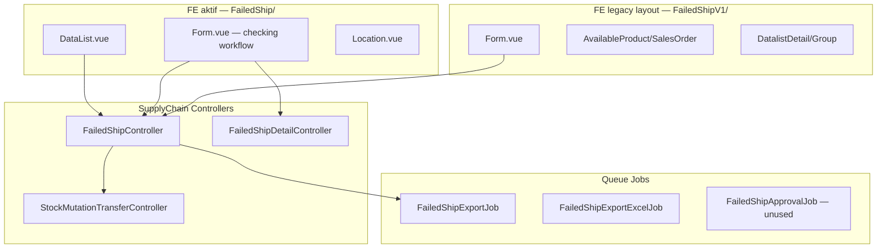
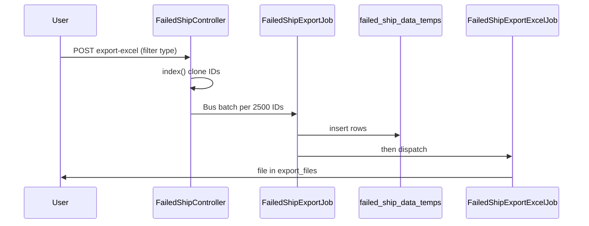
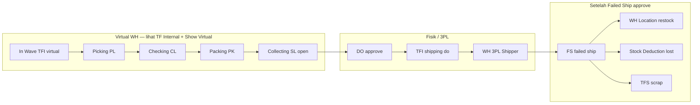

# Failed Ship — Technical Documentation

**Menu slug:** `supplychain-failed-ship`  
**API prefix:** `{APP_URL}/api/supplychain/failed-ship*`  
**Middleware:** `auth:sanctum`, `auth_verified`

---

## 1. Architecture Overview



---

## 2. Frontend File Map

### 2.1 UI aktif (router)

**Root:** `olshoperp-frontend/src/pages/SCM/FailedShip/`

| File | Route | Role |
|------|-------|------|
| `DataList.vue` | `supplychain/failed-ship` | Index SO eligible + scan create |
| `Form.vue` | `create`, `edit/:id` | Checking-style detail + approve |
| `Location.vue` | `set-location/:id` | Set CCTV location |
| `HeaderInformation.vue` | (component) | Header summary panel |

### 2.2 UI layout requirement (tidak di router)

**Root:** `olshoperp-frontend/src/pages/SCM/FailedShipV1/`

| File | Role |
|------|------|
| `Form.vue` | Basic Info + section outstanding + detail |
| `AvailableProduct.vue` | Outstanding group by product |
| `AvailableSalesOrder.vue` | Outstanding group by order |
| `DatalistDetail.vue` | Detail group by order |
| `DatalistDetailGroup.vue` | Detail group by product (default) |
| `ApprovalDialog.vue` | Approval modal |

---

## 3. Backend File Map

| File | Role |
|------|------|
| `Modules/SupplyChain/Http/Controllers/FailedShipController.php` | Header CRUD, index, approve, useSo, export, pause/resume |
| `Modules/SupplyChain/Http/Controllers/FailedShipDetailController.php` | Detail, outstanding, use, inline edit |
| `Modules/SupplyChain/Entities/FailedShip.php` | Model scope `process_type = failed ship` |
| `Modules/SupplyChain/Jobs/FailedShipExportJob.php` | Populate `scm_failed_ship_data_temps` |
| `Modules/SupplyChain/Jobs/FailedShipExportExcelJob.php` | Generate Excel file |
| `Modules/SupplyChain/Jobs/FailedShipApprovalJob.php` | Legacy — **tidak dipanggil** (logic di SMTC approve) |
| `Modules/SupplyChain/Exports/FailedShipExport.php` | Excel column mapping |
| `Modules/SupplyChain/Policies/FailedShipPolicy.php` | Gate abilities |
| `app/Helpers/SupplyChain/WarehouseHelper.php` | `getScrapWHParent()` |
| `app/Helpers/Accounting/CustomerInvoiceHelper.php` | Settlement qty setelah FS processed |
| `Modules/Accounting/Jobs/Traits/SettlementValidation.php` | `validateFailedShip()` |

---

## 4. Database

### 4.1 Tabel utama

| Tabel | Role |
|-------|------|
| `scm_stock_mutations` | Header FS (`process_type = 'failed ship'`, `type = tf internal`) |
| `scm_transfer_mutation_details` | Baris produk + qty restock/lost/scrap |
| `scm_transfer_mutation_middle_details` | Middle layer (group by product view) |
| `omni_sales_order_details` | `prepared_to_failed_ship_quantity`, `processed_to_failed_ship_quantity` |
| `scm_failed_ship_export_files` | Metadata export async |
| `scm_failed_ship_data_temps` | Staging export rows |
| `scm_setting_warehouse_scrap_voids` | `warehouse_scrap_id` untuk scrap path |
| `scm_locations` | CCTV `location_id` pada header FS |

### 4.2 Field header FS (`scm_stock_mutations`)

| Field | Keterangan |
|-------|------------|
| `code` | Prefix FS |
| `warehouse_origin` | WH 3PL (Shipper) |
| `warehouse_destination` | WH Level 20 (Location restock) |
| `location_id` | CCTV processing location |
| `process_type` | `failed ship` |
| `transaction_reference_id/class` | Sales Order (opsional, via useSo) |
| `type` | `tf internal` |

### 4.3 Field detail qty mapping

| UI Label | Kolom `scm_transfer_mutation_details` |
|----------|---------------------------------------|
| Restock Qty | `packed_in_base_unit`, `transfer_quantity` |
| Lost Qty | `picked_in_base_unit` |
| Scrap/Defect Qty | `checked_in_base_unit` |
| Total FS Qty | `transfer_quantity` (sum) |
| SO reference | `transaction_reference_id` → `SalesOrderDetail` |

---

## 5. API Routes

**Prefix:** `supplychain` · Registrasi: `Modules/SupplyChain/Routes/api.php` (~baris 1340+)

### 5.1 Header

| Method | Path | Controller | Keterangan |
|--------|------|------------|------------|
| POST | `failed-ship/get` | `index` | Datalist SO eligible (bukan REST index) |
| POST | `failed-ship` | `store` | Create → delegates `SMTC@store` + `is_failed_ship` |
| GET | `failed-ship/{id}` | `show` | Header + metadata |
| PUT | `failed-ship/{id}` | `update` | Draft/open only |
| DELETE | `failed-ship/{id}` | `destroy` | Draft/open + reset qty |
| POST | `failed-ship/{id}/approve` | `approve` | → `SMTC@approve` `is_from_failed_ship=true` |
| GET | `failed-ship/{id}/approve` | `failedShipApproveinfo` | Approval dialog |
| GET | `failed-ship/{id}/log/approve` | `failedShipApprovalLog` | Approval history |
| GET | `failed-ship/approval-eligibility/{id}` | `failedShipApprovalEligibility` | Eligible approvers |
| POST | `failed-ship/{id}/set-location` | `setLocation` | Set `location_id` |
| POST | `failed-ship/{code}/use-so` | `useSo` | Scan SO → auto create |
| POST | `failed-ship/{id}/pause` | `pauseFailedShip` | Pause duration |
| POST | `failed-ship/{id}/resume` | `resumeFailedShip` | Resume duration |
| GET | `failed-ship/select2-warehouse-origin` | `select2WarehouseOrigin` | 3PL list |
| GET | `failed-ship/select2-warehouse-destination` | `select2WarehouseDestination` | Level 20 |
| GET | `failed-ship/select2-location` | `select2Location` | CCTV |
| GET | `failed-ship/{id}/audit` | `audit` | Audit log |
| POST | `failed-ship/export-excel` | `exportAllExcel` | Start async export |
| GET | `failed-ship/export-file` | `exportFile` | List export files |
| GET | `failed-ship/export-progress` | `exportProgress` | Progress flag |

### 5.2 Detail

| Method | Path | Keterangan |
|--------|------|------------|
| GET | `failed-ship/{id}/failed-ship-detail/primevue` | Detail by order |
| GET | `failed-ship/{id}/failed-ship-middle-detail/primevue` | Detail by product (middle) |
| GET | `failed-ship/{id}/failed-ship-new-detail` | New detail (checking UI) |
| GET | `failed-ship-detail/{id}/outstanding-product` | Outstanding by product |
| GET | `failed-ship-detail/{id}/outstanding-sales-order` | Outstanding by order |
| POST | `failed-ship-detail/{id}/outstanding-product` | Use product |
| POST | `failed-ship-detail/{id}/outstanding-sales-order` | Use entire SO |
| POST | `failed-ship-detail/{id}/bulk-use-product` | Bulk use |
| PUT | `failed-ship/{id}/failed-ship-middle-detail/{so_detail_id}/inline-edit` | Edit qty |
| DELETE | `failed-ship/{id}/failed-ship-middle-detail/{id}` | Delete middle row |
| Resource | `failed-ship.failed-ship-detail` | Nested CRUD |

---

## 6. Stock Movement — Deep Dive

### 6.1 Eligibility — invoice & outbound (qty fields)

Sistem **tidak** join ke `customer_invoices` / outbound `stock_mutations` saat filter. Sumber kebenaran: kolom qty di `omni_sales_order_details`:

| Kolom | Blokir FS jika > 0 |
|-------|-------------------|
| `prepared_to_invoice_quantity` | SI open/draft |
| `processed_to_invoice_quantity` | SI approved |
| `prepared_to_out_quantity` | Outbound open/draft |
| `processed_to_out_quantity` | Outbound approved |

Plus DO full: `processed_to_do_quantity = sales_order_quantity_in_base_unit`.

**Enforcement points:**

| Endpoint | Scope | File |
|----------|-------|------|
| `GET failed-ship` (index) | Join **per detail line** | `FailedShipController@index` L116–124 |
| `POST failed-ship/{code}/use-so` | **Order-level** `exists()` | `FailedShipController@useSo` L2769–2780 |
| `POST failed-ship-detail` store | Per `sales_order_detail_id` | `FailedShipDetailController@store` |
| Outstanding product/SO | Per detail filter | `FailedShipDetailController` |
| `POST failed-ship/{id}/approve` | ❌ **Tidak re-cek** | `FailedShipController@approve` L1024–1077 |

**Commented code** di index (L108–115) menunjukkan rencana `whereDoesntHave` order-level — belum aktif. Akibatnya: order multi-SKU bisa **tampil** di datalist jika masih ada baris detail tanpa invoice/outbound, padahal **scan** ditolak jika ada baris lain yang settled (G-05b).

**Relasi pending (referensi):** `SalesOrderDetail::pending_outbound()`, `pending_invoices()` — dipakai `SettlementValidation::extractOrderDetails` untuk pesan pending SI/Outbound, bukan untuk filter datalist FS.

### 6.1.1 Index query (AS-IS)

`FailedShipController@index` join `omni_sales_order_details` where:

```sql
processed_to_out_quantity = 0
AND prepared_to_out_quantity = 0
AND prepared_to_invoice_quantity = 0
AND processed_to_invoice_quantity = 0
AND processed_to_do_quantity = sales_order_quantity_in_base_unit
```

Artinya: DO sudah fully processed ke shipped pipeline, belum ada jejak settlement.

### 6.2 Outstanding product query

Join ke `StockMutation` dengan:
- `process_type = shipping do` (TF ke 3PL)
- `warehouse_destination = failed_ship.warehouse_origin` (shipper FS = 3PL tujuan DO)
- `transaction_status = approved`
- Akumulasi `(prepared + processed)_to_failed_ship_quantity < sales_order_quantity_in_base_unit`

### 6.3 Approve sequence (`is_from_failed_ship=true`)

**Pre-approve validation (AS-IS):** DO approved, FS date ≥ DO date, minimal satu detail qty > 0. **Tidak** ada re-validasi invoice/outbound qty — **GAP G-05**.

1. `ItemStockMutation::approveTransfer` — pindah stok **restock qty** dari 3PL → WH destination
2. Per detail dengan lost/scrap > 0: `FailedShipController::checkQuantityReceived`
   - Lost → create + approve Stock Deduction FA (`fromHandleMissing: true`)
   - Scrap → create + approve TF Scrap (`process_type = scrap`)
3. Update `prepared_to_failed_ship_quantity` / `processed_to_failed_ship_quantity` per `SalesOrderDetail`
4. Bundle parent SO detail di-update proporsional
5. `SalesOrderDuration` end untuk `process_status = failed ship`

### 6.4 Auto-generated child mutations

| Parent | Child | `process_type` | Prefix |
|--------|-------|----------------|--------|
| FS approve | Stock Deduction | `lost` | Auto |
| FS approve | TF Scrap | `scrap` | TFS |

Reference: `transaction_reference_id` = FS id, `transaction_reference_class` = `StockMutationTransfer::class`.

### 6.5 Wave → 3PL transfer chain (referensi)

| Step | Controller / Service | Prefix | Date offset |
|------|---------------------|--------|-------------|
| Picking | `PicklistService` | PL | +10 min (skip) atau now |
| Checking | `TransferCheckingController` | CL | picking + 10s |
| Packing | `TransferPackingController` | PK | checking + 10s |
| Collected | `TransferShippingController` | SL | packing + 10s |
| Shipped DO | `TransferShippingDoController` | TFI | collected + 10s |

DO approve trigger: `DeliveryOrderProcessTrait` — set SO processing status Shipped.

### 6.6 Delete / rollback

`FailedShipController::deleteFailedShip`:
- Reset `prepared_to_failed_ship_quantity = 0` pada semua SO details (via SO reference)
- Kurangi `prepared_to_do_quantity` pada `OutboundMutationDetail` terkait
- Hapus transfer details + soft delete header

Tidak reverse stok untuk FS **approved** — tidak ada void FS approved di AS-IS.

---

## 7. Settlement Integration

### 7.1 Block upload — header FS open

`SettlementValidation::validateFailedShip`:
- Cek relasi `sales_order.failed_ship` (HasOne header FS)
- Gagal jika `transaction_status == open` atau settlement date ≤ FS date
- **Tidak** perlu loop `prepared_to_failed_ship_quantity` per detail — header open sudah mencerminkan FS belum selesai

### 7.2 Invoice & Outbound — per baris SKU

**Sales Invoice** (`CustomerInvoiceHelper::extractOrderDetails`):

```php
// SalesOrderDetail::invoicableQuantityInBaseUnit
order_qty - failedShippedQuantity - returnedQuantity - invoicedQuantity
```

Baris dengan `invoicable_quantity_in_base_unit <= 0` di-skip (full failed ship per SKU).

**Outbound** (`StockMutationOutbound::generate`):

- Iterasi `transfer_mutation_details` dari shipping DO (3PL)
- Qty outbound = `item_stock.available_quantity` per baris — mencerminkan sisa fisik di 3PL setelah FS approved memindahkan stok
- Baris qty ≤ 0 di-skip

### 7.3 Sales Return qty cap (post-FS)

Path aktif: `SalesReturnController` + `SalesReturnDetailController`

- Return eligibility: `processed_to_out_quantity > 0` (sudah outbound)
- Max return per outbound line: `outbound_qty - prepared_to_return - processed_to_return`
- Agregat: `invoicableQuantityInBaseUnit` sudah mengurangi FS + return

**SalesReturnV1** (routes commented): `inBalanceReturn()` tidak kurangi FS — bukan path produksi.

### 7.4 Pill Sales Platform Returns (Failed Ship index)

FE: `FailedShip/DataList.vue` → `SalesReturnPlatformTable` props: `only-platform`, `without-used`, `without-outbound`.

API: `OmniChannel\SalesReturnController@index` + `count`.

| Mode | `without_outbound` | Filter order detail |
|------|-------------------|---------------------|
| Failed Ship pill | `true` | `processed_to_out_quantity = 0` (list); count juga `prepared_to_out = 0` |
| Sales Return platform tab | tidak dikirim | `processed_to_out = sales_order_quantity_in_base_unit` |

**Inkonsistensi:** `count` cek `prepared_to_out = 0`, `index` list hanya `processed_to_out = 0` — baris dengan outbound **open** bisa muncul di list tapi tidak di count.

Kolom referensi: `outbound_reference_formatted`, `invoice_reference_formatted` (leftJoin — informatif, bukan gate FS).

---

## 8. Export Pipeline



**Import:** tidak ada endpoint import untuk Failed Ship.

---

## 9. Policy

| Ability | Method |
|---------|--------|
| `viewAny` | Index, outstanding lists |
| `view` | Show, approval info |
| `create` | Store, use SO, insert detail |
| `update` | Update header, inline edit |
| `delete` | Destroy draft/open |
| `approval` | Approve |

---

## 10. Known Technical Debt

| Item | Detail |
|------|--------|
| Dual UI | `FailedShipV1/` tidak di router; `FailedShip/Form.vue` referensi route checking-list Omni |
| `FailedShipApprovalJob` | Commented; logic duplicated inline |
| `pauseFailedShip` | Query `SalesOrderDuration::CHECKING_STATUS` — kemungkinan copy-paste |
| Router duplicate name | `create_failed-ship_form` untuk create dan set-location |
| `refTable: 'FailedShop'` | Typo di `DataList.vue` |
| Settlement prepared check | Header-level bukan detail-level qty |
| **G-05** | `approve()` tidak re-cek invoice/outbound qty antara insert dan approve |
| **G-05b** | Index join per-detail vs `useSo` order-level — partial multi-SKU tampil di datalist |
| Platform returns count vs list | `without_outbound`: count cek `prepared_to_out`, list tidak |

---

## 11. Cross-menu — pergerakan stok & dokumen terkait

### 11.1 Rantai fulfillment (prasyarat FS)



| Tahap | Menu operasional | `process_type` | Prefix | Origin → Destination | Approve trigger |
|-------|------------------|----------------|--------|----------------------|-----------------|
| In Wave | Waves / auto wave | `in wave` | TFI (virtual) | Rack → Rack-Waves | Tidak pernah approved |
| Picking | [Picking Process](../omni-picking-process/requirement.md) | `picking` | PL | Rack → Outrack | Picking complete |
| Checking | [Checking Process](../omni-checking-process/requirement.md) | `checking` | CL | Outrack → virtual Checking | Checking complete |
| Packing | [Packing Process](../omni-packing-process/requirement.md) | `packing` | PK | virtual Checking → virtual Packing | Packing complete |
| Collecting | (otomatis / Shipping List) | `shipping` | SL | virtual Packing → virtual Collected | Masuk detail DO, status **open** |
| Shipped 3PL | [Delivery Order](../supplychain-delivery-order/technical.md) approve | `shipping do` | TFI | virtual Collected → WH 3PL | DO approved → SO **Shipped** |
| Failed Ship | [Failed Ship](./requirement.md) | `failed ship` | FS | WH 3PL → Location / deduction / scrap | FS approved |

**Outstanding FS** join TF `shipping do` approved where `warehouse_destination` = shipper FS header (`FailedShipDetailController` outstanding query).

### 11.2 Transfer Internal — cara audit stok

Menu: [supplychain-mutation-transfer-internal](../supplychain-mutation-transfer-internal/technical.md)

- Index default: `process_type IS NULL` (TF manual biasa) — **fulfillment chain tidak tampil**.
- FE `DataList.vue`: toggle **`show_virtual_data`** → kirim `show_virtual=true` ke API.
- API `StockMutationTransferController@index`: jika `show_virtual`, include TF dengan `process_type` picking/checking/packing/shipping/shipping do.
- FS header: `process_type = failed ship` — excluded dari list default kecuali baris restock qty > 0 (rule khusus di index).

### 11.3 Order, settlement, sales return

| Menu | Slug | Relasi FS |
|------|------|-----------|
| Sales Order | `sales-order-general` | `transaction_reference` pada setiap TF; qty `prepared_to_failed_ship_quantity`, `processed_to_failed_ship_quantity`, invoice/outbound qty |
| Instant Settlement | `accounting-settlement-upload` | Block jika FS open; net qty invoice/outbound setelah FS approved |
| Sales Return | `accounting-sales-return` | Jalur pasca-settlement; cap return ke outbound; mutually exclusive dengan FS pada order yang sudah settled |

Detail bisnis: [requirement.md §3](./requirement.md#3-pergerakan-stok-order--wave-hingga-3pl) · [§4.0 eligibility](./requirement.md#40-prasyarat-eligibility--invoice--outbound-major)

---

## Related Documents

| Doc | Path |
|-----|------|
| Knowledge Base | [knowledge-base.md](./knowledge-base.md) |
| Requirement | [requirement.md](./requirement.md) |
| User Guide | [user-guide.md](./user-guide.md) |
| DB schema | `docs/db-schema/supply_chain/scm_stock_mutations.md` |
| API routes | `docs/api/supply_chain/routes.md` |
