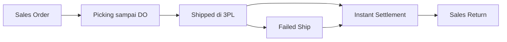
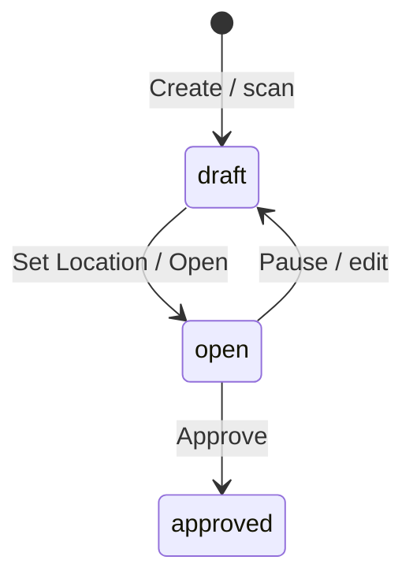

# Failed Ship — Panduan Pengguna

**Siapa yang baca panduan ini:** operator gudang, operations support, finance ops  
**Menu di sistem:** Supply Chain → Failed Ship  
**Kode transaksi:** dimulai dengan `FS`

---

## 1. Apa Itu & Kenapa Penting

**Failed Ship** dipakai saat paket COD **sudah dikirim ke gudang 3PL (status Shipped)**, tapi buyer **tidak terima / gagal kirim**, dan order itu **belum di-settlement** (belum ada Sales Invoice & Outbound).

Lewat menu ini kamu menyesuaikan stok di 3PL: barang yang kembali (Restock), hilang (Lost), atau rusak (Scrap/Broken). Tanpa Failed Ship yang benar, qty settlement dan Sales Return bisa tidak cocok dengan kondisi fisik.

> Beda dengan **Sales Return**: Sales Return untuk order yang **sudah settlement**. Failed Ship untuk yang **belum**.

---

## 2. Overview Flow & Proses Bisnis

### Rantai proses (dari order sampai Failed Ship / settlement)

**Versi teks (tanpa diagram):**

1. Order masuk dan di-proses di gudang: **Picking → Checking → Packing → Collecting → Delivery Order**.
2. Setelah DO di-approve, stok pindah ke **gudang 3PL (shipper)** — status order jadi **Shipped**.
3. Kalau gagal kirim **sebelum settlement** → proses di **Failed Ship** (menu ini).
4. Kalau order sudah di-settle → jangan pakai Failed Ship; pakai **Sales Return**.
5. Setelah Failed Ship di-approve, settlement berikutnya memakai **qty sisa** setelah Failed Ship.

🎬 [Interactive demo akan ditambahkan di sini]

### Siklus status transaksi

**Versi teks — arti tiap status:**

| Status | Artinya | Bisa diubah? |
|--------|---------|--------------|
| **Draft** | Baru dibuat; sering butuh Set Location dulu | Ya |
| **Open** | Sedang diproses; qty Restock/Lost/Scrap bisa diisi | Ya |
| **Approved** | Final — stok sudah dipindah / dipotong | Tidak |

> Setelah **Approved**, transaksi Failed Ship **tidak bisa diubah** seperti draft/open. Void dokumen yang sudah approved belum tersedia untuk dipakai sehari-hari.

---

## 3. Sebelum Mulai (Flow Sebelum)

Pastikan ini sudah siap sebelum scan / buat Failed Ship:

- [ ] Order sudah **Shipped** (sudah lewat picking–packing–DO sampai stok di 3PL).
- [ ] Order **belum** punya Sales Invoice atau Outbound — termasuk yang masih draft/open.
- [ ] Sudah tahu **Warehouse Location** (tujuan restock, rak Level 20 tanpa sub-gudang).
- [ ] Location itu sudah punya **setup scrap** di Warehouse Setting (kalau ada qty rusak).
- [ ] Sudah tahu **Shipper / 3PL** tempat paket terakhir.
- [ ] Kalau pakai CCTV Location di UI aktif: lokasi CCTV sudah dipilih.

**Catatan penting:**

- Kalau order sudah punya invoice/outbound (meski belum approve), sistem menolak scan dengan pesan *already been settled* — arahkan ke **Sales Return**.
- Order multi-produk: kadang masih muncul di daftar, tapi scan ditolak kalau sebagian produk sudah settled — itu known UX gap; cek status settlement per produk.

🎬 [Interactive demo akan ditambahkan di sini]

---

## 4. Setelah Selesai (Flow Sesudah)

Setelah Failed Ship **di-approve**:

1. **Restock** — qty yang diisi Restock pindah dari 3PL ke Location yang kamu pilih.
2. **Lost** — qty hilang keluar dari 3PL lewat Stock Deduction (biaya Return Expense).
3. **Scrap / Broken** — qty rusak pindah ke gudang scrap (dari setting warehouse parent Location).
4. Di Sales Order, status Failed Ship tampil sebagai **Processed** (sudah selesai).
5. **Instant Settlement** berikutnya memakai qty sisa setelah Failed Ship (produk yang full Failed Ship bisa tidak ikut invoice/outbound).

Yang perlu diingat setelah approve:

- Jangan upload settlement saat masih ada Failed Ship **Open** — upload akan ditolak.
- Idealnya: **Approve Failed Ship dulu**, baru settlement.
- Kalau order sudah settled setelah Failed Ship, retur pakai **Sales Return** — qty return maksimal = qty outbound (bukan qty order penuh).

🎬 [Interactive demo akan ditambahkan di sini]

---

## 5. Yang Perlu Diperhatikan

Ditulis dari sudut pandang yang kamu alami di layar:

- **Kalau kamu scan order yang sudah punya invoice atau outbound** (termasuk draft/open), sistem menolak dan minta pakai menu return.
- **Kalau order belum Shipped**, sistem menolak — selesaikan fulfillment dulu sampai DO approved dan stok di 3PL.
- **Kalau Total Restock + Lost + Scrap lebih dari qty produk**, sistem menolak — turunkan salah satu qty.
- **Kalau Location belum punya setup scrap**, approve bisa gagal saat ada qty Broken — atur Warehouse Scrap & Void dulu.
- **Kalau tanggal Failed Ship lebih awal dari tanggal DO**, sistem menolak — sesuaikan tanggal transaksi.
- **Kalau semua baris qty masih 0**, approve ditolak — isi minimal satu Restock/Lost/Scrap.
- **Kalau kamu upload settlement sementara Failed Ship masih Open**, seluruh batch settlement gagal — approve atau hapus FS dulu.
- **Kalau Shipper belum diisi**, simpan/proses bisa ditolak.
- **Kalau sudah ada baris detail**, Shipper biasanya tidak bisa diganti — hapus detail atau buat dokumen baru.
- **Kalau settlement terjadi di antara scan dan approve**, saat ini sistem belum selalu menolak ulang di tombol Approve — cek ulang status order sebelum approve; perbaikan sudah terdaftar.

---

## 6. Langkah-Langkah (Step by Step)

### Cara utama — Scan di Index

1. Buka **Supply Chain → Failed Ship**.
2. Pilih **Warehouse Location** (tujuan restock) dan **CCTV Location** bila diminta.
3. Scan / ketik **Platform Order ID** atau **kode Sales Order** → **Use** (atau scan langsung).
4. Sistem membuat dokumen Failed Ship dan mengisi semua produk order.
5. Di form, isi per produk:
   - **Restock Qty** — barang kembali ke Location
   - **Lost Items** — barang hilang
   - **Defect / Broken Items** — barang rusak
6. Pastikan **Total FS Qty** tidak melebihi qty produk.
7. Klik **Approve**.

### Cara alternatif — Create manual (layout lama, jika aktif)

1. Klik **Create**.
2. Isi Basic Information: Location, Shipper Name, Transaction Date (kode boleh dikosongkan untuk auto `FS`).
3. **Save & Next**.
4. Di section Shipped Sales Order, pilih produk/order → **Use**.
5. Edit qty Restock / Lost / Defect → **Approve**.

### Set Location (UI checking-style)

1. Buka **Set Location** jika diminta.
2. Pilih lokasi processing → status biasanya berubah dari Draft ke **Open**.

### Export data

1. Di index, buka panel **Export**.
2. Pilih **With Details** (per produk) atau **Without Details** (per order/header).
3. Tunggu job selesai → download dari daftar file export.

> **Import** bulk Failed Ship belum tersedia.

### Pill Sales Platform Returns

Di index ada pill **Sales Platform Returns**: daftar return dari API marketplace untuk order yang **belum outbound** — kandidat arah Failed Ship.

> Di menu **Sales Return**, section platform sebaliknya: hanya order yang **sudah full outbound**.

🎬 [Interactive demo akan ditambahkan di sini]

---

## 7. Tips & Hal yang Sering Bikin Bingung

- **Failed Ship vs Sales Return** — belum settle = Failed Ship; sudah settle = Sales Return. Jangan tertukar.
- **Invoice/Outbound masih open juga memblokir** — bukan hanya yang sudah approved.
- **Approve Failed Ship sebelum settlement** — supaya qty invoice/outbound cocok dengan fisik.
- **Prepared vs Processed di Sales Order** — Prepared = sudah masuk FS belum approve; Processed = sudah approve.
- **Order tampil di daftar tapi scan ditolak?** Cek apakah sebagian SKU sudah settled — pakai Sales Return untuk jalur yang sudah settle.
- **Scrap tidak muncul saat approve?** Cek setup scrap di Warehouse Setting untuk parent Location.
- **Export stuck?** Tunggu job selesai atau cek progress export; timeout bisa reset status.
- **Dua tampilan form?** UI aktif utama = scan di index + form checking-style; layout section lengkap ada di versi lama (V1).
- **Mau void Failed Ship yang sudah approved?** Belum tersedia sehari-hari — koordinasi manual / support.

---

## 8. Referensi

Untuk detail lebih lanjut (QA, developer, atau operator yang mau ngulik):

| Dokumen | Isi |
|---------|-----|
| [knowledge-base.md](./knowledge-base.md) | SOP operator, tombol UI, troubleshooting |
| [requirement.md](./requirement.md) | Aturan bisnis, validasi, acceptance criteria, gap |
| [technical.md](./technical.md) | API, database, alur approve teknis |

**Menu terkait:** Transfer Internal (audit Show Virtual) · Picking / Checking / Packing Process · Delivery Order · Sales Order · Instant Settlement · Sales Return

---

*Derivatif dari requirement / knowledge-base / technical v2.5 — tanpa menambah fakta baru di luar sumber.*
