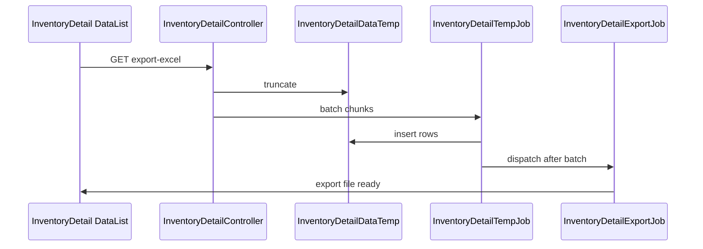

# Inventory Detail — Requirement Documentation

> **DRAFT** — Dokumen ini adalah draft awal hasil analisis codebase otomatis per 2026-06-19. Perlu direview PM/QA sebelum final.

## 0. Metadata & Changelog

| Version | Date | Author | Changes |
|---------|------|--------|---------|
| 1.0 | 2026-06-19 | QA - Yemima | Initial draft (AS-IS) |

## 1. Ringkasan Eksekutif

`InventoryDetailController@index` membangun query kompleks via `itemStockByWarehouseSpaceType()` dengan agregasi stok, reserved, in transit, dan stock alert per product×warehouse parent. Export: truncate `InventoryDetailDataTemp` → chunk jobs → Excel.

## 2. Acceptance Criteria (AS-IS)

| ID | Kriteria | Validasi | Fitur |
|----|----------|----------|-------|
| A-01 | Require `warehouse_space_type` | Request param | Index |
| A-02 | Optional `filter` query | Card filters (all/oos/warning/transit) | Quick filter |
| A-03 | Summary cards API | `all-stock-product-sku`, `all-out-of-stock-sku`, etc. | KPI cards |
| A-04 | Product tooltip + copy SKU | `product_formatted` HTML column | UX |
| A-05 | Detail item stock modal | `get-detail-item-stock?item_stock_ids=` | Drill-down |
| A-06 | Detail reserved modal | `get-detail-reserved-item-stock` | Drill-down |
| A-07 | Export Excel pipeline | `export-excel` → temp jobs → `InventoryDetailExportJob` | Export |
| A-08 | Select2 warehouse level | `select2-warehouse-level` | Filter |

## 3. Validasi & Rules

| ID | Rule | Trigger | Pesan |
|----|------|---------|-------|
| V-01 | Policy viewAny InventoryDetail | index, export | 403 |
| V-02 | Export clears temp table | `InventoryDetailDataTemp::truncate()` before export | Data isolation |

## 4. Fitur & Behavior

| ID | Fitur | Trigger | Expected |
|----|-------|---------|----------|
| F-01 | Total vs filtered record count | `custom_advance_filter: true` | Datatable recordsTotal vs filtered |
| F-02 | Warehouse parent by type join | `WarehouseParentByType` | Rows per parent location |
| F-03 | Cached warehouse children | Cache 300s | Performance |
| F-04 | Chunk export 500 rows | Bus batch with `InventoryDetailTempJob` | Scalable export |

## 5. Export Pipeline

## 6. QA Test Notes

- Switch warehouse level → URL dan count cards harus refresh
- Uji setiap quick filter card
- Uji export large dataset + progress endpoint
- Bandingkan qty dengan Real Time Stock by location

## Related Documents

| Doc | Path |
|-----|------|
| Knowledge Base | [knowledge-base.md](./knowledge-base.md) |
| Technical | [technical.md](./technical.md) |
