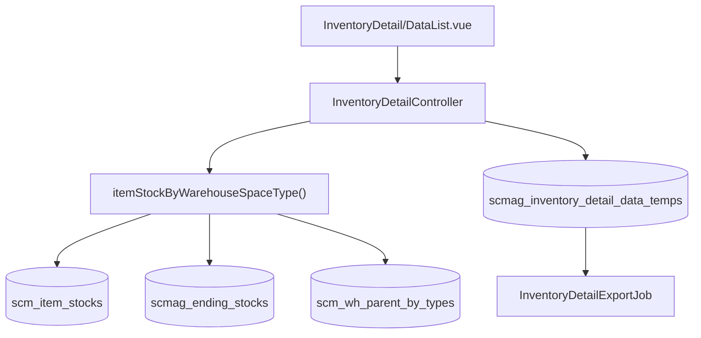

# Inventory Detail — Technical Documentation

> **DRAFT** — Dokumen ini adalah draft awal hasil analisis codebase otomatis per 2026-06-19. Perlu direview PM/QA sebelum final.

**UI route:** `/supplychain/inventory-detail`

---

## 1. Architecture Overview

---

## 2. Frontend File Map

| File | Role | Key API |
|------|------|---------|
| `Report/InventoryDetail/DataList.vue` | Main report UI | `GET supplychain/inventory-detail` |
| | Summary cards | `all-stock-product-sku`, `all-out-of-stock-sku`, etc. |
| | Export | `inventory-detail-export-file`, `get-export-all-progress` |
| | Modals | `get-detail-item-stock`, `get-detail-reserved-item-stock` |

---

## 3. Backend File Map

| File | Role |
|------|------|
| `InventoryDetailController.php` | index, aggregations, export, drill-down (~1700 lines) |
| `InventoryDetail.php` | Policy model |
| `InventoryDetailPolicy.php` | Authorization |
| `InventoryDetailTempJob.php` | Populate export chunks |
| `InventoryDetailExportJob.php` | Excel generation |
| `ReportInventoryDetail.php` | Maatwebsite export |
| `InventoryDetailExportFile.php` | Export metadata |

---

## 4. API Routes

| Method | Path | Handler |
|--------|------|---------|
| GET | `supplychain/inventory-detail` | index |
| GET | `supplychain/inventory-detail/select2-warehouse-level` | select2WarehouseLevel |
| GET | `supplychain/inventory-detail/all-stock-product-sku` | allStockProductSku |
| GET | `supplychain/inventory-detail/all-out-of-stock-sku` | allOutOfStockSku |
| GET | `supplychain/inventory-detail/all-number-of-warning` | allNumberOfWarning |
| GET | `supplychain/inventory-detail/all-qty-in-transit` | allQtyInTransit |
| GET | `supplychain/inventory-detail/export-excel` | exportExcel |
| GET | `supplychain/inventory-detail/inventory-detail-export-file` | inventoryDetailExportFile |
| GET | `supplychain/inventory-detail/get-export-all-progress` | getExportAllProgress |
| GET | `supplychain/inventory-detail/get-detail-item-stock` | getDetailItemStock |
| GET | `supplychain/inventory-detail/get-detail-reserved-item-stock` | getDetailReserved |

---

## 5. Database Schema

| Tabel | Role |
|-------|------|
| `scm_item_stocks` | Physical stock lots |
| `scm_wh_parent_by_types` | Warehouse hierarchy by space type |
| `scm_warehouses` | Warehouse master |
| `scm_warehouse_space_types` | Level definitions |
| `scmag_inventory_detail_data_temps` | Export staging |
| `scmag_inventory_detail_export_files` | Export jobs |

---

## 6. Jobs

| Job | Queue | Fungsi |
|-----|-------|--------|
| `InventoryDetailTempJob` | batch | `getStockArr()` per chunk |
| `InventoryDetailExportJob` | default | Write Excel, truncate temp |

---

## 7. Related docs

- [supplychain-real-stock/technical.md](../supplychain-real-stock/technical.md)
- [supplychain-warehouse-structure](../supplychain-warehouse-structure/) (pending)
