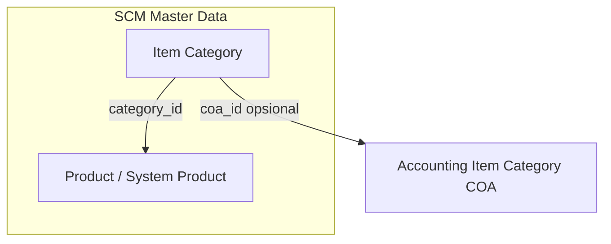

# Item Category — Requirement Documentation

> **DRAFT** — Dokumen ini adalah draft awal hasil analisis codebase otomatis per 2026-06-19. Perlu direview PM/QA sebelum final.

## 0. Metadata & Changelog

| Version | Date | Author | Changes |
|---------|------|--------|---------|
| 1.0 | 2026-06-19 | QA - Yemima | Initial draft (AS-IS dari kode) |

## 1. Ringkasan Eksekutif

Master hierarkis kategori produk (`scm_item_categories` + `scm_item_category_trees`). CRUD via `ItemCategoryController` dengan validasi pohon, default tunggal per company, dan proteksi data sistem.

## 2. How It Works

```mermaid
flowchart TD
    A["Datalist / Form"] -->|"POST item-categories"| B[ItemCategoryController@store]
    B --> C{"parent_id?"}
    C -->|yes| D[treeStoreCheck]
    C -->|no| E[Create ItemCategory]
    D -->|fail| F[Error JSON]
    D -->|ok| E
    E --> G[Create ItemCategoryTree\nparent_id]
    G --> H[Success]

    I["PUT item-categories/{id}"] --> J{System row?\ncreated_by=0}
    J -->|yes| K[Error cannot be changed]
    J -->|no| L[Validate + treeUpdateCheck]
    L --> M[updateChildStatus / is_all_company]
    M --> N[Update tree parent]
```

## 3. Acceptance Criteria (AS-IS)

| ID | Kriteria | Validasi | Fitur |
|----|----------|----------|-------|
| A-01 | Datalist dengan parent name | `index` + join tree | List |
| A-02 | Create kategori | `store` | Form create |
| A-03 | Edit kategori non-sistem | `update` | Form edit |
| A-04 | Soft delete | `destroy` + `deleted_by` | Delete |
| A-05 | Tree select2 | `select2itemCategory` | Parent dropdown |
| A-06 | Audit per record | `GET .../audit` | Audit slideover |
| A-07 | Proteksi default | destroy/update | Business rule |

## 4. Validasi & Rules

| ID | Rule | Trigger | Pesan error |
|----|------|---------|-------------|
| V-01 | `code` required, max 50, unique per company | store/update | Laravel validation |
| V-02 | `name` required, max 50 | store/update | Laravel validation |
| V-03 | `description` nullable, max 150 | store/update | Laravel validation |
| V-04 | `status`, `is_default`, `is_all_company` boolean string `true` | store/update | Cast 0/1 |
| V-05 | Parent harus exist | store/update | `Parent Not found` |
| V-06 | Tree cycle / depth | store/update | Pesan dari `TreeHandlerTrait` |
| V-07 | System row immutable | update/destroy | `Item category cannot be changed/deleted` |
| V-08 | Min satu default | update off default | `At least one default Item Category must remain active.` |
| V-09 | Tidak hapus default | destroy | `Cannot delete this data because it is set as the default...` |

## 5. Relasi Menu



| Menu terkait | Relasi |
|--------------|--------|
| Product (system) | `Product.category_id` |
| Item Category COA (Accounting) | Mapping COA per kategori |

## 6. Permission & Dependencies

- Policy: `ItemCategoryPolicy` (extends `MainPolicy`)
- Menu Gate id **125**: add/update/delete = 1
- Dependency: `ItemCategoryTree`, `TreeHandlerTrait`

## 7. QA Test Notes

- [ ] Create root + child; parent tampil di datalist
- [ ] Set default → kategori lain default reset
- [ ] Coba hapus default → ditolak
- [ ] Coba edit row sistem (`created_by=0`) → view only
- [ ] Select2 parent exclude cyclic branch

## 8. Known Gaps / Open Questions

- Field `coa_id` di controller vs visibility di form Vue — konfirmasi UI COA.
- `is_view_only` hanya untuk `created_by=0 && is_all_company`.

## Related Documents

| Doc | Path |
|-----|------|
| Knowledge Base | [knowledge-base.md](./knowledge-base.md) |
| Technical | [technical.md](./technical.md) |
