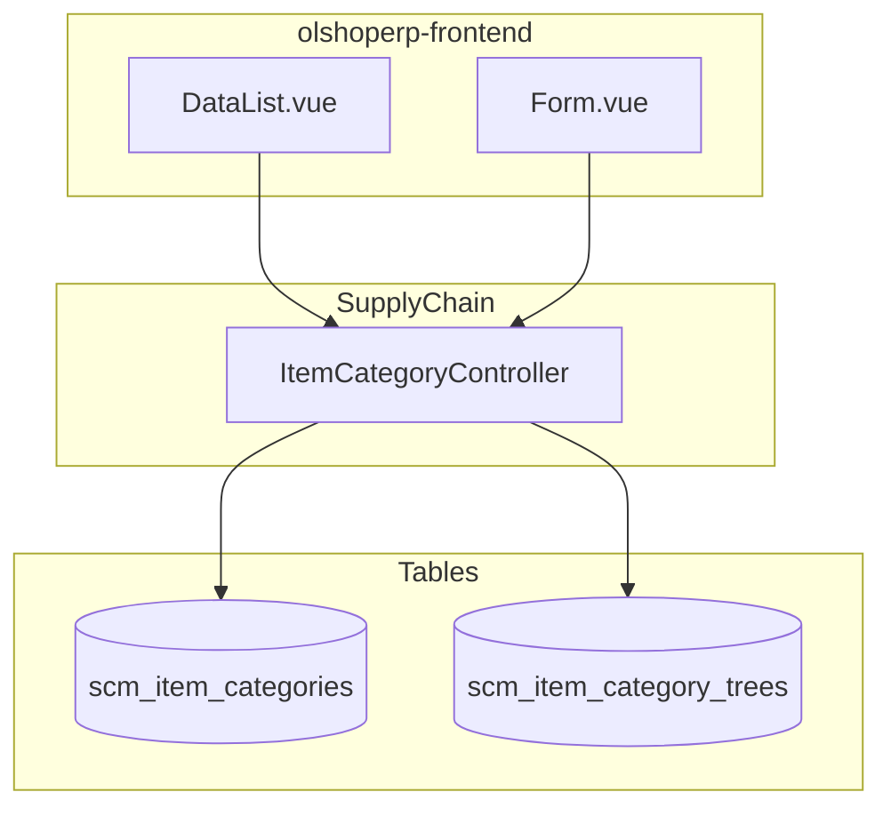

# Item Category — Technical Documentation

> **DRAFT** — Dokumen ini adalah draft awal hasil analisis codebase otomatis per 2026-06-19. Perlu direview PM/QA sebelum final.

**Stack:** Laravel 13 API · Vue 3 SPA  
**Menu slug:** `supplychain-item-category`  
**UI route:** `/supplychain/item-category`  
**API base:** `{VITE_API_URL}supplychain/item-categories`

---

## 1. Architecture Overview

---

## 2. Frontend File Map

**Root:** `olshoperp-frontend/src/pages/SCM/master/ItemCategory/`

| File | Role | Key API |
|------|------|---------|
| `DataList.vue` | Datalist + bulk delete | `GET supplychain/item-categories` |
| `Form.vue` | Create/edit | `POST/PUT supplychain/item-categories` |

### Router (`src/router/index.ts`)

| Route | Component |
|-------|-----------|
| `supplychain/item-category` | `DataList.vue` |
| `supplychain/item-category/create` | `Form.vue` |
| `supplychain/item-category/edit/:id` | `Form.vue` |

---

## 3. Backend File Map

| File | Role |
|------|------|
| `Modules/SupplyChain/Http/Controllers/ItemCategoryController.php` | CRUD, tree, select2, audit |
| `Modules/SupplyChain/Entities/ItemCategory.php` | Model `scm_item_categories` |
| `Modules/SupplyChain/Entities/ItemCategoryTree.php` | Pivot tree `parent_id` |
| `Modules/SupplyChain/Policies/ItemCategoryPolicy.php` | Authorization |

---

## 4. API Routes

**Prefix:** `supplychain` · **Middleware:** `auth:sanctum`, `auth_verified`  
**File:** `Modules/SupplyChain/Routes/api.php`

| Method | Path | Controller@method |
|--------|------|-------------------|
| GET | `item-categories` | `ItemCategoryController@index` |
| POST | `item-categories` | `ItemCategoryController@store` |
| GET | `item-categories/{id}` | `ItemCategoryController@show` |
| PUT/PATCH | `item-categories/{id}` | `ItemCategoryController@update` |
| DELETE | `item-categories/{id}` | `ItemCategoryController@destroy` |
| GET | `item-categories/tree/item` | `ItemCategoryController@treeItemCategory` |
| GET | `item-categories/select2/item` | `ItemCategoryController@select2itemCategory` |
| GET | `item-categories/{id}/audit` | `ItemCategoryController@audit` |

---

## 5. Database Schema

### `scm_item_categories`

| Column | Keterangan |
|--------|------------|
| `code`, `name` | Identifier tampilan |
| `description` | Opsional |
| `coa_id` | FK COA (opsional) |
| `status`, `is_default`, `is_all_company` | Flags |
| `owned_by`, `created_by`, `deleted_by` | Scope & audit |

### `scm_item_category_trees`

| Column | Keterangan |
|--------|------------|
| `item_category_id` | FK kategori |
| `parent_id` | FK parent (nullable = root) |

---

## 6. Jobs / Observers / Events

Tidak ada job khusus menu ini. Tree logic di `App\Traits\TreeHandlerTrait`.

---

## 7. Permissions

Policy `ItemCategoryPolicy` — actions standar `viewAny`, `view`, `create`, `update`, `delete` via `MainPolicy` + menu permission.
