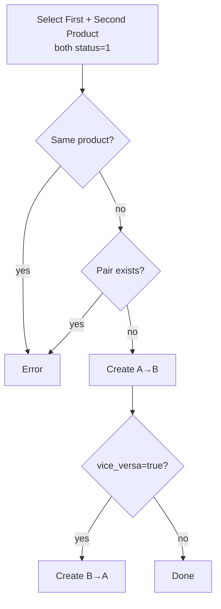
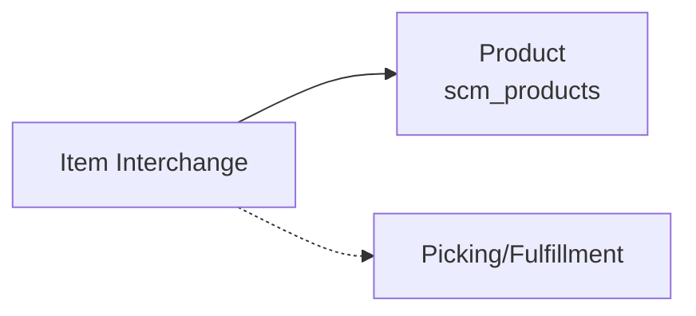

# Product Interchange — Requirement Detail

> **DRAFT** — Dokumen ini adalah draft awal hasil analisis codebase otomatis per 2026-06-19. Perlu direview PM/QA sebelum final.

**Modul:** SupplyChain · **Status:** AS-IS

---

## Daftar Isi

1. [Fungsi & Tujuan](#1-fungsi--tujuan)
2. [How It Works](#2-how-it-works)
3. [Validasi yang Berjalan](#3-validasi-yang-berjalan)
4. [Relasi Menu Lain](#4-relasi-menu-lain)
5. [FAQ](#5-faq)
6. [Known Gaps](#6-known-gaps)

---

## 1. Fungsi & Tujuan

### Apa itu?

Master pasangan produk substitusi di `scm_item_interchanges` — `first_item_id` (locked) dan `second_item_id` (editable).

### Masalah yang diselesaikan

| Kebutuhan | Solusi |
|-----------|--------|
| Substitusi SKU saat fulfillment | Directed pair mapping |
| Substitusi dua arah | Vice versa auto-create |
| Kontrol duplikasi | Unique pair check |

---

## 2. How It Works

### Update rules

- Hanya `second_item_id` + `description` dapat diubah.
- Validasi produk active + tidak duplikat pair.

---

## 3. Validasi yang Berjalan

### Store

| Field | Rule |
|-------|------|
| `first_item_id` | Required, max 30 |
| `second_item_id` | Required, max 30 |
| `description` | Nullable, max 150 |
| Products | Must exist with `status = 1` |
| Same item | Error: "First and second item can't be same" |
| Duplicate pair | Error: "Item interchange already exists" |
| Vice versa duplicate | Same error on reverse pair |

### Update

| Field | Rule |
|-------|------|
| `second_item_id` | Required, max 30 |
| `description` | Nullable, max 150 |
| `first_item_id` | **Not updatable** |

---

## 4. Relasi Menu Lain

| Menu | Relasi |
|------|--------|
| Product | FK first_item_id, second_item_id |
| Select2 | `item-interchange/select2/product-for-transaction` |

---

## 5. FAQ

**Q: Apakah first_item_id FK formal?**  
A: Migration menyimpan string ID (bukan foreignId constraint).

**Q: Apakah delete vice versa pair otomatis?**  
A: Tidak — delete hanya record yang dipilih.

---

## 6. Known Gaps

- Dead code `return $data` after `make(true)` in index.
- `first_item_id` immutable on update — tidak ada UI sync vice versa reverse record.
- Tidak ada FormRequest.

---

## Related Documents

| Doc | Path |
|-----|------|
| Knowledge Base | [knowledge-base.md](./knowledge-base.md) |
| Technical | [technical.md](./technical.md) |
