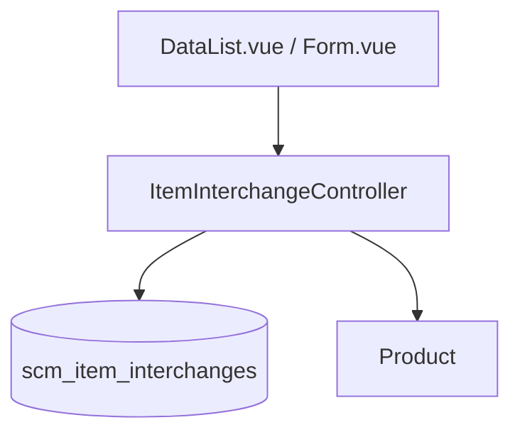

# Product Interchange — Technical Documentation

> **DRAFT** — Dokumen ini adalah draft awal hasil analisis codebase otomatis per 2026-06-19. Perlu direview PM/QA sebelum final.

**Menu slug:** `supplychain-item-interchange`  
**UI route:** `/supplychain/item-interchange`  
**API base:** `{VITE_API_URL}supplychain/item-interchange*`

---

## 1. Architecture Overview

---

## 2. Frontend File Map

**Root:** `olshoperp-frontend/src/pages/SCM/master/ItemInterchange/`

| File | Role |
|------|------|
| `DataList.vue` | Datalist dengan kolom first/second item formatted |
| `Form.vue` | Create/edit + vice versa toggle |

| Route | Component |
|-------|-----------|
| `supplychain/item-interchange` | `DataList.vue` |
| `supplychain/item-interchange/create` | `Form.vue` |
| `supplychain/item-interchange/edit/:id` | `Form.vue` |

---

## 3. Controller

| Class | Path |
|-------|------|
| `ItemInterchangeController` | `Modules/SupplyChain/Http/Controllers/ItemInterchangeController.php` |

| Method | Route |
|--------|-------|
| `index` | GET `/item-interchange` |
| `store` | POST `/item-interchange` |
| `show` | GET `/item-interchange/{id}` |
| `update` | PUT `/item-interchange/{id}` |
| `destroy` | DELETE `/item-interchange/{id}` |
| `audit` | GET `/item-interchange/{id}/audit` |
| `select2ProductForTransaction` | GET `/item-interchange/select2/product-for-transaction` |

---

## 4. Model / Entity

| Class | Table |
|-------|-------|
| `ItemInterchange` | `scm_item_interchanges` |

**Columns:** `first_item_id`, `second_item_id`, `description`, `status`, `is_all_company`.

**Relations:** `first_item()`, `second_item()` → `Product` (withTrashed on show).

---

## 5. DB Tables

| Table | Purpose |
|-------|---------|
| `scm_item_interchanges` | Product substitution pairs |

---

## 6. API Routes

| Method | URI | Controller |
|--------|-----|------------|
| GET | `item-interchange` | index |
| POST | `item-interchange` | store |
| GET | `item-interchange/{item_interchange}` | show |
| PUT/PATCH | `item-interchange/{item_interchange}` | update |
| DELETE | `item-interchange/{item_interchange}` | destroy |
| GET | `item-interchange/{item_interchange}/audit` | audit |
| GET | `item-interchange/select2/product-for-transaction` | select2 |

---

## 7. Policy

| Class | Abilities |
|-------|-----------|
| `ItemInterchangePolicy` | `viewAny`, `view`, `create`, `update`, `delete` |

---

## Related Documents

| Doc | Path |
|-----|------|
| Knowledge Base | [knowledge-base.md](./knowledge-base.md) |
| Requirement | [requirement.md](./requirement.md) |
