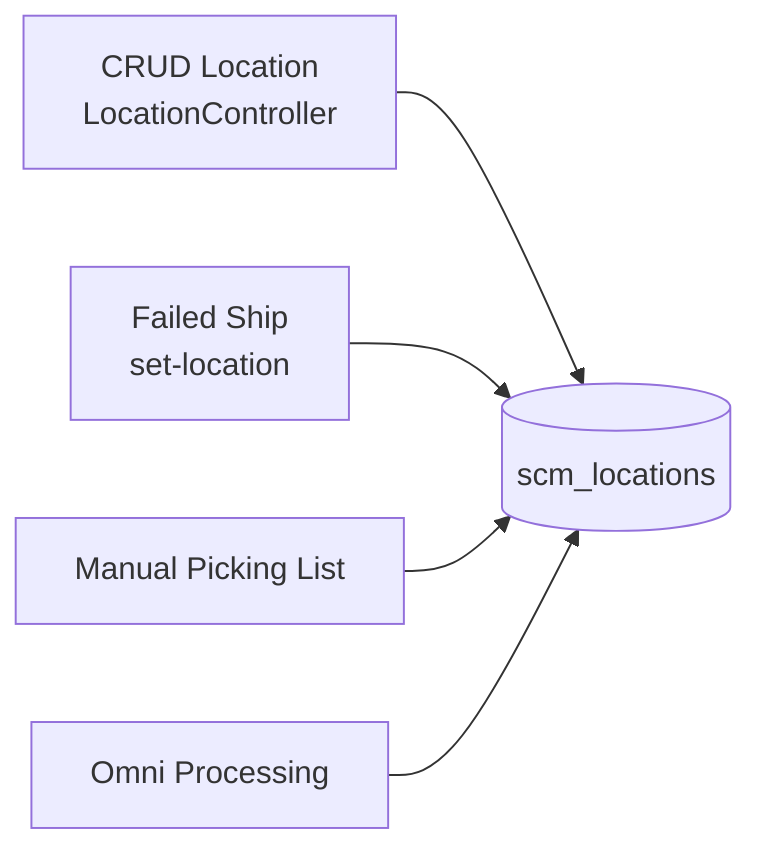
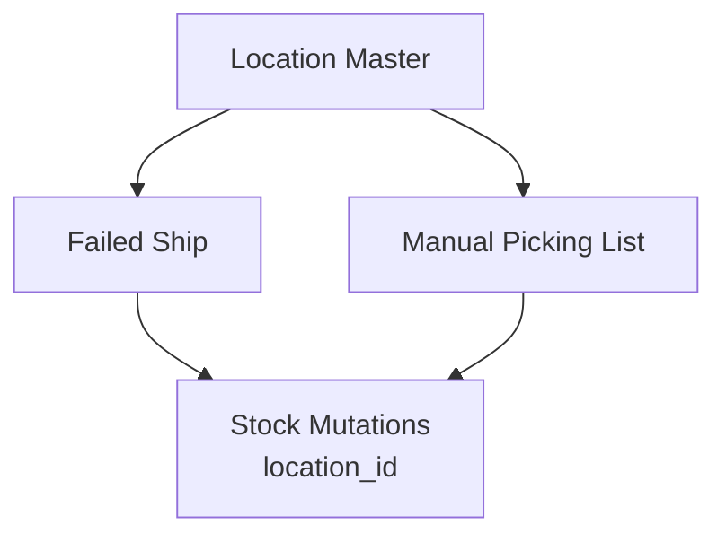

# Location — Requirement Detail

> **DRAFT** — Dokumen ini adalah draft awal hasil analisis codebase otomatis per 2026-06-19. Perlu direview PM/QA sebelum final.

**Modul:** SupplyChain · **Status:** AS-IS

---

## Daftar Isi

1. [Fungsi & Tujuan](#1-fungsi--tujuan)
2. [How It Works](#2-how-it-works)
3. [Validasi yang Berjalan](#3-validasi-yang-berjalan)
4. [Relasi Menu Lain](#4-relasi-menu-lain)
5. [FAQ](#5-faq)
6. [Known Gaps](#6-known-gaps)

---

## 1. Fungsi & Tujuan

### Apa itu Location?

Master lokasi proses gudang (`scm_locations`) untuk melacak **di mana** aktivitas warehouse (failed ship, picking, checking) dilakukan.

### Masalah yang diselesaikan

| Kebutuhan | Solusi |
|-----------|--------|
| Audit trail lokasi fisik proses | `location_id` on mutations |
| Standardisasi nama lokasi | Master code + name |
| Integrasi multi modul | Shared select2 |

---

## 2. How It Works

### CRUD flow

1. `GET/POST/PUT/DELETE supplychain/location` — standard resource.
2. `GET supplychain/location/select2` — HasSelect2 trait, filter active, limit 25.
3. `GET supplychain/location/{id}/audit` — audit datatable.
4. Destroy sets `deleted_by` then soft delete.

### Konsumsi transaksi

- Failed Ship: `POST failed-ship/{id}/set-location` → update `location_id`, may transition draft→open.
- Failed Ship select2: `GET failed-ship/select2-location` delegates to location logic.
- Manual Picking List: `select2-location`, `set-location`.

---

## 3. Validasi yang Berjalan

| Field | Rule |
|-------|------|
| `code` | Required, max 50, unique per company |
| `name` | Required, max 50 |
| `description` | Nullable, max 150 |
| `status` | `'true'` → 1 |
| `is_all_company` | `'true'` → 1 |

Inline validation — no FormRequest.

---

## 4. Relasi Menu Lain

| Menu | Relasi |
|------|--------|
| Failed Ship | set-location, select2-location |
| Manual Picking List | set-location |
| Warehouse operations (Omni) | Processing location pages |

---

## 5. FAQ

**Q: Apakah delete location diblokir jika masih dipakai?**  
A: AS-IS destroy tidak cek referensi mutation — soft delete langsung.

**Q: Bedanya `select2` vs `select2Location`?**  
A: Dua method di controller; route aktif utama `/location/select2`.

---

## 6. Known Gaps

- Stub methods `create()`, `edit()` kosong.
- `select2Location` method exists but no dedicated route in location group.
- No referential integrity check on delete.

---

## Related Documents

| Doc | Path |
|-----|------|
| Knowledge Base | [knowledge-base.md](./knowledge-base.md) |
| Technical | [technical.md](./technical.md) |
