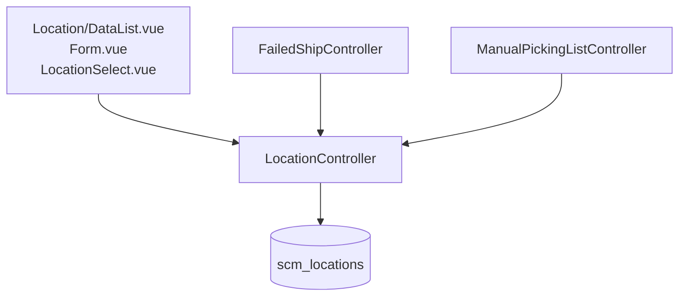

# Location — Technical Documentation

> **DRAFT** — Dokumen ini adalah draft awal hasil analisis codebase otomatis per 2026-06-19. Perlu direview PM/QA sebelum final.

**Menu slug:** `supplychain-location`  
**UI route:** `/supplychain/location`  
**API base:** `{VITE_API_URL}supplychain/location*`

---

## 1. Architecture Overview

---

## 2. Frontend File Map

**Root:** `olshoperp-frontend/src/pages/SCM/master/Location/`

| File | Role |
|------|------|
| `DataList.vue` | Master datalist |
| `Form.vue` | Create/edit |
| `components/LocationSelect.vue` | Reusable select component |

| Route | Component |
|-------|-----------|
| `supplychain/location` | `DataList.vue` |
| `supplychain/location/create` | `Form.vue` |
| `supplychain/location/edit/:id` | `Form.vue` |

Also reused: Failed Ship `Location.vue`, Omni processing pages.

---

## 3. Controller

| Class | Path |
|-------|------|
| `LocationController` | `Modules/SupplyChain/Http/Controllers/LocationController.php` |

Uses traits: `HasSelect2`, `AuditHandlerTrait`, `BasicResponseTrait`.

| Method | Route |
|--------|-------|
| `index` | GET `/location` |
| `store` | POST `/location` |
| `show` | GET `/location/{id}` |
| `update` | PUT `/location/{id}` |
| `destroy` | DELETE `/location/{id}` |
| `audit` | GET `/location/{id}/audit` |
| `select2` | GET `/location/select2` |
| `select2Location` | (no dedicated route) |

---

## 4. Model / Entity

| Class | Table |
|-------|-------|
| `Location` | `scm_locations` |

**Columns:** `code`, `name`, `description`, `status`, `is_all_company`.

Referenced by `scm_stock_mutations.location_id` (Failed Ship, picking flows).

---

## 5. DB Tables

| Table | Purpose |
|-------|---------|
| `scm_locations` | Processing location master |

---

## 6. API Routes

| Method | URI | Notes |
|--------|-----|-------|
| GET | `location` | index |
| POST | `location` | store |
| GET | `location/{location}` | show |
| PUT/PATCH | `location/{location}` | update |
| DELETE | `location/{location}` | destroy |
| GET | `location/select2` | select2 |
| GET | `location/{id}/audit` | audit |
| GET | `failed-ship/select2-location` | Failed Ship proxy |
| POST | `failed-ship/{id}/set-location` | Sets location on FS |
| GET | `manual-picking-list/select2-location` | MPL proxy |

---

## 7. Policy

| Class | Abilities |
|-------|-----------|
| `LocationPolicy` | `viewAny`, `view`, `create`, `update`, `delete` |

---

## Related Documents

| Doc | Path |
|-----|------|
| Knowledge Base | [knowledge-base.md](./knowledge-base.md) |
| Requirement | [requirement.md](./requirement.md) |
