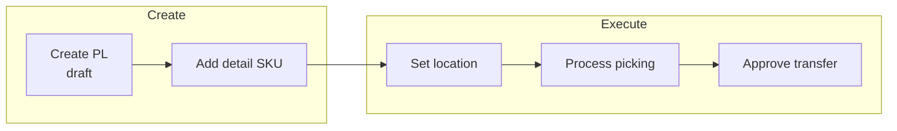

# Manual Picking List — Requirement Detail

> **DRAFT** — Dokumen ini adalah draft awal hasil analisis codebase otomatis per 2026-06-19. Perlu direview PM/QA sebelum final.

**Modul:** SupplyChain  
**Status:** AS-IS

---

## 1. Fungsi & Tujuan

Manual Picking List adalah `StockMutation` dengan:

- `type = TF_INTERNAL`
- `process_type = PROCESS_TYPE_MANUAL_PICKING`
- Prefix kode `PL`

Data disimpan di `scm_stock_mutations` + detail `scm_transfer_mutation_details`.

---

## 2. Alur Kerja

### 2.1 Create (`POST supplychain/manual-picking-list`)

| Field | Validasi |
|-------|----------|
| `transaction_date` | Wajib, tidak > hari ini |
| `warehouse_origin` | Wajib |
| `name` | Opsional, max 50 |
| `description` | Max 150 |
| `code` | Opsional; auto `PL-*`; unique per company |

`warehouse_destination` di-resolve otomatis via `SettingWarehouseScrapVoidController@getWarehouseOutRack` (type PICKING).

### 2.2 Update

Hanya jika `can_update = true` **dan** `start` masih null.

### 2.3 Set Location / Pause / Resume

| Endpoint | Fungsi |
|----------|--------|
| `POST manual-picking-list/{id}/set-location` | Assign lokasi picking |
| `POST manual-picking-list/{id}/pause` | Pause durasi |
| `POST manual-picking-list/{id}/resume` | Lanjutkan |

### 2.4 Detail

| Endpoint | Fungsi |
|----------|--------|
| `GET .../manual-picking-list-detail/primevue` | Grid detail |
| `POST .../bulk-create` | Bulk FIFO |
| `POST .../upload` | Import Excel |
| `GET .../export-excel` | Export detail |

`show()` mendelegasikan ke `OmniChannel\PickingListController@show` dengan model `ManualPickingList`.

---

## 3. Validasi

- Fiscal period pada tanggal transaksi.
- Policy `ManualPickingListPolicy`.
- Warehouse origin wajib punya out rack picking terkonfigurasi.

---

## 4. Relasi Menu

| Menu | Relasi |
|------|--------|
| Warehouse Setting | Out rack destination |
| Location | Set location flow |
| Omni Picking List | Shared picking UI logic |

---

## 5. FAQ

**Q: Beda dengan Omni Picking List?**  
A: Manual PL memakai `PROCESS_TYPE_MANUAL_PICKING`; tidak terikat wave SO otomatis.

**Q: Bagaimana cek PL belum selesai?**  
A: `GET manual-picking-list/incomplete-picklist` dan `get-incomplete-count`.
