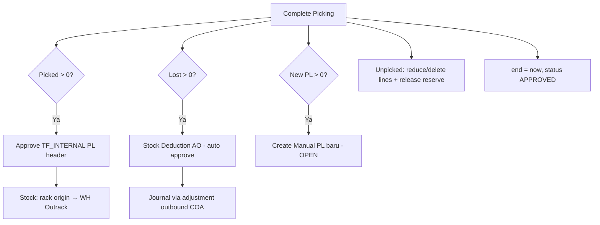
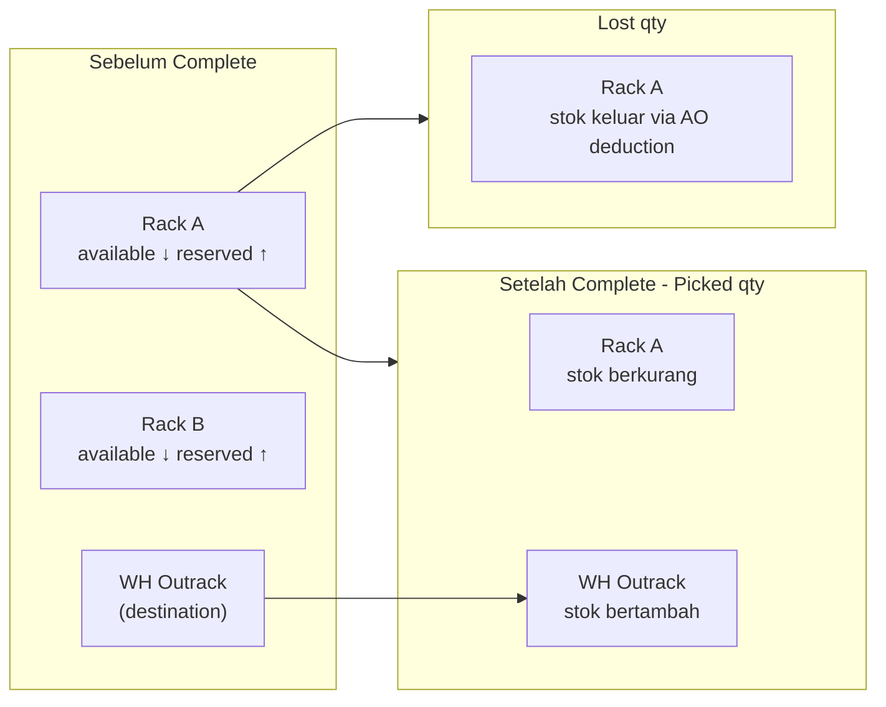

# Manual Picking List — Requirement Documentation

**Modul:** Supply Chain Management / Warehouse Operations  
**Prefix transaksi:** `PL-`  
**UI route:** `/supplychain/manual-picking-list`  
**API base:** `{VITE_API_URL}supplychain/manual-picking-list`  
**Audience:** PM, Operations, QA, Support, Developer  
**Status:** AS-IS verified against codebase per 2026-07-05  
**PM source:** Manual Picking List requirement v1.0 (5 Juli 2026)

> **Pembeda penting:** Menu ini = **Manual Picking List** (user buat ad-hoc). **Bukan** Omni Picking List yang auto-generate dari Sales Order / Wave. Keduanya pakai prefix `PL-` dan engine picking yang sama (`PickingListController`), dibedakan `process_type`.

---

## 0. Metadata & Changelog

| Version | Date | Author | Changes |
|---------|------|--------|---------|
| 1.0 | 2026-06-19 | QA - Yemima | Draft awal codebase AS-IS (singkat) |
| 2.0 | 2026-07-05 | QA - Yemima | Full rewrite PM requirement + codebase verify; gaps §16; relasi Transfer Internal & warehouse §12 |

---

## Daftar Isi

1. [Fungsi & Tujuan](#1-fungsi--tujuan)
2. [Datalist — Kolom & Fitur](#2-datalist--kolom--fitur)
3. [Create — Basic Information](#3-create--basic-information)
4. [Section Picking List Detail](#4-section-picking-list-detail)
5. [Mekanisme Pengambilan Stok](#5-mekanisme-pengambilan-stok--single-rack-fulfillment--fifo)
6. [Stock Reserved](#6-stock-reserved--efek-insert-produk-ke-detail)
7. [Halaman Proses Picking](#7-halaman-proses-picking)
8. [Sub-Flow: Lost, New PL, Picked, Unpicked](#8-sub-flow-lost-qty-qty-new-pl-picked-unpicked)
9. [Complete Picking](#9-behavior-saat-complete-picking)
10. [Dokumen Turunan](#10-dokumen-turunan-yang-digenerate)
11. [Validasi](#11-validasi-yang-berjalan)
12. [Relasi Menu Lain — Transfer Internal & Warehouse](#12-relasi-menu-lain)
13. [Do's and Don'ts](#13-dos-and-donts)
14. [Edge Cases](#14-edge-cases)
15. [Acceptance Criteria](#15-acceptance-criteria)
16. [Gaps — PM vs AS-IS](#16-gaps--pm-vs-as-is-codebase)
17. [Changelog](#17-changelog)

---

## 1. Fungsi & Tujuan

### 1.1 Apa itu Manual Picking List?

Transaksi gudang ad-hoc untuk memfasilitasi picking barang: user tentukan **Building Origin**, produk + qty, sistem alokasi rack (Single Rack Fulfillment → FIFO), **reserve stok**, lalu petugas menjalankan picking di halaman proses.

Saat **Complete Picking**, sistem generate:

- **Transfer Internal** (picked qty: rack → WH Outrack) — auto-approve
- **Stock Deduction** (lost qty) — auto-approve
- **Manual Picking List baru** (qty new PL)

### 1.2 Data model (AS-IS)

| Aspek | Nilai |
|-------|-------|
| Entity | `ManualPickingList` extends `StockMutation` |
| Tabel header | `scm_stock_mutations` |
| Tabel detail | `scm_transfer_mutation_details` |
| Middle (group) | `scm_transfer_mutation_middle_details` |
| `type` | `TF_INTERNAL` |
| `process_type` | `'manual picking'` (`StockMutation::PROCESS_TYPE_MANUAL_PICKING`) |
| Kode | Auto `PL-*` via `generateCode(ManualPickingList::class, 'PL')` |

### 1.3 Manual vs Auto Picking List

| Aspek | Manual Picking List (menu ini) | Auto Picking List (Omni) |
|-------|-------------------------------|---------------------------|
| Trigger | User create manual | Auto dari Wave / Send to Default Waves |
| Menu | `/supplychain/manual-picking-list` | `/omni/picking-list` |
| `process_type` | `'manual picking'` | `'picking'` |
| Terikat SO | **Tidak** (`from_so = false`) | **Ya** — referensi wave/SO detail |
| Create form | Full SCM Form + detail/import | Tidak ada create manual |
| Complete side-effect | TF approve + deduction + new MPL | + checking list / SO jobs |
| Prefix kode | **`PL-`** (sama) | **`PL-`** (sama) |
| Picking UI | Shared Omni components | Shared Omni components |

Detail perbandingan: [omni-picking-list](../omni-picking-list/requirement.md)

---

## 2. Datalist — Kolom & Fitur

**FE:** `SCM/PickingList/DataList.vue` · **API:** `GET manual-picking-list/primevue`

### 2.1 Kolom

| # | Kolom UI | Backend | Keterangan |
|---|----------|---------|------------|
| 1 | Trx Code \| Trx Date | `code_formatted` | Kode PL + tanggal |
| 2 | Building Origin | `warehouse_origin_formatted` | WH building (level 19+) |
| 3 | Description | `description` | — |
| 4 | Assignee | `picked_by_formatted` | User ditugaskan (`picked_by`) |
| 5 | Start \| End Picking | `start_formatted`, `end_formatted` | Timestamp start/complete |
| 6 | Total SKU \| Total Qty | `total_sku_formatted`, `total_qty_formatted` | Agregasi detail |
| 7 | Picking Status \| Duration | `picking_status_duration_formatted` | Lihat §2.2 |
| 8 | Trx Status | `transaction_status_formatted` | Draft / Open / Approved |
| 9 | Created By \| At | default audit columns | — |
| 10 | Action | `action` | Print, Start/Continue/Resume — §2.4 |

### 2.2 Picking Status (AS-IS)

| Status UI | Kondisi code |
|-----------|--------------|
| **Unpicked** | `start` IS NULL |
| **In Progress** | `start` NOT NULL, `end` NULL, tidak paused |
| **Paused** | Ada `TransferDuration` pause aktif (tooltip alasan) |
| **Complete** | `end` NOT NULL |

> PM hanya menyebut Unpicked / In Progress / Complete — **Paused** ada di AS-IS (tambahan codebase).

### 2.3 Trx Status

| Status | Kondisi | Editable header? |
|--------|---------|------------------|
| **Draft** | Default setelah create | Ya (sebelum start) |
| **Open** | User set manual / auto saat start picking | Ya (sebelum start) |
| **Approved** | Setelah Complete Picking | Tidak |

**AS-IS:** Setelah **Start Picking** (`start` terisi), header **tidak bisa di-update** (termasuk switch ke Draft). Radio Draft/Open di form **auto-save** via watcher.

### 2.4 Action buttons

| Tombol | Kondisi (AS-IS) |
|--------|-----------------|
| **Print** | Selalu (`printable: true`) — `GET {id}/print` |
| **Start Picking** | `startable: true` hanya jika **bukan Draft** dan belum complete — PM: hanya **Open** |
| **Continue / Resume** | Picking paused atau lanjut set-location → `/process/{id}` |

**Routing Start:**

1. Belum set location → `/manual-picking-list/set-location/{id}`
2. Sudah location + manual picking → `/manual-picking-list/process/{id}`
3. Lainnya → `/edit/{id}`

Draft **memblok** Start (`startable = false`) dan `setLocation` return error.

### 2.5 Pill "Incomplete Picklist"

- Count: `GET get-incomplete-count` — PL dengan `start NOT NULL` **tanpa** approval
- Klik pill → modal/filter `GET incomplete-picklist`
- Label FE: **"Incomplete Picklist"** (bukan persis "Incomplete Picking List" di PM)

---

## 3. Create — Basic Information

**Flow:** Klik Create → `fetchDefaultValues()` → **auto POST create** → redirect edit.

| # | Field | Wajib? | Default / Autofill (AS-IS) |
|---|-------|--------|----------------------------|
| 1 | Trx Code | — | Auto `PL-*`; disabled on edit |
| 2 | Trx Date | ✓ | `now()` |
| 3 | Picking List Name | — | Auto `"Picking List {code}"` on create — **tidak** `"Picking List - {trx code}"` persis PM |
| 4 | Building Origin | **✓** | `GET default-values` → **last** PL `warehouse_origin`; NULL jika belum pernah |
| 5 | Assign To | Opsional | Autofill last `picked_by` jika ada |
| 6 | Status | — | Default **Draft** |
| 7 | WH Destination (hidden) | Auto | `getWarehouseOutRack(origin, PICKING_TYPE)` — **tidak tampil di form** |
| 8 | Start / End | — | Disabled sampai picking flow |

### 3.1 Auto-save rules (AS-IS)

| Field | Auto-save on change? |
|-------|---------------------|
| Building Origin | ✓ watcher → PUT update |
| Assign To | ✓ |
| Trx Date | ✓ |
| Draft / Open radio | ✓ |
| Name, Description | ✗ — hanya **Save All** |

Create **gagal** jika `warehouse_origin` NULL (validation required). Out rack harus terkonfigurasi di Warehouse Setting — jika tidak, create error.

---

## 4. Section Picking List Detail

Muncul setelah header tersimpan (edit mode).

### 4.1 Select Product — definisi "available" (verified)

`select2AvailableProducts()` — produk punya `ItemStock` dengan:

| Filter | Rule |
|--------|------|
| Stok | `available_quantity >= config('warehouse.item_stock.lowest_available_stock')` |
| Tanggal inbound | `transaction_date <=` PL transaction date |
| Empty stock date | `empty_stock_date >= request_date` OR NULL |
| Scope WH | Subtree **Building Origin** |
| **Exclude** | WH **destination Outrack** PL ini |
| **Exclude** | Semua global **Outrack** (`SettingWarehouseOutRack::PICKING_TYPE`) |
| **Exclude** | **WIP** warehouse (`getWarehouseWip()`) |
| Produk | **Bukan** random SKU · **Bukan** bundle |

Insert inline juga memanggil `checkAvailableProduct()` → `getFulfillAfterFifo` dengan qty 1.

**Stok tidak cukup saat insert:** return error **`Product is not available.`** (block insert, bukan warning). Qty explicit > available → **`Transfer quantity must be greater than 0 and less than current available stock`**.

### 4.2 Datatable detail (AS-IS)

**FE columns** (`DatalistDetail.vue`):

| Kolom | Keterangan |
|-------|------------|
| System Product SKU \| Name | Identitas produk |
| **Availability** | `available_quantity` item_stock (primary unit) |
| **Qty to Pick** | Editable sebelum start (`transfer_quantity`) |
| **Unpick** | Qty belum dipick (derived post-start) |
| **Picked** | `picked_in_base_unit` |
| **Lost** | `lost_in_base_unit` |
| Unit | Satuan line |
| **Location Origin** | Rack / `transfer_detailed_item_location` |
| Total Weight | Agregasi D&W |
| Cart No | Cart picking |

**Group view:** `DatalistDetailGroup.vue` — middle layer per product.

**Bulk actions:** Bulk FIFO · Import Excel · Export detail.

---

## 5. Mekanisme Pengambilan Stok — Single Rack Fulfillment + FIFO

**Helper:** `getFulfillAfterFifo()` — `app/Helpers/SupplyChain/WarehouseHelper.php`  
**Config:** `config('warehouse.item_stock.ful_fill_method')` = `'fulfill_after_fifo'`

### 5.1 Algoritma (verified = PM intent)

1. Resolve **WIP** + **Outrack** IDs → **exclude** dari kandidat rack
2. Exclude `warehouse_destination` (Outrack tujuan PL)
3. Filter stocks: `available_quantity >= outbound_qty`, inbound date ≤ request date
4. **Tahap 1 — Single rack fulfillment:** prefer stock yang bisa fulfill **full qty** dari satu rack, urut **FIFO** inbound date
5. **Tahap 2 — Fallback FIFO:** jika tidak ada single rack cukup → `getFifoProduct()` — kombinasi multi-rack FIFO

Ini selaras **FIFO After Fulfill** (bukan FIFO klasik murni) — sama family dengan Failed Ship / SO allocation.

### 5.2 Exclude Outrack & WIP (verified)

| WH di-exclude | Sumber |
|---------------|--------|
| Outrack destination PL | `warehouse_destination` header |
| Semua Outrack picking | `SettingWarehouseOutRack::PICKING_TYPE` |
| WIP | `getWarehouseWip(building_origin)` |

**Alasan:** Transfer Internal picked qty → destination = **Outrack**; origin tidak boleh Outrack/WIP (hindari loop invalid).

---

## 6. Stock Reserved — Efek Insert Produk ke Detail

**Mekanisme:** update langsung pada `scm_item_stocks`:

```
reserved_quantity += qty_in_base_unit
available_quantity -= qty_in_base_unit
```

**Saat delete detail / delete header:** `ItemStockMutation::deleteTransferDetailRow` / `deleteTransfer` — **release** reservation (reserved ↓, available ↑).

**Middle layer:** `generateMiddleTransfer()` agregasi per product.

**Child stock picking:** `ItemStockMutation::pickChildsForTransfer` untuk BOM child jika applicable.

---

## 7. Halaman Proses Picking

**Route:** `/supplychain/manual-picking-list/process/:id`  
**Component:** `PickingForm.vue` — **wrapper** Omni shared components:

| Komponen | Fungsi |
|----------|--------|
| `HeaderInformation.vue` | Info PL + durasi |
| `FormComponent.vue` | Grid pick/unpick per line |
| `IncompleteDetailDatalist.vue` | Baris incomplete — Lost / New PL input |
| `CompletionSummary.vue` | Ringkasan setelah complete |

**API data:** `omnichannel/picking-list/{id}` + `picking-list-detail` (shared dengan Omni PL).

### 7.1 Start Picking (verified)

User klik Start dari datalist → **Set Location** (`Location.vue`) jika belum ada `location_id`:

| Step | Efek |
|------|------|
| Validasi | Bukan Draft · punya detail · bukan WIP-only details · assignee lock |
| Update | `location_id`, `start = now()`, `transaction_status = open`, `picked_by = current user` |
| Duration | Create `TransferDuration` record |

### 7.2 UX picking (verified)

| Aksi | API / behavior |
|------|----------------|
| Tandai **Picked** | `POST omnichannel/picking-list-detail/{id}/pick` → update `picked_in_base_unit` |
| Icon picked | Green `fa-square-check` (#0D9488) |
| Icon unpicked | Gray `fa-square` (#AFB0B2) |
| **Lost Qty / Qty New PL** | Input di incomplete flow → `updatePickingDetail` distribusi ke `lost_in_base_unit` / `new_pick_in_base_unit` |
| **Pause / Resume** | SCM routes → shared pause logic |
| **Complete** | `POST omnichannel/picking-list/{id}/approve` → `approveManualPicking()` |

Jika masih ada unpicked → response `incomplete_picking: true` — user wajib pilih **`incomplete_action`** sebelum lanjut.

---

## 8. Sub-Flow: Lost Qty, Qty New PL, Picked, Unpicked

### 8.1 Formula (PM + AS-IS)

```
Qty to Pick = Picked + Lost Qty + Qty New PL + Unpicked
Unpicked    = Qty to Pick - Picked - Lost Qty - Qty New PL  (otomatis, bukan input user)
```

### 8.2 Efek per kondisi saat Complete

| Kondisi | Efek |
|---------|------|
| **Picked** | Detail qty disesuaikan → TF Internal approve (rack → Outrack) |
| **Lost** | Stock Deduction `AO-*`, `process_type = lost`, ref PL |
| **Qty New PL** | Generate MPL baru (§9.5) |
| **Unpicked** | Qty line di-reduce/delete; reservation **released** proporsional |

---

## 9. Behavior saat Complete Picking

**Entry:** `PickingListController@preApproved` → `approveManualPicking()`



### 9.1 Transfer Internal — Picked (verified)

| Aspek | Detail |
|-------|--------|
| Dokumen | **Header PL sendiri** (`type = TF_INTERNAL`) — bukan dokumen TF terpisah |
| WH Origin | Rack per detail (`warehouse_origin_id` / item_stock location) |
| WH Destination | `warehouse_destination` = **Outrack** dari Warehouse Setting |
| Approve | `StockMutationTransferController@approve(..., is_from_pl: true)` |
| Journal | Mengikuti flow Transfer Internal standard (inventory COA per product) — lihat [mutation-transfer-internal](../supplychain-mutation-transfer-internal/requirement.md) |
| Stock movement | `item_stock` pindah rack → Outrack; `reserved_quantity` cleared on approve path |

### 9.2 Stock Deduction — Lost (verified)

| Aspek | Detail |
|-------|--------|
| Entity | `StockMutationDeduction` code prefix **`AO-`** |
| `process_type` | `'lost'` |
| `is_inventory_adjustment` | 1 |
| Referensi | `transaction_reference_class = PickingList`, id + code PL |
| WH Origin | Building origin PL |
| Approve | Auto via `StockMutationDeductionDetailController@store(..., is_finance: true)` |
| Journal / COA | **Indirect** — lewat Product COA Group pada adjustment outbound (finance path) · bukan hardcoded "Return Expense" di controller PL |
| UI link completion | `/accounting/adjustment-outbound/...` atau `/supplychain/adjustment-deduction/...` |

### 9.3 New Picking List — Qty New PL (verified)

| Aspek | AS-IS |
|-------|-------|
| Status baru | **`Open`** (bukan Draft) |
| Building Origin | **Sama** dengan PL induk |
| Assignee | Copy `picked_by` induk |
| Description | `"This document auto generated from {parent code}"` |
| Detail | Re-create via `ManualPickingListDetailController@store` — **re-reserve** stock |
| Iterasi | **Tidak ada batas** safeguard — rekursif dimungkinkan |

### 9.4 Completion Summary

`GET manual-picking-list/{id}/completion-summary` — ringkasan TF / Deduction / New PL quantities + links.

---

## 10. Dokumen Turunan yang Digenerate

| Kondisi | Dokumen | Origin → Destination | Auto-approve |
|---------|---------|----------------------|--------------|
| Picked > 0 | TF Internal (header PL) | Rack → WH Outrack | ✓ |
| Lost > 0 | Stock Deduction (`AO-`) | WH origin building | ✓ |
| New PL > 0 | Manual PL baru | — (new header) | Header Open; picking belum start |
| Unpicked > 0 | — | Release reservation only | — |

---

## 11. Validasi yang Berjalan

| # | Validasi | Behavior AS-IS |
|---|----------|----------------|
| 1 | Building Origin NULL on create | Block — validation error |
| 2 | Out rack tidak configured | Error on create/update warehouse |
| 3 | Start Picking saat Draft | Block — datalist `startable=false`; setLocation error |
| 4 | Edit setelah start | Block update header |
| 5 | Switch ke Draft setelah start | Block (start terisi) |
| 6 | Stok tidak cukup insert | Error `Product is not available.` |
| 7 | Qty > available (explicit stock) | Error transfer quantity message |
| 8 | Random / Bundle product | Block insert |
| 9 | Max details | `config('general.max_child')` |
| 10 | Fiscal period | `validate_fiscal_period()` |
| 11 | Delete header approved/started | Block |
| 12 | Assignee lock | User lain tidak bisa start picking |
| 13 | Complete dengan unpicked | Wajib `incomplete_action` |
| 14 | Import parallel | Block jika import sedang jalan |

---

## 12. Relasi Menu Lain

### 12.1 Transfer Internal & pergerakan stok

Manual PL **adalah** dokumen Transfer Internal (`TF_INTERNAL`). Saat complete:



| Tahap | `scm_item_stocks` | Dokumen |
|-------|-------------------|---------|
| Insert detail | `reserved_quantity ↑`, `available_quantity ↓` | — |
| Picking in progress | Picked qty tracked on detail row | — |
| Complete picked | Transfer approve: stock moves rack → Outrack | TF_INTERNAL (PL header) |
| Complete lost | Outbound deduction at rack | Stock Deduction `AO-` |
| Complete unpicked | Release reservation | — |
| Delete draft detail/header | Release reservation | — |

Detail TF rules: [supplychain-mutation-transfer-internal](../supplychain-mutation-transfer-internal/requirement.md)

### 12.2 Warehouse Structure & Warehouse Setting

| Setting | Peran |
|---------|-------|
| [Warehouse Structure](../supplychain-warehouse-structure/requirement.md) | Hierarki building → rack; scope FIFO `WarehouseTree::newGetAllChilds()` |
| [Warehouse Setting](../supplychain-setting/requirement.md) | **`SettingWarehouseOutRack::PICKING_TYPE`** → resolve `warehouse_destination` Outrack per building |
| WIP warehouse | `getWarehouseWip()` — exclude dari alloc + block start jika detail only WIP |
| [Location](../supplychain-location/requirement.md) | `location_id` on header — cart/area picking |

**Create PL:** `getWarehouseOutRack($warehouse_origin, PICKING_TYPE)` — jika Outrack belum di-set di Warehouse Setting untuk building tersebut → **create gagal**.

### 12.3 Menu lain

| Menu | Relasi |
|------|--------|
| [System Product](../system-product/requirement.md) | Select2 product filter |
| [Omni Picking List](../omni-picking-list/requirement.md) | Shared picking engine & UI |
| [Adjustment Deduction](../supplychain-adjustment-addition/requirement.md) | Lost qty → AO deduction path |
| Stock Report / ATS | `available_quantity` real-time affected by reservation |
| Product COA Group | COA journal lost qty via adjustment outbound |

---

## 13. Do's and Don'ts

### Do's

| Do | Alasan |
|----|--------|
| Set **Open** sebelum Start Picking | Draft memblok start |
| Isi **Building Origin** sebelum add detail | Outrack + FIFO scope |
| Konfigurasi **Outrack Picking** di Warehouse Setting | Required for destination |
| Pakai **Qty New PL** untuk re-pick | Auto-generate MPL baru |

### Don'ts

| Don't | Alasan |
|-------|--------|
| Start picking saat Draft | System block |
| Expect stok dari Outrack/WIP as origin | Excluded from allocation |
| Edit header setelah start | Blocked |
| Asumsikan reservation lepas otomatis tanpa delete/complete | Hanya via complete unpicked, delete, atau approve path |

---

## 14. Edge Cases

| Case | AS-IS behavior |
|------|----------------|
| 0 Picked, all Lost + New PL | Valid — TF approve hanya picked rows; zero-qty destroyed |
| New PL > Qty to Pick | Distribusi via `updatePickingDetail` — **verify QA** tidak melebihi saat complete |
| Building tanpa Outrack configured | Error saat **create** (bukan saat complete) |
| Delete PL draft dengan detail | Release all reservations |
| Delete detail draft | Release per-line reservation |
| Rekursif New PL → partial lagi | **Allowed** — no iteration limit |
| Assignee berbeda | Error access on setLocation |
| Completion summary link TF | Points to `/omni/picking-list/edit/{id}` — **wrong URL for manual** (GAP-MPL-03) |

---

## 15. Acceptance Criteria

### Datalist
- [ ] Incomplete pill count + filter In Progress PL
- [ ] Start hanya non-Draft (Open)
- [ ] Print semua status
- [ ] Picking status Unpicked → In Progress → Complete (+ Paused AS-IS)

### Create & Detail
- [ ] Building autofill last transaction
- [ ] Create blocked without origin
- [ ] Product filter excludes Outrack/WIP/random/bundle
- [ ] FIFO fulfill after single rack attempt
- [ ] Reservation on insert; release on delete

### Complete
- [ ] Picked → TF approve rack → Outrack
- [ ] Lost → AO deduction auto-approved
- [ ] New PL → Open status, same building
- [ ] Unpicked → reservation released
- [ ] `end` timestamp + Approved status

---

## 16. Gaps — PM vs AS-IS Codebase

| ID | Topik | PM | AS-IS | Status |
|----|-------|-----|-------|--------|
| **GAP-MPL-01** | Auto-approve metric | (N/A) | Complete via shared Omni approve | OK |
| **GAP-MPL-02** | Name autofill | `Picking List - {code}` | `Picking List {code}` | Minor wording |
| **GAP-MPL-03** | Completion summary URL | — | Link TF ke `/omni/picking-list/edit/` bukan SCM edit | **Bug UX** |
| **GAP-MPL-04** | Deduction ref URL | — | `transaction_reference_url` juga omni path | **Bug UX** |
| **GAP-MPL-05** | Picking status Paused | Not in PM | Full pause/resume + duration | **AS-IS extra** |
| **GAP-MPL-06** | Set Location step | PM: langsung process | Wajib set location dulu | **AS-IS extra step** |
| **GAP-MPL-07** | Name/Description autosave | PM implies autosave | Only Save All | **Partial** |
| **GAP-MPL-08** | COA Lost journal | Return Expense explicit | Via adjustment outbound COA group | **Indirect — OK** |
| **GAP-MPL-09** | New PL iteration limit | Not specified | No limit | **Open risk** |
| **GAP-MPL-10** | Incomplete pill label | "Incomplete Picking List" | "Incomplete Picklist" | Minor |

### Open Items PM §16 — Resolution

| # | PM open item | Resolution |
|---|--------------|------------|
| 1 | Prefix PL- | **Confirmed** — same as auto PL |
| 2 | Available definition | §4.1 — lowest_available_stock + exclusions |
| 3 | Detail columns | §4.2 |
| 4 | FIFO type | **FIFO After Fulfill** (`getFulfillAfterFifo`) |
| 5 | Reservation | `item_stocks.reserved/available` direct update |
| 6 | Insufficient stock | **Block** insert with error |
| 7 | Process page UI | §7 |
| 8 | Picked icons | §7.2 green/gray square |
| 9 | New PL status/building | **Open**, same origin |
| 10 | TF journal | Standard TF approve journal |
| 11 | Lost COA | Adjustment outbound / Product COA Group |
| 12 | Qty validation | `updatePickingDetail` + incomplete_action flow |
| 13 | Delete releases reserve | **Yes** §6 |
| 14 | New PL iteration | No safeguard |
| 15 | Outrack validation timing | **Create** time via getWarehouseOutRack |

---

## 17. Changelog

| Date | Changes |
|------|---------|
| 2026-07-05 | v2.0 — Full PM merge + codebase verify; relasi TF/warehouse §12; gaps §16 |
| 2026-06-19 | v1.0 — Draft codebase summary |

---

## Related Documents

| Doc | Path |
|-----|------|
| Knowledge Base | [knowledge-base.md](./knowledge-base.md) |
| Technical | [technical.md](./technical.md) |
| Transfer Internal | [../supplychain-mutation-transfer-internal/requirement.md](../supplychain-mutation-transfer-internal/requirement.md) |
| Warehouse Setting | [../supplychain-setting/requirement.md](../supplychain-setting/requirement.md) |
| Omni Picking List | [../omni-picking-list/requirement.md](../omni-picking-list/requirement.md) |
