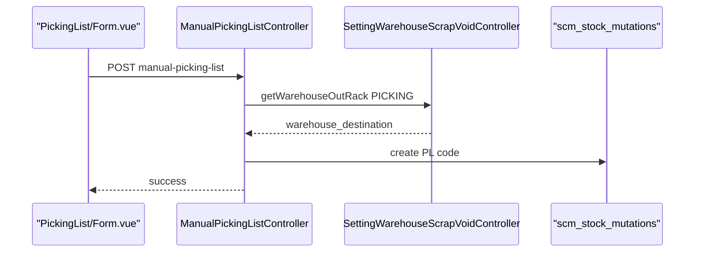

# Manual Picking List — Technical Documentation

> **DRAFT** — Draft per 2026-06-19.

**UI route:** `/supplychain/manual-picking-list`  
**API base:** `{VITE_API_URL}supplychain/manual-picking-list`

---

## 1. Frontend File Map

**Root:** `olshoperp-frontend/src/pages/SCM/PickingList/`

| File | Role |
|------|------|
| `DataList.vue` | Index datalist |
| `Form.vue` | Create/edit header |
| `Location.vue` | Set location (`set-location/:id`) |
| `PickingForm.vue` | Process picking (`process/:id`) |
| `DatalistDetail.vue` | Detail grid |
| `DatalistDetailGroup.vue` | Grouped detail |
| `DatalistIncompletePicking.vue` | Incomplete list |
| `AvailableWarehouse.vue` | Select2 warehouse |

### Router

| Route | Component |
|-------|-----------|
| `manual-picking-list` | `DataList.vue` |
| `manual-picking-list/create` | `Form.vue` |
| `manual-picking-list/edit/:id` | `Form.vue` |
| `manual-picking-list/set-location/:id` | `Location.vue` |
| `manual-picking-list/process/:id` | `PickingForm.vue` |

---

## 2. Backend

| File | Role |
|------|------|
| `ManualPickingListController.php` | CRUD, print, export, pause/resume |
| `ManualPickingListDetailController.php` | Detail, import, bulk FIFO |
| `ManualPickingListMiddleDetailController.php` | Middle detail layer |
| `Entities/ManualPickingList.php` | Extends `StockMutation` |
| `Import/ManualPickingListDetailImport.php` | Excel import |
| `Jobs/ManualPickingListDetailImportJob.php` | Async import |
| `Jobs/PickingListExportDetailJob.php` | Export job |
| `Policies/ManualPickingListPolicy.php` | Auth |

---

## 3. API Routes (utama)

| Method | Path | Notes |
|--------|------|-------|
| GET | `manual-picking-list/primevue` | Datalist |
| POST | `manual-picking-list` | Create |
| GET | `manual-picking-list/{id}` | Show (via PickingListController) |
| PUT | `manual-picking-list/{id}` | Update |
| POST | `manual-picking-list/{id}/set-location` | Location |
| POST | `manual-picking-list/{id}/pause` | Pause |
| POST | `manual-picking-list/{id}/resume` | Resume |
| GET | `manual-picking-list/{id}/completion-summary` | Summary |
| GET | `manual-picking-list/incomplete-picklist` | Incomplete |
| POST | `manual-picking-list/{id}/manual-picking-list-detail/upload` | Import |

---

## 4. Database

Menggunakan tabel shared `scm_stock_mutations` dengan filter `process_type = manual_picking`.

Detail: `scm_transfer_mutation_details`, middle: `scm_transfer_mutation_middle_details`.

Import log: `scm_manual_picking_list_detail_import_histories`, `scm_manual_picking_list_detail_import_logs`.

---

## 5. Sequence — Create

