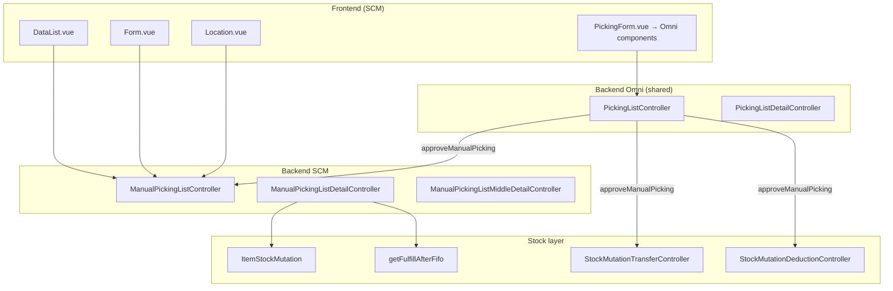
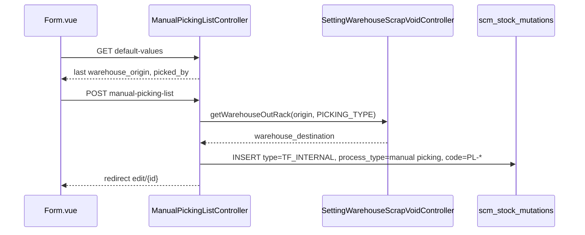
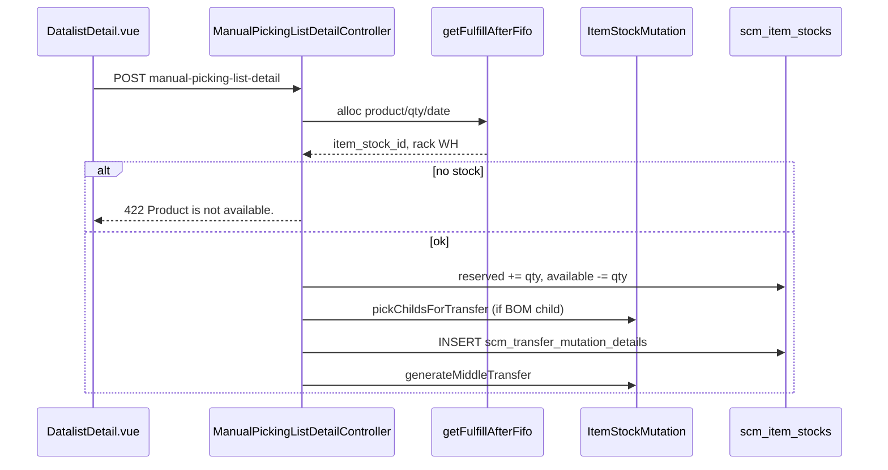
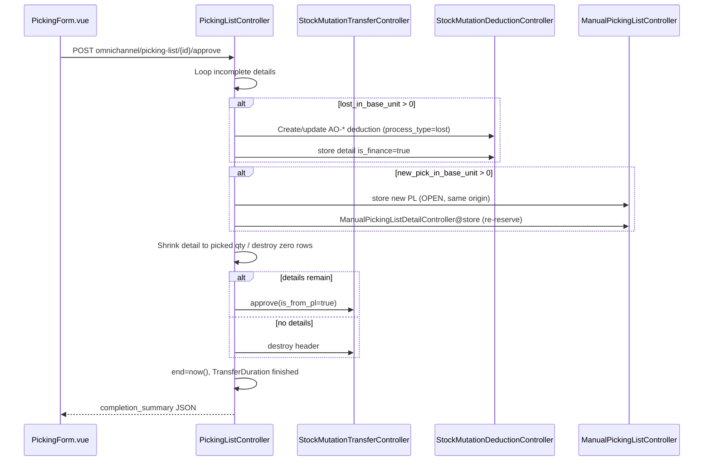

# Manual Picking List — Technical Documentation

**UI route:** `/supplychain/manual-picking-list`  
**API base:** `{VITE_API_URL}supplychain/manual-picking-list`  
**Shared picking engine:** `Modules/OmniChannel/Http/Controllers/PickingListController.php`

---

## 1. Architecture Overview

Manual Picking List (MPL) is a **Supply Chain menu** that reuses the **Omni picking process UI and approve logic**, but persists as `StockMutation` with `process_type = 'manual picking'`.



---

## 2. Frontend File Map

**Root:** `olshoperp-frontend/src/pages/SCM/PickingList/`

| File | Role |
|------|------|
| `DataList.vue` | Index datalist, incomplete pill, export |
| `Form.vue` | Create/edit header, detail tabs, auto-save watchers |
| `Location.vue` | Set cart/location before start (`set-location/:id`) |
| `PickingForm.vue` | Thin wrapper → Omni picking components |
| `DatalistDetail.vue` | Line-level detail grid (pre-start edit qty) |
| `DatalistDetailGroup.vue` | Middle layer grouped by product |
| `DatalistIncompletePicking.vue` | Incomplete PL modal list |
| `AvailableWarehouse.vue` | Warehouse select2 helper |

**Shared Omni components** (imported by `PickingForm.vue`):

| Path | Role |
|------|------|
| `pages/Omni/PickingList/components/HeaderInformation.vue` | Header + duration |
| `pages/Omni/PickingList/components/FormComponent.vue` | Pick/unpick grid |
| `pages/Omni/PickingList/components/IncompleteDetailDatalist.vue` | Lost / New PL inputs |
| `pages/Omni/PickingList/components/CompletionSummary.vue` | Post-complete summary |

### Router (`olshoperp-frontend/src/router/...`)

| Route | Component |
|-------|-----------|
| `manual-picking-list` | `DataList.vue` |
| `manual-picking-list/create` | `Form.vue` |
| `manual-picking-list/edit/:id` | `Form.vue` |
| `manual-picking-list/set-location/:id` | `Location.vue` |
| `manual-picking-list/process/:id` | `PickingForm.vue` |

---

## 3. Backend File Map

| File | Role |
|------|------|
| `ManualPickingListController.php` | CRUD, print, export, pause/resume, setLocation, completion summary |
| `ManualPickingListDetailController.php` | Detail CRUD, FIFO alloc, import, bulk FIFO |
| `ManualPickingListMiddleDetailController.php` | Middle detail layer |
| `Entities/ManualPickingList.php` | Extends `StockMutation`, `PROCESS_TYPE_MANUAL_PICKING` |
| `Import/ManualPickingListDetailImport.php` | Excel import |
| `Jobs/ManualPickingListDetailImportJob.php` | Async import |
| `Jobs/PickingListExportDetailJob.php` | Export job |
| `Policies/ManualPickingListPolicy.php` | Gate authorization |
| `OmniChannel/.../PickingListController.php` | `approveManualPicking()`, pick/unpick, incomplete flow |
| `app/Helpers/SupplyChain/WarehouseHelper.php` | `getFulfillAfterFifo()` |
| `app/Helpers/SupplyChain/ItemStockMutation.php` | Reservation, transfer approve, delete release |
| `SettingWarehouseScrapVoidController.php` | `getWarehouseOutRack(..., PICKING_TYPE)` |

---

## 4. Database

### 4.1 Header — `scm_stock_mutations`

| Column | MPL value |
|--------|-----------|
| `type` | `TF_INTERNAL` |
| `process_type` | `'manual picking'` |
| `code` | `PL-*` |
| `warehouse_origin` | Building (level 19+) |
| `warehouse_destination` | Outrack from Warehouse Setting |
| `transaction_status` | draft / open / approved |
| `start`, `end` | Picking timestamps |
| `location_id` | Cart/area (set before process) |
| `picked_by` | Assignee user id |

### 4.2 Detail — `scm_transfer_mutation_details`

| Column | Usage |
|--------|-------|
| `item_stock_id` | FIFO-allocated rack stock |
| `warehouse_origin_id` | Rack WH |
| `warehouse_destination_id` | Outrack (header destination) |
| `transfer_quantity` | Qty to pick (primary unit) |
| `transfer_quantity_in_base_unit` | Base unit qty |
| `picked_in_base_unit` | Picked qty during process |
| `lost_in_base_unit` | Lost qty input |
| `new_pick_in_base_unit` | Qty for new PL |
| `transfer_detailed_item_location` | Rack label for UI |

### 4.3 Middle — `scm_transfer_mutation_middle_details`

Aggregated per product via `generateMiddleTransfer()`.

### 4.4 Stock — `scm_item_stocks`

On detail **insert**:

```php
'reserved_quantity' => $item_stock->reserved_quantity + $qty_unit,
'available_quantity' => $item_stock->available_quantity - $qty_unit,
```

On **delete** detail/header: `ItemStockMutation::deleteTransferDetailRow()` / `deleteTransfer()` reverses reservation.

On **TF approve** (picked): stock physically moves origin rack → Outrack; reservation cleared in approve path.

### 4.5 Import audit

- `scm_manual_picking_list_detail_import_histories`
- `scm_manual_picking_list_detail_import_logs`

### 4.6 Duration — `scm_transfer_durations`

Pause/resume tracking per PL header.

---

## 5. API Routes

### 5.1 Header (`ManualPickingListController`)

| Method | Path | Action |
|--------|------|--------|
| GET | `manual-picking-list/primevue` | Datalist |
| GET | `manual-picking-list/default-values` | Last origin + assignee |
| GET | `manual-picking-list/get-incomplete-count` | Badge count |
| GET | `manual-picking-list/incomplete-picklist` | Incomplete modal |
| POST | `manual-picking-list` | Create |
| PUT | `manual-picking-list/{id}` | Update |
| DELETE | `manual-picking-list/{id}` | Delete (draft only) |
| POST | `manual-picking-list/{id}/set-location` | Start picking |
| POST | `manual-picking-list/{id}/pause` | Pause |
| POST | `manual-picking-list/{id}/resume` | Resume |
| GET | `manual-picking-list/{id}/print` | Print PL |
| GET | `manual-picking-list/{id}/completion-summary` | Summary JSON |
| GET | `manual-picking-list/{id}/print-completion-summary` | Print summary |
| POST | `manual-picking-list/print-bulk` | Bulk print |
| GET | `manual-picking-list/export-excel` | Export datalist |

### 5.2 Detail (`ManualPickingListDetailController`)

| Method | Path | Action |
|--------|------|--------|
| GET | `.../manual-picking-list-detail/primevue` | Detail grid |
| GET | `.../picking-list-detail/primevue` | Picking process grid |
| POST | `.../manual-picking-list-detail` | Store line |
| PUT | `.../manual-picking-list-detail/{id}` | Update qty |
| DELETE | `.../manual-picking-list-detail/{id}` | Delete line |
| POST | `.../manual-picking-list-detail/bulk-create` | Bulk FIFO |
| GET | `.../select2-available-products` | Product filter |
| POST | `.../manual-picking-list-detail/upload` | Excel import |

### 5.3 Shared Omni (process picking)

| Method | Path | Action |
|--------|------|--------|
| GET | `omnichannel/picking-list/{id}` | Show header for process UI |
| POST | `omnichannel/picking-list-detail/{id}/pick` | Mark picked |
| POST | `omnichannel/picking-list/{id}/approve` | Complete → `approveManualPicking()` |

---

## 6. FIFO Allocation — `getFulfillAfterFifo()`

**File:** `app/Helpers/SupplyChain/WarehouseHelper.php`  
**Config:** `config('warehouse.item_stock.fulfill_method')` = `'fulfill_after_fifo'`

### Algorithm

1. Resolve exclude IDs: WIP warehouse + all `SettingWarehouseOutRack::PICKING_TYPE` + PL `warehouse_destination`
2. Query `ItemStock` in building subtree where:
   - `available_quantity >= outbound_qty`
   - inbound `transaction_date <= request_date`
   - `empty_stock_date >= request_date` OR NULL
3. **Single rack fulfillment:** prefer one stock row fulfilling full qty, FIFO by inbound date
4. **Fallback:** `getFifoProduct()` multi-rack combination

### Call sites (MPL)

| Method | `outbound_qty` |
|--------|----------------|
| `ManualPickingListDetailController@store` | `transfer_quantity` |
| `checkAvailableProduct()` | `1` (select2 validation) |
| `select2AvailableProducts()` | implicit via stock filter |
| `bulkFifo()` | per import row |

---

## 7. Sequence — Create Header



---

## 8. Sequence — Insert Detail + Reservation



---

## 9. Sequence — Complete Picking (`approveManualPicking`)

**File:** `PickingListController.php` ~L2833



### Stock movement on TF approve (`is_from_pl: true`)

Uses standard Transfer Internal approve path in `StockMutationTransferController@approve`:

- Decrease qty at origin rack (`item_stock_id`)
- Increase/create stock at Outrack destination
- Clear reservation on affected rows

---

## 10. Config & Constants

| Key | Value | Effect |
|-----|-------|--------|
| `warehouse.item_stock.fulfill_method` | `fulfill_after_fifo` | Allocation strategy |
| `warehouse.item_stock.lowest_available_stock` | numeric threshold | Product select2 filter |
| `general.max_child` | int | Max detail lines |
| `SettingWarehouseOutRack::PICKING_TYPE` | string constant | Outrack resolution |
| `ManualPickingList::PROCESS_TYPE_MANUAL_PICKING` | `'manual picking'` | Datalist filter |
| `StockMutation::TF_INTERNAL` | type enum | Header type |
| `StockMutation::PROCESS_TYPE_LOST` | `'lost'` | Deduction process_type |

---

## 11. Authorization

**Policy:** `ManualPickingListPolicy` — extends transfer mutation permissions.

**Assignee lock:** `setLocation()` validates current user matches `picked_by` (if set).

**Complete:** `PickingListController@preApproved` → authorize on `PickingList` class (shared).

---

## 12. Known Issues (code)

| ID | Location | Issue |
|----|----------|-------|
| GAP-MPL-03 | `approveManualPicking` L3099 | Completion summary TF link → `/omni/picking-list/edit/` (should be SCM edit for manual PL) |
| GAP-MPL-04 | `approveManualPicking` L2986 | Deduction `transaction_reference_url` → omni path |

---

## 13. Related Technical Docs

| Menu | Doc |
|------|-----|
| Transfer Internal | [../supplychain-mutation-transfer-internal/technical.md](../supplychain-mutation-transfer-internal/technical.md) |
| Warehouse Setting | [../supplychain-setting/technical.md](../supplychain-setting/technical.md) |
| Omni Picking List | Shared `PickingListController` — no separate technical.md yet |
