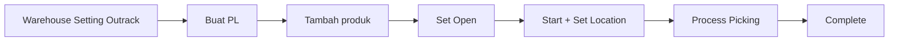
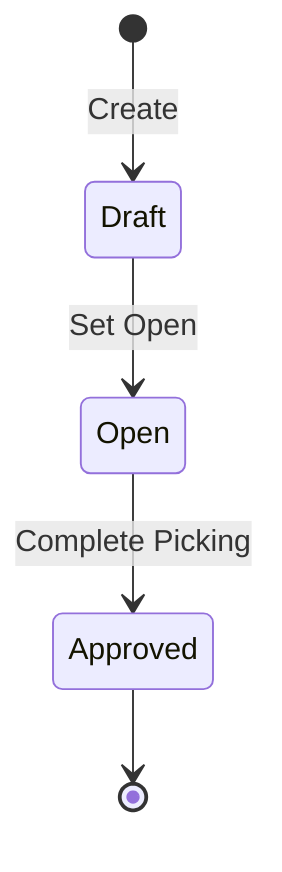

# Panduan Pengguna — Manual Picking List

**Siapa yang baca:** tim gudang / warehouse ops  
**Menu:** Supply Chain → Operations → Manual Picking List  
**Route:** `/supplychain/manual-picking-list`  
**Kode dokumen:** `PL-*` (otomatis)

---

## 1. Apa Itu & Kenapa Penting

**Manual Picking List** dipakai untuk picking stok ke area Outrack **tanpa** Sales Order atau Wave. Kamu pilih building dan produk; sistem alokasi rak, **reserve** stok, lalu petugas menandai picked / lost / sisa yang perlu di-pick ulang.

Ini **bukan** menu Omni Picking List. Tampilan proses picking mirip, tapi dokumen ini kamu buat sendiri di Supply Chain. Keduanya memakai kode `PL-*` — bedakan dari menu dan konteks (ad-hoc gudang vs order/wave).

---

## 2. Overview Flow & Proses Bisnis

**Versi teks:**

1. Set **Outrack Picking** di Warehouse Setting untuk building.  
2. **Create** Manual PL (kode `PL-*`).  
3. Tambah produk — stok langsung di-reserve.  
4. Set status **Open** (Draft **tidak bisa** Start).  
5. **Start Picking** → pilih cart/lokasi.  
6. Tandai picked, isi Lost / Qty New PL bila perlu.  
7. **Complete** — picked pindah ke Outrack; lost jadi pengurangan stok; Qty New PL jadi PL baru.

### Status

| Status transaksi | Arti | Bisa Start? |
|------------------|------|-------------|
| Draft | Baru dibuat (default) | Tidak |
| Open | Siap Start / sedang proses | Ya |
| Approved | Complete selesai | Tidak |

| Status picking | Arti |
|----------------|------|
| Unpicked | Belum Start |
| In Progress | Sudah Start, belum Complete |
| Paused | Dijeda (hover alasan) |
| Complete | Selesai |

---

## 3. Sebelum Mulai

- **Outrack Picking** sudah di-set di **Warehouse Setting** untuk building yang dipakai. Tanpa ini, **create PL gagal**.  
- **Building Origin** sudah jelas (level building).  
- Stok ada di rak biasa (bukan Outrack / WIP), qty available cukup.  
- Produk bukan bundle / random SKU.  
- Tanggal inbound stok tidak lebih baru dari tanggal PL.

🎬 [Interactive demo akan ditambahkan di sini]

---

## 4. Setelah Selesai

Setelah **Complete Picking**:

| Yang kamu tandai | Yang terjadi |
|------------------|--------------|
| **Picked** | Stok pindah rak → Outrack (Transfer Internal, auto-approve) |
| **Lost** | Stok keluar lewat Stock Deduction (`AO-*`), auto-approve |
| **Qty New PL** | Sistem buat Manual PL baru (status **Open**, building & assignee sama) — siap di-pick ulang |
| **Unpicked** | Reservation dilepas; qty baris dikurangi |

Cek **Completion Summary** untuk tautan dokumen turunan. Header jadi **Approved**; Start/End terisi.

🎬 [Interactive demo akan ditambahkan di sini]

---

## 5. Yang Perlu Diperhatikan

- **Kalau kamu Start saat masih Draft**, tombol disabled / sistem menolak. Ubah ke **Open** dulu.  
- **Kalau Outrack Picking belum di-set**, create gagal — bukan saat Complete.  
- **Kalau kamu tambah produk**, stok **langsung di-reserve** (available turun). Hapus baris/header Draft = reservation dilepas.  
- **Kalau stok tidak cukup / hanya di Outrack atau WIP**, produk tidak muncul atau insert ditolak (“Product is not available”).  
- **Kalau picking sudah Start**, header terkunci — jangan harap ganti building atau kembali Draft.  
- **Kalau kamu ditugaskan orang lain**, user lain tidak bisa Start.  
- **Kalau masih ada Unpicked saat Complete**, sistem minta konfirmasi dulu.  
- **Kalau Qty New PL diisi**, PL baru status Open (bukan Draft) — langsung bisa Start. Tidak ada batas berapa kali re-pick.  
- Jangan mengandalkan stok Outrack/WIP sebagai sumber picking — keduanya dikecualikan.

---

## 6. Langkah-Langkah

1. Buka **Supply Chain → Manual Picking List → Create**. Header tersimpan otomatis (`PL-*`).  
2. Pilih **Building Origin** (sering terisi dari PL terakhir). Opsional: **Assign To**.  
3. Set status **Open** jika mau langsung Start.  
4. Tab **Picking List Detail**: pilih produk, atau **Bulk FIFO** / **Import Excel**. Cek qty & lokasi rak.  
5. Dari datalist klik **Start Picking** → **Set Location** (cart/lokasi).  
6. Di **Process Picking**: klik kotak agar hijau = picked. Isi **Lost Qty** / **Qty New PL** di baris incomplete. Pause/Resume bila perlu.  
7. **Complete** → cek Completion Summary.

**Rumus yang tampil di layar:** Qty to Pick = Picked + Lost + Qty New PL + Unpicked. Unpicked dihitung otomatis (bukan input).

🎬 [Interactive demo akan ditambahkan di sini]

---

## 7. Tips & Hal yang Sering Bikin Bingung

**Ini bukan Omni Picking List.**  
Omni PL muncul dari Wave / Sales Order. Manual PL kamu buat ad-hoc di SCM. UI proses sama, menu dan tujuan beda.

**Draft tidak bisa Start.**  
Default create = Draft. Lupa Open → tombol Start Picking mati. Bukan bug.

**Qty New PL = re-pick sisa.**  
Barang belum ketemu / belum sempat diambil: isi Qty New PL, Complete, lalu kerjakan PL baru (Open, building sama). Jangan hapus reservation manual — sistem yang melepaskan saat unpicked/delete/complete.

**Reservation saat tambah produk.**  
Begitu baris masuk, available di Real Time Stock langsung turun. Salah pilih SKU? hapus baris Draft supaya stok kembali.

**Produk tidak muncul?** Stok habis, ada di Outrack/WIP, bundle/random, atau tanggal inbound setelah tanggal PL.  
**Pill Incomplete Picklist** = PL sudah Start tapi belum Complete — selesaikan atau pause.  
**Link Transfer di summary mengarah ke Omni?** Buka Manual Picking List SCM lewat kode dokumen.

---

## 8. Referensi

| Sumber | Untuk apa |
|--------|-----------|
| [Knowledge Base](./knowledge-base.md) | Troubleshooting & status |
| [Requirement](./requirement.md) | Validasi & acceptance |
| [Technical](./technical.md) | Developer |
| [Warehouse Setting](../supplychain-setting/README.md) | Outrack Picking |
| [Transfer Internal](../supplychain-mutation-transfer-internal/README.md) | Efek picked |
| [Omni Picking List](../omni-picking-list/README.md) | Bukan menu ini — PL dari Wave/SO |
