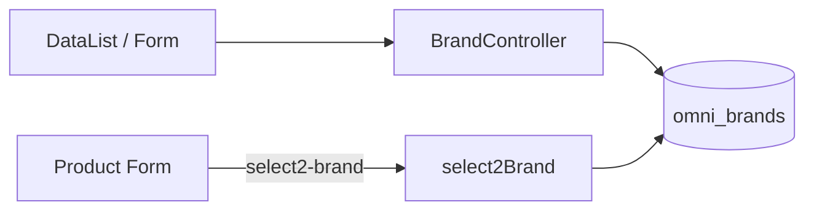
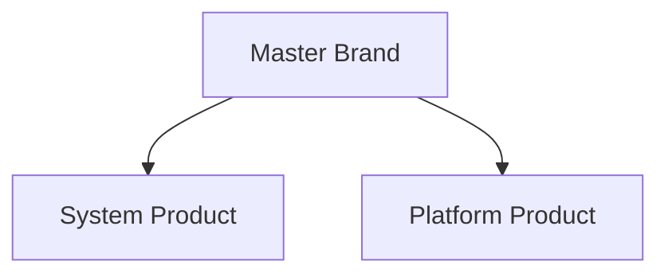

# Master Brand — Requirement Documentation

> **DRAFT** — Dokumen ini adalah draft awal hasil analisis codebase otomatis per 2026-06-19. Perlu direview PM/QA sebelum final.

## 0. Metadata & Changelog

| Version | Date | Author | Changes |
|---------|------|--------|---------|
| 1.0 | 2026-06-19 | QA - Yemima | Initial draft (AS-IS) |

## 1. Ringkasan Eksekutif

CRUD sederhana brand produk pada tabel `omni_brands` via `Modules\SupplyChain\Http\Controllers\BrandController`. Entity `Modules\SupplyChain\Entities\Brand` extends model OmniChannel.

## 2. How It Works

## 3. Acceptance Criteria (AS-IS)

| ID | Kriteria | Validasi | Fitur |
|----|----------|----------|-------|
| A-01 | Datalist brand + platform.name | index `withoutCompanyScope` | List |
| A-02 | Create brand | store | Form |
| A-03 | Update brand | update | Form |
| A-04 | Soft delete + bulk delete | destroy | Delete |
| A-05 | Select2 active brands | select2Brand | Dropdown produk |
| A-06 | Audit | GET brand/{id}/audit | Audit |

## 4. Validasi & Rules

| ID | Rule | Trigger | Pesan error |
|----|------|---------|-------------|
| V-01 | `name` required | store/update | Laravel validation |
| V-02 | `description` nullable, max 150 | store/update | Laravel validation |
| V-03 | `status` boolean | store/update | `$request->boolean('status')` |
| V-04 | `is_all_company` always 0 on write | store/update | Hardcoded controller |

## 5. Relasi Menu

| Menu | Relasi |
|------|--------|
| Product (SCM) | `brand_id` via select2 |
| Product General / Inventory Configuration | select2-brand |

## 6. Permission & Dependencies

- Policy: `BrandPolicy`
- Menu Gate id **188**: add/update/delete = 1

## 7. QA Test Notes

- [ ] Create brand → muncul di product select2
- [ ] Deactivate → hilang dari select2 (`activeFilter`)
- [ ] Bulk delete beberapa row
- [ ] Audit log setelah update

## 8. Known Gaps / Open Questions

- Platform column di datalist — data platform hanya terisi jika `platform_id` ada (sync omni).
- Tidak ada unique constraint `name` di validation controller.

## Related Documents

| Doc | Path |
|-----|------|
| Knowledge Base | [knowledge-base.md](./knowledge-base.md) |
| Technical | [technical.md](./technical.md) |
