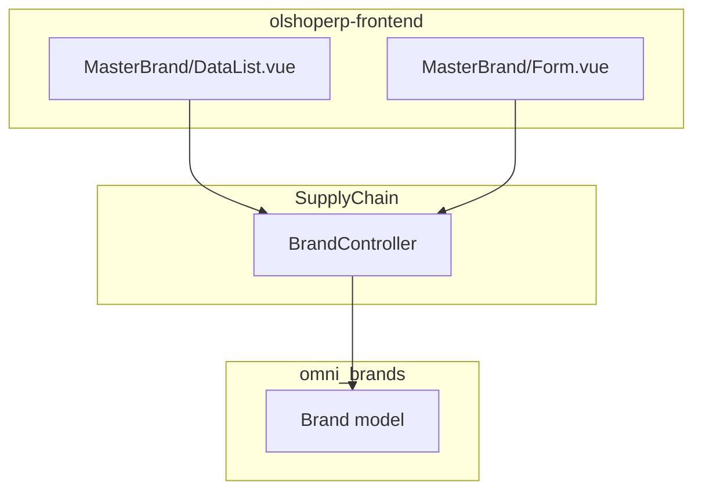

# Master Brand — Technical Documentation

> **DRAFT** — Dokumen ini adalah draft awal hasil analisis codebase otomatis per 2026-06-19. Perlu direview PM/QA sebelum final.

**UI route:** `/supplychain/master-brand`  
**API base:** `{VITE_API_URL}supplychain/brand`

---

## 1. Architecture Overview

---

## 2. Frontend File Map

**Root:** `olshoperp-frontend/src/pages/SCM/master/MasterBrand/`

| File | Role | Key API |
|------|------|---------|
| `DataList.vue` | List + bulk delete | `GET supplychain/brand` |
| `Form.vue` | Create/edit | `POST/PUT supplychain/brand/{id}` |

### Router

| Route | Component |
|-------|-----------|
| `supplychain/master-brand` | `DataList.vue` |
| `supplychain/master-brand/create` | `Form.vue` |
| `supplychain/master-brand/edit/:id` | `Form.vue` |

---

## 3. Backend File Map

| File | Role |
|------|------|
| `Modules/SupplyChain/Http/Controllers/BrandController.php` | CRUD, select2, audit |
| `Modules/SupplyChain/Entities/Brand.php` | Extends `Modules\OmniChannel\Entities\Brand` |
| `Modules/OmniChannel/Entities/Brand.php` | Table `omni_brands` |
| `Modules/SupplyChain/Policies/BrandPolicy.php` | Policy |

---

## 4. API Routes

| Method | Path | Controller@method |
|--------|------|-------------------|
| GET | `brand` | `BrandController@index` |
| POST | `brand` | `BrandController@store` |
| GET | `brand/{id}` | `BrandController@show` |
| PUT/PATCH | `brand/{id}` | `BrandController@update` |
| DELETE | `brand/{id}` | `BrandController@destroy` |
| GET | `brand/{id}/audit` | `BrandController@audit` |

**Select2 (internal):** `BrandController@select2Brand` — dipanggil dari `ProductController@select2Brand` route `product/select2-brand`.

---

## 5. Database Schema — `omni_brands`

| Column | Keterangan |
|--------|------------|
| `name`, `description` | Data utama |
| `platform_id` | FK platform (opsional) |
| `platform_brand_id`, `global_identifier` | Sync omni |
| `status`, `is_all_company` | Flags |
| Soft delete columns | `deleted_at`, `deleted_by` |

---

## 6. Permissions

`BrandPolicy` — menu id **188**, `menu_class` = `Brand::class`.
