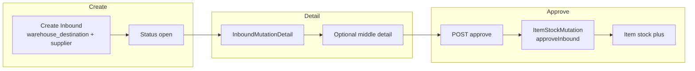

# Purchase Inbound — Knowledge Base

> **DRAFT** — Dokumen ini adalah draft awal hasil analisis codebase otomatis per 2026-06-19. Perlu direview PM/QA sebelum final.

## 1. Apa itu Purchase Inbound?

Dokumen penerimaan barang dari supplier (Goods Receipt / GRN). Header disimpan di `scm_stock_mutations` sebagai subclass `StockMutationInbound` dengan `warehouse_destination` terisi, `warehouse_origin` null, `supplier_id` wajib, dan `is_inventory_adjustment = 0`.

| Item | Nilai |
|------|-------|
| Menu | Supply Chain → Purchase Inbound |
| Route UI | `/supplychain/mutation-inbound` |
| Kode dokumen | `IN` |
| Tabel header | `scm_stock_mutations` |
| Tabel detail | `scm_inbound_mutation_details` (`InboundMutationDetail`) + optional middle `scm_inbound_mutation_middle_details` |

**Tujuan:** Mencatat barang masuk dari Purchase Order atau penerimaan manual supplier ke gudang tujuan.

## 2. Glosarium

| Istilah | Arti |
|---------|------|
| Stock Mutation | Transaksi pergerakan stok di `scm_stock_mutations` |
| Item Stock | Batch/lot stok fisik per produk di gudang (`scm_item_stocks`) |
| Transaction status | `open`, `draft`, `approved`, `rejected`, `void`, dll. |
| Approval log | Riwayat approve di `scm_stock_mutation_approvals` |
| Fiscal period | Periode akuntansi — transaksi harus dalam periode terbuka |

## 3. Yang Bisa / Tidak Bisa Dilakukan

### Bisa
- Buat header transaksi (status `open` / `draft`)
- Tambah/edit/hapus detail selama belum approved (`can_update`)
- Import Excel detail (jika menu mendukung)
- Approve dengan permission `approval` (lihat catatan approve per menu)
- Export list dan detail, print label (jika tersedia)
- Lihat audit log dan approval eligibility

### Tidak Bisa
- Ubah header/detail setelah approved (`can_update = false`)
- Tanggal transaksi lebih besar dari hari ini
- Approve tanpa detail
- Approve saat import detail sedang berjalan (cache lock)
- Transaksi di luar fiscal period terbuka
- Hapus dokumen auto-generated (opname, in-transit) — baca error message spesifik

## 4. Cara Pakai (How-To)

### Skenario umum
1. Buka menu **Purchase Inbound** → **Create**.
2. Isi header: tanggal transaksi, gudang (origin/destination sesuai tipe), deskripsi, lampiran opsional.
3. Simpan → tambah detail produk (manual, bulk, atau import).
4. Review **Approval Eligibility** di panel form.
5. **Approve** — ikuti alur di bagian approve (SCM langsung atau via Accounting).
6. Verifikasi stok di **Real Time Stock** / **Stock History**.

## 5. Troubleshooting

| Gejala | Penyebab | Solusi |
|--------|----------|--------|
| Approve gagal "doesn't have any detail" | Belum ada baris detail | Tambah minimal 1 detail |
| "Updating process is in progress" | Import Excel masih jalan | Tunggu selesai, cek import log |
| "Transaction date cannot be greater than today" | Tanggal lebih besar dari hari ini | Koreksi tanggal transaksi |
| Fiscal period error | Periode tutup | Buka periode di Accounting atau ubah tanggal |
| Tidak bisa ubah gudang | Sudah ada detail terikat gudang | Hapus detail dulu atau buat dokumen baru |
| Tombol Approve tidak muncul | Permission / menu SCM adjustment | Cek role; untuk Addition/Deduction approve di Accounting |

## 6. FAQ

**Q: Apa beda menu ini dengan Stock Adjustment?**  
A: Menu mutation (`mutation-inbound/outbound/transfer`) untuk alur operasional normal. Menu `adjustment-addition/deduction` khusus `is_inventory_adjustment = 1` dengan approval finance terpisah.

**Q: Dokumen terkait menu lain?**  
A: Lihat: supplychain-purchase-order, supplychain-new-purchase-inbound, accounting-supplier-invoice.

**Q: Bagaimana cara approve?**  
A: POST `mutation-inbound/{id}/approve` → `ItemStockMutation::approveInbound()` — update item stock, QC/inspection jika ada, set `transaction_status = approved`.
