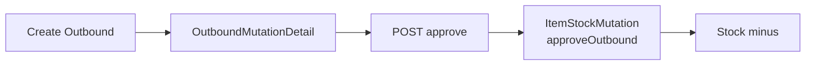

# Outbound External — Knowledge Base

> **DRAFT** — Dokumen ini adalah draft awal hasil analisis codebase otomatis per 2026-06-19. Perlu direview PM/QA sebelum final.

## 1. Apa itu Outbound External?

Dokumen pengeluaran stok keluar gudang (bukan transfer antar gudang). Subclass `StockMutationOutbound` dengan `warehouse_origin` terisi, `warehouse_destination` null, `is_inventory_adjustment = 0`.

| Item | Nilai |
|------|-------|
| Menu | Supply Chain → Outbound External |
| Route UI | `/supplychain/mutation-outbound` |
| Kode dokumen | `OT` |
| Tabel header | `scm_stock_mutations` |
| Tabel detail | `scm_outbound_mutation_details` (`OutboundMutationDetail`) + optional middle details |

**Tujuan:** Mengeluarkan stok untuk sales order general/platform/other/POS, work order, atau kebutuhan outbound manual.

## 2. Glosarium

| Istilah | Arti |
|---------|------|
| Stock Mutation | Transaksi pergerakan stok di `scm_stock_mutations` |
| Item Stock | Batch/lot stok fisik per produk di gudang (`scm_item_stocks`) |
| Transaction status | `open`, `draft`, `approved`, `rejected`, `void`, dll. |
| Approval log | Riwayat approve di `scm_stock_mutation_approvals` |
| Fiscal period | Periode akuntansi — transaksi harus dalam periode terbuka |

## 3. Yang Bisa / Tidak Bisa Dilakukan

### Bisa
- Buat header transaksi (status `open` / `draft`)
- Tambah/edit/hapus detail selama belum approved (`can_update`)
- Import Excel detail (jika menu mendukung)
- Approve dengan permission `approval` (lihat catatan approve per menu)
- Export list dan detail, print label (jika tersedia)
- Lihat audit log dan approval eligibility

### Tidak Bisa
- Ubah header/detail setelah approved (`can_update = false`)
- Tanggal transaksi lebih besar dari hari ini
- Approve tanpa detail
- Approve saat import detail sedang berjalan (cache lock)
- Transaksi di luar fiscal period terbuka
- Hapus dokumen auto-generated (opname, in-transit) — baca error message spesifik

## 4. Cara Pakai (How-To)

### Skenario umum
1. Buka menu **Outbound External** → **Create**.
2. Isi header: tanggal transaksi, gudang (origin/destination sesuai tipe), deskripsi, lampiran opsional.
3. Simpan → tambah detail produk (manual, bulk, atau import).
4. Review **Approval Eligibility** di panel form.
5. **Approve** — ikuti alur di bagian approve (SCM langsung atau via Accounting).
6. Verifikasi stok di **Real Time Stock** / **Stock History**.

## 5. Troubleshooting

| Gejala | Penyebab | Solusi |
|--------|----------|--------|
| Approve gagal "doesn't have any detail" | Belum ada baris detail | Tambah minimal 1 detail |
| "Updating process is in progress" | Import Excel masih jalan | Tunggu selesai, cek import log |
| "Transaction date cannot be greater than today" | Tanggal lebih besar dari hari ini | Koreksi tanggal transaksi |
| Fiscal period error | Periode tutup | Buka periode di Accounting atau ubah tanggal |
| Tidak bisa ubah gudang | Sudah ada detail terikat gudang | Hapus detail dulu atau buat dokumen baru |
| Tombol Approve tidak muncul | Permission / menu SCM adjustment | Cek role; untuk Addition/Deduction approve di Accounting |

## 6. FAQ

**Q: Apa beda menu ini dengan Stock Adjustment?**  
A: Menu mutation (`mutation-inbound/outbound/transfer`) untuk alur operasional normal. Menu `adjustment-addition/deduction` khusus `is_inventory_adjustment = 1` dengan approval finance terpisah.

**Q: Dokumen terkait menu lain?**  
A: Lihat: sales-order-general, supplychain-delivery-order, accounting-customer-invoice.

**Q: Bagaimana cara approve?**  
A: POST `mutation-outbound/{id}/approve` → `ItemStockMutation::approveOutbound()` — kurangi item stock FIFO, optional auto journal COGS.

## 7. Relasi Instant Settlement (operator)

Outbound bisa muncul dari **Instant Settlement** (otomatis) atau dari menu ini (manual).

| Situasi | Yang terjadi |
|---------|--------------|
| Upload settlement sukses | Sistem buat OB per order — cek counter **Out** di grid settlement |
| Jurnal OB warning | Buka panel **Out Journal** di settlement → tab **Warnings** (bukan selalu error di menu OB) |
| Hapus settlement | OB hasil generate ikut terhapus + stok revert; OB manual tidak otomatis terhapus |

Prasyarat: order harus **Shipped WH 3PL** dan stok cukup sebelum upload.

**Detail:** [Instant Settlement](../accounting-settlement-upload/requirement.md)
