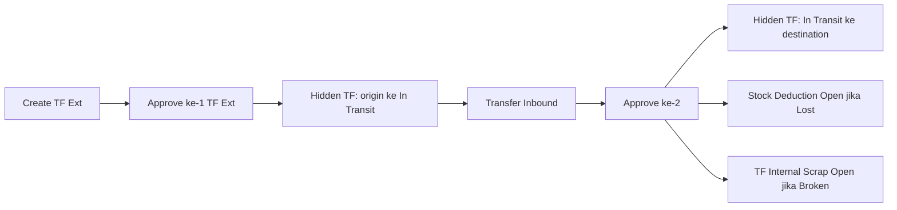
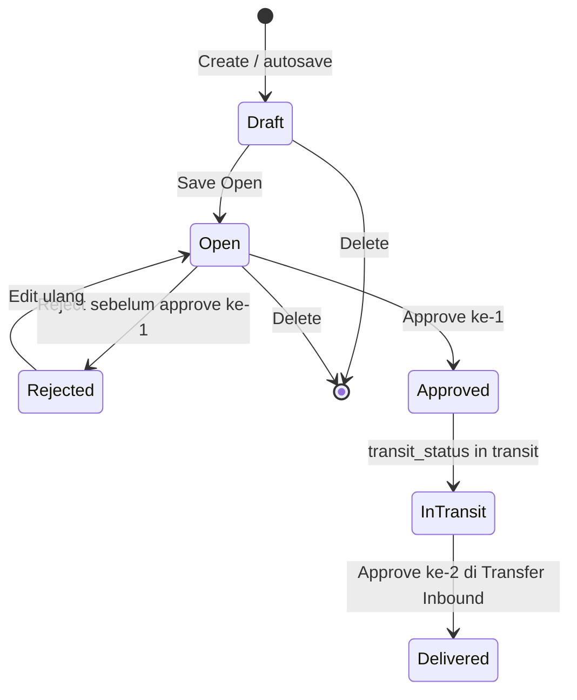
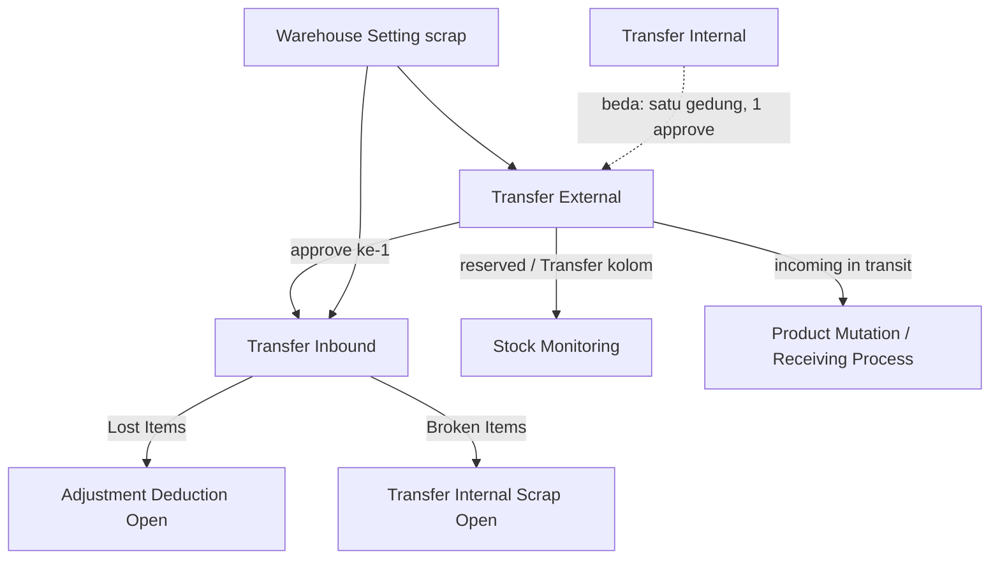

# Transfer External — Requirement Documentation

**Modul:** SupplyChain  
**Audience:** PM, Operations, QA, Support, Developer  
**Prefix:** `TF` · `type = tf external`

| UI | Route | Colli |
|----|-------|-------|
| **Produksi** | `/supplychain/mutation-transfer-external` | Tidak |
| **BETA** | `/supplychain/new-mutation-transfer-external` | Experimental — bukan expected produksi |

**SOT:** [supplychain-mutation-transfer-external-source-of-truth.md](../_meta/sot/supplychain-mutation-transfer-external-source-of-truth.md) v1.0  
**Pasangan:** [Transfer Inbound](../supplychain-transfer-inbound/requirement.md) (approval ke-2)

---

## 0. Metadata & Changelog

| Version | Date | Author | Changes |
|---------|------|--------|---------|
| 1.0 | 2026-06-19 | QA - Yemima | Initial draft stub |
| 2.0 | 2026-09-01 | QA - Yemima | Split SOT v1.0: dual approve, FIFO, import, pairing Inbound; Colli produksi out; Show Virtual TO-BE hide; GAP-TFEXT-01..06 |

## 1. Ringkasan Eksekutif

Transfer External memindahkan stok **antar gedung / struktur warehouse berbeda**. Butuh **dua kali approve**: pengirim di menu ini, penerima di Transfer Inbound.

Setelah approve ke-1, sistem membuat dokumen hidden ke **virtual In Transit** destination. Stok origin masuk kolom **Transfer**. Destination masih incoming sampai approve ke-2 → Delivery Status **Delivered** dan availability destination resmi.

## 2. Prasyarat

| Prerequisite | Sumber | Catatan |
|--------------|--------|---------|
| Origin WH level lebih dari sama dengan 20 (drop-off ke rack) | Master Warehouse | Tooltip: *Level 20 or below (drop-off to rack) only.* FIFO tidak mengambil Outrack & WIP |
| Destination level 20, leaf, beda struktur dari origin, **wajib WH Scrap** di Warehouse Setting | Warehouse Setting scrap | Dipakai Broken Items di approval ke-2 |
| Stok availability lebih dari 0 di origin | Item Stock | Select Product / Import |
| Fiscal period valid | Fiscal Period | Tanggal transaksi |
| Privilege TF External | Gate | view / create / update / approve |
| Virtual WH In Transit pada destination | Template virtual WH | Wajib sebelum approve ke-1 |

## 3. Siklus Status

**Tidak ada Void.** Setelah approve ke-1, alur **harus dilanjut** sampai Delivered (Transfer Inbound). Reject hanya **sebelum** approve ke-1 (Draft/Open).

| Status | Delivery Status | Edit detail | Delete | Approve |
|--------|-----------------|-------------|--------|---------|
| Draft / Open / Rejected | `-` | Ya jika `can_update` | Ya | Approve ke-1 jika eligible |
| Approved | **In Transit** | Header view; qty received/lost/broken di **Transfer Inbound** | Tidak | Tombol Approve ke-1 hilang |
| Approved | **Delivered** | Tidak | Tidak | Tidak |

**Reserved vs Stock Monitoring**

- Insert/edit qty (belum approve): qty masuk **reserved**, availability berkurang.
- **Delete header** (Draft/Open/Rejected, belum approve): reserved **berkurang**, availability **bertambah** (bukan pindah ke kolom Transfer).
- Setelah **approve ke-1**: qty origin ke kolom **Transfer**; destination incoming, belum availability penuh.

**Action datalist (produksi):** Draft/Open → Update, Delete, Approve. Soft-deleted → Restore/Delete. Saat job approve: loading hourglass.

## 4. Acceptance Criteria — Datalist

Filter default: origin & destination **non-virtual** (kecuali voided-order virtual). Dokumen auto-gen In Transit (`is_visible = 0`) **tidak** muncul.

| # | Fitur | Expected |
|---|--------|----------|
| 1 | Global Search | SearchBuilder / global DataTablesV3 |
| 2 | Advanced Filter | SearchBuilder |
| 3 | Reset Filter | Clear |
| 4 | **Create** | Hanya di TF External, **tidak** di Transfer Inbound |
| 5 | **Show Virtual WH** | **TO-BE hide** (diminta ke dev). Produksi FE `is_show_virtual=false`. Backend index TF Ext **tidak** memproses `show_virtual`. BETA masih menampilkan toggle. |
| 6 | Show Deleted Data | Soft-deleted |
| 7 | Column Show/Hide | Ya |
| 8 | Export | §4.1 |
| 9 | Bulk Action | Checkbox → **Delete** & **Approve** |
| 10 | Kolom | §4.2 |

### 4.1 Export

| Opsi | Isi |
|------|-----|
| **Without Details** | Trx Code, Date, System Product SKU, Name, Building Origin, Location Destination, Qty, Description, Trx Ref, Trx Status, Created/Updated/Approved By/At |
| **With Details** | Header + per baris: Availability, Qty Transfered, Qty Received, Qty Lost Items, Qty Broken Items, Unit, Is Fifo (Yes/No/`-`) |
| **Active Page Only** | Subset halaman datalist |

Building Origin di export = **nama building** (level building), bukan full path rack.

### 4.2 Kolom datatable

| Kolom | Isi |
|-------|-----|
| Trx Code \| Trx Date | Kode TF + tanggal; link edit TF Ext |
| Building Origin | WH origin |
| Location Destination | WH destination |
| Qty | Jumlah `transfer_quantity` semua detail |
| Description | Header |
| Trx. Ref | Class Transfer External → edit TF Ext; Deduction → Adjustment Deduction; else → TF Internal. User-created biasanya kosong |
| Trx. Status | Draft / Open / Rejected / Approved |
| Delivery Status | `-` / **In Transit** / **Delivered** |
| Created / Updated | Audit |
| Action | §3 |

## 5. Form & Field

### 5.1 Basic Information

| Field | Aturan |
|-------|--------|
| Transaction Code | Auto prefix **TF** setelah save |
| Transaction Date | Fiscal period valid. Setelah ada detail, tanggal **tidak** boleh diubah |
| **Origin** | Level lebih dari sama dengan 20. Tooltip: FIFO tidak berlaku Outrack & WIP. Origin ≠ destination; destination tidak boleh child tree origin. Setelah detail, origin **lock** |
| **Location Destination** | Tooltip: *Level 20 only, no sub-locations, different structure from origin, and must have a scrap warehouse configured.* Leaf. Wajib scrap |
| Autosave | Origin + destination dari TF Ext terakhir (visible). First time: isi manual |

### 5.2 Product Transfer Detail (produksi)

| Elemen | Aturan |
|--------|--------|
| Select Product | Availability lebih dari 0; default qty **1**; unit primary; loc dest = header (editable) |
| Group View | Default (agregasi SKU) |
| Detail View | Multi stock ID |
| Available Products | Per stock ID; Use/bulk Use — §6.2 |
| Import | Excel — §6.3 |
| Print detail | SKU QR / Stock ID QR |
| Approval / Audit Log | Siapa/kapan; perubahan header/detail |

### 5.3 Tidak ada di produksi

- Colli Origin / Destination / Bulk Colli — hanya BETA (§6.5, §9).
- `with_picking_list` — tidak ada UI; save selalu 0. Manual Picking List generate **TF Internal**.

## 6. How It Works

### 6.1 Alokasi stok — Single Rack FIFO lalu FIFO klasik

Exclude **WIP** dan **Outrack** dari setting WH origin. Exclude WH destination dari kandidat.

1. Cari **satu** batch (inbound paling lama) dengan availability **lebih dari sama dengan** qty diminta → **Single Rack FIFO**.
2. Jika tidak → **FIFO klasik**: bertahap dari batch terlama.
3. Total kurang → *Insufficient stock*.

**Contoh availability (user):**

| Tanggal | Rack | Qty |
|---------|------|-----|
| 1 Jan | A | 50 |
| 2 Jan | B | 100 |
| 3 Jan | C | 150 |
| 4 Jan | D | 200 |

| Out qty | Alokasi |
|---------|---------|
| 50 | A saja |
| 75 | B saja |
| 150 | C saja |
| 200 | D saja |
| 250 | A(50)+B(100)+C(100) — FIFO klasik |

Berlaku **insert** dan **edit qty** untuk Select Product & Import. **Tidak** untuk Available Products (stock-id only).

### 6.2 Tiga sumber insert

| Sumber | Default qty | Alokasi | Edit qty |
|--------|-------------|---------|----------|
| **Select Product** | 1 | Single Rack FIFO → FIFO klasik | Re-run aturan |
| **Import** | Dari file | Sama | Sama |
| **Available Products Use** | Availability stock ID terpilih | **Tidak** FIFO — ikat stock ID | Max = availability stock ID; lebih → pesan HTML: *Quantity entered cannot exceed available stock for this specific product stock ID. This product is selected from the 'Available Products' section. To input larger quantities, please use the 'Add Product' feature or import function instead.* |

**Contoh Available Products:** SKUPENSIL total 80 = stock ID 10:00 (50) + 11:00 (30). Use 11:00, edit qty 40 → ditolak.

### 6.3 Import detail

Template header **exact** baris 1: `Product ID` \| `System Product SKU` \| `Qty` \| `Unit`.

Validasi: §7. Proses: Single Rack FIFO dari origin; insert per stock ID (`is_fifo = 1`). Partial success via history success/failed. **Tidak** mengisi Colli / Lost / Broken.

### 6.4 Dual approve & dokumen hidden (contoh user)

SKUPENSIL 1.000 pcs, origin `GD.SBY → Rack-001`, destination `GD-SDA → Drop OFF`.

| Dokumen | Kapan | Origin | Destination | Visible |
|---------|-------|--------|-------------|---------|
| TF001 (utama) | Create | GD.SBY Rack-001 | GD-SDA Drop OFF | Ya |
| TF002 | Setelah approve ke-1 | GD.SBY Rack-001 | **In Transit** (child virtual destination) | Tidak |
| TF003 | Setelah approve ke-2 | In Transit | GD-SDA Drop OFF | Tidak |

Approve ke-1: `transit_status = in transit` + header **Approved**. Approve ke-2 (Inbound): **Delivered** + received/lost/broken.

### 6.5 Colli v2 — hanya BETA

Produksi **tanpa Colli**. BETA meniru TF Internal tapi Existing Colli di-scope ke **warehouse destination** (beda gedung). Risiko: colli origin SBY tidak muncul di SDA; Detail BETA bisa POST bulk-colli ke route TF Internal. **Jangan** expected produksi sampai redesign. Lihat §9.

## 7. Validasi

| ID | Kondisi | Behavior / pesan (verbatim) |
|----|---------|------------------------------|
| V-TFE-01 | Origin = destination atau dest di child tree origin | *The selected warehouse origin and destination must be different.* |
| V-TFE-02 | Destination bukan leaf | *You can only select a destination warehouse without child locations.* |
| V-TFE-03 | Ubah origin saat sudah ada detail | *This stock mutation transfer already has prepared detail data which relate to specific warehouse, so you can't modify warehouse* |
| V-TFE-04 | Ubah tanggal saat sudah ada detail | *…relate to specific transaction date, so you can't modify transaction date* |
| V-TFE-05 | Approve tanpa detail | *This stock mutation transfer doesn't have any detail data* |
| V-TFE-06 | Approve, dest detail = origin header | *Warehouse destination must be different from the origin. Please select another warehouse.* |
| V-TFE-07 | Approve ke-1, origin level kurang dari 20 | *Warehouse Origin level must be greater than or equal to 20.* |
| V-TFE-08 | Detail belum lengkap WH | *Please select warehouse on all details* |
| V-TFE-09 | Stok tidak cukup (Select/Import) | *Insufficient stock* (varian nama + request/available) |
| V-TFE-10 | Qty Available Products lebih dari stock ID | *Quantity entered cannot exceed available stock for this specific product stock ID.* + arahkan Add Product / import |
| V-TFE-11 | Import file kosong | *The imported file is empty. Please add at least one product.* |
| V-TFE-12 | Header import salah | *The file format doesn't match the system template.* |
| V-TFE-13 | Product ID & SKU kosong | *Product ID or SKU is required.* |
| V-TFE-14 | Product ID tidak ketemu | *Product ID {x} not found* |
| V-TFE-15 | SKU tidak ketemu | *Product SKU {x} not found* |
| V-TFE-16 | Qty kosong | *QTY is empty.* |
| V-TFE-17 | Qty bukan angka | *QTY must be a number.* |
| V-TFE-18 | Qty kurang dari 0 | *QTY must be greater than 0.* |
| V-TFE-19 | Unit kosong | *Unit is required.* |
| V-TFE-20 | Unit pakai name | *The entered unit data isn't from the master unit code.* |
| V-TFE-21 | Unit tidak ada | *Unit is not available in system.* |
| V-TFE-22 | Unit tidak valid untuk produk | *Unit code {x} is not valid for this product.* |
| V-TFE-23 | Melebihi max detail | *Cannot add more than {N} details to this transaction.* |
| V-TFE-24 | Import masih jalan saat approve | Diblok via cache import |
| V-TFE-25 | Approve job lock | *Approval is being processed. Please press the refresh button to reload the data.* / *Approval is in progress. Please wait a moment.* |
| V-TFE-26 | Delete dokumen In Transit auto-gen | *You cannot delete this data because it auto generated from transfer external* |
| V-TFE-27 | Delete sudah approve | *This data approve, you can't delete this data anymore.* |
| V-TFE-28 | Data dari sales platform (`transfer_type`) | Tidak boleh delete/reject |

Validasi received/lost/broken: [Transfer Inbound requirement](../supplychain-transfer-inbound/requirement.md).

## 8. Relasi Menu Lain

| Menu | Relasi |
|------|--------|
| Transfer Inbound | Approval ke-2; list TF Ext In Transit / Delivered |
| Adjustment Deduction | Auto-gen Lost; ref **kode dokumen TF Ext utama**; status **Open** — approve manual |
| Transfer Scrap / TF Internal scrap | Auto-gen Broken; origin In Transit → WH scrap destination; **Open** — approve manual |
| Warehouse Setting | Wajib scrap di destination |
| Stock Monitoring | Reserved (draft/open); Transfer setelah approve ke-1; availability destination setelah Delivered |
| Transfer Internal | Pola FIFO / Available Products mirip; **bukan** pasangan dual-approve |
| Product Mutation Stock | Receiving Process selama In Transit |

## 9. Gaps

| ID | Deskripsi | Type | Dampak | Status |
|----|-----------|------|--------|--------|
| GAP-TFEXT-01 | Show Virtual: produksi `is_show_virtual=false`; BETA masih true; backend tidak proses `show_virtual`. TO-BE hide. | Missing Behavior (TO-BE) | Toggle membingungkan jika muncul lagi | Pending — hide in progress |
| GAP-TFEXT-02 | Colli v2 hanya BETA; Existing colli scope destination; Detail BETA POST bulk-colli ke Internal. | Missing Behavior / Contradiction | Colli produksi tidak ada; BETA berisiko | Open — experimental only |
| GAP-TFEXT-03 | Field `with_picking_list` + guard; UI selalu 0. Manual PL → TF Internal. | Unverified (legacy) | Jangan masuk UG/operator | Resolved for docs: out of scope |
| GAP-TFEXT-04 | Requirement: tidak reject setelah approve ke-1. Code masih punya jalur residual jika `transit_status` terisi. | Contradiction | Docs ikut requirement user | Pending Decision — Yemima |
| GAP-TFEXT-05 | Live generate Lost memakai class referensi Transfer (bukan Transfer External) meski text/URL ke TF Ext utama. | Unverified | Filter by class bisa miss | Open |
| GAP-TFEXT-06 | Tooltip FIFO ignore WIP/outrack; dropdown origin tidak hard-exclude WIP. | Contradiction ringan | User bisa pilih origin WIP; FIFO tetap skip | Open — ikuti tooltip + FIFO exclude |

## 10. FAQ

**Bedanya dengan Transfer Internal?** TF Ext = beda gedung, dua approve, In Transit & Delivery Status. TF Internal = satu struktur, satu approve.

**Kenapa stok SDA belum bisa dipakai setelah approve pengirim?** Masih In Transit — tunggu Transfer Inbound.

**Kenapa tidak bisa hapus setelah approve?** Tidak ada Void. Lanjut sampai Delivered.

**Qty Available Products ditolak padahal total SKU cukup?** Terikat satu stock ID. Pakai Select Product / Import.

**Show Virtual?** Tidak dipakai di produksi TF Ext.
