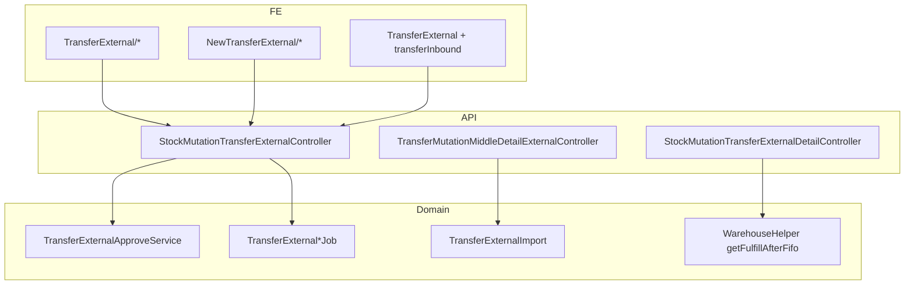

# Transfer External — Technical Documentation

## 1. Architecture Overview

Header stock mutation `type = tf external`, prefix **TF**. Dual-approve: ke-1 di menu ini (generate hidden In Transit), ke-2 di Transfer Inbound (same FE flag + API filter).



## 2. Frontend File Map

| Path | Route UI | Role |
|------|----------|------|
| `olshoperp-frontend/src/pages/SCM/StockMutation/TransferExternal/DataList.vue` | `mutation-transfer-external` | Produksi datalist (`is_show_virtual=false`) |
| `TransferExternal/Form.vue`, `DatalistDetail.vue` | produksi edit | Header + detail |
| `NewTransferExternal/**` | `new-mutation-transfer-external` | BETA Colli experimental |
| Same `TransferExternal/*` + `meta.transferInbound` | `transfer-inbound` | Surface inbound (no Create) |

Router: `olshoperp-frontend/src/router/index.ts` — paths under `/supplychain/`.

## 3. Backend File Map

| File | Role |
|------|------|
| `StockMutationTransferExternalController.php` | Header CRUD, index, approve, export; **tidak** handle `show_virtual` |
| `StockMutationTransferExternalDetailController.php` | Detail CRUD |
| `TransferMutationMiddleDetailExternalController.php` | Middle detail, Available Product, import hooks |
| `TransferExternalApproveService.php` | Approve ke-1/ke-2 helpers; `checkQuantityReceived` / lost / broken |
| `TransferExternalTransactionalJob.php` | Approve orchestration |
| `TransferExternalHiddenInTransitJob.php` (nama setara) | Generate hidden origin→In Transit |
| `TransferExternalProcessApproveJob.php` | Process approve steps |
| `TransferExternalImport.php` | Excel import 4 kolom |
| `MultiskuColliService.php` | Dipakai BETA Colli saja |
| Entity `StockMutationTransferExternal` / shared stock mutation | `type=tf external` |

Policy: share privilege TF External (inbound memakai policy yang sama).

## 4. API Routes (utama)

| Method | Path | Notes |
|--------|------|-------|
| GET | `supplychain/mutation-transfer-external` | Index; + `transfer_inbound` filter In Transit \| Delivered |
| POST | `supplychain/mutation-transfer-external` | Create |
| PUT/PATCH | `supplychain/mutation-transfer-external/{id}` | Update header |
| DELETE | `supplychain/mutation-transfer-external/{id}` | Delete unapproved only |
| POST | `…/approve` | Dual path: sequence 0 (ke-1) vs inbound (ke-2) |
| Detail / middle / import / export | under same prefix | Import queue key `TRANSFER EXTERNAL DETAIL IMPORT-{id}` |

## 5. Database Key Tables

| Table / concept | Notes |
|-----------------|-------|
| Stock mutation header | `type=tf external`, prefix TF, `transit_status` in transit \| delivered, `is_visible` |
| Detail / middle | `transfer_quantity`, received/lost/broken fields (packed/picked/checked mapping inbound) |
| Virtual WH In Transit | Child virtual destination, process_group in-transit sequence 1 |
| Soft delete | Restore policy seperti mutation lain |

## 6. Flow utama

```mermaid
sequenceDiagram
    participant U as User pengirim
    participant API as TF Ext API
    participant Job as Approve jobs
    participant SM as ItemStockMutation
    participant R as User penerima Inbound

    U->>API: Create + detail (FIFO / AP / import)
    Note over SM: reserved ↑ availability ↓
    U->>API: Approve ke-1
    API->>Job: TransferExternalTransactionalJob
    Job->>SM: origin → In Transit (hidden TF, is_visible=0)
    Note over API: transit_status=in transit, header Approved
    R->>API: transfer_inbound=1 edit received/lost/broken
    R->>API: Approve ke-2
    Job->>SM: In Transit → dest (hidden); Lost Open; Broken scrap Open
    Note over API: transit_status=delivered
```

## 7. Invariants

- Dual document hidden `is_visible=0`, `type=tf external`.
- In Transit WH = child virtual destination (in-transit sequence).
- After approve-1: `transit_status=in transit`; after approve-2: `delivered`.
- Delete unapproved: reserved↓ availability↑ — **bukan** pindah ke kolom Transfer.
- Produksi FE: `is_show_virtual=false`; index controller tidak memproses `show_virtual`.
- FE save `with_picking_list=0` selalu.
- Lost: deduction Open, `process_type=lost`, Trx Ref text/URL = **main TF code**.
- Broken: TF Internal scrap Open, origin In Transit → scrap WH destination settings — **bukan** auto-approve.

## 8. Validation Highlights

Lihat [requirement §7](./requirement.md) V-TFE-01..28. FIFO: `WarehouseHelper::getFulfillAfterFifo` (Single Rack lalu klasik); exclude `warehouse_wip_id` + `warehouse_out_rack_id`.

Approve-time origin level: *Warehouse Origin level must be greater than or equal to 20.*

## 9. Frontend Behaviors

- Produksi tanpa Colli columns.
- BETA: Colli UI; Existing Colli scoped ke **destination** WH; risk Detail view POST bulk-colli ke route **Internal** (GAP-TFEXT-02).
- Inbound: hide Create; link edit ke `transfer-inbound/edit/{id}`.
- Job lock: hourglass + pesan refresh / in progress.

## 10. Failure Modes & Transaction Boundary

| Mode | Boundary |
|------|----------|
| Job lock 429 / in progress | Jangan double approve |
| Import queue aktif | Blok approve |
| Fiscal period invalid | Tolak save/approve |
| Dest tanpa scrap | Broken path gagal di inbound |
| Insufficient stock | Tolak insert/edit Select/Import |
| Delete auto-gen In Transit | Pesan auto generated from transfer external |

## 11. Data Lifecycle

| Dokumen | Visible | Origin → Dest |
|---------|---------|---------------|
| TF utama (user) | Ya | Origin rack → destination leaf |
| Hidden setelah ke-1 | Tidak | Origin → In Transit dest |
| Hidden setelah ke-2 | Tidak | In Transit → destination |
| Lost | Deduction Open | Trx Ref = kode TF utama |
| Broken | TF Internal scrap Open | In Transit → scrap WH |

## 12. Tests & QA Notes

- Pair TC dengan Transfer Inbound (dual approve + Lost/Broken Open).
- Verifikasi delete unapproved = reserved restore (bukan Transfer column).
- Import template exact 4 columns.
- BETA Colli: jangan lock expected produksi.

## 13. Known Issues

Refer [requirement §9](./requirement.md): GAP-TFEXT-01..06.
