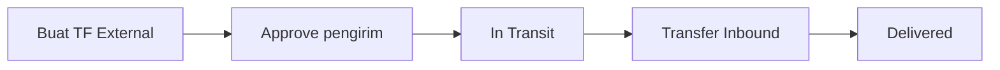
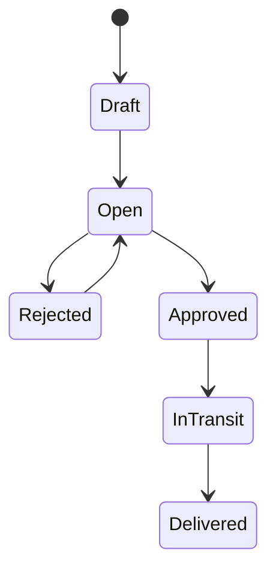

# Transfer External — Panduan Pengguna

**Siapa yang baca panduan ini:** operator gudang pengirim, inventory, support  
**Menu di sistem:** Supply Chain → Transfer External  
**Kode transaksi:** dimulai dengan `TF`

Ada route **BETA** untuk eksperimen Colli — **jangan** dipakai sebagai standar produksi. Produksi = menu Transfer External biasa (tanpa Colli).

---

## 1. Apa Itu & Kenapa Penting

Transfer External dipakai untuk **mengirim stok ke gudang di gedung lain** — misalnya dari Surabaya ke Sidoarjo. Perpindahan ini butuh **dua kali persetujuan**: pengirim di menu ini, penerima di **Transfer Inbound**.

Tanpa kedua approve itu, stok di tujuan belum resmi bisa dipakai, dan jejak barang di perjalanan tidak lengkap.

---

## 2. Overview Flow & Proses Bisnis

### Alur singkat

**Versi teks:**

1. Pengirim buat Transfer External dan isi barang + gudang tujuan.
2. Pengirim **Approve** — barang masuk status **In Transit**; stok asal masuk kolom Transfer.
3. Penerima buka **Transfer Inbound**, isi qty diterima / hilang / rusak, lalu Approve.
4. Status jadi **Delivered** — stok yang diterima masuk availability di tujuan.

🎬 [Interactive demo akan ditambahkan di sini — rantai TF Ext ke Inbound + Lost/Broken]

### Siklus status

| Status / Delivery | Artinya | Bisa diedit? |
|-------------------|---------|--------------|
| Draft / Open | Belum dikirim | Ya |
| Rejected | Ditolak sebelum approve pengirim | Ya (edit ulang) |
| Approved + In Transit | Sudah dikirim, menunggu penerima | Detail qty di Transfer Inbound |
| Delivered | Penerimaan selesai | Tidak |

**Tidak ada Void** setelah approve pengirim — harus dilanjut sampai Delivered.

---

## 3. Sebelum Mulai (Flow Sebelum)

Pastikan:

- Gudang **asal** level drop-off / rack (level 20 ke atas sesuai aturan sistem).
- Gudang **tujuan** level 20, tanpa sub-lokasi, **beda struktur** dari asal, dan sudah punya **gudang scrap** di Warehouse Setting.
- Stok availability cukup di asal (bukan hanya di WIP / Outrack).
- Periode fiskal untuk tanggal transaksi terbuka.
- Role kamu boleh create / approve Transfer External.

🎬 [Interactive demo — setting scrap destination]

---

## 4. Setelah Selesai (Flow Sesudah)

Setelah kamu Approve (pengirim):

- Dokumen tampil Delivery **In Transit**.
- Tim tujuan mengerjakan **Transfer Inbound**.
- Kalau penerima isi Lost / Broken, sistem membuat dokumen potongan / scrap yang masih **Open** — mereka approve manual di menu terkait.

Setelah Delivered: stok yang diterima bisa dipakai di gudang tujuan.

---

## 5. Yang Perlu Diperhatikan

- Kalau asal dan tujuan sama (atau tujuan di dalam pohon asal), sistem menolak.
- Tujuan harus tanpa anak lokasi; harus ada setting scrap.
- Setelah ada baris barang, kamu **tidak bisa** ganti asal atau tanggal transaksi.
- Approve tanpa baris barang ditolak.
- Qty dari **Available Products** tidak boleh lebih dari stock ID yang dipilih — untuk gabung beberapa batch, pakai **Select Product** atau **Import**.
- Import harus mengikuti template: Product ID, System Product SKU, Qty, Unit.
- Setelah approve pengirim, dokumen **tidak bisa dihapus**.
- Saat approve sedang diproses (jam pasir), tunggu lalu refresh — jangan spam approve.

---

## 6. Langkah-Langkah (Step by Step)

1. Buka Supply Chain → **Transfer External** → **Create**.
2. Isi tanggal, **Origin**, dan **Location Destination**.
3. Tambah barang: **Select Product** (qty default 1), **Import**, atau **Available Products**.
4. Simpan status Open.
5. Klik **Approve** (approve pengirim).
6. Informasikan nomor **TF** ke penerima untuk dikerjakan di **Transfer Inbound**.

**Contoh FIFO (Select Product / Import):** stok A 50, B 100, C 150, D 200 — pindah 50 ambil A saja; pindah 250 ambil A+B+C.

**Contoh rantai:** TF001 kirim 1.000 pensil SBY Rack-001 → SDA Drop OFF → setelah pengirim approve masih In Transit → setelah penerima approve baru Delivered.

---

## 7. Tips & Hal yang Sering Bikin Bingung

- **Bedanya Transfer Internal?** Internal = dalam satu gedung, satu approve. External = beda gedung, dua approve.
- **Stok di SDA belum bisa dipakai?** Masih In Transit — tunggu Transfer Inbound.
- **Qty Available Products ditolak padahal total SKU cukup?** Kamu hanya mengikat satu stock ID.
- **Colli / Show Virtual?** Produksi tidak memakai keduanya untuk menu ini.
- **Import gagal?** Cek empat kolom header template persis.

---

## 8. Referensi

- [Requirement](./requirement.md) — aturan lengkap & validasi  
- [Knowledge Base](./knowledge-base.md) — troubleshooting operator  
- [Technical](./technical.md) — API & file map  
- [Transfer Inbound](../supplychain-transfer-inbound/user-guide.md) — panduan penerima
