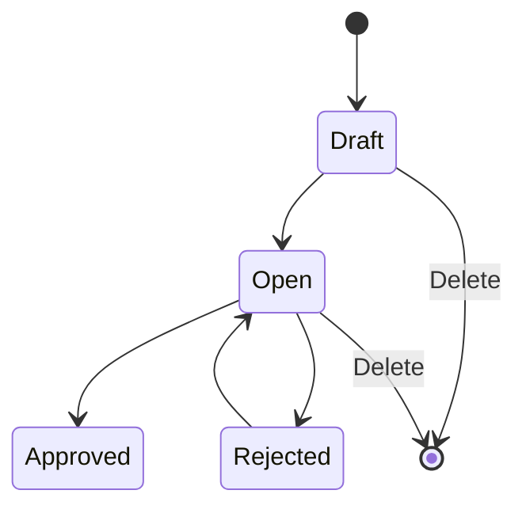

# Transfer Internal — Requirement Documentation

**Modul:** SupplyChain  
**Audience:** PM, Operations, QA, Support, Developer  
**Prefix:** `TFI` · API `mutation-transfer` · `type = tf internal`

| UI | Route | Colli v2 |
|----|-------|----------|
| **Legacy** | `/supplychain/mutation-transfer-internal` | Tidak |
| **BETA** | `/supplychain/new-mutation-transfer-internal` | Ya — Multisku Colli |

**SOT:** [supplychain-mutation-transfer-internal-source-of-truth.md](../_meta/sot/supplychain-mutation-transfer-internal-source-of-truth.md) v1.0  
**Colli master:** [PI Colli v2 SOT](../_meta/sot/supplychain-purchase-inbound-colli-v2-source-of-truth.md) · [Colli Type](../supplychain-colli-type/requirement.md)

**Colli ID v1** (Colli × Colli Qty) **takedown** — canonical Colli v2 only.

---

## 0. Metadata & Changelog

| Version | Date | Author | Changes |
|---------|------|--------|---------|
| 1.0 | 2026-06-19 | QA - Yemima | Initial draft from codebase |
| 1.1 | 2026-07-04 | QA - Yemima | Cross-ref Assembly + Master Unit |
| 1.2 | 2026-07-05 | QA - Yemima | Relasi Manual Picking List |
| 2.0 | 2026-09-01 | QA - Yemima | SOT split: legacy AS-IS lengkap + BETA Colli v2 Flow 1/2; FIFO fulfill-after; import TO-BE; GAP-TFI-01..07 |

## 1. Ringkasan Eksekutif

Transfer Internal memindahkan stok antar lokasi **dalam satu gedung** (struktur WH origin = destination header). Selain input manual, TFI auto-generate dari Assembly, SO fulfillment, Failed Ship, dll. — kolom **Trx. Ref**; virtual WH via **Show Virtual WH**.

**Invariant Colli v2 (BETA):** **1 colli code = 1 lokasi** — tidak boleh split lokasi untuk code yang sama.

## 2. Prasyarat

| Prasyarat | Sumber | Catatan |
|-----------|--------|---------|
| WH origin level ≤ 20; detail dest leaf same building tree | Master Warehouse | Exclude Outrack/WIP dari FIFO origin |
| Availability > 0 | Item Stock | Per stock ID / colli |
| Fiscal period terbuka | Fiscal Period | Trx date ≤ today |
| Gate privilege | Role menu | viewAny / create / update / approval |
| Colli Type Active (New Colli BETA) | Colli Type | Default ON preselect — sama PI |
| Stok/colli dari inbound approved | New PI / legacy PI | List [Multisku Colli](https://staging.olshoperp.com/supplychain/multisku-colli) |

## 3. Siklus Status

**Tidak ada Void** untuk TFI manual.

| Status | Edit | Approve | Reserved |
|--------|------|---------|----------|
| Draft / Open | Ya (`can_update`) | Ya jika ada detail | Qty detail → reserved ↓ availability |
| Approved | Tidak | — | Mutasi final |
| Rejected | Ya | — | Reserved tetap |

**Delete header:** reserved → kolom **Transfer** di Stock Monitoring.

## 4. Acceptance Criteria — Datalist

| ID | Kriteria | Expected |
|----|----------|----------|
| A-TFI-01 | Global Search + Advanced Filter + Reset | SearchBuilder standar |
| A-TFI-02 | Create | Form TFI baru |
| A-TFI-03 | Show Virtual WH | Query `show_virtual` — TFI proses order |
| A-TFI-04 | Show Deleted | Soft-deleted rows |
| A-TFI-05 | Column Show/Hide | Column manager |
| A-TFI-06 | Export | With Details / Without Details / Active Page Only |
| A-TFI-07 | Bulk Delete & Approve | Multi-row checkbox |
| A-TFI-08 | Kolom datalist | Trx Code\|Date, Building Origin, Location Destination, Qty, Description, Trx Ref, Status, audit, Action |

## 5. Acceptance Criteria — Header & Detail (legacy core)

| ID | Kriteria | Expected |
|----|----------|----------|
| A-TFI-10 | Origin WH level ≤ 20 | Validasi tree |
| A-TFI-11 | Location Destination same building as origin | Parent hierarchy match |
| A-TFI-12 | Select Product | SKU avail > 0; qty default 1; dest = header default |
| A-TFI-13 | Group View default; Detail View if multi stock ID | Toggle views |
| A-TFI-14 | Fulfill-after-FIFO on Select Product & Import | Single-rack try then classic FIFO — §6.1 |
| A-TFI-15 | Available Product Use | Bind specific `item_stock_id`; max = its availability |
| A-TFI-16 | Import max 500 rows | Async job + import log |
| A-TFI-17 | Approve | ItemStockMutation transfer; `can_update=false` after |
| A-TFI-18 | Permission | Policy `StockMutationTransfer` |

## 6. Alokasi Stok & Sumber Insert

### 6.1 Fulfill-after-FIFO (AS-IS)

Helper `getFulfillAfterFifo`:

1. Satu Item Stock oldest dengan `available_quantity >= qty` (bukan Outrack/WIP).
2. Else fallback `getFifoProduct` multi-batch.
3. Else **Insufficient product stock.**

**Loose path:** hanya stock dengan `multisku_colli_id` NULL — colli-bound stock excluded.

**Contoh:**

| Inbound date | Rack | Qty |
|--------------|------|-----|
| 1 Jan | A | 50 |
| 2 Jan | B | 100 |
| 3 Jan | C | 150 |
| 4 Jan | D | 200 |

| Out | Allocation |
|-----|------------|
| 50 | A |
| 75 | B |
| 150 | C |
| 200 | D |
| 250 | A50+B100+C100 |

### 6.2 Tiga sumber insert

| Sumber | Alokasi | Edit qty |
|--------|---------|----------|
| Select Product | Fulfill-after-FIFO (loose) atau colli path §7 | Re-run rules |
| Import Excel | Sama Select Product | Sama |
| Available Product Use | **Specific stock ID** — no FIFO | Max stock ID avail; error: *Quantity entered cannot exceed available stock for this specific product stock ID…* |

### 6.3 Import detail — Colli v2 (TO-BE)

Satu kolom **Colli code**:

| Nilai | Interpretasi |
|-------|--------------|
| NULL | Tanpa colli |
| Code not exist | New Colli |
| Code exist, lokasi = WH dest baris | Existing Colli |
| Code exist, lokasi beda | **Row fail** — pesan jelas; partial import OK |

**AS-IS codebase:** masih Colli × Colli Qty v1 — **GAP-TFI-02 Major**.

## 7. BETA — Colli v2

Toolbar **BulkColliAction**: Existing / New + Colli Type (sama PI). Kolom: Colli Origin, Colli Destination, Full COLLI Transfer (hidden).

### 7.1 Flow 1 — New Colli

| Case | Rule |
|------|------|
| **1a Loose** | FIFO loose only; Existing filter: struktur WH origin; **exclude** colli same loc as origin stock |
| **1b Colli-bound origin** | Max qty = colli availability; no free FIFO |

**Location change → Colli Destination NULL** jika lokasi ≠ lokasi colli (**wajib — GAP-TFI-01 Major** jika codebase belum universal).

Bulk Existing: exclude colli code = origin baris terpilih (anti self).

### 7.2 Flow 2 — Existing Colli

**2a — Assign ke colli existing:** multi-SKU boleh satu colli dest; filter & exclude same as §7.1.

**2b — Relocate whole colli:** entry = **Available Product + bulk Use** (all SKUs in colli); Colli Origin = Colli Destination = same code; new single location.

**Invariant:** whole relocate valid only if **all** remaining colli qty moves — no reserved elsewhere.

**Contoh reject approve:**

- COLLI001 @ RACK001: SKUPENSIL 100 + SKUBUKU 50.
- Elsewhere: SKUBUKU **2 reserved** on COLLI001 @ RACK001.
- TF move SKUPENSIL 100 + SKUBUKU **48** → **cannot** approve as whole COLLI001 relocate (**GAP-TFI-04** verify message).

### 7.3 TF vs PI Colli

| Aspek | PI | TF BETA |
|-------|-----|---------|
| Filter Existing | Exact WH dest header | WH origin structure; exclude same loc as origin stock |
| New Colli location | Header dest | **Detail row** dest |
| Permanent in Multisku Colli | After inbound Approve | After TF Approve |

## 8. Validasi

| ID | Trigger | Pesan / behavior |
|----|---------|------------------|
| V-TFI-01 | Date > today | Transaction date cannot be greater than today |
| V-TFI-02 | Approve no detail | doesn't have any detail data |
| V-TFI-03 | Import running | Updating process is in progress |
| V-TFI-04 | Insufficient FIFO | Insufficient product stock. |
| V-TFI-05 | Available Product over stock ID | Quantity entered cannot exceed available stock for this specific product stock ID… |
| V-TFI-06 | Origin = dest detail | Origin dan destination tidak boleh sama |
| V-TFI-07 | Colli qty > colli avail | Tolak |
| V-TFI-08 | Import colli wrong loc | Row error (TO-BE) |
| V-TFI-09 | Whole colli + reserved elsewhere | Approve fail |
| V-TFI-10 | Location change vs colli dest | Colli dest NULL |
| V-TFI-11 | Existing = self colli | Hidden / rejected |

Legacy V-01..V-08 dari v1.2 tetap berlaku (description max 150, approve lock 60s, reject, fiscal period, dll.).

## 9. Gap Registry

| ID | Deskripsi | Status |
|----|-----------|--------|
| GAP-TFI-01 | Colli dest NULL saat ganti location (wajib user) — partial di codebase | **Open Major** |
| GAP-TFI-02 | Import 1 kolom colli code vs v1 Colli×Qty di code | **Open Major** |
| GAP-TFI-03 | Filter Existing exclude same loc as origin — verify API | Open |
| GAP-TFI-04 | Whole colli + reserved elsewhere — verify approve message | Open |
| GAP-TFI-05 | Colli ID v1 takedown | Note |
| GAP-TFI-06 | BETA URL vs MultiskuColli transactionUrl legacy | Open |
| GAP-TFI-07 | Loose vs colli FIFO priority edge case | Open — QA watch |

## 10. Permission & Dependencies

| Permission | Aksi |
|------------|------|
| viewAny | Datalist |
| view | Form detail |
| create / update / delete | CRUD header-detail |
| approval | Approve / reject |

Dependencies: Master Warehouse, Product, Unit, Fiscal Period; upstream inbound/PO for stock.

## 11. Relasi Menu

Lihat juga § Relasi Assembly, Master Unit, Manual Picking List di bawah.

| Menu | Relasi |
|------|--------|
| New Purchase Inbound | Birth colli on Item Stock |
| Colli Type / Multisku Colli | Master colli |
| Assembly | Auto TFI Open → Approve job |
| Failed Ship / Omni fulfillment | Auto TFI + Show Virtual |
| Stock Monitoring | Reserved / Transfer |
| Manual Picking List | Pola Available Product; PL ≠ TFI manual |

---

## Relasi Assembly

Saat Assembly **Open**, auto-create **TFI** per detail line:

| Aspek | Nilai |
|-------|-------|
| Origin | Building Origin |
| Destination | WIP (Warehouse Setting) |
| Status awal | open (approved saat Assembly Approve job) |
| Ref | `WorkOrder` |
| FIFO | `item_stock_id = null` → auto-pick building tree |

Detail: [Assembly requirement §5](../supplychain-assembly/requirement.md).

---

## Relasi Master Unit

Detail `transfer_quantity_unit_id`; approve → base unit via observer. Unit harus Active. Detail: [Master Unit](../supplychain-unit/requirement.md).

---

## Relasi Manual Picking List

PL header = `TF_INTERNAL`, `process_type = manual picking`, prefix **`PL-`** — bukan TFI manual.

| Aspek | TFI menu (`TFI-*`) | Manual PL (`PL-*`) |
|-------|-------------------|-------------------|
| Create | User di Transfer Internal | Manual Picking List |
| Approve | User Approve | Auto Complete Picking |
| Picking UI | Tidak | Omni picking |

Detail: [Manual Picking List §12](../supplychain-manual-picking-list/requirement.md).

---

## 12. QA Test Notes

- [ ] Legacy create/approve happy path + reserved
- [ ] Fulfill-after-FIFO contoh §6.1
- [ ] Available Product stock ID cap + error message
- [ ] BETA New Colli loose + colli-bound max qty
- [ ] BETA Existing + exclude self + location NULL on dest change (GAP-TFI-01)
- [ ] Whole colli via Available Product + reserved block (GAP-TFI-04)
- [ ] Import colli TO-BE vs AS-IS (GAP-TFI-02)
- [ ] TC-MTIN-001..007 regression
- [ ] Show Virtual + Failed Ship chain — [technical §8](./technical.md#8-relasi-failed-ship--rantai-fulfillment)

## Related Documents

| Doc | Path |
|-----|------|
| Knowledge Base | [knowledge-base.md](./knowledge-base.md) |
| Technical | [technical.md](./technical.md) |
| SOT | [../_meta/sot/supplychain-mutation-transfer-internal-source-of-truth.md](../_meta/sot/supplychain-mutation-transfer-internal-source-of-truth.md) |
| PI Colli v2 | [../supplychain-new-purchase-inbound/requirement.md](../supplychain-new-purchase-inbound/requirement.md) |
