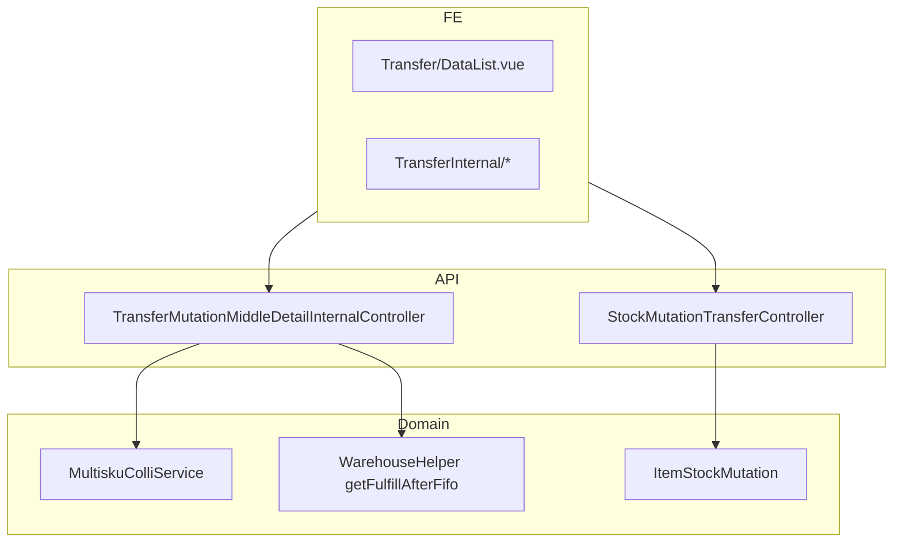

# Transfer Internal — Technical Documentation

## 1. Architecture Overview

Header **`scm_stock_mutations`** via `StockMutationTransfer` (`type = tf internal`, prefix `TFI`). Middle/detail internal: `TransferMutationMiddleDetail` + `multisku_colli_id` untuk Colli v2.



**Approve:** POST `mutation-transfer/{id}/approve` → validasi detail → `ItemStockMutation` transfer internal.

## 2. Frontend File Map

| Path | Route UI | Role |
|------|----------|------|
| `olshoperp-frontend/src/pages/SCM/StockMutation/Transfer/DataList.vue` | `mutation-transfer-internal` | Legacy datalist |
| `Transfer/Form.vue`, `DatalistDetail.vue` | legacy edit | Header + detail |
| `TransferInternal/DataList.vue` | `new-mutation-transfer-internal` | BETA datalist (`from_menu=new-transfer-internal`) |
| `TransferInternal/Form.vue`, `DatalistDetail.vue` | BETA edit | + colli columns |
| `TransferInternal/components/BulkColliAction.vue` | BETA | Existing/New colli toolbar |
| `TransferInternal/components/AvailableWarehouse.vue` | BETA | Available Product + colli column |

Router: `olshoperp-frontend/src/router/index.ts` — paths under `/supplychain/`.

## 3. Backend File Map

| File | Role |
|------|------|
| `StockMutationTransferController.php` | Header CRUD, approve, export, index filter |
| `StockMutationTransferInternalController.php` | Internal-specific header ops |
| `TransferMutationMiddleDetailInternalController.php` | Detail CRUD, Available Product Use, bulk colli, qty adjust |
| `TransferMutationDetailController.php` | Shared detail patterns |
| `MultiskuColliService.php` | assign, `fullTransferByColli`, `isFullTransfer`, promote/demote |
| `TransferInternalImport.php` | Excel import (**v1 colli cols AS-IS**) |
| `TransferInternalDetailImportJob.php` | Async import |
| `StockMutationTransferInternalExportDetailJob.php` | Export with detail |
| `WarehouseHelper.php` | `getFulfillAfterFifo`, `getFifoProduct` |
| `ItemStockMutation.php` | Approve stock move |
| `MultiskuColli.php`, `TransferMutationMiddleDetail.php` | Entities + `multisku_colli_id` |

Policy: `StockMutationTransferPolicy.php`.

## 4. API Routes (utama)

| Method | Path | Notes |
|--------|------|-------|
| GET | `supplychain/mutation-transfer` | Index; `show_virtual`, `from_menu` |
| POST/PUT/DELETE | `supplychain/mutation-transfer` | Header CRUD |
| POST | `supplychain/mutation-transfer/{id}/approve` | Approve |
| Nested | `.../transfer-internal-middle-detail` | Internal middle detail + colli endpoints |
| POST | import upload routes | Max 500 rows |
| GET | `export-excel`, `export-progress` | Export jobs |

Detail nested routes: `Modules/SupplyChain/Routes/api.php`.

## 5. Database Schema

### Header `scm_stock_mutations`

| Column | TF Internal |
|--------|-------------|
| `code` | Prefix `TFI` |
| `type` | `tf internal` |
| `warehouse_origin` / `warehouse_destination` | Header WH |
| `transaction_status` | draft, open, approved, rejected |
| `process_type` | null manual; picking, failed ship, dll. auto |
| `transaction_reference_*` | Polymorphic SO, WorkOrder, … |

### Detail `scm_transfer_mutation_middle_details`

| Column | Notes |
|--------|-------|
| `item_stock_id` | Bound for Available Product path |
| `warehouse_origin_id` / `warehouse_destination_id` | Per line |
| `multisku_colli_id` | Colli v2 destination assignment |
| `transfer_quantity` | Qty + unit FK |

### Item Stock `scm_item_stocks`

`multisku_colli_id` — colli-bound stock excluded from loose FIFO.

## 6. Colli v2 — Implementation Notes

| Behavior | Location |
|----------|----------|
| NULL colli on WH dest change | `TransferMutationMiddleDetailInternalController` ~updateAdjustQuantity, bulk colli store ~1068 |
| Full colli transfer flag | `MultiskuColliService::fullTransferByColli`, promote/demote |
| Select2 multisku colli | API filter — verify GAP-TFI-03 |
| BETA vs legacy URL in audit | `MultiskuColliService::transactionUrl` — GAP-TFI-06 |

**Invariants (code intent):** loose FIFO skips `multisku_colli_id NOT NULL`; Available Product binds explicit `item_stock_id`; 1 colli = 1 location post-approve.

## 7. Index Query Filter (AS-IS)

```
type = tf internal
is_inventory_adjustment = 0
process_type null (manual default) OR show_virtual / failed ship rules
```

## 8. Relasi Failed Ship & rantai fulfillment

Index default **menyembunyikan** virtual WH dan `process_type` fulfillment — toggle **Show Virtual** (`show_virtual=true`).

| Urutan | process_type | Prefix | Origin → Dest |
|--------|--------------|--------|---------------|
| 0 | in wave | TFI virtual | Rack → Rack-Waves |
| 1 | picking | PL | Rack → Outrack |
| 2 | checking | CL | Outrack → virtual Checking |
| 3 | packing | PK | virtual Checking → virtual Packing |
| 4 | shipping | SL | virtual Packing → virtual Collected |
| 5 | shipping do | TFI | virtual Collected → WH 3PL |
| 6 | failed ship | FS | WH 3PL → restock/lost/scrap |

**Doc FS:** [supplychain-failed-ship/technical.md §11](../supplychain-failed-ship/technical.md#11-cross-menu--pergerakan-stok--dokumen-terkait)

## 9. Jobs / Export / Import

| Component | Purpose |
|-----------|---------|
| `StockMutationTransferInternalExportDetailJob` | Async export with detail |
| `TransferInternalDetailImportJob` | Async import |
| `TransferInternalImport` | Row validation — **v1 colli×qty AS-IS** |

FE export options: `EXPORT_OPTIONS_WITH_AND_WITHOUT_DETAILS`.

## 10. Known Technical Gaps

Sync dengan requirement §9 GAP-TFI-01..07 — prioritas Major: location→colli NULL universal; import colli v2 single column.

## Related Documents

| Doc | Path |
|-----|------|
| Requirement | [requirement.md](./requirement.md) |
| SOT | [../_meta/sot/supplychain-mutation-transfer-internal-source-of-truth.md](../_meta/sot/supplychain-mutation-transfer-internal-source-of-truth.md) |
| PI Colli v2 SOT | [../_meta/sot/supplychain-purchase-inbound-colli-v2-source-of-truth.md](../_meta/sot/supplychain-purchase-inbound-colli-v2-source-of-truth.md) |
