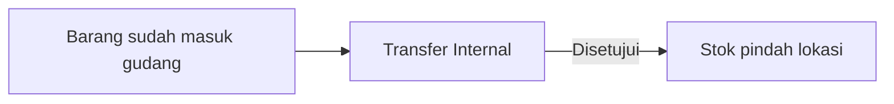
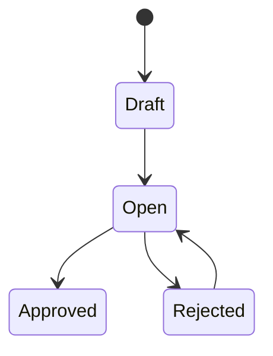

# Transfer Internal — Panduan Pengguna

**Siapa yang baca panduan ini:** operator gudang, inventory, support  
**Menu di sistem:** Supply Chain → Transfer Internal  
**Kode transaksi:** dimulai dengan `TFI-`

Ada **dua tampilan menu**: yang dipakai sehari-hari (**legacy**) dan versi **BETA** untuk fitur **Colli** (wadah multi-SKU). Route BETA: Supply Chain → menu Transfer Internal versi baru (Colli).

---

## 1. Apa Itu & Kenapa Penting

Transfer Internal dipakai untuk **memindahkan barang antar rak atau lokasi dalam gedung yang sama** — misalnya pensil dari RAK001 Lantai 1 ke RACK005 Lantai 2.

Tanpa dokumen ini yang disetujui, perpindahan fisik barang **tidak tercatat** di sistem dan saldo stok di tiap lokasi jadi tidak akurat.

---

## 2. Overview Flow & Proses Bisnis

### Alur singkat

**Versi teks:**

1. Barang sudah ada stok di gudang (biasanya setelah penerimaan barang / inbound).
2. Kamu buat **Transfer Internal**, isi barang yang dipindah dan lokasi tujuan.
3. Setelah **disetujui**, stok berkurang di lokasi asal dan bertambah di lokasi tujuan.

Beberapa Transfer Internal **dibuat otomatis** oleh sistem (order, assembly, dll.). Itu normal — aktifkan **Show Virtual WH** di daftar transaksi kalau mau melihatnya.

🎬 [Interactive demo akan ditambahkan di sini — rantai order fulfillment]

### Siklus status

**Versi teks:**

| Status | Artinya | Bisa diubah? |
|--------|---------|--------------|
| **Draft / Open** | Masih bisa diedit | Ya |
| **Rejected** | Ditolak — perbaiki lalu simpan lagi | Ya |
| **Approved** | Sudah final, stok sudah pindah | Tidak |

Menu ini **tidak punya Void**. Kalau salah setelah disetujui, buat koreksi lewat transfer baru atau prosedur internal perusahaan.

---

## 3. Sebelum Mulai

Pastikan:

- Struktur gudang / rak sudah benar di master data.
- Barang yang mau dipindah **masih ada stok tersedia** di lokasi asal.
- Tanggal transaksi **tidak lebih dari hari ini**.
- Periode akuntansi masih terbuka.
- Akun kamu punya akses buat dan setujui Transfer Internal.

Untuk fitur **Colli (BETA)** tambahan:

- Minimal satu **Colli Type** aktif (kalau mau buat colli baru).
- Barang yang sudah masuk colli dari penerimaan barang akan tampil terpisah dari stok loose.

---

## 4. Setelah Selesai

Setelah dokumen **Approved**:

- Stok **berpindah** dari lokasi asal ke lokasi tujuan per baris detail.
- Qty yang sebelumnya “dipegang” dokumen ini (reserved) **hilang** — sudah jadi mutasi resmi.
- Kalau kamu buat **colli baru** di versi BETA, kode colli baru muncul di daftar **Multisku Colli** setelah disetujui.

Langkah lanjutan: cek **Stock Monitoring** atau laporan stok untuk memastikan saldo per lokasi sudah sesuai.

---

## 5. Yang Perlu Diperhatikan

**Tanggal & persetujuan**

- Kalau tanggal lebih dari hari ini, sistem menolak simpan.
- Kalau belum ada baris detail, **Approve** tidak bisa.
- Kalau import Excel masih jalan, tunggu selesai dulu baru approve.

**Cara menambah barang (penting)**

Ada tiga cara — cara alokasi stoknya **beda**:

| Cara | Kapan dipakai |
|------|----------------|
| **Select Product** | Umum; sistem pilih batch stok otomatis (dari batch/rak paling lama dulu) |
| **Import** | Banyak baris sekaligus lewat Excel |
| **Available Product** | Kamu **memilih stock ID spesifik** (batch tertentu) |

Kalau pakai **Available Product** dan qty melebihi stok batch yang dipilih, sistem menolak dengan pesan bahwa qty melebihi stok untuk **stock ID tersebut**. Solusinya: kurangi qty, atau pakai Select Product / Import kalau butuh ambil dari beberapa batch.

**Lokasi asal dan tujuan**

- Asal dan tujuan per baris **tidak boleh sama**.
- Asal dan tujuan header harus masih dalam **gedung / struktur gudang yang sama**.

**Colli (versi BETA saja)**

- Satu kode colli **hanya boleh di satu lokasi** — tidak boleh “terbelah” di dua rak.
- Kalau kamu **ganti lokasi tujuan** baris, pilihan colli tujuan biasanya **kosong lagi** — assign ulang colli.
- Pindah **seluruh isi colli** sekaligus: lewat **Available Product**, pilih semua SKU dalam colli yang sama, lalu bulk action colli.
- Kalau masih ada qty colli yang “dipegang” transaksi lain, approve pindah colli utuh bisa **gagal** — selesaikan transaksi lain dulu atau pakai colli baru.

---

## 6. Langkah-Langkah

### A. Transfer biasa (menu legacy)

1. Buka **Transfer Internal** → **Create**.
2. Isi **Origin** (gedung/asal), **Location Destination** default, tanggal, keterangan jika perlu → **Save**.
3. Tambah barang:
   - **Select Product** — pilih SKU (qty default 1, bisa diubah), atau
   - **Available Product** — pilih baris stok spesifik → **Use**, atau
   - **Import** — upload Excel (maks. 500 baris).
4. Per baris, sesuaikan **Location Destination** jika beda rak.
5. Review detail ( **Group View** = ringkas per SKU; **Detail View** = per batch stok).
6. Klik **Approve** → pastikan status **Approved**.
7. Cek saldo stok di lokasi asal dan tujuan.

### B. Transfer dengan Colli (menu BETA)

1. Buka menu Transfer Internal **versi BETA (Colli)** → **Create** (sama seperti langkah header di atas).
2. Tambah barang lewat Select Product, Available Product, atau Import.
3. Centang baris yang mau di-colli → toolbar **New Colli** (pilih tipe colli) atau **Existing Colli**.
4. Untuk barang **loose** (tanpa colli): New/Existing colli opsional.
5. Untuk barang **sudah dalam colli**: qty maksimal = stok colli itu; tidak bisa sembarang ambil dari batch lain.
6. **Ganti lokasi tujuan** → cek ulang colli tujuan (sering perlu assign lagi).
7. **Approve** → verifikasi stok dan colli di lokasi baru.

**Contoh sederhana (Colli):**

- Colli COLLI001 di RAK001 berisi pensil 100 + buku 50.
- Kalau buku 2 pcs masih “dipegang” transaksi lain di colli yang sama, kamu **tidak bisa** approve pindah seluruh colli ke rak lain hanya sebagian isinya — harus selesaikan yang reserve dulu atau buat colli baru.

---

## 7. Tips & Hal yang Sering Bikin Bingung

**Kenapa qty di Available Product tidak bisa dinaikkan?**  
Karena baris itu terikat **satu batch stok**. Mau ambil dari batch lain? Pakai Select Product.

**Kenapa colli tujuan hilang setelah ganti rak?**  
Itu aturan sistem supaya colli tidak salah lokasi. Assign lagi setelah lokasi final.

**Legacy vs BETA — pakai yang mana?**  
End-user saat ini pakai menu **legacy** (tanpa colli). Fitur colli ada di **BETA** sampai tim internal selesai rollout.

**TF dari order tidak kelihatan?**  
Aktifkan **Show Virtual WH** di datalist.

**Import gagal sebagian baris (BETA, colli):**  
Baris dengan kode colli yang lokasinya tidak cocok bisa gagal; baris lain tetap bisa sukses — baca pesan error per baris.

---

## 8. Referensi

| Dokumen | Untuk siapa |
|---------|-------------|
| [Knowledge Base](./knowledge-base.md) | Operator & support — troubleshooting |
| [Requirement](./requirement.md) | QA & PM — aturan lengkap + Colli v2 |
| [Technical](./technical.md) | Developer — API & file map |

Versi BETA Colli: lihat juga panduan **Purchase Inbound** (aturan colli master serupa).
