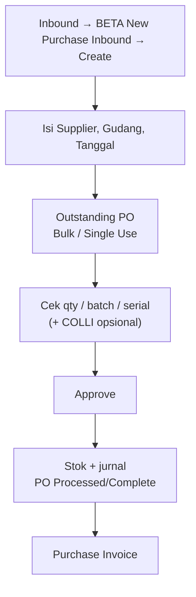

# Purchase Inbound (GRN) — Knowledge Base

**Audience:** Operator gudang, Support  
**Path:** Supply Chain → Inbound → **BETA - New Purchase Inbound** (`/supplychain/new-purchase-inbound`)  
**Prefix dokumen:** `IN-`

> Menu **Purchase Inbound** lama memakai backend yang sama — UI berbeda; BETA punya fitur **COLLI**.

---

## 1. Apa itu Purchase Inbound?

**Purchase Inbound** (GRN — Goods Receipt Note) mencatat **barang masuk ke gudang** dari supplier berdasarkan **Purchase Order** yang sudah disetujui. Setelah di-approve, stok masuk (kecuali jasa) dan jurnal utang sementara (Unbilled Goods) terbit. Pajak/PPN **tidak** dicatat di sini — di Purchase Invoice. Nilai Unbilled memakai **harga sebelum PPN** dari PO.

---

## 2. Kapan dipakai?

| ✅ Buat GRN jika | ❌ Jangan buat GRN jika |
|------------------|-------------------------|
| Barang fisik sudah datang | Hanya punya PR — belum ada PO approved |
| Ada PO **approved/processed** dengan sisa qty | PO sudah closed/void / qty habis |
| Product COA Group sudah lengkap | COA kosong — Approve akan gagal |
| Supplier punya PO outstanding | Mau terima barang tanpa referensi PO (pakai menu lain) |

---

## 3. Alur kerja standar

Setelah PO disetujui dan barang datang, buat GRN untuk mencatat penerimaan.

**Keterangan langkah:**

- **Create:** Supplier hanya yang punya PO outstanding; gudang = fisik tanpa sub-gudang; tanggal ≤ hari ini + periode fiskal aktif.
- **Outstanding PO:** Bulk Use (banyak baris, qty = sisa), Single Use (detail batch/serial/expired), atau Select Product.
- **Keranjang:** qty tidak boleh melebihi sisa PO. Setelah ada detail, supplier/gudang/tanggal terkunci.
- **COLLI (opsional):** Group view → isi jumlah koli + isi per koli; qty inbound otomatis. Tanpa COLLI (0) → isi qty manual.
- **Approve:** stok + jurnal. PO partial → Processed; semua baris penuh → Complete.
- **Lanjut:** tagih di Purchase Invoice (termasuk PPN).

---

## 4. Fitur COLLI (kemasan koli)

Untuk barang dikemas per **koli** (box/pallet):

1. Aktifkan **Group view** di detail.
2. Isi **jumlah koli** dan **isi per koli** — Inbound Qty otomatis = koli × isi.
3. Isi per koli sering terisi dari transaksi terakhir SKU yang sama (atau 1 jika melebihi sisa).
4. Saat Approve — sistem buat **1 Stock ID per koli** (background job).
5. Pantau **Item Stock Status** di daftar (% progress).
6. Jika gagal → notifikasi → status kembali Open → **Approve ulang**.

**Tanpa COLLI (colli = 0):** input Inbound Qty manual seperti biasa.

---

## 5. Tombol & aksi

| Tombol | Fungsi |
|--------|--------|
| **Create** | Header GRN baru |
| **Approve** | Post stok + jurnal (hanya Open) |
| **Reject** | Tolak dokumen Open |
| **Delete** | Hapus draft/open (kembalikan qty reserved di PO) |
| **Export / Import** | Excel (standard atau template colli) |
| **Print / Print RIR** | PDF GRN / Receiving Inspection Report |
| **Allocate Full Qty** | Ambil sisa PO penuh (modal) — bantu selisih desimal unit |

---

## 6. Import Excel

- **Standard** — PO, SKU, Qty, Unit (+ batch/serial/expired)
- **Colli** — template colli (qty = koli × isi)

Aturan: PO approved, SKU ada di PO, qty ≤ sisa, supplier cocok.

---

## 7. Aturan penting

| Rule | Detail |
|------|--------|
| Header lock | Tidak bisa ganti supplier/gudang/tanggal jika sudah ada detail |
| Qty cap | Tidak melebihi sisa PO per baris |
| Expired / Batch | Wajib jika flag produk ON |
| Serial | 1 baris per 1 pcs; max 50 sekaligus |
| Pajak | **Tidak** di GRN — di Purchase Invoice |
| **Service** | **Tidak** generate Stock ID — jurnal biaya operasional |
| **Fix Asset** | Stock ID + jurnal Debit **Assets** |
| **Barang biasa** | Stock ID + jurnal Debit **Inventory** |

---

## 8. Troubleshooting

| Gejala | Penyebab | Tindakan |
|--------|----------|----------|
| Supplier kosong | Tidak ada PO approved | Approve PO dulu |
| Qty exceed outstanding | Input > sisa PO | Kurangi qty / cek GRN lain |
| Approve: no detail | Keranjang kosong | Tambah baris dari outstanding |
| Approve: COA error | Product COA Group incomplete | Lengkapi akun produk + Unbilled Goods |
| COLLI stuck loading | Background job | Tunggu / cek Item Stock Status; re-approve jika error |
| Cannot delete detail | Sudah linked colli | Hapus/edit colli dulu |
| PO sudah closed | Sisa di-close manual | Tidak bisa inbound sisa |
| Void tidak jalan | Fitur belum berfungsi | Hubungi admin/dev |

---

## 9. FAQ

**Q: Beda BETA vs Purchase Inbound lama?**  
A: BETA punya **COLLI** + UI baru. Backend sama.

**Q: Partial receiving?**  
A: Ya — beberapa GRN per PO sampai qty penuh.

**Q: Kapan PO complete?**  
A: Otomatis saat semua baris PO sudah diterima penuh.

**Q: Apakah GRN posting PPN?**  
A: Tidak. PPN di **Purchase Invoice**.

**Q: SKU Service — ada Stock ID?**  
A: **Tidak.** Jasa tidak generate stok; jurnal biaya operasional + Unbilled Goods.

**Q: SKU Fix Asset?**  
A: Tetap ada Stock ID; jurnal Debit **Assets** (bukan Inventory).

**Q: Random SKU bisa inbound?**  
A: Tidak.

---

## Related Documents

| Doc | Path |
|-----|------|
| User Guide | [user-guide.md](./user-guide.md) |
| Requirement | [requirement.md](./requirement.md) |
| Technical | [technical.md](./technical.md) |
| Purchase Order | [../supplychain-purchase-order/knowledge-base.md](../supplychain-purchase-order/knowledge-base.md) |
| Purchase Invoice | [../accounting-supplier-invoice/knowledge-base.md](../accounting-supplier-invoice/knowledge-base.md) |
