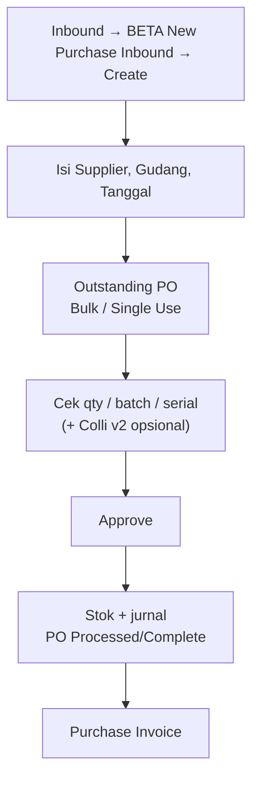

# Purchase Inbound (GRN) — Knowledge Base

**Audience:** Operator gudang, Support  
**Path:** Supply Chain → Inbound → **BETA - New Purchase Inbound** (`/supplychain/new-purchase-inbound`)  
**Prefix dokumen:** `IN-`

> Menu **Purchase Inbound** lama memakai backend yang sama. **Aturan Colli v2 identik** di kedua UI. Master jenis wadah: [Colli Type](../supplychain-colli-type/knowledge-base.md).

---

## 1. Apa itu Purchase Inbound?

**Purchase Inbound** (GRN — Goods Receipt Note) mencatat **barang masuk ke gudang** dari supplier berdasarkan **Purchase Order** yang sudah disetujui. Setelah di-approve, stok masuk (kecuali jasa) dan jurnal utang sementara (Unbilled Goods) terbit. Pajak/PPN **tidak** dicatat di sini — di Purchase Invoice. Nilai Unbilled memakai **harga sebelum PPN** dari PO.

---

## 2. Kapan dipakai?

| ✅ Buat GRN jika | ❌ Jangan buat GRN jika |
|------------------|-------------------------|
| Barang fisik sudah datang | Hanya punya PR — belum ada PO approved |
| Ada PO **approved/processed** dengan sisa qty | PO sudah closed/void / qty habis |
| Product COA Group sudah lengkap | COA kosong — Approve akan gagal |
| Supplier punya PO outstanding | Mau terima barang tanpa referensi PO (pakai menu lain) |

---

## 3. Alur kerja standar

Setelah PO disetujui dan barang datang, buat GRN untuk mencatat penerimaan.

```mermaid
flowchart TD
    A["Inbound → BETA New Purchase Inbound → Create"] --> B["Isi Supplier, Gudang, Tanggal"]
    B --> C["Outstanding PO\nBulk / Single Use"]
    C --> D["Cek qty / batch / serial\n(+ Colli v2 opsional)"]
    D --> E["Approve"]
    E --> F["Stok + jurnal\nPO Processed/Complete"]
    F --> G["Purchase Invoice"]
```

**Keterangan langkah:**

- **Create:** Supplier hanya yang punya PO outstanding; gudang = fisik tanpa sub-gudang; tanggal ≤ hari ini + periode fiskal aktif.
- **Outstanding PO:** Bulk Use (banyak baris, qty = sisa), Single Use (detail batch/serial/expired), atau Select Product.
- **Keranjang:** qty tidak boleh melebihi sisa PO. Setelah ada detail, supplier/gudang/tanggal terkunci.
- **Colli v2 (opsional):** assign **Existing** (kode di WH yang sama) atau **New** (kode `COL` baru + jenis dari Colli Type). Qty penerimaan **tidak berubah**. Tanpa colli = boleh.
- **Approve:** stok + jurnal. Qty di dalam colli baru bermakna setelah Approve. PO partial → Processed; semua baris penuh → Complete.
- **Lanjut:** tagih di Purchase Invoice (termasuk PPN).

---

## 4. Fitur Colli v2 (wadah multi-SKU)

Satu **kode colli** (awalan `COL`) = satu wadah (box/pallet) yang bisa berisi **banyak SKU** di **satu gudang tujuan** (lokasi terkecil, harus sama persis). Bukan lagi “jumlah koli × isi → banyak Stock ID”.

| Mode | Kapan | Syarat |
|------|--------|--------|
| **Existing Colli** | Pakai kode yang sudah ada | Hanya colli di **gudang yang sama** dengan header |
| **New Colli** | Buat kode baru | Pilih **Colli Type** Active; type Default biasanya sudah terpilih |
| **Tanpa colli** | Baris biasa | Boleh — colli tidak wajib |

**Cara assign (setelah baris ada):**

1. Centang beberapa SKU → toolbar **Existing** atau **New** + Type → **Save** (banyak SKU masuk **satu** colli).
2. **Bulk Use** di Outstanding: isi Colli lalu **Use** — banyak SKU satu colli.
3. **Single Use:** field Colli setelah Serial, sebelum Description → **Save**.

**Siklus kode colli:**

- Baru dibuat, inbound belum Approve → masih bisa **hilang** jika semua inbound draft yang memakai kode itu dihapus.
- Setelah **minimal satu** inbound Approved memakai colli itu → kode **permanen**.
- Reject lalu hapus (belum pernah Approve) = sama seperti hapus draft.

**Contoh:**

| Situasi | Hasil |
|---------|--------|
| 3 SKU, New Colli type Box | Satu kode COL baru; 3 baris terikat |
| Existing COL di gudang lain | Ditolak |
| Hapus inbound draft; COL baru tidak dipakai lain, belum Approve | COL hilang dari daftar |
| Baris tanpa colli | OK |
| Satu baris dua colli | Tidak boleh |

---

## 5. Tombol & aksi

| Tombol | Fungsi |
|--------|--------|
| **Create** | Header GRN baru |
| **Approve** | Post stok + jurnal (hanya Open) |
| **Reject** | Tolak dokumen Open |
| **Delete** | Hapus draft/open (kembalikan qty reserved di PO) |
| **Export / Import** | Excel; TO-BE satu kolom Colli (numbering / kode existing) |
| **Print / Print RIR** | PDF GRN / Receiving Inspection Report |
| **Allocate Full Qty** | Ambil sisa PO penuh (modal) — bantu selisih desimal unit |

---

## 6. Import Excel

- **Standard** — PO, SKU, Qty, Unit (+ batch/serial/expired)
- **Colli v2 (TO-BE):** satu kolom **Colli** — numbering sama di banyak baris = satu New Colli; isi kode yang sudah ada = Existing (gudang harus sama); kosong = tanpa colli

Aturan: PO approved, SKU ada di PO, qty ≤ sisa, supplier cocok. Template lama (koli × isi) akan diganti.

---

## 7. Aturan penting

| Rule | Detail |
|------|--------|
| Header lock | Tidak bisa ganti supplier/gudang/tanggal jika sudah ada detail |
| Supplier tampilan | Di layar & export: **kode** saja. Cari by nama tetap OK. Print/Print RIR: nama **masih boleh**. |
| Qty cap | Tidak melebihi sisa PO per baris |
| Expired / Batch | Wajib jika flag produk ON |
| Serial | 1 baris per 1 pcs; max 50 sekaligus |
| Pajak | **Tidak** di GRN — di Purchase Invoice |
| **Service** | **Tidak** generate Stock ID — jurnal biaya operasional |
| **Fix Asset** | Stock ID + jurnal Debit **Assets** |
| **Barang biasa** | Stock ID + jurnal Debit **Inventory** |

---

## 8. Troubleshooting

| Gejala | Penyebab | Tindakan |
|--------|----------|----------|
| Supplier kosong | Tidak ada PO approved | Approve PO dulu |
| Qty exceed outstanding | Input > sisa PO | Kurangi qty / cek GRN lain |
| Approve: no detail | Keranjang kosong | Tambah baris dari outstanding |
| Approve: COA error | Product COA Group incomplete | Lengkapi akun produk + Unbilled Goods |
| Existing colli tidak muncul | Colli di gudang lain | Samakan Location Destination (WH terkecil) |
| Colli hilang setelah hapus inbound | Belum pernah Approve + tidak dipakai inbound lain | Normal — buat New Colli lagi jika perlu |
| Colli masih ada setelah hapus | Masih dipakai inbound lain, atau sudah pernah Approve | Jangan hapus colli lewat hapus inbound Approved |
| Type kosong di New Colli | Belum ada Colli Type Active / Default | Isi master Colli Type dulu |
| Job approve v1 stuck (AS-IS sampai takedown) | Background koli lama | Tunggu / Item Stock Status; re-approve jika error |
| PO sudah closed | Sisa di-close manual | Tidak bisa inbound sisa |
| Void tidak jalan | Fitur belum berfungsi | Hubungi admin/dev |

---

## 9. FAQ

**Q: Beda BETA vs Purchase Inbound lama?**  
A: UI berbeda; backend sama. **Colli v2** aturannya sama di kedua menu.

**Q: Wajib pakai colli?**  
A: Tidak.

**Q: Kapan colli tidak terhapus?**  
A: Setelah minimal satu inbound yang memakai colli itu **Approved**.

**Q: Colli v2 vs Colli ID lama?**  
A: Lama = pecah Stock ID per koli per SKU. Baru = satu kode wadah banyak SKU di satu lokasi.

**Q: Partial receiving?**  
A: Ya — beberapa GRN per PO sampai qty penuh.

**Q: Kapan PO complete?**  
A: Otomatis saat semua baris PO sudah diterima penuh.

**Q: Apakah GRN posting PPN?**  
A: Tidak. PPN di **Purchase Invoice**.

**Q: SKU Service — ada Stock ID?**  
A: **Tidak.** Jasa tidak generate stok; jurnal biaya operasional + Unbilled Goods.

**Q: SKU Fix Asset?**  
A: Tetap ada Stock ID; jurnal Debit **Assets** (bukan Inventory).

**Q: Random SKU bisa inbound?**  
A: Tidak.

---

## Related Documents

| Doc | Path |
|-----|------|
| Feature Map | [feature-map.md](./feature-map.md) |
| User Guide | [user-guide.md](./user-guide.md) |
| Requirement | [requirement.md](./requirement.md) |
| Technical | [technical.md](./technical.md) |
| Purchase Order | [../supplychain-purchase-order/knowledge-base.md](../supplychain-purchase-order/knowledge-base.md) |
| Purchase Invoice | [../accounting-supplier-invoice/knowledge-base.md](../accounting-supplier-invoice/knowledge-base.md) |
| Colli Type | [../supplychain-colli-type/knowledge-base.md](../supplychain-colli-type/knowledge-base.md) |
| Legacy UI | [../supplychain-mutation-inbound/knowledge-base.md](../supplychain-mutation-inbound/knowledge-base.md) |
