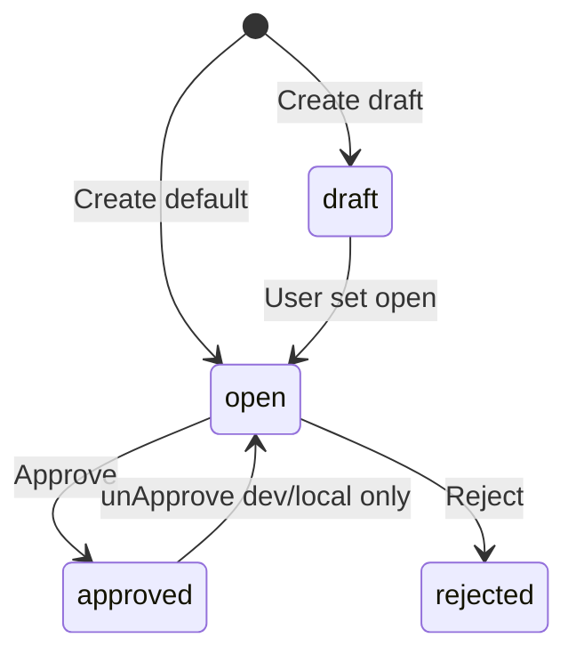
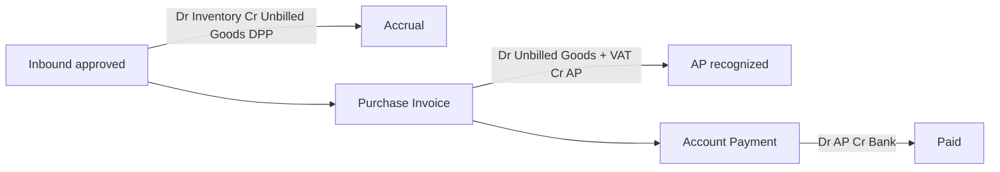

# Purchase Inbound (GRN) — Requirement Documentation

**Modul:** Supply Chain Management (SCM) / Inventory / Inbound  
**Prefix transaksi:** `IN-`  
**Audience:** PM, Operations (Gudang), QA, Support, Developer  
**Status:** AS-IS verified against codebase per 2026-07-05

**UI route (BETA):** `/supplychain/new-purchase-inbound`  
**UI route (legacy):** `/supplychain/mutation-inbound` — same API, UI lama  
**API base:** `{VITE_API_URL}supplychain/mutation-inbound`  
**Entity:** `StockMutationInbound` → `scm_stock_mutations` · detail → `scm_inbound_mutation_details`

**PM sources:** `purchase-inbound-requirement.md` v1.0 (14 Jan 2026) · COLLI BETA v2.0 (27 Mar 2026) · COLLI v2.1 (8 Apr 2026)

**Legacy menu doc:** [supplychain-mutation-inbound](../supplychain-mutation-inbound/README.md) — pointer ke canonical ini

---

## 0. Metadata & Changelog

| Version | Date | Author | Changes |
|---------|------|--------|---------|
| 1.0 | 2026-06-19 | QA - Yemima | Initial draft AS-IS codebase |
| 2.0 | 2026-07-05 | QA - Yemima | Full PM merge: standard GRN + COLLI BETA, journal, import, gaps §19–§21 |
| 2.1 | 2026-07-05 | QA - Yemima | §11.1 Product COA Group type: Service (no stock), Fix Asset (Assets debit) |

---

## 1. Ringkasan Eksekutif

**Purchase Inbound (GRN)** mencatat penerimaan barang ke gudang berdasarkan **Purchase Order (PO) approved/processed**. Mendukung partial receiving, serial/batch/expired, import Excel, dan fitur **COLLI** (kemasan fisik koli) di menu BETA.

| Kebutuhan Bisnis | Bagaimana GRN Menjawab |
|------------------|------------------------|
| Traceability PO → GRN → stok | `purchase_order_detail_id`; `prepared_to_grn_quantity` / `processed_to_grn_quantity` |
| Partial receiving | Multiple GRN per PO; PO → `processed` / `complete` |
| Akurasi kemasan (COLLI) | Middle detail: jumlah koli × isi/koli → N Stock ID |
| Pajak pembelian | **Tidak** di GRN — jurnal harga murni; VAT di Supplier Invoice |
| Unbilled goods | Debit Inventory / Assets / Op. Expense (by COA group type) · Credit Unbilled Goods |

### 1.1 Dua UI, satu backend

| Menu | Route | COLLI | Catatan |
|------|-------|-------|---------|
| **BETA - New Purchase Inbound** | `/supplychain/new-purchase-inbound` | ✓ Group view + middle detail | **Canonical QA** |
| **Purchase Inbound (legacy)** | `/supplychain/mutation-inbound` | Partial / UI berbeda | Same `mutation-inbound` API |

Datalist BETA: query `from_menu=newInobound` (typo preserved) — link edit ke route BETA.

---

## 2. Siklus Status Transaksi



| Status | Definisi | Edit? | Approve? |
|--------|----------|-------|----------|
| **draft** | Optional on create | Yes | No |
| **open** | Default; siap approve | Yes | Yes |
| **approved** | Stok + jurnal posted | No | No |
| **rejected** | Ditolak approver | No | No |
| **declined** | Line reject → sibling IN doc | Special | — |
| processed/complete/closed/void | **Not set** on GRN header normal path | — | GAP §19 |

**Approval:** single level (`gate_menus.approval = 1`).

---

## 3. Datalist (Halaman Depan)

**Komponen:** `PurchaseInbound/DataList.vue`  
**API:** `GET supplychain/mutation-inbound`

| Kolom | Keterangan |
|-------|------------|
| **Trx Code / Date** | Link edit; prefix `IN` |
| **Location Destination** | Gudang penerima (leaf WH) |
| **Supplier** | Supplier header |
| **Trx Ref** | PO codes dari detail lines |
| **Qty** | Total qty received |
| **Trx Status** | draft / open / approved / rejected |
| **Item Stock Status** | Progress % saat async approve (COLLI job) |
| **Description** | Optional, max 150 |

**Toolbar:** bulk delete, bulk approve, export (with/without details), create, show deleted.

**Row actions:**

| Status | Update | Delete | Approve |
|--------|--------|--------|---------|
| open + can_approve | ✓ | ✓ | ✓ |
| approved | ✓ (read) | ✗ | ✗ |
| void/closed | ✓ | ✗ | ✗ |

**PM:** Search filter & pagination persistent — verify FE localStorage/state (standard pattern).

---

## 4. Basic Information (Header)

| Field | Rules AS-IS |
|-------|-------------|
| **Transaction Code** | Auto `IN` prefix on create |
| **Transaction Date** | Required; **≤ today**; fiscal period active; PM: backdate max **6 bulan** (FE tooltip) |
| **Supplier** | Required; select2 hanya supplier dengan PO **approved/processed** |
| **Location (Warehouse)** | Required; leaf level ≤ 20 (`under_31`, `no_child`) |
| **Description** | Optional, max 150 |
| **Transaction Status** | `open` (default) or `draft` |
| **Attachments** | Optional; `config('upload.size.file')` |

**Update lock** (jika sudah ada detail): supplier, warehouse, transaction date **tidak bisa diubah**.

**Currency:** tidak di header GRN — diwarisi dari PO saat jurnal (`current_primary_currency_id`).

---

## 5. Outstanding PO Selection (Source)

**API:** `GET mutation-inbound/{id}/mutation-inbound-detail/outstanding`

| Filter | Rule |
|--------|------|
| PO status | `approved` atau `processed` |
| PO date | `PO.transaction_date < inbound.transaction_date` |
| Sisa qty | `processed_to_grn_quantity < order_quantity_in_base_unit` |
| Not fully blocked | `(prepared + processed) != order_qty` |
| Supplier | Match inbound supplier |

| Kolom | Arti |
|-------|------|
| **Max Inbound Qty** | `inBalance()` = PO qty − prepared − processed |
| **Prepared** | Qty di GRN lain (draft/open) |
| **Processed** | Qty di GRN approved lain |
| **Availability** | Stok realtime gudang (info only) |

### 5.1 Actions

| Action | Behavior AS-IS |
|--------|----------------|
| **Bulk Use** | Multi-select outstanding → add lines; auto-fill max qty |
| **Single Use** | Modal detail — input qty, unit, batch, serial, expired, location |
| **Select Product (shortcut)** | Quick add dari PO same supplier |

**Default saat insert (PM vs AS-IS):**

| Mode | COLLI default | Inbound Qty default |
|------|---------------|---------------------|
| Single Use modal | `0 @ 0` primary unit | User input |
| Bulk Use | `0 @ 0` | Max outstanding PO |
| Select Product shortcut | `0 @ 0` | **1** |

---

## 6. Modal Single Use — Detail Fields

| Field | Rule |
|-------|------|
| Product info | Read-only from PO |
| **Expired Date** | Required if product `warning_expired_date` set; ≥ transaction date |
| **Serial Number** | If ON: 1 row per 1 base unit qty; auto `SN{sku}-{n}`; max **50** SN per create |
| **Batch Number** | Required if `with_default_batch_number=1`; max 50 |
| **Unit** | Primary or alternate; converted to PO base unit for cap |
| **Qty vs PO** | `compareUnitQty` — error: `Input Quantity exceeds Outstanding PO. Max allowed: {n}` |
| **Allocate Full Qty** | Button clears decimal mismatch from unit conversion — `fullAllocate()` |

**Random product:** blocked — `Cannot add stock random product`  
**PO voided:** `The Purchase Order data for this item has been Voided.`  
**PO closed:** `Document purhase order has been closed.`

---

## 7. Inbound Detail Section (Keranjang)

**Views:** toggle **Group view** (`DatalistDetailGroup`) vs flat (`DatalistDetail`)

| Feature | AS-IS |
|---------|-------|
| Inline edit | Qty, unit, batch, location |
| Global search | In detail grid |
| Select Product shortcut | From same PO supplier |
| Delete / bulk delete | Revert `prepared_to_grn_quantity` |
| Max rows | `config('general.max_child_10000')` = **10000** |

**After approve:** kolom PO Reference Code/Date ditambahkan.

---

## 8. Fitur COLLI (BETA — Update 8 Apr 2026)

> Modul kemasan fisik — sinkronkan jumlah koli lapangan dengan Stock ID sistem.

### 8.1 Before vs After

| Komponen | Standard (colli=0) | COLLI mode |
|----------|-------------------|------------|
| Stock ID | 1 detail row → 1 ItemStock (or N for serial) | **N Stock ID** = jumlah koli |
| Input utama | Inbound Qty manual | Jumlah COLLI + Isi per Colli |
| Inbound Qty | Editable | **Read-only** when colli > 0; = colli × isi |

### 8.2 UI — kolom "COLLI & Inbound Qty"

**Komponen:** `InboundColly.vue` inside `DatalistDetailGroup.vue`

```
Baris atas:  [Jumlah Koli] COLLI @ [Isi Koli] [Unit dropdown]
Baris bawah: [Inbound Qty] [Unit dropdown]
```

### 8.3 Logic saat COLLI diisi

| Rule | Behavior |
|------|----------|
| Jumlah colli > 0 | Isi colli auto dari **last trx** SKU (`latest_colly` API) atau **1** jika safety |
| Safety limit | Jika `colli × latest_colly > outstanding + current qty` → isi = **1** (integer only) |
| Inbound qty | Auto = `qty_in_colly × qty_each_colly`; unit locked to colli unit |
| colli = 0 | Manual inbound qty mode (standard) |

**Auto-fill isi colli (PM 8 Apr):** `StockMutationInboundMiddleDetailController@latest_colly` — last middle detail same `product_id`, any status, converted to current unit, `floor()`.

### 8.4 Stock ID generation — Background Job

| Phase | Behavior |
|-------|----------|
| Approve click | Header → **approved**; stock generation **deferred** if middle detail exists |
| Job | `ApproveInboundJob` → chunks `GenerateItemStockChunkJob` (200 rows/chunk) |
| Colli stock | 1 ItemStock per koli; `is_colly` flag on ItemStock |
| Progress | `Item Stock Status` column % on datalist |
| **Job fail** | Toast error; status reverted to **open**; stock/journal rolled back; user can **Re-approve** |

**PM fix (8 Apr):** mengatasi crash limit ~300 row insert real-time.

**Re-approve AS-IS:** failed job sets `transaction_status = open`, deletes partial stock/journal → user clicks Approve again.

---

## 9. Import Excel

**Endpoint:** `POST mutation-inbound/{id}/mutation-inbound-detail/upload`

| Import type | Class |
|-------------|-------|
| Standard | `StockMutationInboundImport` |
| **COLLI** | `StockMutationInboundColliImport` |

**Template COLLI:** `/files/Template-Import-Inbound-colli.xlsx`

### 9.1 Standard columns (PM)

`PO Code*`, `Product ID`, `Product SKU*`, `Inbound Qty*`, `Unit*`  
Optional: Batch, Serial, Location, Expired Date

### 9.2 COLLI columns (AS-IS)

Includes colli qty + colli isi; rule: `Inbound Qty = Colli × Colli Qty`

### 9.3 Validations

| # | Rule |
|---|------|
| 1 | PO exists, approved, same supplier |
| 2 | SKU in PO |
| 3 | Qty ≤ max inbound |
| 4 | Unit valid (base/alternate) |
| 5 | Expired required if product flag ON |
| 6 | Serial: split rows or auto-generate |
| 7 | Concurrent import blocked: `Please wait, other import is being process` |
| 8 | Import log per row on failure |

---

## 10. Approval Flow

### 10.1 Pre-checks

- Auth `approval` policy
- Cache lock `approval_process_inbound` 60s
- Fiscal period
- Min 1 detail
- Max 10000 details
- Warehouse leaf validation
- No import in progress
- Async job not running (`cekMutationApprovalStatus` — 20 min timeout)

### 10.2 Approve paths

| Path | When | Result |
|------|------|--------|
| **Sync** | No middle detail / standard lines | `ItemStockMutation::approveInbound()` inline |
| **Async** | Middle detail (COLLI) exists | `ApproveInboundJob` → `"Approval in progress, please wait a moment."` |

### 10.3 Reject

`approval_status=rejected` → `"The data successfully rejected"`

### 10.4 Side effects on approve

| Target | Update |
|--------|--------|
| PO detail | `prepared_to_grn` ↓, `processed_to_grn` ↑ |
| PO header | → `processed` (partial) or `complete` (full all lines) |
| ItemStock | Created per detail/colli |
| Journal | `JournalProcess::stockInboundAutoJournal` |
| Inspection | Auto RIR from template on header update |

---

## 11. Accounting / Journal (AS-IS)

**Config:** `config('accounting.auto-journal.inbound-with-unbilled-goods')` = **true** (default)

**Method:** `JournalProcess::stockInboundAutoJournal()` · Amount = `each_price_before_vat × quantity_in_base_unit` (harga murni, **tanpa VAT**).

### 11.1 Product COA Group type — stok & jurnal

Perilaku saat **Approve** GRN bergantung pada `ProductCoaGroup.type` pada SKU:

| Product COA Group Type | Generate Stock ID (`ItemStock`)? | Debit (jurnal GRN) | Credit (jurnal GRN) |
|------------------------|----------------------------------|--------------------|---------------------|
| **Purchased Item** | ✅ Ya | Product COA Group → **Inventory** | Product COA Group → **Unbilled Goods** |
| **Manufactured Item** | ✅ Ya | Product COA Group → **Inventory** | Product COA Group → **Unbilled Goods** |
| **Fix Asset** | ✅ Ya (`is_fix_asset=1` pada ItemStock) | Product COA Group → **Assets** | Product COA Group → **Unbilled Goods** |
| **Service** | ❌ **Tidak** | Product COA Group → **Operational Expense** | Product COA Group → **Unbilled Goods** |

#### 11.1.1 Service — tidak generate Stock ID

SKU dengan Product COA Group type **`Service`** adalah **jasa** — tidak punya stok fisik.

| Aspek | AS-IS |
|-------|-------|
| **Stock ID** | **Tidak dibuat** — `ItemStockMutation::approveInbound()` skip jika `productCoaGroup->type == 'Service'` |
| **GRN detail** | Baris detail tetap ada (qty, PO link, prepared/processed GRN di PO) |
| **Jurnal** | Debit **Operational Expense** (bukan Inventory); Credit **Unbilled Goods** |
| **COA wajib** | Operational Expense + Unbilled Goods terkonfigurasi di Product COA Group |

**Alasan bisnis:** jasa tidak di-inventory; pencatatan biaya/jasa via jurnal expense + unbilled goods sampai Supplier Invoice.

#### 11.1.2 Fix Asset — jurnal berbeda, tetap generate Stock ID

SKU dengan Product COA Group type **`Fix Asset`** tetap **generate Stock ID** seperti barang non-service, tetapi **posisi debit jurnal berbeda**:

| Posisi | COA field Product COA Group |
|--------|----------------------------|
| **Debit** | **Assets** (bukan Inventory) |
| **Credit** | **Unbilled Goods** |

| Aspek | AS-IS |
|-------|-------|
| **Stock ID** | ✅ Dibuat — flag `is_fix_asset` pada `ItemStock` |
| **COLLI** | Berlaku sama (N koli → N Stock ID) jika middle detail colli dipakai |
| **Validasi approve** | `"Please Configure \"Asset COA\" for this Product: {sku}"` jika Assets COA kosong |

**Perbandingan ringkas:**

```
Purchased/Manufactured:  Dr Inventory      / Cr Unbilled Goods  + Stock ID
Fix Asset:               Dr Assets         / Cr Unbilled Goods  + Stock ID (is_fix_asset)
Service:                 Dr Op. Expense    / Cr Unbilled Goods  (no Stock ID)
```

**Code refs:** `ItemStockMutation::approveInbound` L401 (`type != 'Service'`) · `JournalProcess::stockInboundAutoJournal` L257–294 (`Fix Asset` → Assets; Service → Operational Expense).

### 11.2 Aturan jurnal umum

If config `inbound-with-unbilled-goods` = **false** → Credit **Account Payable** on supplier (semua type).

| PM rule | AS-IS |
|---------|-------|
| VAT di GRN | **Tidak** — commented out in `JournalProcess`; VAT at Supplier Invoice |
| Harga 0 | Header journal tetap generate; detail lines may be empty |
| Journal status | Auto-approved; date = GRN transaction date |
| Description | `"Auto-Journal from {IN-code}"` |

**AP posting:** at **Supplier Invoice** approve, not GRN.

---

## 12. Void / Delete / Close

| Action | AS-IS |
|--------|-------|
| **Delete** (open) | ✓ Reverts `prepared_to_grn_quantity` |
| **Delete detail** | Blocked if linked colli (`qty_in_colly > 0`) or has children |
| **Void** (approved) | UI `VoidDialog` posts `approval_status=void` — **BE rejects** (only approved/rejected accepted) — **GAP-PI-01** |
| **Close** | `can_closed` needs `processed` header — GRN never reaches it — **GAP-PI-02** |
| **Unapprove** | `GET unapprove` — **development/local only** |

---

## 13. Print & Export

| Endpoint | Document |
|----------|----------|
| `GET …/print` | Purchase Inbound PDF |
| `GET …/print-rir` | Receiving Inspection Report |
| `GET …/export-excel` | Header export with/without details |
| Detail export | Per inbound detail / middle export |

---

## 14. Relasi Purchase Order

| PO status | GRN allowed? |
|-----------|--------------|
| approved | ✓ |
| processed | ✓ (partial received) |
| complete | Edge: closed PO + inbound → PO re-opened complete |
| void | ✗ on add detail |
| closed | Block new qty unless line fully prepared |

**Qty fields on `scm_purchase_order_details`:**

```
inBalance() = order_quantity_in_base_unit - prepared_to_grn_quantity - processed_to_grn_quantity
```

Detail: [Purchase Order requirement §2.3](../supplychain-purchase-order/requirement.md).

---

## 15. Do's & Don'ts

| ✅ Do | ❌ Don't |
|-------|----------|
| Pastikan PO approved sebelum GRN | Inbound tanpa PO reference (menu ini) |
| Match supplier header = PO supplier | Ganti supplier setelah ada detail |
| Set batch/expired jika product flag ON | Approve dengan 0 detail |
| Configure Inventory + Unbilled Goods COA | Expect VAT journal at GRN |
| Re-approve jika COLLI job gagal | Delete detail yang sudah linked colli |
| Use COLLI for bulk packaging | Force >10000 lines without chunk plan |

---

## 16. Acceptance Criteria (QA smoke)

1. Create GRN open → add PO line → prepared_to_grn increments  
2. Qty > inBalance → error max outstanding  
3. Approve standard (Purchased Item) → ItemStock + journal Dr Inventory / Cr Unbilled Goods  
4. Approve **Service** line → **no** ItemStock; journal Dr Operational Expense / Cr Unbilled Goods  
5. Approve **Fix Asset** line → ItemStock (`is_fix_asset`) + journal Dr **Assets** / Cr Unbilled Goods  
6. Partial GRN → PO processed; full all lines → PO complete  
7. COLLI 10×5 → 10 ItemStock after async job  
8. Job fail → toast + status open + re-approve works  
9. Serial product → max 50 per operation  
10. Import colli template → qty = colli × isi  
11. Reject open GRN → rejected status  
12. Print PDF + RIR available

---

## 17. Relasi Menu

| Menu | Relasi |
|------|--------|
| [Purchase Order](../supplychain-purchase-order/requirement.md) | Source outstanding |
| [Purchase Requisition](../supplychain-purchase-requisition/requirement.md) | Via PO With PR |
| [Purchase Invoice](../accounting-supplier-invoice/requirement.md) | Downstream: VAT + AP; qty bridge `prepared_to_invoice` / `processed_to_invoice` on inbound detail — see PI §10 |

### 17.1 Rantai ke Purchase Invoice & Account Payment



| Inbound detail field | Updated when |
|----------------------|--------------|
| `prepared_to_invoice_quantity` | PI adds line (draft/open) |
| `processed_to_invoice_quantity` | PI **approved** |

**Eligibility for PI outstanding:** inbound approved; same supplier/currency; inbound date < PI date; `invoiceBalance() > 0`.

Full spec: [Purchase Invoice requirement §10–§11](../accounting-supplier-invoice/requirement.md#10-relasi-purchase-inbound-detail)
| [System Product](../system-product/requirement.md) | Batch/serial/expired flags |
| [Master Unit](../supplychain-unit/requirement.md) | Unit conversion |
| [Other Inbound](../supplychain-other-inbound/) | Same controller family, no supplier/PO |

---

## 19. Gaps — PM vs AS-IS

| ID | Topik | PM / Expected | AS-IS | Status |
|----|-------|---------------|-------|--------|
| GAP-PI-01 | Void approved GRN | Void action | `approve()` rejects `void` status | **Broken UI** |
| GAP-PI-02 | Close GRN | Close button | `can_closed` needs `processed`; dialog sends `void` | **Not functional** |
| GAP-PI-03 | Menu BETA vs legacy | Single menu | Two UIs same API | **By design transitional** |
| GAP-PI-04 | Currency on header | Display | Inherited from PO silently | **Partial** |
| GAP-PI-05 | VAT at GRN | PM note: no VAT | Confirmed — SI only | **OK by design** |
| GAP-PI-06 | Unapprove production | — | dev/local only | **Gap ops** |
| GAP-PI-07 | `from_menu=newInobound` | — | Typo in API contract | **Low** |
| GAP-PI-08 | Line reject | — | Creates separate `declined` IN doc | **Non-standard** |
| GAP-PI-09 | Over-receipt tolerance | Hard cap inBalance | No % tolerance | **PM decision** |
| GAP-PI-10 | Completion summary | — | No dialog post-approve | **Not implemented** |
| GAP-PI-11 | Legacy edit URLs in journal | — | Points to `mutation-inbound/edit` | **Low drift** |

---

## 20. Dev Follow-ups

| ID | Item |
|----|------|
| DEV-PI-01 | Wire void/close in `StockMutationInboundController@approve` or remove UI |
| DEV-PI-02 | Fix `ClosedDialog` to send `closed` not `void` |
| DEV-PI-03 | Production unapprove policy |
| DEV-PI-04 | Fix `from_menu=newInobound` typo |
| DEV-PI-05 | Journal/deep links to `new-purchase-inbound/edit` |

---

## 21. Pending Items — Major

| ID | Severity | Stakeholder | Pertanyaan | AS-IS |
|----|----------|-------------|------------|-------|
| **P-PI-01** | 🔴 **Highest** | **Dev + QA** | **Void approved GRN — fix or remove UI?** (GAP-PI-01) | VoidDialog broken |
| **P-PI-02** | 🔴 **Major** | **PM + Ops** | **Graduate BETA menu to production?** (GAP-PI-03) | Two menus coexist |
| **P-PI-03** | 🔴 **Major** | **Finance** | **Unapprove di staging/production untuk koreksi?** (GAP-PI-06) | Dev/local only |
| **P-PI-04** | 🟡 Medium | **Ops** | COLLI default isi dari last trx — include draft/open? | Yes — any status |
| **P-PI-05** | 🟡 Medium | **QA** | Async approve timeout 20 min — SLA expectation? | Job + cache |

**Confirmed OK:**

- VAT not at GRN ✓  
- Unbilled Goods journal default ✓  
- COLLI background job + re-approve on fail ✓  
- max 10000 details ✓

---

## Related Documents

| Doc | Path |
|-----|------|
| Knowledge Base | [knowledge-base.md](./knowledge-base.md) |
| Technical | [technical.md](./technical.md) |
| Legacy UI menu | [../supplychain-mutation-inbound/README.md](../supplychain-mutation-inbound/README.md) |
| Purchase Order | [../supplychain-purchase-order/requirement.md](../supplychain-purchase-order/requirement.md) |
