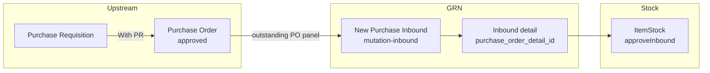
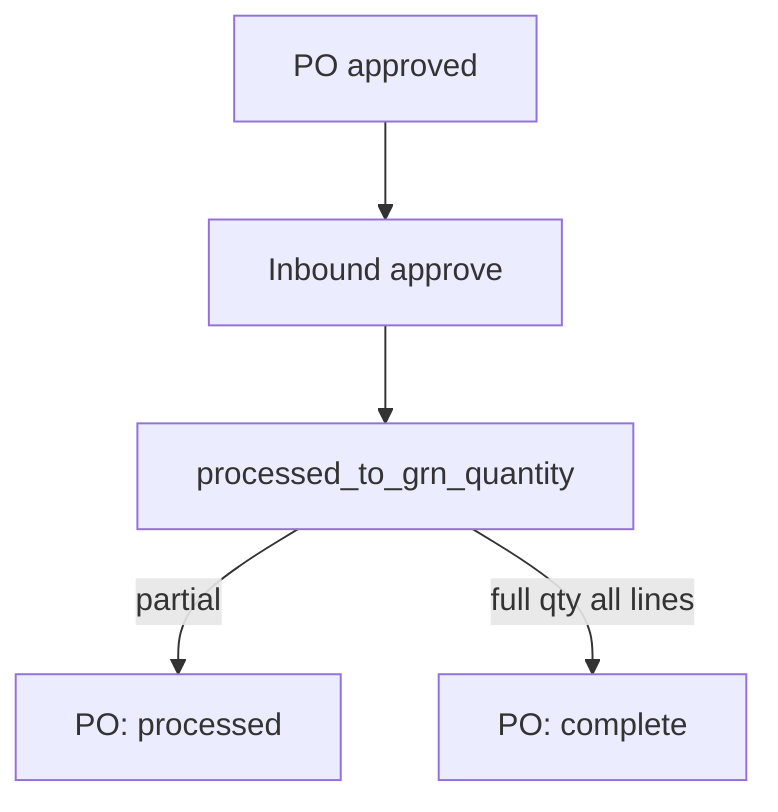

# BETA - New Purchase Inbound — Requirement Detail

> **DRAFT** — Dokumen ini adalah draft awal hasil analisis codebase otomatis per 2026-06-19. Perlu direview PM/QA sebelum final.

**Modul:** SupplyChain  
**Audience:** PM, Operations, QA, Support, Developer  
**Status:** AS-IS (UI BETA, backend shared dengan `mutation-inbound`)

---

## 1. Fungsi & Tujuan

Menu **New Purchase Inbound** adalah UI BETA untuk GRN pembelian. Backend entity: `StockMutationInbound` (`scm_stock_mutations`) dengan filter:

- `warehouse_origin` IS NULL
- `warehouse_destination` IS NOT NULL
- `supplier_id` IS NOT NULL
- `is_inventory_adjustment = 0`
- `is_return_process = 0`
- `type` IS NULL

Detail disimpan di `scm_inbound_mutation_details` dengan FK `purchase_order_detail_id`.

---

## 2. How It Works — Alur Kerja

### 2.1 Procurement → receiving chain

### 2.2 Create header

`POST supplychain/mutation-inbound` — `StockMutationInboundController@store`:

1. **Supplier wajib** (frontend juga validasi client-side).
2. Warehouse destination wajib.
3. Tanggal tidak boleh > hari ini.
4. Kode prefix `IN` jika bukan adjustment/return.
5. Fiscal period divalidasi.

### 2.3 Tambah detail dari PO

`POST mutation-inbound/{id}/mutation-inbound-detail`:

1. Referensi `purchase_order_detail_id` dari outstanding PO.
2. Supplier PO harus match supplier inbound.
3. Qty tidak boleh melebihi `PurchaseOrderDetail::inBalance()`.
4. Auto-create **middle detail** (`StockMutationInboundMiddleDetailController@store`).
5. Increment `prepared_to_grn_quantity` di PO detail.

### 2.4 Approval

`POST mutation-inbound/{id}/approve`:

1. Cache lock `approval_process_inbound` (60s).
2. Minimal 1 detail; fiscal period valid.
3. Warehouse destination level ≤ 20 (leaf).
4. `ItemStockMutation::approveInbound()` → stok, `processed_to_grn_quantity`.
5. Observer PO detail → status PO `processed` / `complete`.

---

## 3. Validasi yang Berjalan

### 3.1 Header

| Field | Rule |
|-------|------|
| `code` | Unique per company (inbound scope) |
| `transaction_date` | Required; ≤ today |
| `warehouse_destination` | Required; leaf level ≤ 20 on approve |
| `supplier_id` | Required (purchase inbound) |
| `description` | Max 150 |
| `transaction_status` | `open` atau `draft` |
| Fiscal period | `validate_fiscal_period()` |

**Update lock:** supplier, warehouse, transaction_date tidak bisa diubah jika sudah ada detail.

### 3.2 Detail

| Field | Rule |
|-------|------|
| `purchase_order_detail_id` | PO approved/processed; supplier match |
| `quantity` | Required numeric; whole number (non-bulk) |
| `quantity_unit_id` | Required; unit aktif |
| `batch_number` | Required jika produk `with_default_batch_number=1` |
| `expired_date` | Required jika produk punya `warning_expired_date`; ≥ transaction date |
| Qty vs PO | Tidak melebihi `inBalance()` |
| Product | Bukan random; bundle check on direct product path |
| Max detail | `config('general.max_child')` |
| Serial limit | Max 50 SN per create |

### 3.3 Outstanding PO query

Filter (`StockMutationInboundDetailController@outstanding_purchase_order_details`):

- PO supplier = inbound supplier
- PO status `approved` atau `processed`
- PO transaction_date < inbound transaction_date
- `processed_to_grn_quantity < order_quantity_in_base_unit`
- Sisa prepared + processed ≠ order qty

### 3.4 Approval

| Rule | Pesan |
|------|-------|
| No detail | Standard ERR_NO_DETAIL_MSG |
| Import in progress | "Updating process is in progress" |
| Already approved | Cannot modify |
| Reject after approved | Blocked |

---

## 4. Relasi Menu Lain

| Menu | Relasi |
|------|--------|
| Purchase Order | Outstanding + qty GRN fields |
| Purchase Requisition | Via PO detail → PR detail tree |
| Supplier Invoice | Invoice qty fields on inbound detail |
| Legacy Inbound | Same API `mutation-inbound`; UI route berbeda |

---

## 5. Known Gaps / Open Questions

| ID | Gap |
|----|-----|
| G-01 | Menu masih label **BETA**; coexist dengan `supplychain/mutation-inbound` legacy |
| G-02 | Datalist filter via query param `from_menu=newInobound` (typo preserved in code) |

---

## Related Documents

| Doc | Path |
|-----|------|
| Knowledge Base | [knowledge-base.md](./knowledge-base.md) |
| Technical | [technical.md](./technical.md) |
| Purchase Order | [../supplychain-purchase-order/requirement.md](../supplychain-purchase-order/requirement.md) |
