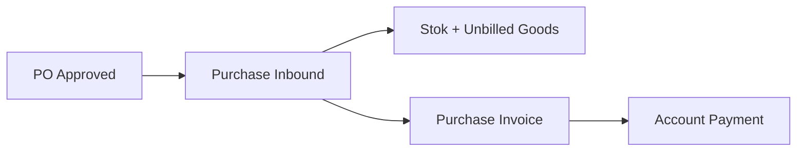
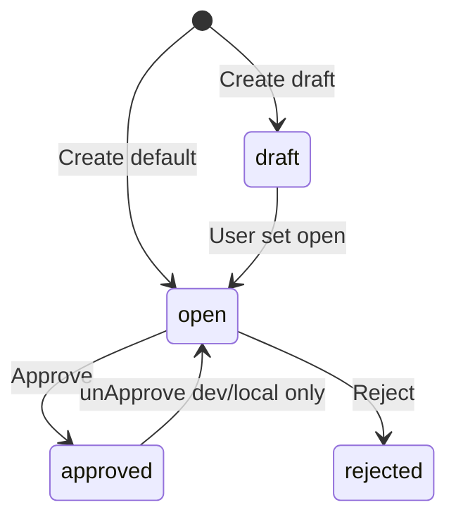
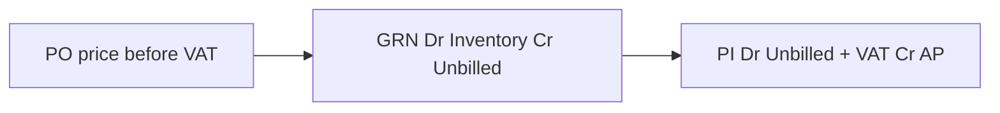
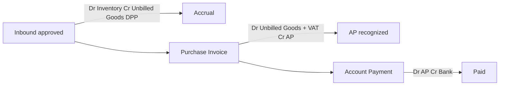

# Purchase Inbound (GRN) — Requirement Documentation

**Modul:** Supply Chain Management (SCM) / Inventory / Inbound  
**Prefix transaksi:** `IN-`  
**Audience:** PM, Operations (Gudang), QA  
**Status:** AS-IS verified (rounding cross-ref 23 Jul 2026) + **Supplier display code-only** (CR ETM-15721 / ETM-15715)

**UI route (BETA):** `/supplychain/new-purchase-inbound`  
**UI route (legacy):** `/supplychain/mutation-inbound` — same API, UI lama  

**PM sources:** `purchase-inbound-requirement.md` v1.0 · COLLI BETA v2.0/v2.1 · **Colli v2 SOT** `_meta/sot/supplychain-purchase-inbound-colli-v2-source-of-truth.md` v1.0 (14 Agu 2026)

**Legacy menu doc:** [supplychain-mutation-inbound](../supplychain-mutation-inbound/README.md) — pointer ke canonical ini

---

## 0. Metadata & Changelog

| Version | Date | Author | Changes |
|---------|------|--------|---------|
| 1.0 | 2026-06-19 | QA - Yemima | Initial draft AS-IS codebase |
| 2.0 | 2026-07-05 | QA - Yemima | Full PM merge: standard GRN + COLLI BETA, journal, import, gaps §19–§21 |
| 2.1 | 2026-07-05 | QA - Yemima | §11.1 Product COA Group type: Service (no stock), Fix Asset (Assets debit) |
| 2.2 | 2026-07-17 | QA - Yemima | Compliance qa-docs-standard: Prasyarat/FAQ; Mermaid rantai; trim path/class; user-guide |
| 2.3 | 2026-07-23 | QA - Yemima | Cross-ref Rounding SoT PO: basis harga GRN = `each_price_before_vat`; VAT hanya di PI |
| 2.4 | 2026-08-14 | QA - Yemima | Colli v2 (wadah multi-SKU) parity BETA + legacy; takedown Colli ID v1 UX; Gap GAP-CIV2-01..09 |
| 2.5 | 2026-09-02 | QA - Yemima | Supplier display **code-only** (UI/export; print name exception) — CR ETM-15721 / wiring ETM-15715 |

---

## 1. Ringkasan Eksekutif

**Purchase Inbound (GRN)** mencatat penerimaan barang ke gudang berdasarkan **Purchase Order (PO) approved/processed**. Mendukung partial receiving, serial/batch/expired, import Excel, dan **Colli v2** (wadah multi-SKU) — **parity** di BETA dan legacy.


```mermaid
flowchart LR
    PO[PO Approved] --> GRN[Purchase Inbound]
    GRN --> STK[Stok + Unbilled Goods]
    GRN --> PI[Purchase Invoice]
    PI --> PAY[Account Payment]
```

| Kebutuhan Bisnis | Bagaimana GRN Menjawab |
|------------------|------------------------|
| Traceability PO → GRN → stok | `purchase_order_detail_id`; `prepared_to_grn_quantity` / `processed_to_grn_quantity` |
| Partial receiving | Multiple GRN per PO; PO → `processed` / `complete` |
| Akurasi kemasan (Colli v2) | Satu Colli code = wadah banyak SKU di **satu** Location Destination; qty availability setelah Approve |
| Pajak pembelian | **Tidak** di GRN — jurnal harga murni; VAT di Supplier Invoice |
| Unbilled goods | Debit Inventory / Assets / Op. Expense (by COA group type) · Credit Unbilled Goods |

### 1.1 Dua UI, satu backend

| Menu | Route | Colli v2 | Catatan |
|------|-------|----------|---------|
| **BETA - New Purchase Inbound** | `/supplychain/new-purchase-inbound` | ✓ **Parity** Existing/New + Type | **Canonical QA** |
| **Purchase Inbound (legacy)** | `/supplychain/mutation-inbound` | ✓ **Parity** aturan sama | Same `mutation-inbound` API |

Deep change Colli v2 tidak mengganggu flow GRN existing; **aturan Colli v2 identik** di kedua UI. Master tipe: [Colli Type](../supplychain-colli-type/requirement.md).

Datalist BETA: query `from_menu=newInobound` (typo preserved) — link edit ke route BETA.

---


## 1.2 Prasyarat

| Prasyarat | Sumber | Catatan |
|-----------|--------|---------|
| PO approved/processed + sisa qty | Purchase Order | Tanggal PO sebelum tanggal GRN |
| Supplier punya PO outstanding | Select2 supplier | Tanpa PO → dropdown kosong |
| Warehouse fisik tanpa sub | Master warehouse | Leaf / no_child — **Location Destination = WH terkecil** (filter Existing Colli exact) |
| Minimal satu Colli Type Active | [Colli Type](../supplychain-colli-type/requirement.md) | Untuk **New Colli**; Default ON = preselect |
| Product COA Group lengkap | Product COA Group | Inventory/Assets/OpEx + Unbilled Goods per type |
| Fiscal period terbuka | Accounting period | Trx date ≤ today |

## 2. Siklus Status Transaksi


```mermaid
stateDiagram-v2
    [*] --> open: Create default
    [*] --> draft: Create draft
    draft --> open: User set open
    open --> approved: Approve
    open --> rejected: Reject
    approved --> open: unApprove dev/local only
```

| Status | Definisi | Edit? | Approve? |
|--------|----------|-------|----------|
| **draft** | Optional on create | Yes | No |
| **open** | Default; siap approve | Yes | Yes |
| **approved** | Stok + jurnal posted | No | No |
| **rejected** | Ditolak approver | No | No |
| **declined** | Line reject → sibling IN doc | Special | — |
| processed/complete/closed/void | **Not set** on GRN header normal path | — | GAP §19 |

**Approval:** single level (`gate_menus.approval = 1`).

---

## 3. Datalist (Halaman Depan)

| Kolom | Keterangan |
|-------|------------|
| **Trx Code / Date** | Link edit; prefix `IN` |
| **Location Destination** | Gudang penerima (tanpa sub-gudang) |
| **Supplier** | **Kode** supplier header (code-only; bukan nama) |
| **Trx Ref** | PO codes dari detail lines |
| **Qty** | Total qty received |
| **Trx Status** | draft / open / approved / rejected |
| **Item Stock Status** | AS-IS v1: progress % async approve (job koli). TO-BE Colli v2: availability setelah Approve, bukan N Stock ID per koli |
| **Description** | Optional, max 150 |

**Toolbar:** bulk delete, bulk approve, export (with/without details), create, show deleted.

**Row actions:**

| Status | Update | Delete | Approve |
|--------|--------|--------|---------|
| open + can_approve | ✓ | ✓ | ✓ |
| approved | ✓ (read) | ✗ | ✗ |
| void/closed | ✓ | ✗ | ✗ |

**PM:** Search filter & pagination persistent — verify FE localStorage/state (standard pattern).

---

## 4. Basic Information (Header)

| Field | Rules AS-IS |
|-------|-------------|
| **Transaction Code** | Auto `IN` prefix on create |
| **Transaction Date** | Required; **≤ today**; fiscal period active; PM: backdate max **6 bulan** (FE tooltip) |
| **Supplier** | Required; select2 hanya supplier dengan PO **approved/processed**; tampilan **code only** (cari boleh by code+name) — § Supplier display |
| **Location (Warehouse)** | Required; gudang fisik tanpa sub-gudang |
| **Description** | Optional, max 150 |
| **Transaction Status** | `open` (default) or `draft` |
| **Attachments** | Optional; ukuran sesuai config upload |

**Update lock** (jika sudah ada detail): supplier, warehouse, transaction date **tidak bisa diubah**.

**Currency:** tidak di header GRN — diwarisi dari PO saat jurnal (`current_primary_currency_id`).

---

## 5. Outstanding PO Selection (Source)

| Filter | Rule |
|--------|------|
| PO status | `approved` atau `processed` |
| PO date | `PO.transaction_date < inbound.transaction_date` |
| Sisa qty | `processed_to_grn_quantity < order_quantity_in_base_unit` |
| Not fully blocked | `(prepared + processed) != order_qty` |
| Supplier | Match inbound supplier |

| Kolom | Arti |
|-------|------|
| **Max Inbound Qty** | `inBalance()` = PO qty − prepared − processed |
| **Prepared** | Qty di GRN lain (draft/open) |
| **Processed** | Qty di GRN approved lain |
| **Availability** | Stok realtime gudang (info only) |

### 5.1 Actions

| Action | Behavior AS-IS |
|--------|----------------|
| **Bulk Use** | Multi-select outstanding → add lines; auto-fill max qty |
| **Single Use** | Modal detail — input qty, unit, batch, serial, expired, location |
| **Select Product (shortcut)** | Quick add dari PO same supplier |

**Default saat insert (PM vs AS-IS):**

| Mode | Colli v2 default | Inbound Qty default (tidak diubah) |
|------|------------------|-------------------------------------|
| Single Use modal | Existing/New + Type di modal (opsional) | User input (default all outstanding, editable) |
| Bulk Use | Field Colli + **Use** → banyak SKU **satu** colli | Max outstanding PO |
| Select Product shortcut | Assign setelah baris ada (bulk/inline) | **1** |

---

## 6. Modal Single Use — Detail Fields

| Field | Rule |
|-------|------|
| Product info | Read-only from PO |
| **Expired Date** | Required if product `warning_expired_date` set; ≥ transaction date |
| **Serial Number** | If ON: 1 row per 1 base unit qty; auto `SN{sku}-{n}`; max **50** SN per create |
| **Batch Number** | Required if `with_default_batch_number=1`; max 50 |
| **Unit** | Primary or alternate; converted to PO base unit for cap |
| **Qty vs PO** | `compareUnitQty` — error: `Input Quantity exceeds Outstanding PO. Max allowed: {n}` |
| **Allocate Full Qty** | Button clears decimal mismatch from unit conversion — `fullAllocate()` |

**Random product:** blocked — `Cannot add stock random product`  
**PO voided:** `The Purchase Order data for this item has been Voided.`  
**PO closed:** `Document purhase order has been closed.`

---

## 7. Inbound Detail Section (Keranjang)

**Views:** toggle **Group view** vs flat.

| Feature | AS-IS |
|---------|-------|
| Inline edit | Qty, unit, batch, location |
| Global search | In detail grid |
| Select Product shortcut | From same PO supplier |
| Delete / bulk delete | Revert `prepared_to_grn_quantity` |
| Max rows | **10000** |

**After approve:** kolom PO Reference Code/Date ditambahkan.

---

## 8. Fitur Colli v2 (TO-BE — 14 Agu 2026)

> **Canonical Colli:** wadah multi-SKU. **Parity** BETA + legacy. SoT: `_meta/sot/supplychain-purchase-inbound-colli-v2-source-of-truth.md`.  
> **Takedown Colli ID v1:** jumlah koli × isi → N Stock ID (`InboundColly` / import `colli` × `colli_qty`) **diganti** UX v2. Qty GRN / outstanding **tidak diubah**. Void inbound × colli = deferred (GAP-CIV2-08).

### 8.1 Konsep

Satu **Colli code** (prefix `COL`) menampung banyak baris SKU di **satu Location Destination (WH terkecil / exact)**. Availability qty di dalam colli baru bermakna setelah inbound **Approved** (Item Stock). Assign colli **opsional** (NULL OK). Maks **1** colli per baris detail.

Master jenis wadah: [Colli Type](../supplychain-colli-type/requirement.md) (Active + Default preselect New Colli). Colli Type → New Colli → Multisku code; Existing Colli → code yang sama WH; Approve → Item Stock availability.

### 8.2 Existing vs New

| Mode | Aturan |
|------|--------|
| **Existing Colli** | Select colli code; filter **exact** WH = Location Destination header. WH mismatch → tolak |
| **New Colli** | Generate code baru; lokasi = WH header; **Choose Colli Type** (Active only; Default ON preselect) |
| Toolbar / modal / inline | Checkbox bulk → Assign Existing/New + Type + **Save**; Available bulk **Use** = multi SKU satu colli; Single Use: field Colli setelah Serial, sebelum Description |

### 8.3 Tiga jalur insert SKU (qty = AS-IS, tidak diubah)

| Jalur | Qty default | Assign colli |
|-------|-------------|--------------|
| Select product | Qty **1** (bulk product path) | Setelah baris ada: checkbox / inline |
| Available **bulk Use** | Qty = **all outstanding** | Field Colli + **Use** → banyak SKU **satu** colli |
| Available **single Use** | All outstanding, **editable** | Colli method + Type di modal → **Save** |

Selama ada detail, destination WH terkunci (existing) → mismatch colli vs header lewat edit header **tidak terjadi**.

### 8.4 Lifecycle Colli code

| Event inbound | Colli **baru** (belum pernah Approve di inbound mana pun) | Colli existing / pernah Approve |
|---------------|----------------------------------------------------------|----------------------------------|
| Assign, belum Approve | Boleh muncul di list Multisku Colli; **bisa hilang** jika semua inbound draft yang mereferensikan dihapus | Tetap |
| **Approve** | **Permanen** | — |
| Reject lalu Delete / Delete draft | Hilang jika tidak direferensikan inbound lain yang masih hidup | Tidak hapus |
| Inbound-2 pakai colli Inbound-1, hapus Inbound-1 | Tetap selama Inbound-2 masih referensi | — |

Tidak ada status draft khusus di entity colli (GAP-CIV2-01 implementasi).

### 8.5 Import Colli v2 (TO-BE)

Satu kolom **Colli**:

| Isi sel | Arti |
|---------|------|
| Numbering sama di banyak baris | Satu **New Colli** bersama → satu code baru |
| Code colli yang sudah ada | **Existing** — WH colli **exact** = header |
| Kosong | Tanpa Colli v2 (NULL) |

AS-IS template v1 (`colli` × `colli_qty`) diganti (GAP-CIV2-02).

### 8.6 Contoh kasus

| # | Situasi | Expected |
|---|---------|----------|
| 1 | Select 3 SKU, bulk New Colli type Box | 1 COL baru; 3 baris linked |
| 2 | Bulk Use 2 SKU + Existing COL WH sama | Kedua baris ke COL itu |
| 3 | Existing COL beda WH | Tolak — exact WH |
| 4 | Single Use qty 50 (sisa 100) + New Colli | Qty 50; linked |
| 5 | Baris tanpa colli | NULL OK |
| 6 | 1 baris 2 colli | Tidak boleh |
| 7 | Hapus inbound draft; COL baru tidak dipakai lain, belum Approve | COL hilang dari list |
| 8 | Reject lalu delete (belum Approve) | Sama — COL baru hilang |
| 9 | Import numbering `1` + code `COL-ABC` | Group 1 → 1 new COL; existing jika WH match |
| 10 | New Colli tanpa Type, ada default master | Type = Default ON |

### 8.7 AS-IS Colli ID v1 (takedown)

Sampai v2 live: Group view + jumlah koli × isi → N Stock ID, async job, import colli × isi. **Target UX = §8.1–8.6** di **kedua** menu (GAP-CIV2-03).

---

## 9. Import Excel

Import standard atau **Colli v2** (1 kolom Colli). Class/path: [technical §10](./technical.md#10-import--config).

### 9.1 Standard columns (PM)

`PO Code*`, `Product ID`, `Product SKU*`, `Inbound Qty*`, `Unit*`  
Optional: Batch, Serial, Location, Expired Date

### 9.2 Colli v2 column (TO-BE)

Satu kolom **Colli**: numbering sama = satu New Colli; code existing = Existing (WH exact); kosong = NULL. AS-IS v1 `colli × colli_qty` → GAP-CIV2-02.

### 9.3 Validations

| # | Rule |
|---|------|
| 1 | PO exists, approved, same supplier |
| 2 | SKU in PO |
| 3 | Qty ≤ max inbound |
| 4 | Unit valid (base/alternate) |
| 5 | Expired required if product flag ON |
| 6 | Serial: split rows or auto-generate |
| 7 | Concurrent import blocked: `Please wait, other import is being process` |
| 8 | Import log per row on failure |

---

## 10. Approval Flow

### 10.1 Pre-checks

- Auth `approval` policy
- Cache lock approve 60s
- Fiscal period
- Min 1 detail
- Max 10000 details
- Warehouse tanpa sub-gudang
- No import in progress
- Async job not running (timeout ~20 min)

### 10.2 Approve paths

| Path | When | Result |
|------|------|--------|
| **Sync** | Standard lines (tanpa middle v1) | Approve inline |
| **Async** | AS-IS v1: middle detail (koli) exists | Background job → *Approval in progress* |
| **Colli v2** | Link `multisku_colli_id`; availability setelah Approve | Qty GRN unchanged; GAP-CIV2-03 UI |

### 10.3 Reject

`approval_status=rejected` → `"The data successfully rejected"`

### 10.4 Side effects on approve

| Target | Update |
|--------|--------|
| PO detail | `prepared_to_grn` ↓, `processed_to_grn` ↑ |
| PO header | → `processed` (partial) or `complete` (full all lines) |
| ItemStock | Created per detail; Colli v2: `multisku_colli_id` setelah Approve |
| Journal | Auto-journal Unbilled Goods |
| Inspection | Auto RIR from template on header update |

---

## 11. Accounting / Journal (AS-IS)

**Config:** inbound-with-unbilled-goods = **true** (default). Amount = harga sebelum VAT × qty base (**tanpa VAT**). Detail: [technical §9](./technical.md#9-journal--product-coa-group-type).

**Sumber harga:** dari PO `each_price_before_vat` (hasil kalkulasi DPP/VAT PO — unit max 4dp). Lihat [PO Rounding SoT §9](../supplychain-purchase-order/requirement.md#91-variable--presisi-sot-27-jul-2026). **VAT tidak** di-post di GRN. Total hutang/jurnal PI mengikuti backend exact (bukan Σ UI breakdown 2dp).

**Setelah PI approve:** jurnal PI **clear** Unbilled Goods + Debit VAT + Credit AP — [PI §5.6](../accounting-supplier-invoice/requirement.md#56-penjurnalan-pi--relasi-inbound-as-is).


```mermaid
flowchart LR
  PO[PO price before VAT] --> GRN[GRN Dr Inventory Cr Unbilled]
  GRN --> PI[PI Dr Unbilled + VAT Cr AP]
```

### 11.1 Product COA Group type — stok & jurnal

Perilaku saat **Approve** GRN bergantung pada `ProductCoaGroup.type` pada SKU:

| Product COA Group Type | Generate Stock ID (`ItemStock`)? | Debit (jurnal GRN) | Credit (jurnal GRN) |
|------------------------|----------------------------------|--------------------|---------------------|
| **Purchased Item** | ✅ Ya | Product COA Group → **Inventory** | Product COA Group → **Unbilled Goods** |
| **Manufactured Item** | ✅ Ya | Product COA Group → **Inventory** | Product COA Group → **Unbilled Goods** |
| **Fix Asset** | ✅ Ya (`is_fix_asset=1` pada ItemStock) | Product COA Group → **Assets** | Product COA Group → **Unbilled Goods** |
| **Service** | ❌ **Tidak** | Product COA Group → **Operational Expense** | Product COA Group → **Unbilled Goods** |

#### 11.1.1 Service — tidak generate Stock ID

SKU dengan Product COA Group type **`Service`** adalah **jasa** — tidak punya stok fisik.

| Aspek | AS-IS |
|-------|-------|
| **Stock ID** | **Tidak dibuat** — skip untuk type Service |
| **GRN detail** | Baris detail tetap ada (qty, PO link, prepared/processed GRN di PO) |
| **Jurnal** | Debit **Operational Expense** (bukan Inventory); Credit **Unbilled Goods** |
| **COA wajib** | Operational Expense + Unbilled Goods terkonfigurasi di Product COA Group |

**Alasan bisnis:** jasa tidak di-inventory; pencatatan biaya/jasa via jurnal expense + unbilled goods sampai Supplier Invoice.

#### 11.1.2 Fix Asset — jurnal berbeda, tetap generate Stock ID

SKU dengan Product COA Group type **`Fix Asset`** tetap **generate Stock ID** seperti barang non-service, tetapi **posisi debit jurnal berbeda**:

| Posisi | COA field Product COA Group |
|--------|----------------------------|
| **Debit** | **Assets** (bukan Inventory) |
| **Credit** | **Unbilled Goods** |

| Aspek | AS-IS |
|-------|-------|
| **Stock ID** | ✅ Dibuat — flag `is_fix_asset` pada `ItemStock` |
| **Colli v2** | Wadah multi-SKU; bukan N Stock ID per koli. AS-IS v1 middle masih berlaku sampai takedown |
| **Validasi approve** | `"Please Configure \"Asset COA\" for this Product: {sku}"` jika Assets COA kosong |

**Perbandingan ringkas:**

```
Purchased/Manufactured:  Dr Inventory      / Cr Unbilled Goods  + Stock ID
Fix Asset:               Dr Assets         / Cr Unbilled Goods  + Stock ID (is_fix_asset)
Service:                 Dr Op. Expense    / Cr Unbilled Goods  (no Stock ID)
```

Implementasi: [technical §9](./technical.md#9-journal--product-coa-group-type).

### 11.2 Aturan jurnal umum

If config `inbound-with-unbilled-goods` = **false** → Credit **Account Payable** on supplier (semua type).

| PM rule | AS-IS |
|---------|-------|
| VAT di GRN | **Tidak** — commented out in `JournalProcess`; VAT at Supplier Invoice |
| Harga 0 | Header journal tetap generate; detail lines may be empty |
| Journal status | Auto-approved; date = GRN transaction date |
| Description | `"Auto-Journal from {IN-code}"` |

**AP posting:** at **Supplier Invoice** approve, not GRN.

---

## 12. Void / Delete / Close

| Action | AS-IS |
|--------|-------|
| **Delete** (open) | ✓ Reverts `prepared_to_grn_quantity` |
| **Delete detail** | AS-IS v1: blocked if `qty_in_colly > 0`. Colli v2: unlink; colli baru boleh hilang jika tidak direferensikan & belum Approve |
| **Void** (approved) | UI void ada; backend **menolak** — **GAP-PI-01** |
| **Close** | `can_closed` needs `processed` header — GRN never reaches it — **GAP-PI-02** |
| **Unapprove** | `GET unapprove` — **development/local only** |

---


## Supplier display (code-only)

**Policy (CR parent [ETM-15721](https://erpintegration.atlassian.net/browse/ETM-15721), Request ID `recvtQRSDX5SOI`; menu wiring [ETM-15715](https://erpintegration.atlassian.net/browse/ETM-15715)).** Berlaku **semua role** — tidak ada privilege untuk melihat **nama** supplier di layar atau export.

| Surface | Behavior (TO-BE / production dengan CR) |
|---------|----------------------------------------|
| Datalist, create/edit (semua section), modals (Outstanding PO, Select Product, Colli, dll.) | Tampil **Supplier Code only** |
| Column Show/Hide | **Tidak** menawarkan kolom Supplier Name |
| Select2 / search | Match by **code + name**; option & selected label = **code only**; **tanpa** hover/tooltip nama |
| Export (semua role) | **Omit** supplier name (kolom Supplier = code bila ada) |
| Print / Print RIR PDF | **Pengecualian:** supplier **name masih boleh** |
| Basic Information | **Jangan** menambah field read-only Supplier Name (item request asli superseded) |

**Acceptance**

- [ ] UI tidak menampilkan supplier name di datalist / form / modal / ColVis
- [ ] Cari supplier by name tetap menemukan; label opsi & terpilih = code only; tanpa tooltip nama
- [ ] Export tanpa nama supplier (semua role)
- [ ] Print / Print RIR boleh tetap menampilkan nama
- [ ] Tidak ada field baru read-only Supplier Name di Basic Information

## 13. Print & Export

| Endpoint | Document | Supplier display |
|----------|----------|------------------|
| `GET …/print` | Purchase Inbound PDF | **Name allowed** (print exception) |
| `GET …/print-rir` | Receiving Inspection Report | **Name allowed** (print exception) |
| `GET …/export-excel` | Header export with/without details | **Code only** — omit name (all roles) |
| Detail export | Per inbound detail / middle export | **Omit** supplier name |

---

## 14. Relasi Purchase Order

| PO status | GRN allowed? |
|-----------|--------------|
| approved | ✓ |
| processed | ✓ (partial received) |
| complete | Edge: closed PO + inbound → PO re-opened complete |
| void | ✗ on add detail |
| closed | Block new qty unless line fully prepared |

**Qty fields on `scm_purchase_order_details`:**

```
inBalance() = order_quantity_in_base_unit - prepared_to_grn_quantity - processed_to_grn_quantity
```

Detail: [Purchase Order requirement §2.3](../supplychain-purchase-order/requirement.md).

---

## 15. Do's & Don'ts

| ✅ Do | ❌ Don't |
|-------|----------|
| Pastikan PO approved sebelum GRN | Inbound tanpa PO reference (menu ini) |
| Match supplier header = PO supplier | Ganti supplier setelah ada detail |
| Set batch/expired jika product flag ON | Approve dengan 0 detail |
| Configure Inventory + Unbilled Goods COA | Expect VAT journal at GRN |
| Re-approve jika job approve v1 gagal | Hapus inbound Approved hanya untuk “bersihkan” colli |
| Assign Existing Colli di WH yang sama | Existing Colli beda WH |
| Isi Colli Type Active sebelum New Colli | Dua colli di satu baris detail |
| Pakai colli opsional (NULL OK) | Force >10000 lines without chunk plan |

---

## 16. Acceptance Criteria (QA smoke)

1. Create GRN open → add PO line → prepared_to_grn increments  
2. Qty > inBalance → error max outstanding  
3. Approve standard (Purchased Item) → ItemStock + journal Dr Inventory / Cr Unbilled Goods  
4. Approve **Service** line → **no** ItemStock; journal Dr Operational Expense / Cr Unbilled Goods  
5. Approve **Fix Asset** line → ItemStock (`is_fix_asset`) + journal Dr **Assets** / Cr Unbilled Goods  
6. Partial GRN → PO processed; full all lines → PO complete  
7. Colli v2: 3 SKU bulk New Colli → 1 COL code; qty GRN tidak berubah  
8. Existing Colli beda WH → ditolak  
9. Hapus inbound draft (COL baru, belum Approve, tidak dipakai lain) → COL hilang  
10. Import 1 kolom numbering sama → satu New Colli (TO-BE GAP-CIV2-02)  
11. Serial product → max 50 per operation  
12. Reject open GRN → rejected status  
13. Print PDF + RIR available  
14. AS-IS v1 (sampai takedown): job fail → Open + re-approve |

---

## 17. Relasi Menu

| Menu | Relasi |
|------|--------|
| [Purchase Order](../supplychain-purchase-order/requirement.md) | Source outstanding |
| [Purchase Requisition](../supplychain-purchase-requisition/requirement.md) | Via PO With PR |
| [Purchase Invoice](../accounting-supplier-invoice/requirement.md) | Downstream: VAT + AP; qty bridge `prepared_to_invoice` / `processed_to_invoice` on inbound detail — see PI §10 |

### 17.1 Rantai ke Purchase Invoice & Account Payment


```mermaid
flowchart LR
    GRN[Inbound approved] -->|"Dr Inventory Cr Unbilled Goods DPP"| ACC1[Accrual]
    GRN --> PI[Purchase Invoice]
    PI -->|"Dr Unbilled Goods + VAT Cr AP"| ACC2[AP recognized]
    PI --> PAY[Account Payment]
    PAY -->|"Dr AP Cr Bank"| ACC3[Paid]
```

| Inbound detail field | Updated when |
|----------------------|--------------|
| `prepared_to_invoice_quantity` | PI adds line (draft/open) |
| `processed_to_invoice_quantity` | PI **approved** |

**Eligibility for PI outstanding:** inbound approved; same supplier/currency; inbound date < PI date; `invoiceBalance() > 0`.

Full spec: [Purchase Invoice requirement](../accounting-supplier-invoice/requirement.md).

| Menu | Relasi |
|------|--------|
| [System Product](../system-product/requirement.md) | Batch/serial/expired flags |
| [Master Unit](../supplychain-unit/requirement.md) | Unit conversion |
| [Colli Type](../supplychain-colli-type/requirement.md) | Jenis wadah New Colli |
| Multisku Colli | List colli code (lifecycle QA; GAP-CIV2-06) |
| [Other Inbound](../supplychain-other-inbound/) | Inbound non-PO (keluarga controller sama) |

---

## 19. Gaps — PM vs AS-IS

| ID | Topik | PM / Expected | AS-IS | Status |
|----|-------|---------------|-------|--------|
| GAP-PI-01 | Void approved GRN | Void action | `approve()` rejects `void` status | **Broken UI** |
| GAP-PI-02 | Close GRN | Close button | `can_closed` needs `processed`; dialog sends `void` | **Not functional** |
| GAP-PI-03 | Menu BETA vs legacy | Single menu | Two UIs same API | **By design transitional** |
| GAP-PI-04 | Currency on header | Display | Inherited from PO silently | **Partial** |
| GAP-PI-05 | VAT at GRN | PM note: no VAT | Confirmed — SI only | **OK by design** |
| GAP-PI-06 | Unapprove production | — | dev/local only | **Gap ops** |
| GAP-PI-07 | `from_menu=newInobound` | — | Typo in API contract | **Low** |
| GAP-PI-08 | Line reject | — | Creates separate `declined` IN doc | **Non-standard** |
| GAP-PI-09 | Over-receipt tolerance | Hard cap inBalance | No % tolerance | **PM decision** |
| GAP-PI-10 | Completion summary | — | No dialog post-approve | **Not implemented** |
| GAP-PI-11 | Legacy edit URLs in journal | — | Points to `mutation-inbound/edit` | **Low drift** |
| GAP-CIV2-01 | Persistensi colli: belum Approve boleh hilang; pernah Approve permanen | Flag/ref-count/approved-inbound | Entity tanpa status colli | Open — Dev |
| GAP-CIV2-02 | Import 1 kolom numbering/existing | Mengganti template v1 | Masih `colli` × `colli_qty` | Open |
| GAP-CIV2-03 | UI Existing/New + Type + takedown v1 | Parity classic + BETA | WIP vs staging | Open |
| GAP-CIV2-04 | Select2 existing filter exact WH | WH terkecil = header | Missing | Open |
| GAP-CIV2-05 | Preselect Colli Type Default | `is_default` ON | Depends GAP-CT-01 | Open |
| GAP-CIV2-06 | Menu Multisku Colli docs/CRUD | List untuk QA lifecycle | Staging URL ada | Open |
| GAP-CIV2-07 | Pesan EN WH mismatch / type required | FormRequest setelah implement | Unverified | Open |
| GAP-CIV2-08 | Void inbound × lifecycle colli | Next topic | Deferred | **Deferred** |
| GAP-CIV2-09 | Cara teknis remove kode v1 | Out of scope SOT | UX v2 replaces v1 | Resolved for SOT |

---

## 20. Dev Follow-ups

DEV-PI-01…05 (void/close wiring, ClosedDialog, unapprove policy, typo from_menu, journal deep links): [technical §14 Known Issues](./technical.md#14-known-issues).


## 21. Pending Items — Major

| ID | Severity | Stakeholder | Pertanyaan | AS-IS |
|----|----------|-------------|------------|-------|
| **P-PI-01** | 🔴 **Highest** | **Dev + QA** | **Void approved GRN — fix or remove UI?** (GAP-PI-01) | VoidDialog broken |
| **P-PI-02** | 🔴 **Major** | **PM + Ops** | **Graduate BETA menu to production?** (GAP-PI-03) | Two menus coexist |
| **P-PI-03** | 🔴 **Major** | **Finance** | **Unapprove di staging/production untuk koreksi?** (GAP-PI-06) | Dev/local only |
| **P-PI-04** | 🟡 Medium | **Ops** | Colli v2 Default Type / lifecycle hapus — lihat GAP-CIV2 | TO-BE |
| **P-PI-05** | 🟡 Medium | **QA** | Async approve timeout 20 min — SLA expectation? | Job + cache (v1 COLLI job; v2 stock path verify) |

**Confirmed OK:**

- VAT not at GRN ✓  
- Unbilled Goods journal default ✓  
- max 10000 details ✓  
- Colli v2 **parity** kedua menu (aturan) ✓ — implementasi GAP-CIV2-03

---


## 22. FAQ

**Q: Supplier tidak muncul?**  
A: Belum ada PO approved/processed untuk supplier itu.

**Q: Void GRN approved?**  
A: Belum berfungsi (GAP-PI-01 / P-PI-01) — UI ada, backend menolak.

**Q: PPN di GRN?**  
A: Tidak — di Purchase Invoice (GAP-PI-05 confirmed OK).

**Q: Colli v2 vs Colli ID lama?**  
A: v2 = satu kode wadah banyak SKU di satu lokasi. v1 = pecah Stock ID per koli per SKU — UX v1 ditakedown.

**Q: Wajib pakai colli?**  
A: Tidak — baris boleh tanpa colli.

**Q: Kapan colli tidak terhapus?**  
A: Setelah minimal satu inbound yang memakai colli itu **Approved**. Hapus semua draft yang mereferensikan (belum pernah Approve) → colli bisa hilang.

**Q: COLLI job gagal (AS-IS v1)?**  
A: Status kembali Open; approve ulang. Path v2: availability setelah Approve, bukan N Stock ID per koli.

**Q: Service vs Fix Asset?**  
A: Service = tanpa Stock ID + jurnal OpEx. Fix Asset = Stock ID + jurnal Assets.

## Related Documents

| Doc | Path |
|-----|------|
| Knowledge Base | [knowledge-base.md](./knowledge-base.md) |
| Technical | [technical.md](./technical.md) |
| User Guide | [user-guide.md](./user-guide.md) |
| Colli Type | [../supplychain-colli-type/requirement.md](../supplychain-colli-type/requirement.md) |
| Colli v2 SoT | [../_meta/sot/supplychain-purchase-inbound-colli-v2-source-of-truth.md](../_meta/sot/supplychain-purchase-inbound-colli-v2-source-of-truth.md) |
| Legacy UI menu | [../supplychain-mutation-inbound/README.md](../supplychain-mutation-inbound/README.md) |
| Purchase Order | [../supplychain-purchase-order/requirement.md](../supplychain-purchase-order/requirement.md) |
