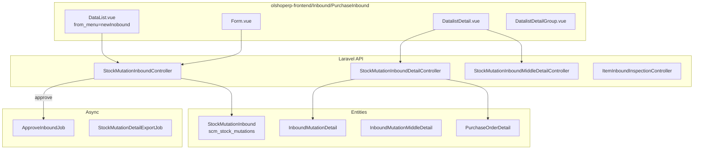
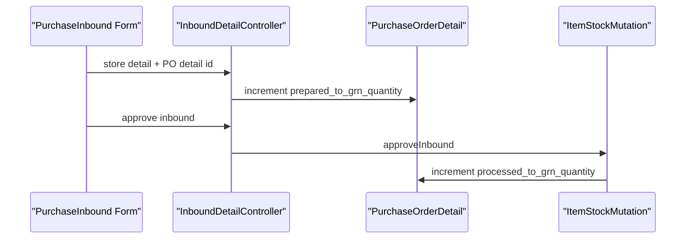

# BETA - New Purchase Inbound — Technical Documentation

> **DRAFT** — Dokumen ini adalah draft awal hasil analisis codebase otomatis per 2026-06-19. Perlu direview PM/QA sebelum final.

**Stack:** Laravel 13 API · Vue 3 SPA  
**Primary module:** `Modules/SupplyChain`  
**Menu slug:** `supplychain-new-purchase-inbound`  
**UI route:** `/supplychain/new-purchase-inbound`  
**API base:** `{VITE_API_URL}supplychain/mutation-inbound*`

---

## 1. Architecture Overview



---

## 2. Frontend File Map

**Root:** `olshoperp-frontend/src/pages/SCM/Inbound/PurchaseInbound/`

| File | Role | Key API |
|------|------|---------|
| `DataList.vue` | Datalist + export | `GET mutation-inbound?from_menu=newInobound` |
| `Form.vue` | Create/edit header (Composition API) | `POST/PUT mutation-inbound/{id}` |
| `DatalistDetail.vue` | Detail grid + outstanding PO | `mutation-inbound-detail` |
| `DatalistDetailGroup.vue` | Middle detail grouping | `mutation-inbound-detail/middle/primevue` |
| `InboundColly.vue` / `InboundQuantity.vue` | Colli/qty helpers | detail endpoints |

### Router

| Route | Component |
|-------|-----------|
| `supplychain/new-purchase-inbound` | `DataList.vue` |
| `supplychain/new-purchase-inbound/create` | `Form.vue` |
| `supplychain/new-purchase-inbound/edit/:id` | `Form.vue` |

**Note:** `redirectUrl` di Form = `supplychain/new-purchase-inbound`; API tetap `mutation-inbound`.

---

## 3. Backend File Map

| Class | Responsibility |
|-------|----------------|
| `StockMutationInboundController` | CRUD header, approve, select2, export, print RIR |
| `StockMutationInboundDetailController` | CRUD detail, outstanding PO, bulk FIFO, import |
| `StockMutationInboundMiddleDetailController` | Middle layer FIFO, inline update |
| `ItemInboundInspectionController` | Receiving inspection checklist |
| `ItemStockMutation` (helper) | `approveInbound()` — core stock posting |

### Models

| Class | Table |
|-------|-------|
| `StockMutationInbound` extends `StockMutation` | `scm_stock_mutations` |
| `InboundMutationDetail` | `scm_inbound_mutation_details` |
| `InboundMutationMiddleDetail` | `scm_inbound_mutation_middle_details` |
| `InboundMutationApprovalStatus` | Progress tracker approval async |
| `StockMutationInboundPolicy` | Authorization |

---

## 4. API Routes (selected)

**File:** `Modules/SupplyChain/Routes/api.php`

| Method | Path | Notes |
|--------|------|-------|
| GET | `mutation-inbound` | Index; `from_menu=newInobound` → link ke UI BETA |
| POST | `mutation-inbound` | Create header |
| PUT | `mutation-inbound/{id}` | Update (POST + `_method=put` di FE) |
| POST | `mutation-inbound/{id}/approve` | Approve GRN |
| GET | `mutation-inbound-detail/outstanding` | Outstanding PO (alias route) |
| GET | `mutation-inbound/{id}/mutation-inbound-detail/primevue` | Detail list |
| POST | `mutation-inbound/{id}/mutation-inbound-detail` | Create detail |
| POST | `mutation-inbound/{id}/mutation-inbound-detail/bulk-fifo` | Bulk FIFO |
| GET | `mutation-inbound/select2/supplier` | Supplier select2 |
| GET | `mutation-inbound/select2/warehouse-destination` | Warehouse select2 |

---

## 5. Database

### 5.1 Header filter (purchase inbound)

```sql
-- Conceptual scope for New Purchase Inbound datalist
warehouse_origin IS NULL
AND warehouse_destination IS NOT NULL
AND supplier_id IS NOT NULL
AND is_inventory_adjustment = 0
AND is_return_process = 0
AND type IS NULL
```

### 5.2 Detail key columns

| Column | Keterangan |
|--------|------------|
| `purchase_order_detail_id` | Link ke PO detail |
| `each_price_before_vat` | Harga per base unit dari PO |
| `prepared_to_invoice_quantity` | Untuk supplier invoice downstream |
| `middle_detail_id` | FK middle layer FIFO |

### 5.3 PO qty integration



---

## 6. Key Integration Points

| Sistem | Mekanisme |
|--------|-----------|
| Purchase Order | Outstanding query + observer status via GRN qty |
| Purchase Requisition | PO detail → PR detail tree; pickChildsForInbound |
| Product | Batch/expired/serial rules per product config |
| Warehouse | Leaf-only destination; tree display formatted |
| Accounting | Supplier invoice qty fields on inbound detail |

---

## 7. Permissions

Policy: `StockMutationInboundPolicy` — `viewAny`, `create`, `update`, `delete`, `approval`.

Menu seeder: `SupplyChainMenuSeeder` → `supplychain/new-purchase-inbound`.
