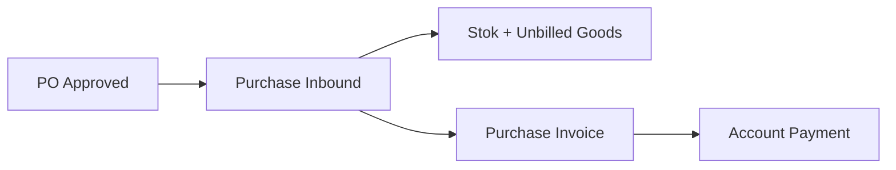
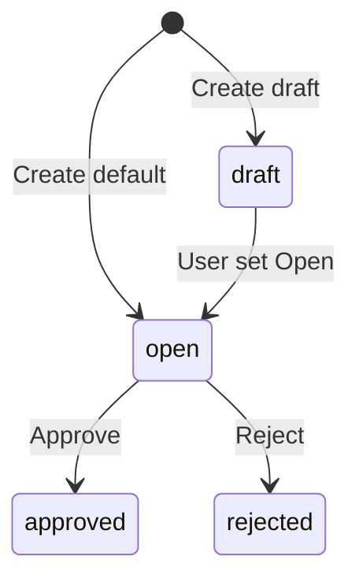

# Purchase Inbound — Panduan Pengguna

**Siapa yang baca panduan ini:** operator gudang, receiving, operations support  
**Menu di sistem:** Supply Chain → Inbound → **BETA - New Purchase Inbound**  
**Kode transaksi:** dimulai dengan `IN-`

> Ada juga menu Purchase Inbound lama (tanpa COLLI). Backend sama; panduan ini untuk UI BETA.

---

## 1. Apa Itu & Kenapa Penting

Purchase Inbound (sering disebut GRN) adalah dokumen untuk **mencatat barang masuk ke gudang** dari supplier berdasarkan Purchase Order yang sudah disetujui.

Lewat menu ini stok masuk (kecuali jasa), jurnal utang sementara terbit, dan qty penerimaan tercatat di PO. Pajak/PPN **tidak** dicatat di sini — itu di Purchase Invoice.

---

## 2. Overview Flow & Proses Bisnis

### Rantai proses

**Versi teks (tanpa diagram):**

1. **Purchase Order** sudah disetujui (atau partial processed).
2. Barang datang → buat **Purchase Inbound** di menu ini.
3. Setelah approve: stok masuk + jurnal Unbilled Goods.
4. Tagih di **Purchase Invoice** (termasuk PPN), lalu bayar di Account Payment.

🎬 [Interactive demo akan ditambahkan di sini]

### Siklus status

**Versi teks:**

| Status | Artinya | Bisa diubah? |
|--------|---------|--------------|
| **Draft** | Belum siap approve | Ya |
| **Open** | Siap di-approve | Ya |
| **Approved** | Stok + jurnal sudah post | Tidak |
| **Rejected** | Ditolak | Tidak (alur normal) |

> Partial receiving boleh: beberapa GRN per PO. PO jadi **Processed** (sebagian) atau **Complete** (semua qty diterima).

---

## 3. Sebelum Mulai (Flow Sebelum)

Pastikan:

- [ ] Ada **PO approved/processed** dengan sisa qty belum diterima.
- [ ] **Supplier** muncul di daftar (punya PO outstanding).
- [ ] **Gudang** tujuan = gudang fisik tanpa sub-gudang.
- [ ] **Tanggal** ≤ hari ini dan periode fiskal masih terbuka.
- [ ] **Akun produk** (COA Group) lengkap — termasuk Unbilled Goods; untuk Fix Asset / Service sesuai tipenya.

🎬 [Interactive demo akan ditambahkan di sini]

---

## 4. Setelah Selesai (Flow Sesudah)

Setelah GRN **di-approve**:

1. Stok masuk ke gudang (kecuali SKU **Service**).
2. Jurnal otomatis sesuai tipe produk (Inventory / Assets / biaya operasional) ke Unbilled Goods.
3. Qty di PO ter-update → Processed atau Complete.
4. Lanjut **Purchase Invoice** untuk tagihan + PPN.
5. Opsional: **Print** PDF GRN atau **Print RIR**.

Jika pakai **COLLI** dan job gagal: status kembali **Open**, dapat notifikasi — **Approve ulang**.

> Void GRN yang sudah approved **belum berfungsi** di sistem saat ini. Koordinasikan dengan admin/dev jika perlu koreksi.

🎬 [Interactive demo akan ditambahkan di sini]

---

## 5. Yang Perlu Diperhatikan

- **Kalau kamu isi qty melebihi sisa PO**, sistem menolak dan menampilkan batas maksimal.
- **Kalau kamu ganti supplier/gudang/tanggal setelah ada baris**, field itu terkunci.
- **Kalau produk wajib expired/batch** tapi belum diisi, validasi menolak.
- **Kalau produk serial**, satu baris = satu pcs; maksimal 50 sekaligus.
- **Kalau approve tanpa baris**, atau masih ada import berjalan / proses approve lain, sistem menolak.
- **Kalau lebih dari sekitar 10.000 baris**, approve ditolak.
- **Kalau hapus baris yang sudah punya data COLLI**, ditolak — hapus/edit COLLI dulu.
- **Kalau Product COA belum lengkap**, Approve gagal dengan pesan konfigurasi akun.
- **Kalau PO sudah void/closed** untuk sisa qty, baris tidak bisa ditambah sesuai pesan sistem.
- **Kalau SKU random**, tidak bisa di-inbound.
- **Kalau kamu mengharapkan PPN di GRN**, tidak ada — PPN di Purchase Invoice.
- **Kalau kamu klik Void pada GRN approved**, saat ini tidak berhasil (fitur belum siap).

---

## 6. Langkah-Langkah (Step by Step)

### Cek dulu

1. PO sudah approved/processed + sisa qty.
2. COA produk siap.

### Langkah 1 — Buat header

1. Buka **BETA - New Purchase Inbound → Create**.
2. Isi **Supplier**, **Warehouse**, **Transaction Date**.
3. Simpan sebagai **Open** (atau Draft dulu).

### Langkah 2 — Tambah barang dari PO

1. Buka panel **Outstanding PO**.
2. Pilih cara:
   - **Bulk Use** — banyak baris, qty default = sisa.
   - **Single Use** — isi qty, unit, batch, serial, expired.
   - **Select Product** — shortcut satu SKU.
3. Pastikan qty ≤ sisa PO.

### Langkah 3 — COLLI (opsional)

1. Aktifkan **Group view**.
2. Isi **jumlah koli** dan **isi per koli**.
3. Inbound Qty terisi otomatis.
4. Kalau colli = 0 → isi qty manual seperti biasa.

🎬 [Interactive demo akan ditambahkan di sini]

### Langkah 4 — Approve

1. Klik **Approve**.
2. Tanpa COLLI: proses langsung.
3. Dengan COLLI: proses background — pantau **Item Stock Status**; jika gagal, approve ulang.

### Langkah 5 — Lanjutan

| Kebutuhan | Lakukan |
|-----------|---------|
| Tagih supplier | **Purchase Invoice** |
| Cetak | **Print** / **Print RIR** |
| Partial lagi | Buat GRN baru dari sisa PO |

---

## 7. Tips & Hal yang Sering Bikin Bingung

- **Supplier kosong?** Approve PO dulu.
- **BETA vs menu lama?** BETA = COLLI + UI baru; backend sama.
- **Partial OK** — boleh beberapa kali terima sampai penuh.
- **Service** = tidak ada Stock ID; jurnal biaya operasional.
- **Fix Asset** = ada Stock ID; jurnal Debit Assets.
- **COLLI stuck?** Tunggu progress; kalau error, approve ulang.
- **Void tidak jalan?** Known issue — hubungi admin/dev.
- **Import:** PO harus approved, SKU di PO, qty ≤ sisa; ada template colli.

---

## 8. Referensi

| Dokumen | Isi |
|---------|-----|
| [knowledge-base.md](./knowledge-base.md) | SOP operator, troubleshooting, FAQ |
| [requirement.md](./requirement.md) | Aturan bisnis, validasi, gap |
| [technical.md](./technical.md) | API, job COLLI, jurnal teknis |

**Menu terkait:** Purchase Order · Purchase Invoice · Purchase Inbound (legacy) · Other Inbound

---

*Derivatif dari requirement / knowledge-base / technical v2.2 — tanpa menambah fakta baru di luar sumber.*
