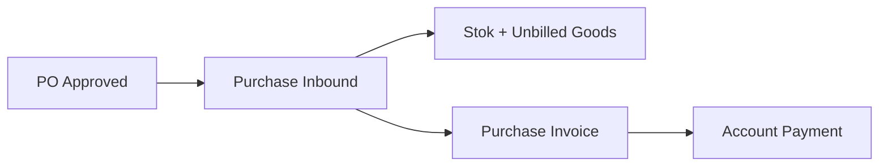
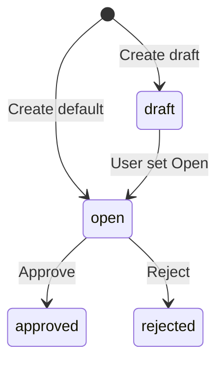

# Purchase Inbound — Panduan Pengguna

**Siapa yang baca panduan ini:** operator gudang, receiving, operations support  
**Menu di sistem:** Supply Chain → Inbound → **BETA - New Purchase Inbound**  
**Kode transaksi:** dimulai dengan `IN-`  
**Feature Map / Lingo:** [feature-map.md](./feature-map.md)

> Ada juga menu Purchase Inbound lama. Backend sama; **aturan [Colli v2](#sf-lingo:SF-INB-01) identik** di kedua UI. Panduan langkah memakai label UI BETA.

---

## 1. Apa Itu & Kenapa Penting

Purchase Inbound (sering disebut GRN) adalah dokumen untuk **mencatat barang masuk ke gudang** dari supplier berdasarkan Purchase Order yang sudah disetujui.

Di layar dan export, supplier ditampilkan sebagai **kode** saja (bukan nama). Kamu tetap bisa **mencari by nama**; hasil yang tampil tetap kode. Cetak (**Print** / **Print RIR**) **boleh** masih menampilkan nama supplier.

Lewat menu ini stok masuk (kecuali jasa), jurnal utang sementara terbit, dan qty penerimaan tercatat di PO. Pajak/PPN **tidak** dicatat di sini — itu di Purchase Invoice.

---

## 2. Overview Flow & Proses Bisnis

### Rantai proses

```mermaid
flowchart LR
    PO[PO Approved] --> GRN[Purchase Inbound]
    GRN --> STK[Stok + Unbilled Goods]
    GRN --> PI[Purchase Invoice]
    PI --> PAY[Account Payment]
```

**Versi teks (tanpa diagram):**

1. **Purchase Order** sudah disetujui (atau partial processed).
2. Barang datang → buat **Purchase Inbound** di menu ini.
3. Setelah approve: stok masuk + jurnal Unbilled Goods ([tipe produk](#sf-lingo:SF-INB-03)).
4. Tagih di **Purchase Invoice** (termasuk PPN), lalu bayar di Account Payment.

🎬 [Interactive demo akan ditambahkan di sini]

### Siklus status

```mermaid
stateDiagram-v2
    [*] --> open: Create default
    [*] --> draft: Create draft
    draft --> open: User set Open
    open --> approved: Approve
    open --> rejected: Reject
```

**Versi teks:**

| Status | Artinya | Bisa diubah? |
|--------|---------|--------------|
| **Draft** | Belum siap approve | Ya |
| **Open** | Siap di-approve | Ya |
| **Approved** | Stok + jurnal sudah post | Tidak |
| **Rejected** | Ditolak | Tidak (alur normal) |

> [Partial receiving](#sf-lingo:SF-INB-02) boleh: beberapa GRN per PO. PO jadi **Processed** (sebagian) atau **Complete** (semua qty diterima).

---

## 3. Sebelum Mulai (Flow Sebelum)

Pastikan:

- [ ] Ada **PO approved/processed** dengan sisa qty belum diterima.
- [ ] **Supplier** muncul di daftar (punya PO outstanding).
- [ ] **Gudang** tujuan = gudang fisik tanpa sub-gudang.
- [ ] **Tanggal** ≤ hari ini dan periode fiskal masih terbuka.
- [ ] **Akun produk** (COA Group) lengkap — termasuk Unbilled Goods; untuk Fix Asset / Service sesuai tipenya.
- [ ] **Colli Type** Active siap jika akan buat **New Colli** (type Default biasanya terpilih otomatis).

🎬 [Interactive demo akan ditambahkan di sini]

---

## 4. Setelah Selesai (Flow Sesudah)

Setelah GRN **di-approve**:

1. Stok masuk ke gudang (kecuali SKU **Service**).
2. Jurnal otomatis sesuai tipe produk (Inventory / Assets / biaya operasional) ke Unbilled Goods — **tanpa PPN**. PPN baru saat Purchase Invoice di-approve.
3. Qty di PO ter-update → Processed atau Complete.
4. Lanjut **Purchase Invoice** untuk tagihan + PPN.
5. Opsional: **Print** PDF GRN atau **Print RIR**.
6. Qty di dalam [Colli v2](#sf-lingo:SF-INB-01) baru bermakna setelah Approve (stok di wadah).

Jika colli **baru** belum pernah Approve, hapus semua inbound draft yang memakai kode itu → kode bisa hilang dari daftar. Setelah Approve, kode colli **permanen**.

> Void GRN yang sudah approved **belum berfungsi**. Jangan hapus inbound Approved hanya untuk “bersihkan” colli.

🎬 [Interactive demo akan ditambahkan di sini]

---

## 5. Yang Perlu Diperhatikan

- **Kalau kamu isi qty melebihi sisa PO**, sistem menolak dan menampilkan batas maksimal.
- **Kalau kamu ganti supplier/gudang/tanggal setelah ada baris**, field itu terkunci.
- **Kalau produk wajib expired/batch** tapi belum diisi, validasi menolak.
- **Kalau produk serial**, satu baris = satu pcs; maksimal 50 sekaligus.
- **Kalau approve tanpa baris**, atau masih ada import berjalan / proses approve lain, sistem menolak.
- **Kalau lebih dari sekitar 10.000 baris**, approve ditolak.
- **Kalau kamu pilih Existing Colli di gudang lain**, sistem menolak — colli harus di Location Destination yang sama.
- **Kalau kamu hapus inbound draft** yang generate colli baru (belum Approve, tidak dipakai dokumen lain), kode colli bisa hilang.
- **Kalau Product COA belum lengkap**, Approve gagal dengan pesan konfigurasi akun.
- **Kalau PO sudah void/closed** untuk sisa qty, baris tidak bisa ditambah sesuai pesan sistem.
- **Kalau SKU random**, tidak bisa di-inbound.
- **Kalau kamu mengharapkan PPN di GRN**, tidak ada — PPN di Purchase Invoice.
- **Kalau kamu klik Void pada GRN approved**, saat ini tidak berhasil (fitur belum siap).

---

## 6. Langkah-Langkah (Step by Step)

### Cek dulu

1. PO sudah approved/processed + sisa qty.
2. COA produk siap.

### Langkah 1 — Buat header

1. Buka **BETA - New Purchase Inbound → Create**.
2. Isi **Supplier**, **Warehouse**, **Transaction Date**.
3. Simpan sebagai **Open** (atau Draft dulu).

### Langkah 2 — Tambah barang dari PO

1. Buka panel **Outstanding PO**.
2. Pilih cara:
   - [**Bulk Use**](#sf-lingo:SF-DET-01) — banyak baris, qty default = sisa.
   - [**Single Use**](#sf-lingo:SF-DET-01) — isi qty, unit, batch, serial, expired.
   - [**Select Product**](#sf-lingo:SF-DET-01) — shortcut satu SKU.
   - [**Allocate Full Qty**](#sf-lingo:SF-DET-02) — ambil sisa penuh (bantu selisih desimal unit).
3. Pastikan qty ≤ sisa PO.
4. Opsional massal: [**Import Excel**](#sf-lingo:SF-IMP-01) (satu kolom Colli: numbering sama = New Colli bersama; kode existing = Existing).

### Langkah 3 — Colli v2 (opsional)

1. Colli **tidak wajib** — baris tanpa colli tetap valid.
2. Pilih **Existing Colli** (kode di gudang yang sama) atau **New Colli** + **Colli Type** ([Colli v2](#sf-lingo:SF-INB-01)).
3. Banyak SKU ke **satu** wadah: centang baris → Save, atau Bulk Use + field Colli.
4. Satu baris = maksimal satu colli.
5. Contoh: 3 SKU + New Colli type Box → satu kode `COL`; Existing di gudang lain → ditolak.

🎬 [Interactive demo akan ditambahkan di sini]

### Langkah 4 — Approve

1. Klik **Approve**.
2. Qty penerimaan tidak berubah karena colli — colli hanya mengikat wadah.
3. Setelah Approve, qty di dalam colli terlihat di stok.

### Langkah 5 — Lanjutan

| Kebutuhan | Lakukan |
|-----------|---------|
| Tagih supplier | **Purchase Invoice** |
| Cetak | **Print** / **Print RIR** |
| Partial lagi | Buat GRN baru dari sisa PO ([Partial receiving](#sf-lingo:SF-INB-02)) |

---

## 7. Tips & Hal yang Sering Bikin Bingung

- **Supplier kosong?** Approve PO dulu.
- **BETA vs menu lama?** UI berbeda; backend sama; Colli v2 aturannya sama.
- **Partial OK** — boleh beberapa kali terima sampai penuh.
- **[Colli v2](#sf-lingo:SF-INB-01)** = satu kode wadah banyak SKU di satu lokasi — bukan pecah Stock ID per koli.
- **Existing colli kosong?** Cek gudang tujuan (harus sama persis).
- **Colli hilang setelah hapus draft?** Belum Approve + tidak dipakai inbound lain — normal.
- **[Service](#sf-lingo:SF-INB-03)** = tidak ada Stock ID; jurnal biaya operasional.
- **[Fix Asset](#sf-lingo:SF-INB-03)** = ada Stock ID; jurnal Debit Assets.
- **Void tidak jalan?** Known issue — hubungi admin/dev.
- **Import:** PO harus approved, SKU di PO, qty ≤ sisa; kolom Colli = numbering / kode existing / kosong.

---

## 8. Referensi

| Dokumen | Isi |
|---------|-----|
| [feature-map.md](./feature-map.md) | Indeks sub-feature + Lingo |
| [knowledge-base.md](./knowledge-base.md) | SOP operator, troubleshooting, FAQ |
| [requirement.md](./requirement.md) | Aturan bisnis, validasi, gap |
| [technical.md](./technical.md) | API, Colli v2 FK, jurnal teknis |

**Menu terkait:** Purchase Order · Purchase Invoice · Purchase Inbound (legacy) · Colli Type · Other Inbound

---

*Derivatif dari requirement / knowledge-base / technical v2.4 — tanpa menambah fakta baru di luar sumber. Feature Map v1.1 ditautkan untuk Lingo.*
