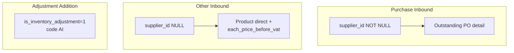
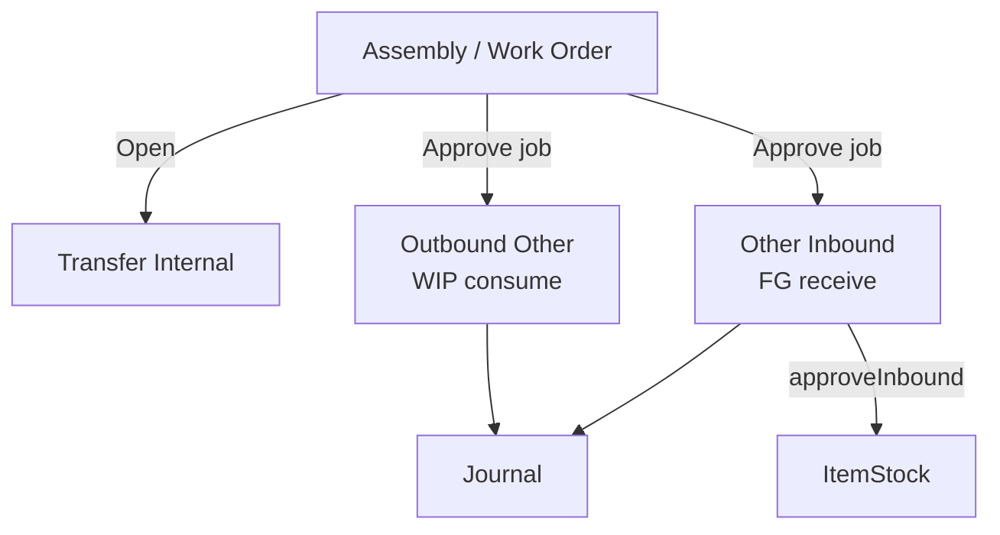

# Other Inbound — Requirement Detail

> **DRAFT** — Dokumen ini adalah draft awal hasil analisis codebase otomatis per 2026-06-19. Perlu direview PM/QA sebelum final.

**Modul:** SupplyChain  
**Audience:** PM, Operations, QA, Support, Developer  
**Status:** AS-IS

---

## 0. Metadata & Changelog

| Version | Date | Author | Changes |
|---------|------|--------|---------|
| 1.0 | 2026-06-19 | QA - Yemima | Initial draft from codebase analysis |
| 1.1 | 2026-07-04 | QA - Yemima | Expand Relasi Assembly (full stock chain + journal) |

---

## 1. Fungsi & Tujuan

**Other Inbound** adalah subset `StockMutationInbound` tanpa supplier dan tanpa PO. Scope datalist:

```text
warehouse_origin IS NULL
warehouse_destination IS NOT NULL
supplier_id IS NULL
is_inventory_adjustment = 0
is_return_process = 0
type IS NULL
```

`OtherInboundController` hanya handle **index, show, export**. Create/update/approve/detail memakai **`StockMutationInboundController`** dan **`StockMutationInboundDetailController`** dengan parameter internal `other=true` (programmatic) atau detail path tanpa PO (UI).

---

## 2. How It Works — Alur Kerja

### 2.1 Inbound types comparison



### 2.2 Auto-generate from Work Order

`WorkOrderApprovalJob` (Assembly):

1. Cari inbound open dengan `transaction_reference_class = WorkOrder`, `supplier_id = null`.
2. Jika tidak ada → `StockMutationInboundController@store($request, with_auth: false, other: true)`.
3. Create detail via inbound detail store dengan harga dari outbound component cost.
4. Link ke Work Order detail via `stock_mutation_ids`.

### 2.3 Manual detail (UI)

`InventoryOther/DatalistDetail.vue`:

- `POST mutation-inbound/{id}/mutation-inbound-detail` tanpa `purchase_order_detail_id`.
- Backend: path `generateDetail()` (bukan `generateDetailOther` kecuali `$other=true` internal).
- Input harga manual di form detail other inbound.

### 2.4 Approval

Identik purchase inbound: `POST mutation-inbound/{id}/approve` → `ItemStockMutation::approveInbound()`.

Tidak ada update PO qty.

---

## 3. Validasi yang Berjalan

### 3.1 Header (store with other=true)

| Field | Rule |
|-------|------|
| `warehouse_destination` | Required |
| `transaction_date` | Required; ≤ today |
| `supplier_id` | NULL (other scope) |
| `is_inventory_adjustment` | 0 (when other=true + no customer) |
| Code | Prefix `IN` |
| Fiscal period | When with_auth |

### 3.2 Detail (non-PO path)

| Field | Rule |
|-------|------|
| `product_id` | Required (no PO/outbound ref) |
| `quantity` | Required numeric; whole number |
| `quantity_unit_id` | Required |
| `each_price_before_vat` | Set on other path (`generateDetailOther`) |
| `batch_number` / `expired_date` | Per product config |
| Bundle check | Skipped when other=true on product path |

### 3.3 Datalist scope

`OtherInboundController@index` → delegates to `StockMutationInboundController@index(other: true)`:

- Adds `whereNull(supplier_id)` filter
- Link formatting → `/supplychain/other-inbound/edit/{id}`

### 3.4 Export

| Endpoint | Behavior |
|----------|----------|
| `GET other-inbound/export-excel` | Batch export via `OtherInboundExportJob` |
| Filter types | With details / Without details / Active page |

---

## 4. Relasi Menu Lain



| Menu | Relasi |
|------|--------|
| [Assembly](../supplychain-assembly/) | Auto-create + approve other inbound per FG detail |
| [Transfer Internal](../supplychain-mutation-transfer-internal/) | Pre-step: komponen Building→WIP |
| [Outbound External](../supplychain-mutation-outbound/) | Pre-step: konsumsi komponen di WIP (`type_so=other`) |
| [Warehouse Setting](../supplychain-setting/) | Finish Good warehouse = destination |
| [Product COA Group](../accounting-product-coa-group/) | COA Inventory FG + WIP untuk jurnal |
| [Master Unit](../supplychain-unit/) | Qty unit per detail FG |
| Purchase Inbound | Shared `mutation-inbound` API, beda scope (`supplier_id` NOT NULL) |
| Journal (Accounting) | `JournalProcess::stockInboundAutoJournal` when ref = WorkOrder |

---

## Relasi Assembly

**Dampak ke menu ini:** `WorkOrderApprovalJob` (Assembly Approve) auto-create **Other Inbound** per FG line jika belum ada inbound open dengan ref WorkOrder:

| Step | Action |
|------|--------|
| 1 | Cari inbound open: `transaction_reference_class = WorkOrder`, `supplier_id = null` |
| 2 | Jika tidak ada → `StockMutationInboundController@store(other: true)` |
| 3 | Create detail FG + `each_price_before_vat` dari rollup cost komponen outbound |
| 4 | Link ke WO detail via `stock_mutation_ids` |
| 5 | Auto-approve inbound → stok FG masuk Finish Good warehouse |

**Jurnal saat approve:** Dr Inventory (FG), Cr WIP — aggregated per FG line.

**Prasyarat dari menu ini agar Assembly lolos:** Finish Good warehouse configured di Warehouse Setting; COA Inventory + WIP valid untuk SKU FG.

**Independensi:** Other Inbound manual (non-Assembly) tetap bisa dibuat — tidak require Work Order reference.

**Detail alur:** [Assembly requirement §5–§6](../supplychain-assembly/requirement.md) · [Assembly technical §7–§8](../supplychain-assembly/technical.md).

---

## Relasi Master Unit

**Dampak ke menu ini:** Detail other inbound punya `inbound_quantity_unit_id` — biasanya primary/alternate unit FG dari System Product.

**Prasyarat:** Unit Active; konversi ke base unit saat approve via observer.

**Detail:** [Master Unit requirement](../supplychain-unit/requirement.md).

---

## 5. Known Gaps / Open Questions

| ID | Gap |
|----|-----|
| G-01 | `OtherInboundController` resource route declares CRUD but **store/update/destroy not implemented** in controller — UI uses `mutation-inbound` for mutations |
| G-02 | `InventoryOther/Form.vue` — header fields disabled; **no `submit()` method** in script (create flow perlu verifikasi QA manual) |
| G-03 | Detail store from UI does not pass `$other=true` — uses `generateDetail()` without PO (works but different code path vs `generateDetailOther`) |
| G-04 | `routes.md` lists `OtherInboundController@store` — may be stale vs actual controller |

---

## Related Documents

| Doc | Path |
|-----|------|
| Knowledge Base | [knowledge-base.md](./knowledge-base.md) |
| Technical | [technical.md](./technical.md) |
| New Purchase Inbound | [../supplychain-new-purchase-inbound/requirement.md](../supplychain-new-purchase-inbound/requirement.md) |
| Assembly | [../supplychain-assembly/requirement.md](../supplychain-assembly/requirement.md) |
| Master Unit | [../supplychain-unit/requirement.md](../supplychain-unit/requirement.md) |
