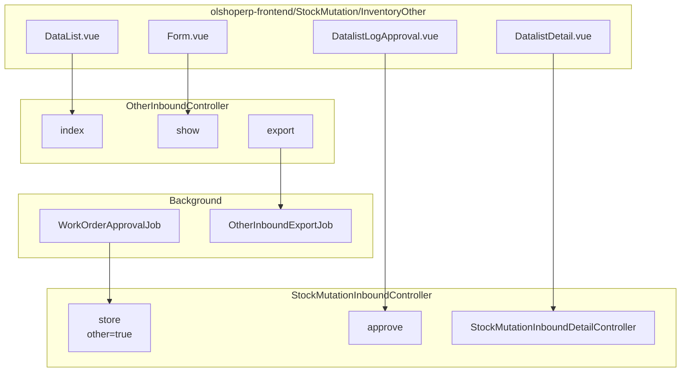
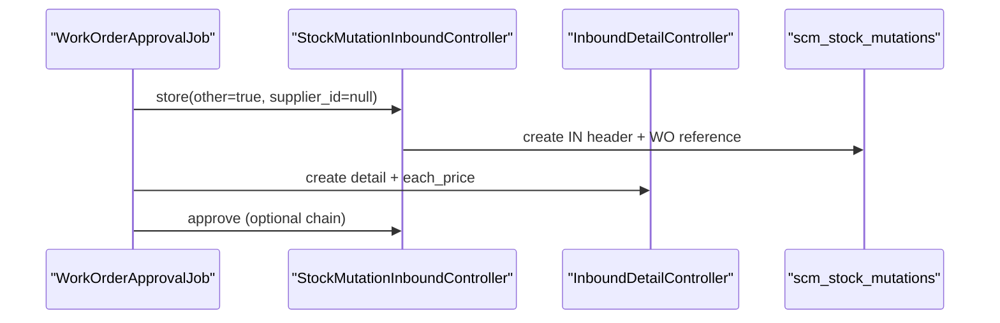

# Other Inbound — Technical Documentation

> **DRAFT** — Dokumen ini adalah draft awal hasil analisis codebase otomatis per 2026-06-19. Perlu direview PM/QA sebelum final.

**Stack:** Laravel 13 API · Vue 3 SPA  
**Primary module:** `Modules/SupplyChain`  
**Menu slug:** `supplychain-other-inbound`  
**UI route:** `/supplychain/other-inbound`  
**API datalist:** `{VITE_API_URL}supplychain/other-inbound`  
**API mutations:** `{VITE_API_URL}supplychain/mutation-inbound*`

---

## 1. Architecture Overview

---

## 2. Frontend File Map

**Root:** `olshoperp-frontend/src/pages/SCM/StockMutation/InventoryOther/`

| File | Role | Key API |
|------|------|---------|
| `DataList.vue` | Datalist + export | `GET other-inbound` |
| `Form.vue` | Edit header (read-only fields) | `GET other-inbound/{id}` |
| `DatalistDetail.vue` | Detail CRUD | `mutation-inbound/{id}/mutation-inbound-detail` |
| `DatalistLogApproval.vue` | Approve/reject | `POST mutation-inbound/{id}/approve` |
| `ApprovalEligibility.vue` | Approvers | `mutation-inbound/approval-eligibility/{id}` |

### Router

| Route | Component |
|-------|-----------|
| `supplychain/other-inbound` | `DataList.vue` |
| `supplychain/other-inbound/create` | `Form.vue` |
| `supplychain/other-inbound/edit/:id` | `Form.vue` |

### API split (important)

| Operation | API module used by FE |
|-----------|----------------------|
| List / show / export | `other-inbound` |
| Detail CRUD | `mutation-inbound` |
| Approve / audit / approval log | `mutation-inbound` |
| Warehouse select2 | `mutation-inbound/select2/warehouse-destination` |

---

## 3. Backend File Map

| Class | Responsibility |
|-------|----------------|
| `OtherInboundController` | Index (delegate), show, exportFile/Progress/Excel |
| `StockMutationInboundController` | Store with `other=true`, approve, shared inbound logic |
| `StockMutationInboundDetailController` | Detail store; `generateDetailOther()` when `$other=true` |
| `WorkOrderApprovalJob` | Auto-create other inbound from assembly |

### Export pipeline

| Class | Table temp |
|-------|------------|
| `OtherInboundExportJob` | Chunk → `StockMutationOtherInboundExportTemp` |
| `OtherInboundExportExcelJob` | Merge → Excel file |
| `StockMutationOtherInboundExportAll` | Excel export class |

---

## 4. API Routes

| Method | Path | Controller |
|--------|------|------------|
| GET | `other-inbound` | `OtherInboundController@index` → `StockMutationInboundController@index(other:true)` |
| GET | `other-inbound/{id}` | `OtherInboundController@show` |
| GET | `other-inbound/export-excel` | `OtherInboundController@exportExcel` |
| GET | `other-inbound/export-file` | `OtherInboundController@exportFile` |
| GET | `other-inbound/export-progress` | `OtherInboundController@exportProgress` |
| POST | `mutation-inbound` | `StockMutationInboundController@store` (programmatic other=true) |
| POST | `mutation-inbound/{id}/mutation-inbound-detail` | Detail create |
| POST | `mutation-inbound/{id}/approve` | Approve |

---

## 5. Database

### 5.1 Scope query (other inbound)

Same table `scm_stock_mutations` as purchase inbound, filtered by:

| Condition | Value |
|-----------|-------|
| `supplier_id` | NULL |
| `warehouse_origin` | NULL |
| `warehouse_destination` | NOT NULL |
| `is_inventory_adjustment` | 0 |
| `is_return_process` | 0 |
| `type` | NULL |

### 5.2 Detail differences

| Field | Purchase inbound | Other inbound |
|-------|------------------|---------------|
| `purchase_order_detail_id` | FK PO | NULL |
| `each_price_before_vat` | From PO | Manual / WO calculated |
| `middle_detail_id` | Usually set | Usually NULL |

### 5.3 Work order auto-create sequence

---

## 6. Key Integration Points

| Sistem | Mekanisme |
|--------|-----------|
| Work Order / Assembly | `transaction_reference_class = WorkOrder::class` |
| Accounting Journal | URL helper → `/supplychain/other-inbound/edit/{id}` |
| Product Mutation History | Link formatting to other-inbound edit |
| Item Stock | `approveInbound()` same as purchase inbound |

---

## 7. Permissions

Shared `StockMutationInboundPolicy` for detail/approve operations.  
Menu seeder: `supplychain/other-inbound`.

---

## 8. Code globs (reference)

| Layer | Paths |
|-------|-------|
| Backend | `Modules/SupplyChain/Http/Controllers/OtherInboundController.php`, `StockMutationInbound*.php`, `Jobs/OtherInbound*.php`, `Jobs/WorkOrderApprovalJob.php` |
| Frontend | `olshoperp-frontend/src/pages/SCM/StockMutation/InventoryOther/**` |
