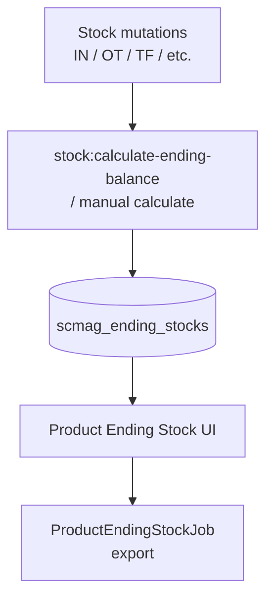

# Product Ending Stock — Requirement Documentation

> **DRAFT** — Dokumen ini adalah draft awal hasil analisis codebase otomatis per 2026-06-19. Perlu direview PM/QA sebelum final.

## 0. Metadata & Changelog

| Version | Date | Author | Changes |
|---------|------|--------|---------|
| 1.0 | 2026-06-19 | QA - Yemima | Initial draft (AS-IS) |

## 1. Ringkasan Eksekutif

Read-only report dari `ItemStockProductEndingStock` (`scmag_ending_stocks`). Menghitung kolom turunan on hand, reserved, ATS via helper internal controller. Export async via `ProductEndingStockJob`.

## 2. Acceptance Criteria (AS-IS)

| ID | Kriteria | Validasi | Fitur |
|----|----------|----------|-------|
| A-01 | Tab By Warehouse load datalist | `GET product-ending-stock` | Warehouse view |
| A-02 | Tab By SKU load datalist | `GET product-ending-stock-by-sku` | SKU view |
| A-03 | Hanya stok > 0 | `where stock > 0` | Filter default |
| A-04 | Exclude In Transit warehouse | `whereHas warehouse name != In Transit` | Business rule |
| A-05 | Optional exclude Voided Order WH | `RenderTransactionLimit.include_virtual_wh_void` | Company setting |
| A-06 | Export Excel async | `export-file`, `export-progress` | Export |
| A-07 | Manual recalculate link | FE calls `real-stock/manual-calculate` | Recalc |

## 3. Validasi & Rules

| ID | Rule | Trigger | Pesan |
|----|------|---------|-------|
| V-01 | `viewAny` ItemStockProductEndingStock | Semua index | 403 jika tidak berhak |
| V-02 | Export type `by_sku` / `by_warehouse` | Query param `type` | Menentukan export shape |

## 4. Fitur & Behavior

| ID | Fitur | Trigger | Expected |
|----|-------|---------|----------|
| F-01 | Warehouse group breadcrumb | `warehouse_group_formatted` column | Parent chain dengan separator |
| F-02 | Unit conversion display | `product.productUnit`, `baseUnit` | Qty dalam primary unit |
| F-03 | Latest calculation timestamp | `CalculateTodoDate` status 0 | Ditampilkan di UI |
| F-04 | SO-based stock columns | `SOBasedStock` entities | Outstanding SO metrics |
| F-05 | Export batch job | `ProductEndingStockJob` | File Excel di storage |

## 5. Diagram Alur Data

## 6. QA Test Notes

- Bandingkan angka By SKU vs Real Time Stock untuk SKU yang sama
- Uji export kedua tab + cek progress endpoint
- Uji company dengan `include_virtual_wh_void = 0` → Voided Order tidak tampil

## Related Documents

| Doc | Path |
|-----|------|
| Knowledge Base | [knowledge-base.md](./knowledge-base.md) |
| Technical | [technical.md](./technical.md) |
