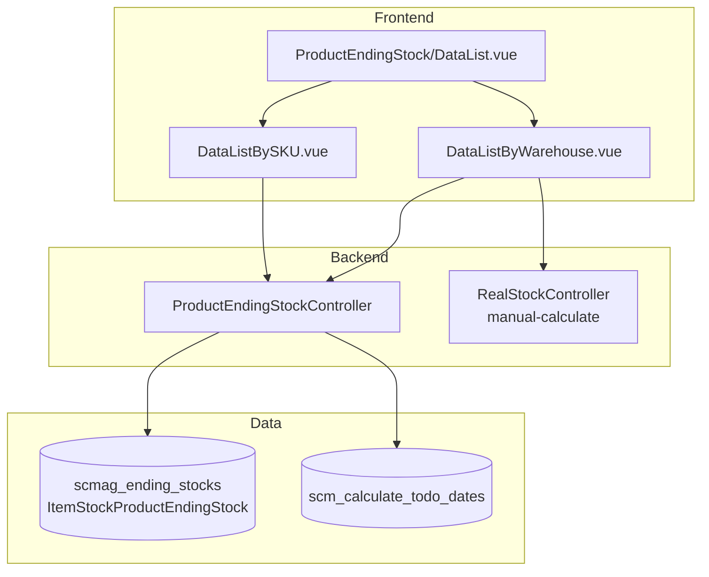

# Product Ending Stock — Technical Documentation

> **DRAFT** — Dokumen ini adalah draft awal hasil analisis codebase otomatis per 2026-06-19. Perlu direview PM/QA sebelum final.

**UI route:** `/supplychain/product-ending-stock`

---

## 1. Architecture Overview

---

## 2. Frontend File Map

| File | Role | Key API |
|------|------|---------|
| `Report/ProductEndingStock/DataList.vue` | Tab container | — |
| `DataListByWarehouse.vue` | Tab By Warehouse | `GET supplychain/product-ending-stock` |
| `DataListBySKU.vue` | Tab By SKU | `GET supplychain/product-ending-stock-by-sku` |

---

## 3. Backend File Map

| File | Role |
|------|------|
| `ProductEndingStockController.php` | index, indexBySKU, export |
| `ItemStockProductEndingStock.php` | Entity extends EndingStock |
| `ItemStockProductEndingStockPolicy.php` | Policy |
| `ProductEndingStockJob.php` | Export job |
| `ProductEndingStockExportFile.php` | Export tracking |
| `StoreSOBasedStockJob.php` | SO-based stock refresh |

---

## 4. API Routes

| Method | Path | Nama |
|--------|------|------|
| GET | `supplychain/product-ending-stock` | index (by warehouse) |
| GET | `supplychain/product-ending-stock-by-sku` | indexBySKU |
| GET | `supplychain/product-ending-stock/export-excel` | exportAllExcel |
| GET | `supplychain/product-ending-stock/export-file` | exportFile |
| GET | `supplychain/product-ending-stock/export-progress` | exportProgress |

Manual calculate (dipanggil FE By Warehouse): `GET supplychain/real-stock/manual-calculate`

---

## 5. Database Schema

| Tabel | Role |
|-------|------|
| `scmag_ending_stocks` | Ending stock per product+warehouse |
| `scm_calculate_todo_dates` | Jadwal/status kalkulasi |
| `scm_s_o_based_stocks` | Outstanding SO stock |
| `scm_product_ending_stock_export_files` | Export metadata |
| `scm_product_ending_stock_data_temps` | Temp export rows |

---

## 6. Jobs

| Job | Fungsi |
|-----|--------|
| `ProductEndingStockJob` | Chunk export Excel |
| `StoreSOBasedStockJob` | Update SO-based columns |
| `StoreAvailableToSellStockJob` | ATS recalculation |

---

## 7. Related docs

- [supplychain-real-stock/technical.md](../supplychain-real-stock/technical.md)
- [supplychain-product-mutation/technical.md](../supplychain-product-mutation/technical.md)
