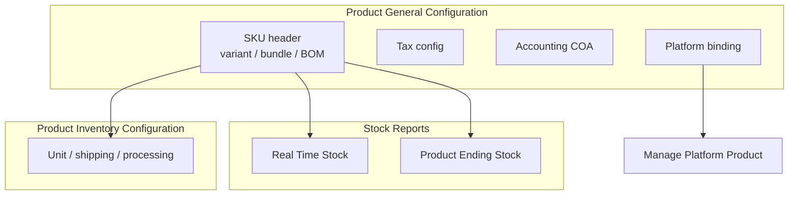

# Product General Configuration — Requirement Documentation

> **DRAFT** — Dokumen ini adalah draft awal hasil analisis codebase otomatis per 2026-06-19. Perlu direview PM/QA sebelum final.

## 0. Metadata & Changelog

| Version | Date | Author | Changes |
|---------|------|--------|---------|
| 1.0 | 2026-06-19 | QA - Yemima | Initial draft (AS-IS dari codebase) |

## 1. Ringkasan Eksekutif

Product General Configuration adalah **view master produk** dengan `typeProduct = general`. Backend memakai `ProductGeneralConfigurationController` (extends `ProductController`) dan entity `ProductGeneralConfiguration`. Form Vue menampilkan `FormProductComponent` dengan `showGeneral=true`, `showInventory=false`.

## 2. Acceptance Criteria (AS-IS)

| ID | Kriteria | Validasi | Fitur |
|----|----------|----------|-------|
| A-01 | Datalist menampilkan produk aktif per company | `GET product-general-configuration` + policy `viewAny` | Index |
| A-02 | Create produk dengan field wajib | FormRequest inline di `ProductController@store` | Create |
| A-03 | SKU unik per company | Custom rule + `withTrashed` check | Create/Update |
| A-04 | Edit produk existing | `PUT product-general-configuration/{id}` | Update |
| A-05 | Platform binding icon di datalist | `authorize update PlatformProduct` | Binding |
| A-06 | Variant, BOM, tax, accounting sub-resource | Route prefix `product-general-configuration/*` | Sub-panels |
| A-07 | Import/export Excel | Route `import`, `export-excel`, progress endpoints | Bulk |
| A-08 | Archive / show archived toggle | Query `show_archived` | Datalist filter |

## 3. Validasi & Rules

| ID | Rule | Trigger | Pesan error |
|----|------|---------|-------------|
| V-01 | `sku` required, max 50, unique | Create | `The sku has already been taken.` |
| V-02 | `name` required, max 150 | Create/Update | Laravel default |
| V-03 | `category_id` required, exists | Create/Update | `Category not found` |
| V-04 | `stock_unit_id` required | Create/Update | `The primary unit field is required.` |
| V-05 | `conversion_rate` required, numeric, gt:0 | Create | `Conversion rate must be 1!` (base unit) |
| V-06 | `product_coa_group_id` required, active | Create/Update | COA group validation error |
| V-07 | `condition` in NEW/SECOND | Create/Update | Laravel Rule::in |
| V-08 | SKU tidak boleh mengandung `random` | Create/Update | Error custom string |
| V-09 | Primary unit immutable jika ada transaksi | Update | `Primary unit cannot be updated because product has relation to transaction` |
| V-10 | Product COA group fix asset immutable jika ada transaksi PR/PO/Inbound | Update | `Cannot change product coa group...` |
| V-11 | Alternative unit distinct | Create/Update | `Alternative Unit duplicate value.` |
| V-12 | Inactive hanya jika stok 0 | `updateStatusProduct` | Error dari business logic |

## 4. Fitur & Behavior

| ID | Fitur | Trigger | Expected result |
|----|-------|---------|-----------------|
| F-01 | Datalist kolom stok | Index query + relasi `globalAtsStock` | Availability, On Hand, ATS ditampilkan |
| F-02 | Search SKU prioritas exact match | `orderByRaw` CASE pada sku/code/name | Exact match di atas |
| F-03 | Variant auto-generate child SKU | `POST .../variant` | Child SKU dibuat |
| F-04 | BOM header/detail CRUD | `bill-of-material-*` routes | BOM tersimpan |
| F-05 | Activate/deactivate bundle | `activate-bundle` / `deactivate-bundle` | Flag bundle berubah |
| F-06 | Tax config CRUD | `tax-config` routes via `ProductGeneralTaxController` | Mapping pajak produk |
| F-07 | Accounting COA mapping | `ProductGeneralAccountingController` | COA income/expense/asset |
| F-08 | Duplicate product | `POST .../duplicate` | Clone produk |
| F-09 | Auto-bind platform | `POST .../auto-bind` | Job binding OmniChannel |
| F-10 | Bulk delete | FE `bulk-delete?type=general` | Hapus massal sesuai policy |

## 5. Permission & Dependencies

- Policy: `ProductGeneralConfigurationPolicy` (extends `MainPolicy`)
- Sub-resource policies: variant, specification, BOM, platform binding
- Dependencies master: Item Category, Unit, Tagging, Brand, Product COA Group, QC Procedure, Dimension & Weight

## 6. Diagram Relasi Menu

## 7. QA Test Notes

- Uji create SKU baru + variant + BOM di company staging
- Uji edit primary unit pada produk yang sudah inbound → harus ditolak
- Uji inactive dengan stok > 0 → harus ditolak
- Uji binding icon hanya muncul di mode general (bukan inventory)
- Uji import Excel + cek progress endpoint
- Cross-check validasi Vue `FormProductComponent` vs Laravel `store`/`update`

## 8. Known Gaps / Open Questions

- Perbedaan filter datalist general vs inventory (jika ada flag produk) perlu konfirmasi PM
- Relasi lengkap dengan menu `system-product` — overlap dokumentasi disengaja

## Related Documents

| Doc | Path |
|-----|------|
| Knowledge Base | [knowledge-base.md](./knowledge-base.md) |
| Technical | [technical.md](./technical.md) |
