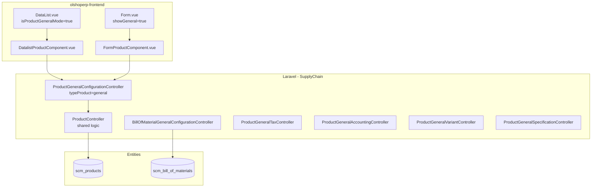

# Product General Configuration — Technical Documentation

> **DRAFT** — Dokumen ini adalah draft awal hasil analisis codebase otomatis per 2026-06-19. Perlu direview PM/QA sebelum final.

**Stack:** Laravel 13 API · Vue 3 SPA  
**Menu slug:** `supplychain-product-general-configuration`  
**UI route:** `/supplychain/product-general-configuration`  
**API base:** `{VITE_API_URL}supplychain/product-general-configuration`

---

## 1. Architecture Overview

Controller tipis: constructor merge `typeProduct => general` lalu delegasi ke `ProductController`.

---

## 2. Frontend File Map

**Root:** `olshoperp-frontend/src/pages/SCM/master/ProductGeneralConfiguration/`

| File | Role | Key API |
|------|------|---------|
| `DataList.vue` | Wrapper datalist | — |
| `Form.vue` | Wrapper form create/edit | — |
| `../Product/components/DatalistProductComponent.vue` | Datalist shared | `GET supplychain/product-general-configuration` |
| `../Product/components/FormProductComponent.vue` | Form shared (general sections) | `POST/PUT supplychain/product-general-configuration/{id}` |

**Router:** `olshoperp-frontend/src/router/index.ts` — paths `product-general-configuration`, `create`, `edit/:id`

---

## 3. Backend File Map

| File | Role |
|------|------|
| `ProductGeneralConfigurationController.php` | Set `typeProduct=general`, extends ProductController |
| `ProductController.php` | CRUD, import/export, datalist, status |
| `ProductGeneralConfiguration.php` | Entity extends `Product` |
| `ProductGeneralConfigurationPolicy.php` | Authorization |
| `BillOfMaterialGeneralConfigurationController.php` | BOM under general prefix |
| `ProductGeneralTaxController.php` | Tax config |
| `ProductGeneralAccountingController.php` | COA mapping |
| `ProductGeneralVariantController.php` | Variant store |
| `ProductGeneralSpecificationController.php` | Specification CRUD |
| `ProductGeneralShippingInformationController.php` | Shipping (route exists; hidden di FE general mode) |
| `ProductGeneralProcessingConfigurationController.php` | Processing routes |

---

## 4. API Routes (utama)

| Method | Path | Handler |
|--------|------|---------|
| GET/POST | `supplychain/product-general-configuration` | index, store |
| GET/PUT/DELETE | `supplychain/product-general-configuration/{product}` | show, update, destroy |
| GET | `.../role-privilege` | getRolePrivilege |
| GET | `.../select2-*` | Master data select2 |
| POST | `.../{product}/variant` | Variant store |
| POST/GET | `.../{product}/specification/*` | Specification |
| GET/POST | `.../bill-of-material-*` | BOM CRUD |
| GET/POST/PUT | `.../tax-config*` | Tax |
| GET/POST | `.../{product}/accounting` | Accounting |
| POST | `.../{product}/binding` | Platform binding |
| POST | `.../import` | Excel import |
| GET | `.../export-excel` | Excel export |

Full list: `Modules/SupplyChain/Routes/api.php` blok `product-general-configuration`.

---

## 5. Database Schema

| Tabel | Keterangan |
|-------|------------|
| `scm_products` | Master produk (shared semua menu product) |
| `scm_product_trees` | Parent-child variant |
| `scm_bill_of_materials` | BOM header/detail |
| `scm_product_images` | Gambar produk |
| `scm_product_alternative_units` | Alternate unit |
| `omni_product_binding_pivots` | Platform binding |

---

## 6. Jobs / Observers / Events

| Komponen | Fungsi |
|----------|--------|
| `ProductExportExcelJob` | Export async |
| `ProductImport` (Excel) | Import batch |
| `CanAutoBind` trait | Auto-bind platform product |
| `CanPushStock` trait | Push stok ke platform |

---

## 7. Related docs

- [system-product/technical.md](../system-product/technical.md) — logic produk lengkap
- [bill-of-material/technical.md](../bill-of-material/technical.md) — BOM detail
- Mermaid style: [MERMAID_STYLE_GUIDE.md](../_meta/MERMAID_STYLE_GUIDE.md)
