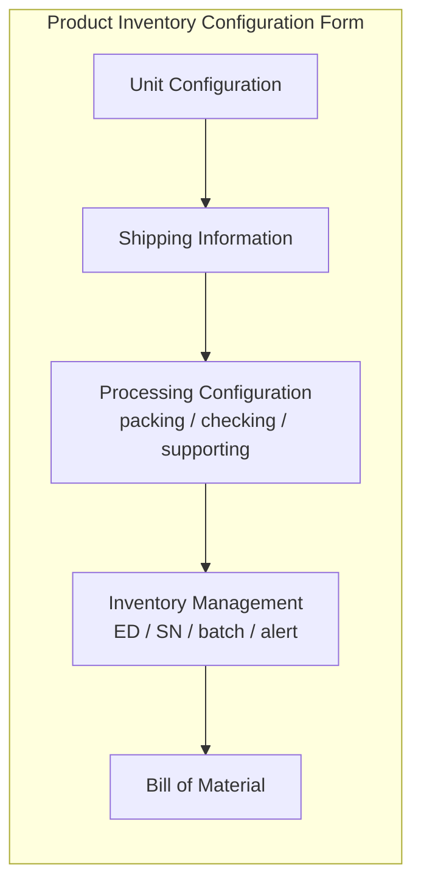

# Product Inventory Configuration — Requirement Documentation

> **DRAFT** — Dokumen ini adalah draft awal hasil analisis codebase otomatis per 2026-06-19. Perlu direview PM/QA sebelum final.

## 0. Metadata & Changelog

| Version | Date | Author | Changes |
|---------|------|--------|---------|
| 1.0 | 2026-06-19 | QA - Yemima | Initial draft (AS-IS dari codebase) |

## 1. Ringkasan Eksekutif

Product Inventory Configuration memakai `ProductInventoryConfigurationController` dengan `typeProduct = inventory`. Form Vue: `showInventory=true`, `showGeneral=false`. Menambahkan sub-resource **inventory management**, **processing configuration** (packing/checking/supporting), dan **shipping information** yang tidak ditampilkan di General menu.

## 2. Acceptance Criteria (AS-IS)

| ID | Kriteria | Validasi | Fitur |
|----|----------|----------|-------|
| A-01 | Datalist produk per company | Policy `ProductInventoryConfigurationPolicy` | Index |
| A-02 | CRUD header produk | Same validation as ProductController | Create/Update |
| A-03 | Shipping information save | `ProductInventoryShippingInformationController` | Shipping panel |
| A-04 | Packing/checking/supporting CRUD | `ProductInventoryProcessingConfigurationController` | Processing |
| A-05 | Inventory management toggle | `ProductInventoryDetailController` GET/PUT | ED/SN/batch/alert |
| A-06 | BOM under inventory prefix | `BillOfMaterialInventoryConfigurationController` | BOM |
| A-07 | Import/export Excel | Same pattern as general | Bulk |
| A-08 | No platform bind icon in datalist | `showBindIcon = false` when inventory mode | UI |

## 3. Validasi & Rules

Validasi header produk **sama** dengan Product General Configuration (`ProductController@store` / `@update`). Tambahan:

| ID | Rule | Trigger | Pesan error |
|----|------|---------|-------------|
| V-01 | Inventory management fields | `inventoryManagementUpdate` | Sesuai FormRequest controller |
| V-02 | Processing activity required fields | store/update packing/checking | Controller validation |
| V-03 | Primary unit lock on transaction | Update header | Same as general |
| V-04 | Bulk delete type=inventory | `bulk-delete?type=inventory` | Policy check |

## 4. Fitur & Behavior

| ID | Fitur | Trigger | Expected result |
|----|-------|---------|-----------------|
| F-01 | Unit Configuration panel | `showInventory` sections in FormProductComponent | Primary + alternate unit |
| F-02 | Shipping Information | `POST/GET .../shipping-information` | Dimensi, berat, warranty |
| F-03 | Packing standardization | `.../packing-standarization/*` | CRUD packing activity |
| F-04 | Checking standardization | `.../checking-standarization/*` | CRUD checking activity |
| F-05 | Supporting packing | `.../supporting-packing/*` | Produk pendukung |
| F-06 | Inventory management | `GET/PUT .../inventory-management` | ED, SN, batch, min stock |
| F-07 | Product detail/images | `POST .../detail`, image destroy | Media produk |
| F-08 | BOM inventory routes | `bill-of-material-*` under inventory prefix | Same BOM logic |
| F-09 | Processing configuration data | `GET .../processing-configuration-data` | Aggregated config |

## 5. Permission & Dependencies

- Policy: `ProductInventoryConfigurationPolicy`
- Master dependencies: Unit, Dimension & Weight, QC Procedure, Warehouse (stock alert)
- Processing mengikuti template QC Procedure dan warehouse layout

## 6. Diagram — Panel Form (AS-IS)

## 7. QA Test Notes

- Verifikasi panel Accounting **tidak** tampil di inventory mode
- Verifikasi binding icon **tidak** tampil di datalist inventory
- Uji toggle expired date → inbound wajib isi ED
- Uji packing + checking SOP tersimpan dan muncul di proses Omni picking/packing
- Cross-check API prefix: semua call harus ke `product-inventory-configuration`, bukan general

## 8. Known Gaps / Open Questions

- Apakah ada rencana merge kembali ke single System Product menu?
- Validasi inventory management detail perlu diekstrak ke FormRequest terpisah (saat ini di controller)

## Related Documents

| Doc | Path |
|-----|------|
| Knowledge Base | [knowledge-base.md](./knowledge-base.md) |
| Technical | [technical.md](./technical.md) |
