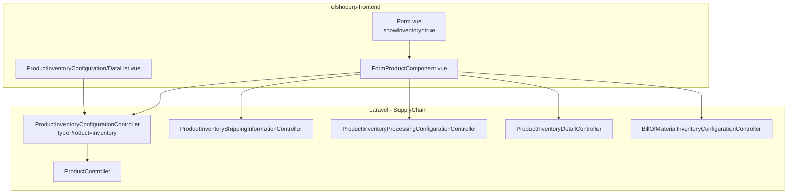

# Product Inventory Configuration — Technical Documentation

> **DRAFT** — Dokumen ini adalah draft awal hasil analisis codebase otomatis per 2026-06-19. Perlu direview PM/QA sebelum final.

**Menu slug:** `supplychain-product-inventory-configuration`  
**UI route:** `/supplychain/product-inventory-configuration`  
**API base:** `{VITE_API_URL}supplychain/product-inventory-configuration`

---

## 1. Architecture Overview

---

## 2. Frontend File Map

| File | Role | Key API |
|------|------|---------|
| `ProductInventoryConfiguration/DataList.vue` | Datalist wrapper | `GET supplychain/product-inventory-configuration` |
| `ProductInventoryConfiguration/Form.vue` | Form wrapper | `POST/PUT .../{id}` |
| `Product/components/DatalistProductComponent.vue` | Shared datalist (`isProductInventoryMode`) | Same index |
| `Product/components/FormProductComponent.vue` | Shared form (inventory sections) | Sub-resource routes |

---

## 3. Backend File Map

| File | Role |
|------|------|
| `ProductInventoryConfigurationController.php` | `typeProduct=inventory` |
| `ProductInventoryConfiguration.php` | Entity extends Product |
| `ProductInventoryConfigurationPolicy.php` | Policy |
| `ProductInventoryShippingInformationController.php` | Shipping CRUD |
| `ProductInventoryProcessingConfigurationController.php` | Packing/checking/supporting |
| `ProductInventoryDetailController.php` | Detail, images, inventory management |
| `BillOfMaterialInventoryConfigurationController.php` | BOM |
| `ProductInventoryTaxController.php` | Tax (route exists) |
| `ProductInventoryAccountingController.php` | Accounting routes (FE hidden) |

---

## 4. API Routes (inventory-specific)

| Method | Path | Handler |
|--------|------|---------|
| GET/POST | `supplychain/product-inventory-configuration` | index, store |
| GET/PUT/DELETE | `.../{product}` | show, update, destroy |
| POST/GET | `.../{product}/shipping-information` | Shipping |
| GET/POST/PUT/DELETE | `.../packing-standarization/*` | Packing |
| GET/POST/PUT/DELETE | `.../checking-standarization/*` | Checking |
| GET/POST/PUT/DELETE | `.../supporting-packing/*` | Supporting |
| GET/PUT | `.../{product}/inventory-management` | Inventory flags |
| POST | `.../{product}/detail` | Product detail/media |
| GET/POST | `.../bill-of-material-*` | BOM |
| POST | `.../import` | Import Excel |
| GET | `.../export-excel` | Export |

Route group: `Modules/SupplyChain/Routes/api.php` lines ~1517–1649.

---

## 5. Database Schema

Shared dengan produk umum (`scm_products`) plus:

| Tabel | Keterangan |
|-------|------------|
| `scm_product_shipping_informations` | Dimensi/berat |
| `scm_packing_activities` | Packing SOP |
| `scm_checking_activities` | Checking SOP |
| `scm_supporting_packings` | Material pendukung |
| `scm_product_stock_alerts` | Min stock alert |

---

## 6. Jobs / Events

| Komponen | Fungsi |
|----------|--------|
| `ProductExportExcelJob` | Export |
| Product import classes | `ProductImport`, `UpdateProductImport` |
| `CanPushStock` | Sync stok platform setelah perubahan |

---

## 7. Related docs

- [supplychain-product-general-configuration/technical.md](../supplychain-product-general-configuration/technical.md)
- [system-product/technical.md](../system-product/technical.md)
