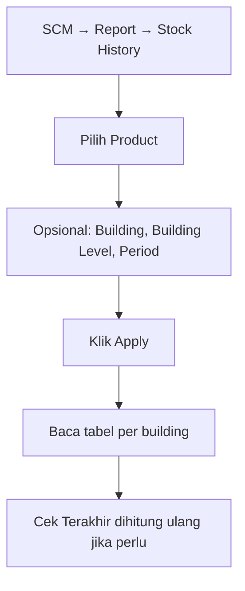

# Stock History — Knowledge Base

**Audience:** Tim Supply Chain & Warehouse  
**Menu:** SCM → Report → Stock History  
**Route:** `/supplychain/product-mutation-stock`

---

## 1. Apa itu Stock History?

Stock History menampilkan **riwayat masuk–keluar barang per produk**, dikelompokkan per gudang/building, lengkap dengan **saldo stock berjalan** (seperti mutasi rekening).

Hanya transaksi yang sudah **disetujui (approved)** yang muncul. Barang bertipe jasa (Service) tidak masuk laporan ini.

Berbeda dari Product Mutation History: laporan itu saldo **global**; Stock History fokus **per lokasi gudang**.

---

## 2. Kapan dipakai?

| ✅ Pakai jika | ❌ Bukan untuk |
|---------------|----------------|
| Cek pergerakan & saldo per building/rack | Mengedit transaksi stock |
| Melacak transfer antar gedung yang masih dalam pengiriman | Melihat saldo tanpa pilih produk |
| Audit kode transaksi ke dokumen asal | Mengganti angka saldo manual di report |

---

## 3. Alur kerja standar

Pilih produk dulu, atur filter opsional, lalu Apply agar tabel terisi.

**Keterangan langkah:**

- **Product:** wajib untuk hasil bermakna. Pilih dari daftar produk aktif yang bisa ditransaksikan.
- **Building:** kosong = semua building. Memilih building mempersempit lokasi.
- **Building Level:** tentukan detail struktur (mis. rack di bawah building).
- **Select Period:** batasi rentang tanggal transaksi.
- **Apply** (atau tekan Enter): baru memuat tabel. Tanpa Apply, tabel tidak tampil.
- **Terakhir dihitung ulang / Status:** lihat §5 — penting saat transaksi tanggal mundur.

---

## 4. Membaca kolom tabel

| Kolom | Artinya |
|-------|---------|
| **Date** | Tanggal/waktu transaksi |
| **Trx. Code** | Nomor dokumen — klik untuk buka menu asal; ada ikon salin |
| **Description** | Keterangan dokumen (biasanya disembunyikan; bisa ditampilkan lewat Column Show/Hide) |
| **Building** | Nama lokasi gudang |
| **Receiving Process** | Barang **masih dalam pengiriman** antar gudang (belum diterima tujuan). Belum masuk saldo |
| **Product In** | Qty masuk (inbound, penambahan, transfer masuk, dll.). Kosong jika 0 |
| **Product Out** | Qty keluar (outbound, pengurangan, transfer keluar, dll.). Kosong jika 0 |
| **Ending Balance** | Saldo stock setelah baris ini. **Tidak** termasuk qty di Receiving Process |

Tabel dikelompokkan per building supaya pergerakan per lokasi terbaca terpisah. Di atas tabel ada info **SKU || nama produk** yang sedang difilter.

**Export:** tersedia opsi with details / without details (file diproses di tab export).

---

## 5. Saldo berjalan & “Terakhir dihitung ulang”

Saldo setiap baris = saldo baris sebelumnya ditambah masuk dikurangi keluar, diurutkan menurut tanggal.

Kadang transaksi dengan **tanggal mundur** sudah terlihat di baris, tapi saldo belum ikut berubah. Itu karena sistem perlu **menghitung ulang** dari tanggal tersebut. Perhitungan ulang biasanya jalan **otomatis tiap jam**, atau bisa dipicu dari menu Product Mutation History (tombol Calculate).

| Label di layar | Arti awam |
|----------------|-----------|
| **Latest Calculation** (Terakhir dihitung ulang) | Waktu terakhir sistem **selesai** menghitung ulang saldo — **bukan** waktu Anda input transaksi |
| **Status: Up to date** | Tidak ada hitung ulang yang sedang berjalan untuk konteks yang ditampilkan |
| **Status: Calculating..** | Sistem sedang menghitung ulang — angka bisa berubah jika Anda refresh |

**Belum tersedia di layar (rencana perbaikan):** waktu “terakhir sistem cek”, perkiraan cek berikutnya, dan peringatan jika saldo stuck terlalu lama. Jika saldo sudah lama tidak berubah padahal ada transaksi baru yang seharusnya memengaruhi, laporkan ke tim Dev beserta screenshot waktu Latest Calculation.

---

## 6. Transfer antar gedung (Receiving Process)

Transfer antar lokasi berbeda lewat **dua kali persetujuan**:

1. Gudang pengirim setuju → qty tujuan muncul di **Receiving Process** (masih pengiriman).
2. Gudang penerima setuju → qty pindah ke **Product In**, baru ikut **Ending Balance**.

Jika qty masih di Receiving Process, cek dulu status approval di menu Transfer External — biasanya menunggu gudang tujuan.

---

## 7. Troubleshooting

| Gejala | Penyebab umum | Solusi |
|--------|---------------|--------|
| Tabel kosong setelah Apply | Product belum dipilih, salah product, atau belum ada transaksi approved | Pilih Product yang benar; pastikan ada mutasi approved |
| Transaksi ada, saldo belum berubah | Hitung ulang belum jalan (sering setelah tanggal mundur) | Tunggu jadwal per jam atau minta Calculate di Product Mutation History; refresh |
| Qty transfer tidak di Product In | Masih menunggu approval gudang penerima | Selesaikan approval di Transfer External |
| Status Calculating.. lama | Job masih berjalan atau tertunda | Refresh; jika terlalu lama, laporkan Dev |
| Tidak bisa buka menu | Hak akses report | Minta privilege Stock History ke admin |

---

## 8. FAQ

**Q: Beda Stock History dengan Product Mutation History?**  
A: Stock History = per gudang/building. Product Mutation History = saldo gabungan tanpa filter gudang.

**Q: Kenapa Latest Calculation beda dengan jam saya input?**  
A: Itu jam selesai hitung ulang sistem, bukan jam transaksi Anda.

**Q: Product In kosong tapi Receiving Process terisi?**  
A: Barang masih dalam pengiriman antar gudang — belum diterima tujuan.

**Q: Bisa edit angka di report?**  
A: Tidak. Perbaiki lewat dokumen transaksi asal, lalu approve ulang sesuai prosedur.

---

## Related Documents

| Doc | Path |
|-----|------|
| Requirement (aturan & gap) | [requirement.md](./requirement.md) |
| Technical | [technical.md](./technical.md) |
| Product Mutation History | [../supplychain-product-mutation/](../supplychain-product-mutation/) |
