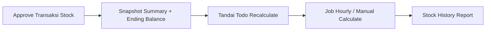
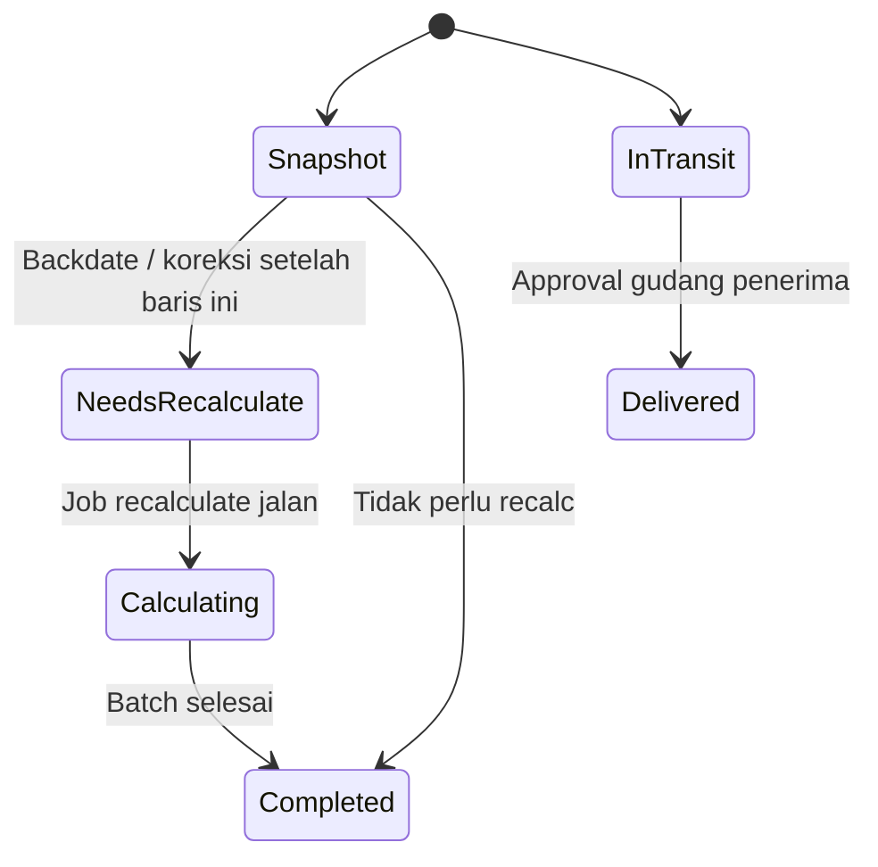
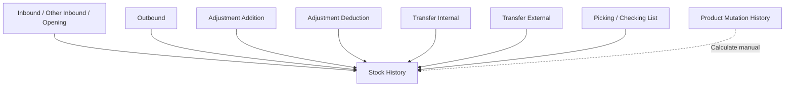

# Stock History — Requirement Documentation

**Modul:** Supply Chain Management / Report  
**Prefix gap:** `SH-`  
**Audience:** PM, QA, Warehouse  
**UI route:** `/supplychain/product-mutation-stock` (alias `/supplychain/stock-history`)  
**SoT:** `supplychain-stock-history-source-of-truth.md` v2.0 (17 Jul 2026)

---

## 0. Metadata & Changelog

| Version | Date | Author | Changes |
|---------|------|--------|---------|
| 1.0 | 2026-06-19 | QA - Yemima | Draft awal analisis otomatis |
| 2.0 | 2026-07-17 | QA - Yemima | Rewrite dari SoT v2.0 + AS-IS codebase: filter, datalist, formula, TF external, job hourly, gap SH-01..05 |

---

## 1. Ringkasan Eksekutif

Stock History adalah report **read-only** yang mencatat pergerakan stock (in/out) per product, dikelompokkan per building/warehouse, dengan ending balance berjalan seperti saldo rekening. Data masuk hanya setelah dokumen stock mutation di-approve.

Ending balance dihitung dua fase: **snapshot** saat approve, lalu **recalculate async** jika ada backdate/koreksi. Recalculate dijadwalkan **hourly** (`stock:calculate-ending-balance`, timezone Asia/Jakarta) dan juga bisa dipicu manual dari Product Mutation History.

| Kebutuhan bisnis | Jawaban Stock History |
|------------------|------------------------|
| Saldo per lokasi | Ending balance per warehouse / building level |
| Transparansi in-transit | Kolom Receiving Process (belum masuk ending balance) |
| Audit jejak transaksi | Trx. Code link ke menu asal (IN/OT/AI/AO/TF/PL/CL) |
| Koreksi backdate | Todo recalculate dari tanggal terdampak |

### 1.1 Rantai proses



---

## 2. Prasyarat

| Prasyarat | Sumber | Catatan |
|-----------|--------|---------|
| Product active (leaf / bisa ditransaksikan) | Master Product | Select2: `status=1`, punya product accounting, tanpa child tree; exclude random variant. Bukan literal "single/variant" saja — leaf product termasuk variant child |
| Warehouse structure level building (= 19) | Config warehouse `building_level` | Filter **Building** |
| Warehouse space type `show_in_report=1` dan level lebih besar dari building | Master Warehouse Structure | Filter **Building Level** (contoh rack level 21). Bukan "level 20 ke bawah" |
| Minimal 1 stock mutation approved untuk product | Modul transaksi terkait | Tanpa approve, datalist kosong |

---

## 3. Siklus Status

Report tidak punya status dokumen. Yang relevan: siklus kalkulasi ending balance dan siklus Transfer External.



| Status | Kondisi | Kolom terdampak | AS-IS UI |
|--------|---------|-----------------|----------|
| Snapshot | Approve non-backdate | Ending Balance dari prev + (in − out) | Langsung tampil |
| Needs Recalculate | Transaksi tanggal lebih lama dari baris existing | Todo `status=1`, `start_date` mundur | Belum transparan ke user (GAP-SH-01) |
| Calculating | Job batch running | Ending balance sedang ditata ulang | Label **Status: Calculating..** jika product `is_calculating_ending_balance=1`; progress percent via shared calculation-progress (poll 1 detik) |
| Completed | Job selesai | **Latest Calculation** terisi waktu selesai | Label **Up to date** |
| In Transit | TF External approved pengirim, belum penerima | Receiving Process terisi; Product In/Out kosong | Tooltip kolom sudah ada |
| Delivered | Approval penerima | Qty pindah ke Product In; Ending Balance update | — |

---

## 4. Filter & Field

| Field | Wajib? | Sumber opsi | Behavior AS-IS |
|-------|--------|-------------|----------------|
| Product | Ya (bisnis) | Select2 product-mutation | Datatable bisa di-Apply tanpa product — API tetap dipanggil dengan `product_id` kosong → list kosong. **Tidak ada pesan error** (GAP-SH-03) |
| Building | Tidak | Warehouse level = building (19) | Kosong = semua; `warehouse_id=0` / null |
| Building Level | Tidak | Space type `show_in_report`, level lebih dari building | Menentukan granularity ending balance per WH |
| Select Period | Tidak | Date range | `select_periode=start,end` → `whereBetween transaction_date` |
| Apply | — | — | Wajib klik (atau Enter) untuk load datatable |

---

## 5. Datalist

### 5.1 Fitur

| Fitur | AS-IS | Catatan vs SoT |
|-------|-------|----------------|
| Global Search | Ya (DataTables) | — |
| Latest Calculation | Ya | Timestamp selesai recalc; **bukan** waktu transaksi |
| Status kalkulasi | Ya | `Calculating..` / `Up to date` |
| Info SKU | Ya | Format UI: `SKU \|\| Nama` (bukan pemisah garis) |
| Column Show/Hide | Ya | Description default hidden |
| Export | Ya — With Details / Without Details | Async export file tab; filter ikut params |
| Row grouping | Ya | Group by Building (`warehouse_formatted`) |
| Last Job Started / Next Job Started / Disclaimer | Tidak | GAP-SH-01, GAP-SH-02 |
| Tooltip makna Latest Calculation | Tidak | SoT §6.5 — belum diimplementasi |
| Tombol Calculate | Tidak di halaman ini | Ada di Product Mutation History; job yang sama mempengaruhi Latest Calculation di sini |

### 5.2 Kolom

| Kolom | Visible default | Sumber | Keterangan |
|-------|-----------------|--------|------------|
| Date | Ya | `transaction_date` | Format `d-m-Y H:i:s` |
| Trx. Code | Ya | Kode mutasi + link | Copy clipboard; mapping prefix §6.2 |
| Description | Tidak | Deskripsi dokumen | — |
| Building | Setelah Apply: **selalu visible** | Nama warehouse | SoT: conditional jika Building dipilih. AS-IS Apply rebuild kolom dengan Building selalu tampil (GAP-SH-04) |
| Receiving Process | Ya | Qty in-transit | Hanya jika in=0 dan out=0; pakai `transaction_qty_in_base_unit` |
| Product In | Ya | `base_unit_qty_in` → stock unit | Kosong jika 0 |
| Product Out | Ya | `base_unit_qty_out` → stock unit | Kosong jika 0 |
| Ending Balance | Ya | EB per warehouse/building | Exclude Receiving Process |

---

## 6. How It Works

### 6.1 Formula Ending Balance

```
ending_balance[baris] = ending_balance[baris sebelumnya] + (Product In − Product Out)
```

Urut `transaction_date` ASC lalu `id` ASC (saat store/recalc). Tampilan qty dalam stock unit product; penyimpanan dalam base unit.

### 6.2 Transfer External & Receiving Process

1. Approval pengirim → summary bisa dibuat dengan in/out = 0 (in-transit); qty asli di `transaction_qty_in_base_unit` → kolom Receiving Process di building tujuan.
2. Qty in-transit **tidak** masuk Ending Balance.
3. Approval penerima → update summary: isi Product In; Ending Balance dihitung ulang.

| Prefix | Menu tujuan link |
|--------|------------------|
| IN + supplier | Mutation Inbound |
| IN tanpa supplier | Other Inbound |
| OT | Mutation Outbound |
| AI | Adjustment Addition |
| AO | Adjustment Deduction |
| PL | Picking List |
| CL | Checking List |
| TF external | Transfer External |
| TF lainnya | Transfer Internal |

### 6.3 Kondisi khusus

| Kondisi | Perilaku |
|---------|----------|
| TF internal di level building | Ending balance per-warehouse level building tidak dibuat/recalc (net building tidak berubah) |
| Product COA type Service | Skip dari MutationSummary |
| Return (purchase/sales) | Via inbound/outbound sesuai dokumen (`is_return_process`) |
| Missing/scrap TF External | Qty in dikurangi qty missing sebelum store |
| Wave + process group Pick | Handler skip (tidak tulis summary) |
| Virtual WH in-transit dari TF External | Remap ke dokumen TF External utama |

### 6.4 Job recalculate & transparansi

| Aspek | AS-IS |
|-------|-------|
| Schedule | `stock:calculate-ending-balance` **hourly** Asia/Jakarta |
| Manual trigger | Product Mutation History → Calculate → artisan yang sama |
| Scope job | Global + per warehouse + per building (todo terpisah, paralel) |
| Chunk | 10 product per job |
| Latest Calculation | Dari todo global `status=0` `calculated_date` terakhir |
| Last / Next Job Started | **Belum ada** (GAP-SH-01) |
| Disclaimer stuck | **Belum ada** (GAP-SH-02) |

Estimasi Next Job Started (TO-BE): Last Job Started + 1 jam, atau jam bulat cron — rekomendasi SoT; belum diimplementasi.

### 6.5 UI/UX interaksi (AS-IS + TO-BE)

| Elemen | AS-IS | TO-BE (SoT) |
|--------|-------|-------------|
| Latest Calculation | Teks plain | Tooltip: waktu selesai hitung ulang, bukan waktu transaksi |
| Status | Calculating.. / Up to date | Tetap |
| Last / Next Job | — | Tooltip + estimasi |
| Disclaimer | — | Banner warning jika Next terlewat tapi saldo belum berubah |
| Copy diagnostic | — | Opsional di disclaimer |

---

## 7. Validasi

| # | Kondisi | Behavior AS-IS | Error / UI |
|---|---------|----------------|------------|
| 1 | Product kosong + Apply | Tabel tetap muncul, data kosong | Tidak ada pesan (GAP-SH-03) |
| 2 | Product Service | Tidak masuk summary | — |
| 3 | TF External in-transit | Receiving Process; EB exclude | — |
| 4 | Job recalculate running | Report tetap bisa dibuka; angka bisa berubah saat dilihat; status Calculating.. | Progress shared endpoint |
| 5 | Next Job terlewat + EB belum update | Tidak ada deteksi UI | GAP-SH-02 |
| 6 | Policy viewAny | Index butuh privilege ItemStockProductMutationStock | 403 |

---

## 8. Relasi Menu Lain



| Menu | Peran |
|------|-------|
| Inbound / Other Inbound / Opening | Product In |
| Outbound | Product Out |
| Adjustment Addition / Deduction | In / Out koreksi |
| Transfer Internal / External | In+Out; External 2× approve → Receiving Process |
| Picking / Checking List | Transfer wave Omni |
| Product Mutation History | Ending balance **global**; tombol Calculate memicu job yang sama → Latest Calculation di sini ikut |

---

## 9. Gap Registry

| ID | Deskripsi | Dampak | Status |
|----|-----------|--------|--------|
| GAP-SH-01 | Tidak ada Last Job Started / Next Job Started di Stock History | User tidak bisa perkirakan kapan EB update setelah backdate | Open |
| GAP-SH-02 | Tidak ada disclaimer jika kalkulasi stuck/delay abnormal | User tidak tahu kapan escalate ke Dev | Open |
| GAP-SH-03 | Apply tanpa Product tidak menampilkan validasi | Tabel kosong tanpa feedback | Open |
| GAP-SH-04 | SoT: kolom Building conditional; AS-IS setelah Apply selalu visible | UX beda dari requirement SoT | Open |
| GAP-SH-05 | Tooltip / banner transparansi job (SoT §6.5) belum di UI | Latest Calculation mudah disalahartikan | Open |

---

## 10. FAQ

**Q: Transaksi sudah muncul tapi Ending Balance belum berubah?**  
A: Biasanya transaksi backdate — baris masuk dari snapshot, EB menunggu job recalculate (hourly atau manual Calculate di Product Mutation History).

**Q: Qty transfer di Receiving Process, bukan Product In?**  
A: Transfer External belum di-approve gudang penerima.

**Q: Latest Calculation vs waktu input transaksi?**  
A: Latest Calculation = waktu job selesai menghitung ulang EB, bukan waktu transaksi dibuat.

**Q: Sudah lama EB belum update?**  
A: Cek Status Calculating; jika Up to date tapi saldo salah — escalate Dev (setelah GAP-SH-02, akan ada disclaimer).

**Q: Kolom Building selalu muncul?**  
A: Saat ini setelah Apply selalu tampil (lihat GAP-SH-04).

---

## 11. Implementation Matrix (SoT vs Codebase)

| Item SoT / kebutuhan | Status kode |
|----------------------|-------------|
| Filter Product / Building / Level / Period | Implemented |
| Kolom Date, Trx, Desc, Receiving, In, Out, EB | Implemented |
| Formula ending balance | Implemented |
| TF External Receiving Process | Implemented |
| Schedule hourly recalculate | Implemented (`Kernel` hourly) |
| Latest Calculation + Status | Implemented |
| Info SKU di datatable | Implemented (`SKU \|\| name`) |
| Export with/without detail | Implemented |
| Last / Next Job Started | **Not implemented** |
| Disclaimer stuck | **Not implemented** |
| Tooltip job (SoT §6.5) | **Not implemented** |
| Validasi Product wajib di Apply | **Not implemented** |
| Building column conditional | **Partial / beda AS-IS** (GAP-SH-04) |
| Calculate di halaman Stock History | **Not on this page** (shared via PMH) |
