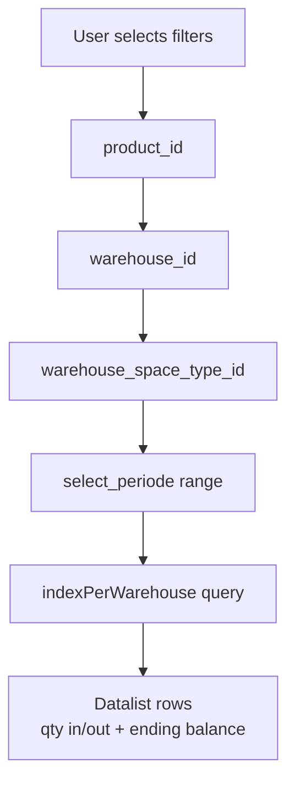

# Stock History — Requirement Documentation

> **DRAFT** — Dokumen ini adalah draft awal hasil analisis codebase otomatis per 2026-06-19. Perlu direview PM/QA sebelum final.

## 0. Metadata & Changelog

| Version | Date | Author | Changes |
|---------|------|--------|---------|
| 1.0 | 2026-06-19 | QA - Yemima | Initial draft (AS-IS) |

## 1. Ringkasan Eksekutif

`ProductMutationController@indexPerWarehouse` query `ItemStockProductMutationStock` dengan join `EndingBalancePerWarehouse`, `EndingBalancePerBuilding`, dan `Warehouse`. Filter warehouse menggunakan child IDs dari `WarehouseTree`.

## 2. Acceptance Criteria (AS-IS)

| ID | Kriteria | Validasi | Fitur |
|----|----------|----------|-------|
| A-01 | Require `product_id` | where product_id | Index |
| A-02 | Filter `warehouse_id` (0 = all) | Child warehouse IDs | Scope |
| A-03 | Filter `warehouse_space_type_id` | Level match logic | Level column |
| A-04 | Filter `select_periode` date range | whereBetween transaction_date | Period |
| A-05 | Ending balance per warehouse column | `ending_balance` from EB per WH | Balance |
| A-06 | Export Excel | `mutationSummaryPerWarehouseExportFile` | Export job |
| A-07 | Shared select2 endpoints | `product-mutation/select2-*` | Filters |
| A-08 | Manual calculate | Same as product-mutation | Recalc |

## 3. Validasi & Rules

| ID | Rule | Trigger | Pesan |
|----|------|---------|-------|
| V-01 | Policy `ItemStockProductMutationStock` viewAny | indexPerWarehouse | 403 |
| V-02 | Warehouse_id=0 skips child filter | Request param | All warehouses |

## 4. Fitur & Behavior

| ID | Fitur | Trigger | Expected |
|----|-------|---------|----------|
| F-01 | Warehouse name/code columns | Join warehouse | Display |
| F-02 | Unit conversion | `baseToPrimary` helper | Qty in primary unit |
| F-03 | Export temp + job | `MutationSummaryPerWhTempJob`, `MutationSummaryPerWhExportJob` | Async Excel |
| F-04 | Duplicate mutation filter (commented) | Code has optional dedup | AS-IS disabled |

## 5. Diagram Filter Flow

## 6. QA Test Notes

- Same product: compare global mutation history vs stock history per warehouse — sum harus konsisten
- Uji warehouse_id=0 vs specific warehouse
- Uji export dengan filter aktif

## Related Documents

| Doc | Path |
|-----|------|
| Knowledge Base | [knowledge-base.md](./knowledge-base.md) |
| Technical | [technical.md](./technical.md) |
