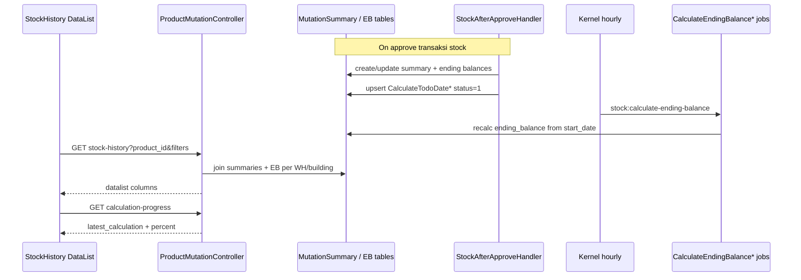

# Stock History — Technical Documentation

**API prefix:** `supplychain/stock-history` (V2 aktif), legacy `product-mutation-stock`  
**Module:** `Modules/SupplyChain`  
**Behavior:** [requirement.md](./requirement.md) v2.0

---

## 1. File Map

### Backend

| Layer | Path |
|-------|------|
| Routes | `Modules/SupplyChain/Routes/api.php` |
| Controller | `Modules/SupplyChain/Http/Controllers/ProductMutationController.php` (`indexStockHistory`, `indexPerWarehouse`, export, calculation*) |
| Entity report | `Modules/SupplyChain/Entities/ItemStockProductMutationStock.php` (extends MutationSummary) |
| Policy | `Modules/SupplyChain/Policies/ItemStockProductMutationStockPolicy.php` |
| Snapshot handler | `app/Helpers/SupplyChain/StockAfterApproveHandler.php` |
| Prev balance | `app/Helpers/SupplyChain/StockEndingBalanceHelper.php` |
| Approve callers | `app/Helpers/SupplyChain/ItemStockMutation.php`; inbound/TF jobs & services |
| Command | `app/Console/Commands/CalculateStockEndingBalance.php` (`stock:calculate-ending-balance`) |
| Schedule | `app/Console/Kernel.php` → hourly Asia/Jakarta |
| Jobs | `CalculateEndingBalance`, `CalculateEndingBalancePerWarehouse`, `CalculateEndingBalancePerBuilding` |
| Export jobs | `MutationSummaryPerWhTempJob`, `MutationSummaryPerWhExportJob` |
| Config | `config/warehouse.php` (`building_level` = 19) |

### Frontend

| Layer | Path |
|-------|------|
| Route menu | `olshoperp-frontend/src/router/index.ts` — `product-mutation-stock` **dan** `stock-history` → `StockHistory/DataList.vue` |
| UI aktif | `src/pages/SCM/Report/StockHistory/DataList.vue` (title V2; API `stock-history`) |
| UI legacy | `src/pages/SCM/Report/ProductMutationStock/DataList.vue` (API `product-mutation-stock`; route menu sudah dialihkan) |
| Export options | `src/utils/exports.ts` → `EXPORT_OPTIONS_ALL_ACTIVE_PAGE` |
| Info SKU | `DataTablesV3.vue` prop `selectedProduct` → `SKU \|\| label` |

---

## 2. API Routes

| Method | Path | Handler |
|--------|------|---------|
| GET | `supplychain/stock-history` | `indexStockHistory` (**V2 datalist**) |
| GET | `supplychain/product-mutation-stock` | `indexPerWarehouse` (legacy) |
| GET | `supplychain/product-mutation-stock/export-excel` | export |
| GET | `…/product-mutation-stock-export-file` | list export files |
| GET | `…/get-export-all-progress` | export progress |
| GET | `supplychain/product-mutation/select2-product` | product + `latest_calculation` jika `calculating=true` |
| GET | `supplychain/product-mutation/select2-warehouse` | building level |
| GET | `supplychain/product-mutation/select2-level` | space types `level > building_level` |
| GET | `supplychain/product-mutation/calculation` | trigger artisan (shared) |
| GET | `supplychain/product-mutation/calculation-progress` | progress + latest_calculation |

Query datalist: `product_id`, `warehouse_id`, `warehouse_space_type_id`, `select_periode`.

---

## 3. Database — Key Tables

| Table | Role |
|-------|------|
| `scmag_mutation_summaries` | Qty in/out per product per stock_mutation; `affected_warehouse_id`, `transaction_qty_in_base_unit` |
| `scmag_ending_balances` | EB global (Product Mutation History) |
| `scmag_ending_balance_per_warehouses` | EB per warehouse + `warehouse_space_type_id` (**Stock History**) |
| `scmag_ending_balance_per_buildings` | EB per building |
| `scm_stock_mutations` | Header dokumen; `transit_status`, `type`, `is_return_process` |
| `scm_calculate_todo_dates` | Todo global `status`, `start_date`, `calculated_date` |
| `scm_calculate_todo_date_per_warehouses` | Todo per WH + space type |
| `scm_calculate_todo_date_per_buildings` | Todo per building |
| `products.is_calculating_ending_balance` | Flag UI Calculating |

Detail sumber qty: inbound / outbound / transfer mutation details (lihat requirement §6).

---

## 4. Services / Calculation

### 4.1 Snapshot (approve)

`StockAfterApproveHandler`:

1. `handleProducts` — map detail → in/out; Service skip; in-transit TF-in qty = 0
2. `storeMutationSummary` atau `updateMutationSummary` (delivered TF)
3. `store/updateEndingBalance` + PerWarehouse (cascade parents) + PerBuilding
4. `updateCalculateTodoDate*` — keep **earliest** `start_date` jika todo `status=1` sudah ada

Formula:

```
ending_balance = prev + (base_unit_qty_in − base_unit_qty_out)
```

### 4.2 Recalculate jobs

Command baca todo `status=1` → batch:

| Job | Scope |
|-----|-------|
| `CalculateEndingBalance` | Global dari `start_date` |
| `CalculateEndingBalancePerWarehouse` | Per product+WH+space type; skip TF internal di building level |
| `CalculateEndingBalancePerBuilding` | Per product+building |

Chunk 10 products/job. Set `is_calculating_ending_balance` 1→0. `finally` set todo `status=0`, `calculated_date=now()`.

Schedule: hourly; manual via Product Mutation calculation endpoint.

---

## 5. Flow utama



---

## 6. Invariants

| ID | Invariant |
|----|-----------|
| INV-SH-01 | `ending_balance[n] = ending_balance[n-1] + (in − out)` chronologis per scope |
| INV-SH-02 | Receiving Process qty (`transaction_qty_in_base_unit` saat in=out=0) **tidak** masuk ending balance |
| INV-SH-03 | TF External: Product In terisi setelah delivered (update summary), bukan saat in-transit create |
| INV-SH-04 | `Latest Calculation` = `calculated_date` todo selesai; tidak lebih baru dari selesai job |
| INV-SH-05 | Product COA type Service tidak pernah punya MutationSummary dari handler |
| INV-SH-06 | Todo `start_date` hanya boleh mundur (earliest), tidak maju saat backdate baru lebih awal |
| INV-SH-07 | Qty UI = convert base unit → product stock unit |

---

## 7. Validation Highlights

| Rule | Where |
|------|-------|
| Policy `viewAny` ItemStockProductMutationStock | `indexStockHistory` / `indexPerWarehouse` |
| Product filter select2 | status=1, has accounting, leaf, no random variant |
| Building select2 | `warehouse_space_type_level` = `config('warehouse.building_level')` |
| Building Level | `level > building_level`, `show_in_report=1` |
| FE Product wajib | **Tidak** divalidasi sebelum Apply — GAP-SH-03 |

---

## 8. Frontend Behaviors

| Behavior | Detail |
|----------|--------|
| Apply / Enter | Rebuild columns, set `api_datalist_url` ke `stock-history`, `show_table=true` |
| Building column | Setelah Apply selalu `visible: true` (GAP-SH-04 vs SoT conditional) |
| Row group | `warehouse_formatted` |
| Latest Calculation | Dari select2 product (`calculating=true`) + poll `calculation-progress` tiap 1s saat percent aktif |
| Status | `is_calculating_ending_balance` → Calculating.. / Up to date |
| Info SKU | `selectedProduct.sku \|\| label` di DataTablesV3 |
| Export | `mutation_stock=true` + filter params; With/Without Details |
| `click_calculation` | Method ada di FE V2 tetapi **tidak** di-wire ke tombol UI halaman ini |

---

## 9. Failure Modes & Transaction Boundary

| Failure | Boundary / risiko | Catatan |
|---------|-------------------|---------|
| Approve gagal di tengah handler | DB transaction caller (ItemStockMutation / jobs) | Snapshot tidak partial jika rollback caller |
| Job batch gagal sebagian | `finally` tetap set todo `status=0` | Risiko todo “selesai” meski sebagian product gagal — monitor failed_jobs batch |
| Dua backdate sebelum job jalan | `updateOrCreate` keep earliest `start_date` | INV-SH-06 |
| Overlap schedule + manual | Batch name `manual-ending-balance-calculation`; command skip jika unfinished batch | `withoutOverlapping` schedule **commented out** |
| User buka report saat Calculating | Diizinkan; data bisa berubah antar refresh | requirement §7 #4 |

---

## 10. Data Lifecycle

| Flag / artefak | Ditulis saat | Dibaca oleh | Cleared / updated |
|----------------|--------------|-------------|-------------------|
| MutationSummary in/out | Approve | Stock History datalist | Update saat TF delivered |
| EndingBalance* | Approve + recalc jobs | Datalist columns | Recalc overwrite nilai |
| CalculateTodoDate* | Approve (status=1) | Command + Latest Calculation | Job finally → status=0 + calculated_date |
| `is_calculating_ending_balance` | Job start | FE Status | Job end = 0 |
| Export temp tables | Export jobs | Excel | Truncate setelah export |

---

## 11. Tests & QA Notes

- Bandingkan sum Stock History (per WH) vs Product Mutation History (global) untuk product sama.
- Uji TF External: in-transit → Receiving Process; delivered → Product In + EB.
- Uji backdate: baris muncul, EB berubah setelah hourly/manual.
- Uji filter Building Level vs tanpa level.
- Regresi GAP-SH-03/04: Apply tanpa product; visibility Building.

Automated: `docs/qa-docs/supplychain-product-mutation-stock/test-cases/`.

---

## 12. Known Issues

| Gap | Technical note |
|-----|----------------|
| [GAP-SH-01](./requirement.md) | Tidak ada field Last/Next Job Started di FE/API progress |
| [GAP-SH-02](./requirement.md) | Tidak ada deteksi “Next terlewat + EB stale” |
| [GAP-SH-03](./requirement.md) | `click_select` tidak guard `product_id` |
| [GAP-SH-04](./requirement.md) | Apply rebuild columns Building selalu visible |
| [GAP-SH-05](./requirement.md) | Tooltip SoT §6.5 belum di template |

**V1 vs V2 API:** `indexPerWarehouse` join space type via warehouse; `indexStockHistory` via EB per WH space type + filter root WH exclude TF saat tanpa building. Menu aktif memakai V2.
