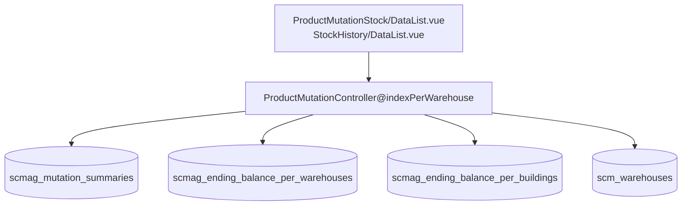

# Stock History — Technical Documentation

> **DRAFT** — Dokumen ini adalah draft awal hasil analisis codebase otomatis per 2026-06-19. Perlu direview PM/QA sebelum final.

**UI route:** `/supplychain/product-mutation-stock`

---

## 1. Architecture Overview

---

## 2. Frontend File Map

| File | Role | Key API |
|------|------|---------|
| `Report/ProductMutationStock/DataList.vue` | Primary UI | `GET supplychain/product-mutation-stock` |
| `Report/StockHistory/DataList.vue` | Alternate/legacy path | Same API |

Query params: `product_id`, `warehouse_id`, `warehouse_space_type_id`, `select_periode`

---

## 3. Backend File Map

| File | Role |
|------|------|
| `ProductMutationController.php` | `indexPerWarehouse`, export methods |
| `ItemStockProductMutationStock.php` | Entity |
| `ItemStockProductMutationStockPolicy.php` | Policy |
| `MutationSummaryPerWhTempJob.php` | Export temp data |
| `MutationSummaryPerWhExportJob.php` | Generate Excel |
| `MutationSummaryPerWhExportFile.php` | Export file tracking |

---

## 4. API Routes

| Method | Path | Handler |
|--------|------|---------|
| GET | `supplychain/product-mutation-stock` | indexPerWarehouse |
| GET | `supplychain/product-mutation-stock/export-excel` | exportExcel |
| GET | `supplychain/product-mutation-stock/product-mutation-stock-export-file` | mutationSummaryPerWarehouseExportFile |
| GET | `supplychain/product-mutation-stock/get-export-all-progress` | getExportAllProgress |

Shared filter endpoints under `supplychain/product-mutation/select2-*`.

---

## 5. Database Schema

| Tabel | Role |
|-------|------|
| `scmag_mutation_summaries` | Mutation lines |
| `scmag_ending_balance_per_warehouses` | WH-scoped balance |
| `scmag_ending_balance_per_buildings` | Building-level balance |
| `scm_warehouse_trees` | Warehouse hierarchy |
| `scm_warehouse_space_types` | Level definitions |
| `scmag_mutation_summary_per_wh_data_temps` | Export staging |

---

## 6. Jobs

| Job | Fungsi |
|-----|--------|
| `MutationSummaryPerWhTempJob` | Populate export temp |
| `MutationSummaryPerWhExportJob` | Excel generation |
| `CalculateEndingBalance` | Shared recalculation |

---

## 7. Related docs

- [supplychain-product-mutation/technical.md](../supplychain-product-mutation/technical.md)
