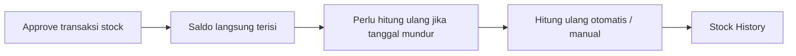
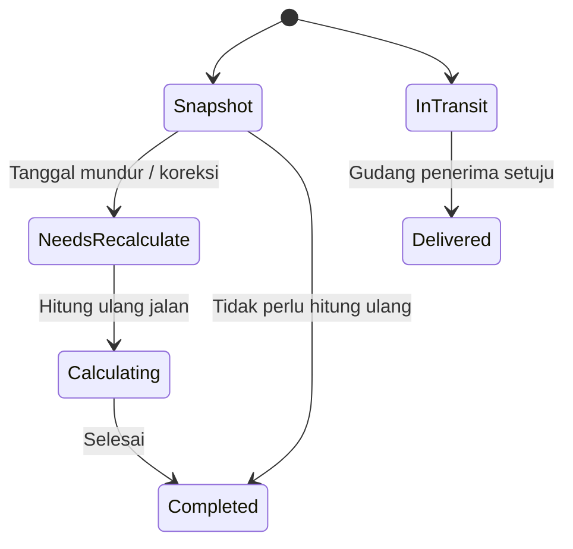

# Stock History — Panduan Pengguna

**Siapa yang baca panduan ini:** tim Supply Chain, Warehouse, operations support  
**Menu di sistem:** SCM → Report → Stock History  
**Sifat menu:** laporan baca saja — tidak untuk membuat atau mengedit transaksi

---

## 1. Apa Itu & Kenapa Penting

Stock History menampilkan **riwayat masuk–keluar barang per produk**, dikelompokkan per gudang/building, lengkap dengan **saldo stock berjalan** — mirip mutasi rekening bank.

Yang muncul hanya transaksi yang sudah **disetujui**. Barang bertipe jasa tidak masuk laporan ini. Pakai menu ini saat kamu perlu cek pergerakan dan saldo **per lokasi**, bukan saldo gabungan semua gudang.

---

## 2. Overview Flow & Proses Bisnis

### Dari transaksi stock sampai muncul di laporan

**Versi teks (tanpa diagram):**

1. Transaksi stock (inbound, outbound, adjustment, transfer, dll.) **di-approve**.
2. Sistem mencatat baris masuk/keluar dan mengisi saldo awal di laporan.
3. Kalau ada transaksi **tanggal mundur**, sistem menandai perlu **hitung ulang** saldo dari tanggal itu.
4. Hitung ulang jalan otomatis **sekitar tiap jam**, atau bisa dipicu manual dari **Product Mutation History** (tombol Calculate).
5. Hasilnya kamu baca di **Stock History** — per building, dengan kolom masuk, keluar, dan saldo.

🎬 [Interactive demo akan ditambahkan di sini]

### Status yang relevan (bukan status dokumen)

Laporan ini **tidak punya** Draft/Open/Approved. Yang perlu kamu kenali:

**Versi teks:**

| Kondisi | Artinya di layar | Bisa edit report? |
|---------|------------------|-------------------|
| Snapshot | Saldo baris langsung terisi setelah approve | Tidak — report hanya baca |
| Perlu hitung ulang | Ada transaksi tanggal mundur; baris sudah ada, saldo bisa belum ikut | Tidak |
| **Calculating..** | Sistem sedang menghitung ulang — angka bisa berubah kalau di-refresh | Tidak |
| **Up to date** | Tidak ada hitung ulang yang sedang berjalan untuk konteks ini | Tidak |
| Masih pengiriman | Qty di **Receiving Process**; belum masuk saldo | Tidak |
| Sudah diterima | Qty pindah ke **Product In**; saldo ikut berubah | Tidak |

---

## 3. Sebelum Mulai (Flow Sebelum)

Pastikan ini sudah siap sebelum membuka laporan:

- [ ] Kamu punya akses menu **Stock History**.
- [ ] **Produk** yang mau dicek sudah aktif dan bisa ditransaksikan (bukan jasa).
- [ ] Minimal sudah ada **satu transaksi stock yang di-approve** untuk produk itu — kalau belum, tabel kosong.
- [ ] Kalau mau sempitkan lokasi: tahu **Building** (dan opsional **Building Level**, misalnya rack) yang relevan.
- [ ] Kalau mau rentang tanggal: siapkan **periode** transaksi yang ingin dilihat.

**Beda dua laporan stock:**

| Laporan | Fokus saldo |
|---------|-------------|
| **Stock History** (menu ini) | Per gudang / building |
| **Product Mutation History** | Gabungan semua lokasi (global); di situ juga ada tombol **Calculate** untuk hitung ulang |

🎬 [Interactive demo akan ditambahkan di sini]

---

## 4. Setelah Selesai (Flow Sesudah)

Setelah kamu baca Stock History:

1. **Audit jejak** — klik **Trx. Code** untuk buka dokumen asal (inbound, outbound, transfer, dll.).
2. **Transfer masih mengambang** — kalau qty masih di **Receiving Process**, selesaikan approval di **Transfer External** (gudang penerima).
3. **Saldo belum ikut** padahal baris sudah ada — tunggu hitung ulang per jam, atau minta **Calculate** di Product Mutation History, lalu refresh.
4. **Export** — pakai opsi with details / without details bila perlu file di luar layar.

Laporan **tidak mengubah** stock. Perbaikan angka selalu lewat dokumen transaksi asal, lalu approve ulang sesuai prosedur.

---

## 5. Yang Perlu Diperhatikan

Ditulis dari sudut pandang yang kamu alami di layar:

- **Kalau kamu klik Apply tanpa pilih Product**, tabel bisa muncul kosong tanpa pesan jelas. Pilih Product dulu, baru Apply.
- **Kalau Product In kosong tapi Receiving Process terisi**, barang masih dalam pengiriman antar gudang — belum diterima tujuan, jadi **belum masuk saldo**.
- **Kalau transaksi tanggal mundur sudah terlihat di baris tapi Ending Balance belum berubah**, itu normal: sistem perlu hitung ulang dulu (otomatis tiap jam atau Calculate di Product Mutation History).
- **Kalau Status: Calculating..**, angka bisa berubah saat kamu refresh — tunggu sampai **Up to date**.
- **Kalau kamu mengira Latest Calculation = jam kamu input transaksi**, itu salah. Label itu = waktu terakhir sistem **selesai** menghitung ulang saldo.
- **Kalau kamu bandingkan angka ke Product Mutation History**, ingat: sana = saldo **global**; sini = **per building**. Jumlah per lokasi di sini yang digabung seharusnya selaras dengan global untuk produk yang sama.
- **Kalau kamu coba mengubah angka di report**, tidak bisa — perbaiki di dokumen asal.
- **Kalau produk bertipe jasa**, tidak akan muncul di laporan ini.
- **Kalau tidak bisa buka menu**, minta privilege Stock History ke admin.

---

## 6. Langkah-Langkah (Step by Step)

### Membuka dan memfilter

1. Buka **SCM → Report → Stock History**.
2. **Pilih Product** (wajib untuk hasil bermakna).
3. Opsional: pilih **Building**, **Building Level**, dan **Select Period**.
4. Klik **Apply** (atau tekan Enter).
5. Baca tabel yang dikelompokkan per building. Di atas tabel ada info **SKU || nama produk**.

### Membaca kolom penting

| Kolom | Cara baca |
|-------|-----------|
| **Date** | Tanggal/waktu transaksi |
| **Trx. Code** | Nomor dokumen — klik untuk menu asal; ada ikon salin |
| **Building** | Nama lokasi gudang |
| **Receiving Process** | Masih dalam pengiriman; **tidak** masuk Ending Balance |
| **Product In / Out** | Qty masuk / keluar (kosong jika 0) |
| **Ending Balance** | Saldo setelah baris ini |

**Saldo berjalan (bahasa awam):**  
Saldo baris ini = saldo baris sebelumnya + barang masuk − barang keluar, diurutkan dari transaksi paling lama ke yang baru. Qty di **Receiving Process tidak dihitung** di saldo.

**Contoh singkat:** saldo sebelumnya 100, masuk 20, keluar 5 → Ending Balance baris itu = **115**.

### Transfer antar gedung (Receiving Process)

1. Gudang pengirim setuju transfer (contoh: **Surabaya** kirim ke **Gedangan**).
2. Di building tujuan (**Gedangan**), qty muncul di **Receiving Process** — masih pengiriman, saldo belum naik.
3. Gudang penerima setuju → qty pindah ke **Product In**, baru **Ending Balance** ikut bertambah.

🎬 [Interactive demo akan ditambahkan di sini]

### Cek status hitung ulang

1. Lihat **Latest Calculation (Terakhir dihitung ulang)** dan **Status** (Up to date / Calculating..).
2. Kalau setelah tanggal mundur saldo masih aneh: tunggu jadwal per jam, atau minta Calculate di Product Mutation History, lalu refresh.
3. Kalau sudah lama tidak berubah padahal seharusnya ikut, laporkan ke Dev beserta screenshot waktu Latest Calculation.

### Export

1. Pilih export **with details** atau **without details**.
2. File diproses di tab export — tunggu sampai siap unduh.

---

## 7. Tips & Hal yang Sering Bikin Bingung

**Stock History vs Product Mutation History**  
Stock History = per gudang. Product Mutation History = saldo gabungan + tombol Calculate. Kalau mau “paksa” hitung ulang setelah tanggal mundur, biasanya lewat Product Mutation History, bukan dari halaman ini.

**Contoh tanggal mundur**  
Kamu approve transaksi dengan tanggal lebih lama jam 08:30. Baris sudah muncul, tapi Latest Calculation masih jam lama dan Ending Balance belum berubah. Tunggu hitung ulang (sekitar tiap jam) atau Calculate manual, lalu refresh — bukan berarti transaksi gagal.

**Contoh transfer Surabaya → Gedangan**  
Setelah pengirim setuju, di Gedangan qty ada di Receiving Process. Ending Balance Gedangan belum naik. Setelah penerima setuju, qty pindah ke Product In dan saldo baru ikut.

**Tabel kosong setelah Apply**  
Cek Product sudah dipilih, produk benar, dan sudah ada mutasi yang di-approve.

**Receiving Process terisi, Product In kosong**  
Masih menunggu approval gudang penerima di Transfer External — bukan bug laporan.

**Tidak bisa edit angka di sini**  
Benar. Perbaiki dokumen asal, bukan report.

---

## 8. Referensi

| Butuh | Buka |
|-------|------|
| Aturan QA, validasi, gap | [requirement.md](./requirement.md) |
| Cara pakai & troubleshooting operator | [knowledge-base.md](./knowledge-base.md) |
| API, job, file map | [technical.md](./technical.md) |
| Saldo global + Calculate | [Product Mutation History](../supplychain-product-mutation/) |
