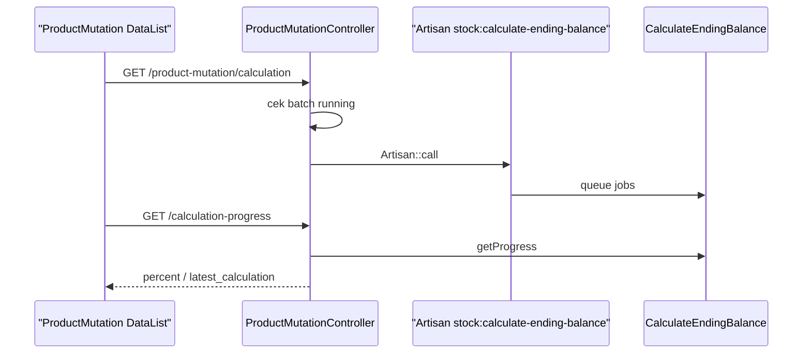

# Product Mutation History — Requirement Documentation

> **DRAFT** — Dokumen ini adalah draft awal hasil analisis codebase otomatis per 2026-06-19. Perlu direview PM/QA sebelum final.

## 0. Metadata & Changelog

| Version | Date | Author | Changes |
|---------|------|--------|---------|
| 1.0 | 2026-06-19 | QA - Yemima | Initial draft (AS-IS) |

## 1. Ringkasan Eksekutif

`ProductMutationController@index` membaca `ItemStockProductMutationHistory` (alias `MutationSummary`) dengan join `scmag_ending_balances`. Filter mutasi: kode stock mutation mengandung `IN`, `OT`, `AI`, `TF`, `PT`, atau `AO`.

## 2. Acceptance Criteria (AS-IS)

| ID | Kriteria | Validasi | Fitur |
|----|----------|----------|-------|
| A-01 | Wajib `product_id` | Query filter | Index |
| A-02 | Tampilkan qty in/out base unit | Kolom formatted | Datalist |
| A-03 | Ending balance per row | Join `ending_balances` | Balance column |
| A-04 | Link ke stock mutation code | `stock_mutation_code` column | Navigation |
| A-05 | Select2 product | `product-mutation/select2-product` | Filter |
| A-06 | Manual calculate | `GET calculation` → Artisan `stock:calculate-ending-balance` | Recalc |
| A-07 | Progress calculate | `GET calculation-progress` | Progress bar |
| A-08 | Export history | Via `product-mutation-stock` export with `type=product-mutation-history` | Export |

## 3. Validasi & Rules

| ID | Rule | Trigger | Pesan |
|----|------|---------|-------|
| V-01 | Policy viewAny mutation history | index | 403 |
| V-02 | Calculation single flight | Batch name `manual-ending-balance-calculation` | `Another ending balance calculation is running` |
| V-03 | No todo date | `CalculateTodoDate status=1` empty | `Ending balance already up to date` |

## 4. Fitur & Behavior

| ID | Fitur | Trigger | Expected |
|----|-------|---------|----------|
| F-01 | Sort by transaction_date desc | Default order | Terbaru di atas |
| F-02 | Description excerpt | `renderExcerpt` 35 char | UI compact |
| F-03 | Export chunked job | `ProductMutationHistory` job | Excel per chunk |

## 5. Sequence — Manual Calculate

## 6. QA Test Notes

- Pilih produk dengan inbound+outbound → verify ending balance chain
- Jalankan calculate 2x paralel → second harus ditolak
- Bandingkan dengan Stock History (per warehouse) untuk transaksi yang sama

## Related Documents

| Doc | Path |
|-----|------|
| Knowledge Base | [knowledge-base.md](./knowledge-base.md) |
| Technical | [technical.md](./technical.md) |
