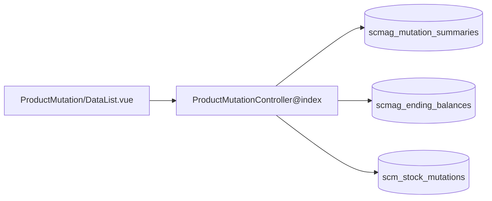

# Product Mutation History — Technical Documentation

> **DRAFT** — Dokumen ini adalah draft awal hasil analisis codebase otomatis per 2026-06-19. Perlu direview PM/QA sebelum final.

**UI route:** `/supplychain/product-mutation`

---

## 1. Architecture Overview

---

## 2. Frontend File Map

| File | Role | Key API |
|------|------|---------|
| `Report/ProductMutation/DataList.vue` | Filter product + datalist | `GET supplychain/product-mutation` |
| | Calculate button | `GET .../calculation`, `.../calculation-progress` |
| | Export | `product-mutation-stock-export-file?type=product-mutation-history` |

---

## 3. Backend File Map

| File | Role |
|------|------|
| `ProductMutationController.php` | index, calculation, export helpers |
| `ItemStockProductMutationHistory.php` | Entity extends MutationSummary |
| `ItemStockProductMutationHistoryPolicy.php` | Policy |
| `CalculateEndingBalance.php` | Job kalkulasi |
| `ProductMutationHistory.php` | Export job |
| `ProductMutationHistoryExportFile.php` | Export tracking |

---

## 4. API Routes

| Method | Path | Handler |
|--------|------|---------|
| GET | `supplychain/product-mutation` | index |
| GET | `supplychain/product-mutation/select2-product` | select2Product |
| GET | `supplychain/product-mutation/select2-warehouse` | select2Warehouse |
| GET | `supplychain/product-mutation/select2-level` | select2WarehouseLevel |
| GET | `supplychain/product-mutation/calculation` | calculation |
| GET | `supplychain/product-mutation/calculation-progress` | getProgress |

Export menggunakan endpoint `product-mutation-stock/*` dengan type query param.

---

## 5. Database Schema

| Tabel | Role |
|-------|------|
| `scmag_mutation_summaries` | Header qty in/out per mutasi |
| `scmag_ending_balances` | Ending balance global |
| `scmag_ending_balance_per_warehouses` | Per warehouse (Stock History) |
| `scm_stock_mutations` | Dokumen mutasi |
| `scm_calculate_todo_dates` | Pending calculation dates |

---

## 6. Jobs / Commands

| Komponen | Fungsi |
|----------|--------|
| `stock:calculate-ending-balance` | Artisan command |
| `CalculateEndingBalance` | Queue job per batch |
| `ProductMutationHistory` | Export chunk |

---

## 7. Related docs

- [supplychain-product-mutation-stock/technical.md](../supplychain-product-mutation-stock/technical.md)
